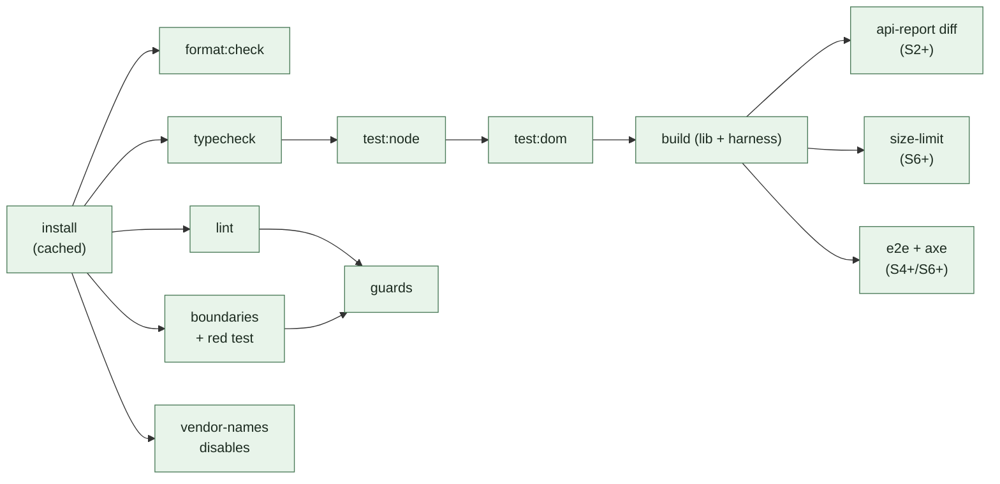

# FreeGantt — Hooks, CI, and Guard Tests

The execution layer: which command runs where, what blocks what, and how we keep the guards themselves honest.

**One rule governs this whole document: hooks and CI run the *same* npm scripts.** A hook that runs a slightly different command drifts, and the drift always resolves as "passes locally, fails in CI."

---

## 1. The script surface

Everything is a `package.json` script; hooks and CI only ever call these.

| Script | Command | Typical time |
|---|---|---|
| `format` / `format:check` | `prettier --write .` / `--check .` | <2s |
| `lint` | `eslint .` (type-aware) | ~10s at S2 scale |
| `lint:file` | `eslint --max-warnings 0` on `$1` | <2s |
| `typecheck` | `tsc --noEmit` | ~5s |
| `boundaries` | `depcruise --config .dependency-cruiser.cjs src harness` | ~3s |
| `test:node` | `vitest run --project pure` | seconds |
| `test:dom` | `vitest run --project dom` | seconds |
| `guards` | `vitest run test/guards` + `scripts/guard-red-test.mjs` + `eslint/rules/*.test.js` | ~10s |
| `vendor-names` | `scripts/check-vendor-names.mjs` | <1s |
| `disables` | `scripts/audit-disables.mjs` | <1s |
| `api:report` | `api-extractor run` (`--local` when updating) | ~10s |
| `verify` | `format:check && typecheck && lint && boundaries && guards && test:node && test:dom && vendor-names && disables` | ~45s |

`pnpm verify` is the whole gate, runnable by a human, an agent, or CI. If it passes locally it passes in CI, modulo the jobs that need a browser.

---

## 2. Claude Code hooks (`.claude/settings.json`, committed)

Agent-time enforcement. The value here is specific: a violation surfaced **inside the turn that wrote it** gets fixed with full context, while the same violation surfaced in CI twenty minutes later gets fixed by re-derivation. Exit code `2` blocks the tool call and returns stderr to the model, so the message text matters — every guard message cites its spec section (`02-lint-rules.md` §4) precisely so the agent is pointed at the governing text instead of inventing a workaround.

```jsonc
{
  "hooks": {
    "PostToolUse": [{
      "matcher": "Edit|Write|MultiEdit",
      "hooks": [{ "type": "command", "command": ".claude/hooks/check-file.sh", "timeout": 30 }]
    }],
    "PreToolUse": [{
      "matcher": "Edit|Write|MultiEdit",
      "hooks": [{ "type": "command", "command": ".claude/hooks/protect-spec.sh" }]
    }]
  }
}
```

### 2.1 `check-file.sh` — PostToolUse

Reads the hook payload from stdin, takes `tool_input.file_path`, and for `src/**/*.ts` runs, in order, stopping at the first failure:

1. `prettier --write` on the file (silent fix — formatting is never worth a turn)
2. `pnpm lint:file <path>` — the full rule set including type-aware rules, scoped to one file
3. `pnpm boundaries` if the edit added an `import` statement (cheap enough, and the ESLint mirror B11 catches most of it already)

Exit `2` with the ESLint output on stderr when any step fails. Non-`src` edits exit `0` immediately — the hook must never tax editing docs or fixtures.

**Deliberately not in this hook:** `tsc --noEmit` (whole-program, too slow per edit) and the test suites. Those belong to §2.3 and CI.

### 2.2 `protect-spec.sh` — PreToolUse

Blocks (exit `2`) with an explanatory message when the edit targets:

| Target | Message |
|---|---|
| `plans/**` | `plans/ is the spec. Locked decisions D1–D12 change by explicit human decision, not as a side effect of implementation. Ask first.` |
| `package.json` → `dependencies` | `Exactly one runtime dependency is allowed (plans/04 §1). Rejected candidates and their reasons are documented there.` |
| `eslint.config.js`, `.dependency-cruiser.cjs` when the diff only *removes* rules | `Loosening a guard is a spec change. Say which invariant is being relaxed and why.` |

The third check is the important one: the failure mode this whole system has to survive is an agent (or a tired human) resolving a guard failure by deleting the guard. It cannot fully prevent that — a determined caller edits the file in a way the heuristic misses — but it converts the easy path into a conversation, and the CI `disables` job plus review catch the rest.

### 2.3 Optional: `Stop` hook

A `Stop` hook running `pnpm verify` when `git status --porcelain src/` is non-empty gives a clean end-of-turn signal. **Recommended off by default** and enabled per-preference: on a fast machine it is 45 seconds of latency at the end of every turn, and the PostToolUse hook plus CI already cover the same ground. Documented here so the choice is deliberate rather than absent.

---

## 3. Git hooks (`.githooks/`, no dependency)

Enabled by `git config core.hooksPath .githooks`, set by a `prepare` script so it applies after `pnpm install`. No husky, no lint-staged — two shell scripts.

| Hook | Runs | Rationale |
|---|---|---|
| `pre-commit` | `format:check` + `lint` on staged `*.ts` + `vendor-names` | Fast (<5s), catches the trivia |
| `pre-push` | `pnpm verify` | The full gate before it becomes anyone else's problem |

`--no-verify` exists and is not fought: CI is the authority. Hooks buy latency, not enforcement.

---

## 4. Guard tests — testing the guards themselves

The rule that makes this system trustworthy rather than decorative: **a guard with no failing fixture is presumed broken.**

| Guard type | Its own test | Fails the build when |
|---|---|---|
| Custom ESLint rules | `eslint/rules/<id>.test.js` via `RuleTester`, ≥2 valid + ≥2 invalid cases each, invalid cases asserting the exact `messageId` | a rule stops matching, or its message drifts from the spec citation |
| Builtin-restriction configs (B1–B11) | `test/guards/lint-fixtures.test.ts` — runs ESLint programmatically over `test/fixtures/violations/*.ts` and asserts the expected rule id fires on the expected line | a `files:` glob is edited so a rule silently stops covering a directory |
| dependency-cruiser graph | `scripts/guard-red-test.mjs` (`03-boundaries-and-config.md` §1.3) | the graph config is loosened or the tool is misconfigured |
| Purity of the pure layers | `test/setup/assert-no-dom.ts` throwing | a pure module reaches for the DOM |
| The matrix itself | `test/guards/matrix-coverage.test.ts` — parses `docs/01-invariant-guard-matrix.md`, asserts every I1–I14 row names a CI job that exists in the workflow file, and that no row's status is blank | an invariant loses its job, or a job is renamed |

That last one deserves emphasis: it closes the loop `plans/04` §4 opens ("an invariant without a job is a TODO, tracked in the table itself"). The table stops being prose and becomes a checked artifact.

### 4.1 Violation fixtures

`test/fixtures/violations/` holds one small file per rule, each a deliberate violation with a header comment naming the rule it must trigger. They are excluded from `tsconfig`'s program and from `src/` globs. The directory doubles as documentation: "what does this rule actually catch?" is answered by reading one file.

---

## 5. CI pipeline

One workflow, `pnpm` with a frozen lockfile, Node pinned by `.nvmrc`. Jobs in dependency order, matching `plans/04` §4 and adding the guard jobs designed here.



**Rules for the pipeline itself:**

- **No `continue-on-error` on a guard job.** A guard that can be yellow is a guard that is off. The only non-blocking jobs are the *measurement* jobs before their gating slice (`size-limit`, `perf`), and they are labeled as measurements, not guards.
- **The red test runs on every PR**, not just at bootstrap. A boundary config that stops working is worse than none, because it is trusted.
- **`api-report` failure is not a bug**, it is a semver decision: the fix is either "revert the surface change" or "commit the updated report and say so in the PR." The job message says exactly that.
- **Required checks on `main`:** `format:check`, `typecheck`, `lint`, `boundaries`, `guards`, `test:node`, `test:dom`, `vendor-names`, `disables`, `build`. Later slices add `api-report` (S2), `e2e` (S4), `axe` + `size-limit` (S6), `perf` (S7).

### 5.1 Slice gates

`plans/00` §4 defines a gate between every pair of slices. `scripts/slice-gate.mjs` reads the current slice from a committed `.slice` file and runs that gate's mechanical conditions, printing the human-only items as an explicit checklist rather than silently ignoring them:

```
$ pnpm gate
S0 → S1 gate
  ✔ boundaries lint active and failing on violation (red test)
  ✔ layout tested headlessly (test:node: 14 passed)
  ☐ HUMAN: harness renders fixture bars   ← check before advancing .slice
```

Bumping `.slice` is a reviewed commit. That is the enforcement: you cannot start S2 work without a commit that says the S1 gate was met, and that commit is where a reviewer asks about the `☐` items.

---

## 6. What this costs

Worth stating, because a guardrail system that nobody wants to run is a guardrail system that gets bypassed:

| | Time |
|---|---|
| Per agent file-edit (PostToolUse) | ~2s |
| Per commit (pre-commit) | ~5s |
| Per push (pre-push, full `verify`) | ~45s at S2 scale |
| Per PR (CI, parallel jobs) | ~4 min wall clock |
| Build-out cost | ~2 days of S0, of which the 9 custom rules are ~1 day |

The type-aware ESLint pass dominates local lint time and grows with the codebase. If `lint` crosses ~30s, the response is to split the type-aware rules into a separate `lint:types` script run at pre-push and CI only, keeping the per-edit hook syntactic and fast — not to drop rules.
