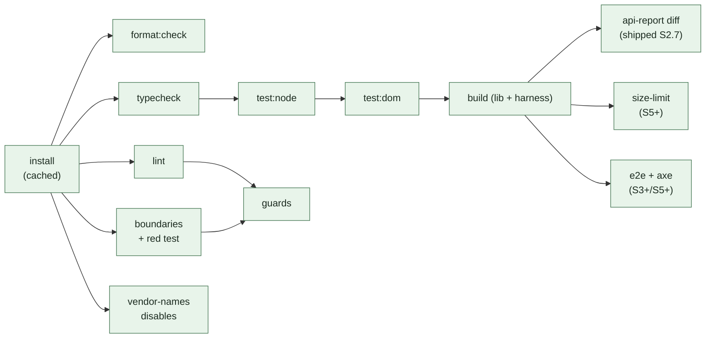

# FreeGantt — Hooks, CI, and Guard Tests

The execution layer: which command runs where, what blocks what, and how we keep the guards themselves honest.

**One rule governs this whole document: hooks and CI run the *same* npm scripts.** A hook that runs a slightly different command drifts, and the drift always resolves as "passes locally, fails in CI."

---

## 1. The script surface

Everything is a `package.json` script; hooks and CI only ever call these.

| Script | Command | Typical time |
|---|---|---|
| `format` / `format:check` | `prettier --write .` / `--check .` | <2s |
| `lint` | `eslint .` (type-aware) | ~10s at S2 scale |
| `lint:file` | `eslint --max-warnings 0` on `$1` | <2s |
| `typecheck` | `tsc --noEmit` | ~5s |
| `boundaries` | `depcruise --config .dependency-cruiser.cjs src harness` | ~3s |
| `test:node` | `vitest run --project pure` | seconds |
| `test:dom` | `vitest run --project dom` | seconds |
| `guards` | `vitest run test/guards` + `scripts/guard-red-test.mjs` + `eslint/rules/*.test.js` | ~10s |
| `vendor-names` | `scripts/check-vendor-names.mjs` | <1s |
| `disables` | `scripts/audit-disables.mjs` | <1s |
| `api-report` | `node scripts/api-report.mjs` (`api-extractor run`, `--local` when updating; shipped S2.7, name corrected from the plan's `api:report`) | ~10s |
| `verify` | `format:check && typecheck && lint && boundaries && guards && test:node && test:dom && vendor-names && disables && build && api-report` | ~45s |
| `verify:full` | `node scripts/verify-full.mjs` — the `verify` chain, then `test:e2e` | ~60s |

`pnpm verify` is **CI parity**, not the gate. It runs every job `ci.yml` defines, and it never starts a browser, so it cannot see `e2e/**`.

`pnpm verify:full` is **the gate**: `verify`, then the browser check no CI job runs. It is what `pre-push` runs, and what a human or an agent runs to prove a change. It reads its check list from the `verify` script at run time, so the two cannot drift (§3.2).

---

## 2. Claude Code hooks (`.claude/settings.json`, committed)

Agent-time enforcement. The value here is specific: a violation surfaced **inside the turn that wrote it** gets fixed with full context, while the same violation surfaced in CI twenty minutes later gets fixed by re-derivation. Exit code `2` blocks the tool call and returns stderr to the model, so the message text matters — every guard message cites its spec section (`02-lint-rules.md` §4) precisely so the agent is pointed at the governing text instead of inventing a workaround.

```jsonc
{
  "hooks": {
    "PostToolUse": [{
      "matcher": "Edit|Write|MultiEdit",
      "hooks": [{ "type": "command", "command": ".claude/hooks/check-file.sh", "timeout": 30 }]
    }],
    "PreToolUse": [{
      "matcher": "Edit|Write|MultiEdit",
      "hooks": [{ "type": "command", "command": ".claude/hooks/protect-spec.sh" }]
    }]
  }
}
```

### 2.1 `check-file.sh` — PostToolUse

Reads the hook payload from stdin, takes `tool_input.file_path`, and for `src/**/*.ts` runs, in order, stopping at the first failure:

1. `prettier --write` on the file (silent fix — formatting is never worth a turn)
2. `pnpm lint:file <path>` — the full rule set including type-aware rules, scoped to one file
3. `pnpm boundaries` if the edit added an `import` statement (cheap enough, and the ESLint mirror B11 catches most of it already)

Exit `2` with the ESLint output on stderr when any step fails. Non-`src` edits exit `0` immediately — the hook must never tax editing docs or fixtures.

**Deliberately not in this hook:** `tsc --noEmit` (whole-program, too slow per edit) and the test suites. Those belong to §2.3 and CI.

### 2.2 `protect-spec.sh` — PreToolUse

Blocks (exit `2`) with an explanatory message when the edit targets:

| Target | Message |
|---|---|
| `plans/**` | `plans/ is the spec. Locked decisions D1–D12 change by explicit human decision, not as a side effect of implementation. Ask first.` |
| `package.json` → `dependencies` | `Exactly one runtime dependency is allowed (plans/04 §1). Rejected candidates and their reasons are documented there.` |
| `eslint.config.js`, `.dependency-cruiser.cjs` when the diff only *removes* rules | `Loosening a guard is a spec change. Say which invariant is being relaxed and why.` |

The third check is the important one: the failure mode this whole system has to survive is an agent (or a tired human) resolving a guard failure by deleting the guard. It cannot fully prevent that — a determined caller edits the file in a way the heuristic misses — but it converts the easy path into a conversation, and the CI `disables` job plus review catch the rest.

### 2.3 Optional: `Stop` hook

A `Stop` hook running `pnpm verify` when `git status --porcelain src/` is non-empty gives a clean end-of-turn signal. **Recommended off by default** and enabled per-preference: on a fast machine it is 45 seconds of latency at the end of every turn, and the PostToolUse hook plus CI already cover the same ground. Documented here so the choice is deliberate rather than absent.

---

## 3. Git hooks (`.githooks/`, no dependency)

Enabled by `git config core.hooksPath .githooks`, set by a `prepare` script so it applies after `pnpm install`. No husky, no lint-staged — two shell scripts.

| Hook | Runs | Rationale |
|---|---|---|
| `pre-commit` | `format` (auto-fix) on staged files, **except partially staged ones** + `lint` on staged `*.ts` + `vendor-names` | Fast (<5s), catches the trivia; auto-fixes formatting instead of blocking on something `pnpm verify` would just fix anyway |
| `pre-push` | `pnpm verify:full` (`verify`, then `test:e2e`) | The full gate before it becomes anyone else's problem — and, while CI is dispatch-only, the *only* gate |

### 3.0 A partially staged file is never formatted (#203)

`prettier --write` edits the working tree, so the hook must re-stage what it formatted. `git add -- <file>` stages that file **whole**. On a file the author staged in part — `git add -p`, `git apply --cached`, an editor's stage-this-hunk — that commits the hunks they left out, under their message.

So the hook skips any file that is both staged and unstaged-modified, and says which on stderr. That file commits unformatted; `pnpm format:check` in `verify` still catches it. Losing a format pass is a nuisance. Committing someone else's sentence under your name is a correctness failure.

The warning names the **intersection** only, never every dirty file. A warning that fires on most commits is a warning people stop reading.

`--no-verify` exists and is not fought. But the old rationale for that ("CI is the authority; hooks buy latency, not enforcement") does not currently hold: `.github/workflows/ci.yml` is `workflow_dispatch:` only — its `push`/`pull_request` triggers are commented out — so no check runs on the server unless a human clicks the button. Until those triggers come back, `pre-push` *is* the enforcement, and skipping it is a decision rather than a shortcut.

### 3.1 e2e runs in the full gate, and nowhere else

`pnpm test:e2e` is the one check with **no CI job behind it**. Playwright owns what happy-dom cannot express: a real engine clamps `scrollTop`, fires `scroll`, and lays out. Two of the five S1 acceptance boxes are e2e tests (`[S1-A1]`, `[S1-A4]`), and `scripts/slice-gate.mjs` shells out to `pnpm test:e2e` for both, so an unrun e2e suite makes the S1 gate unprovable.

**This is a recorded decision, not an oversight (S1.11, D-S1.11-12):** the repository owner chose to keep `ci.yml`'s `push`/`pull_request` triggers off. So `pnpm gate` (and the S1 → S2 condition it proves) is provable **locally** — via `pre-push`, or by a human/agent running it directly — and **not** on the server, until those triggers come back. When they do, e2e gets its own CI job (`pnpm exec playwright install --with-deps chromium`, then `pnpm test:e2e`) and this hook line stays as the local half.

It sits **outside** `pnpm verify`, in the `verify:full` wrapper. `verify` is kept at CI parity (below), and e2e is not a CI job — folding it in would make `verify` claim a parity it no longer has, and would demand a browser everywhere `verify` runs. A wrapper adds the browser half without touching that claim. When the `push`/`pull_request` triggers come back, e2e gets its own job, and `verify:full` stays as the local gate.

Before #255 the hook ran the two halves as two lines, and everyone else ran only `verify`. So the hook and the agent proved different things, and the agent's half was the one that reported completion.

The cost is small: the whole suite runs in about a second, and `playwright.config.ts` starts its own dev server. The failure mode that is *not* a real failure — a missing browser binary — gets its own message pointing at `pnpm exec playwright install chromium`.

So `pnpm verify` is kept at **CI parity**: it runs every job `ci.yml` defines, in the same order, `build` included. That parity is itself guarded — `test/guards/verify-covers-ci.test.ts` (§4) asserts every `pnpm <script>` any CI job runs also appears in `verify`, and that `pre-push` invokes the gate. Adding a job without extending `verify` fails the guards suite, so the hook cannot silently drift into reporting green over a check it no longer performs.

### 3.2 The last line is the verdict (#255)

An exit code only reaches a reader who transcribes it, and the pattern this repo used transcribed the wrong one:

```bash
pnpm verify 2>&1 | tail -4; echo "EXIT: $?"      # `$?` is tail's status. Prints EXIT: 0 over a failure.
pnpm verify:full > /tmp/v.log 2>&1; tail -3 /tmp/v.log   # correct — redirect, and read the verdict
```

Two agents hit this on #142. Both reported green, both told the truth, and `e2e/resize.spec.ts` was fully red. The failure surfaced at the push, after the review and after the merge.

Documenting the capture rule is not enough on its own: it is exactly the instruction a tired reader skips. So `verify:full` states its own result **inside the output stream**, where no plumbing strips it. Every run prints exactly one verdict line:

```
verify:full PASS — all 13 checks green, test:e2e included (58s).
verify:full FAILED at check 7 of 13: pnpm test:dom (exit code 1). 6 later checks did not run. (21s)
```

It is the last line the gate itself prints. `pnpm` adds one `[ELIFECYCLE]` line after it on a failure, which is why the capture above reads three lines, not one.

Three properties follow, and they are the reason this is a script rather than a `&&` chain:

- **Every window onto the run carries the verdict.** A redirect, a `tail -3`, or the whole log — all show it. Even the wrong capture above now prints `EXIT: 0` two lines under a line that says `FAILED`.
- **Green needs a positive token.** The completion test is "quote the last line", not "report a number". A run that a signal kills, or a pipe truncates, has no verdict line, so it reads as **unproven** — never as green.
- **The failing check names itself.** `[ELIFECYCLE] Command failed with exit code 1` says a step failed, not which one, and says nothing at all when the run passes.

The wrapper never holds its own copy of the check list. It parses the `verify` script and appends `test:e2e`, so a new CI job joins the gate the moment it joins `verify`. A `verify` step it cannot parse, or a check no script defines, is a loud failure — never a silently skipped check.

---

## 4. Guard tests — testing the guards themselves

The rule that makes this system trustworthy rather than decorative: **a guard with no failing fixture is presumed broken.**

| Guard type | Its own test | Fails the build when |
|---|---|---|
| Custom ESLint rules | `eslint/rules/<id>.test.js` via `RuleTester`, ≥2 valid + ≥2 invalid cases each, invalid cases asserting the exact `messageId` | a rule stops matching, or its message drifts from the spec citation |
| Builtin-restriction configs (B1–B11) | `test/guards/lint-fixtures.test.ts` — runs ESLint programmatically over `test/fixtures/violations/*.ts` and asserts the expected rule id fires on the expected line | a `files:` glob is edited so a rule silently stops covering a directory |
| dependency-cruiser graph | `scripts/guard-red-test.mjs` (`03-boundaries-and-config.md` §1.3) | the graph config is loosened or the tool is misconfigured |
| Purity of the pure layers | `test/setup/assert-no-dom.ts` throwing | a pure module reaches for the DOM |
| The matrix itself | `test/guards/matrix-coverage.test.ts` — parses `docs/01-invariant-guard-matrix.md`, asserts every I1–I14 row names a CI job that exists in the workflow file and that no row's status is blank; **and** (S1.11, D-S1.11-11) that every `freegantt/*` rule named in the Mechanism column of both §1 and §2 is registered in `eslint/rules/index.cjs`, unless it is honestly marked `PLANNED (Sn)` | an invariant loses its job, a job is renamed, or a row claims a rule is enforced when no rule file exists |
| Hook/CI parity | `test/guards/verify-covers-ci.test.ts` — asserts every `pnpm <script>` a CI job runs also appears in the `verify` script, and that `.githooks/pre-push` invokes `verify` | a CI job is added that the local gate does not run, so `pre-push` reports green over a check it no longer performs |
| The S1 → S2 gate itself | `test/guards/slice-gate.test.ts` (S1.11, plans/s1.11-close-the-gate/README.md §3.4) — drives `tagged()` against a temporary fixture: an id present with a passing runner passes; an id absent from source fails; an id present whose declared runner fails also fails | a gate check stays green after its subject is deleted — U2's own scenario |

That last one deserves emphasis: it closes the loop `plans/04` §4 opens ("an invariant without a job is a TODO, tracked in the table itself"). The table stops being prose and becomes a checked artifact.

### 4.1 `scripts/guard-red-test.mjs` — the red-test cases

Each call writes one deliberate violation, asserts the guard it targets — `depcruise` for a boundary
or leaf rule, `eslint` for the two ESLint-only #287 cases below — fails on it, then deletes the file.
A case with no failing fixture is presumed broken (the rule this whole section states):

| Case | Rule it proves |
|---|---|
| `scheduling/ -> render/` | `scheduling-boundary` — D4, `scheduling/` never reaches a DOM layer |
| `interaction/ -> layout/` | `interaction-boundary` — P3's one-arrow widening (`model/` only) stays to one arrow |
| `rollup-is-removable: second importer` | `rollup-is-removable` — the Rollup leaf keeps exactly one legal importer |
| `dataset-change-subscription-is-removable: second importer` | `dataset-change-subscription-is-removable` — same shape, S2/S4 leaf |
| `history-is-removable: second importer` | `history-is-removable` — same shape, undo/redo leaf |
| `extensions/ -> view/` | `extensions-public-only` — D-S5-5's dogfood gate: a built-in feature may see only `api/` and `model/` |
| `render/ -> data/transaction.js` | the `data/dev-mode.ts` leaf widening stays scoped to that one file, not `data/` generally |
| `extensions/ -> data/transaction.js` | same, from the `extensions/` side |
| `harness/ -> src/` (an internal, `import '../src/layout/items/variants.js'`) | `harness-public-api-only` (#287) — dependency-cruiser blocks a relative reach *past* the published `freegantt` specifier's target |
| `harness/ -> src/api/index.ts` by a relative path, and the same by a type-position inline `import(...)` | `eslint.config.js`'s `harness/`/`e2e/`/`fixtures/` block (#287, review finding F7) — dependency-cruiser matches *resolved* paths, so its one exception (`pathNot: '^src/api/index\.ts$'`, for the `freegantt` alias) can't tell that alias from a relative path naming the same file; this ESLint rule reads the specifier text instead, which is the only place that distinction is visible. `e2e/variant-styles.spec.ts` shipped the type-position case uncaught — belt and braces with the cruiser rule, not a replacement |

### 4.2 Violation fixtures

`test/fixtures/violations/` holds one small file per rule, each a deliberate violation with a header comment naming the rule it must trigger. They are excluded from `tsconfig`'s program and from `src/` globs. The directory doubles as documentation: "what does this rule actually catch?" is answered by reading one file.

---

## 5. CI pipeline

One workflow, `pnpm` with a frozen lockfile, Node pinned by `.nvmrc`. Jobs in dependency order, matching `plans/04` §4 and adding the guard jobs designed here.



**Rules for the pipeline itself:**

- **No `continue-on-error` on a guard job.** A guard that can be yellow is a guard that is off. The only non-blocking jobs are the *measurement* jobs before their gating slice (`size-limit`, `perf`), and they are labeled as measurements, not guards.
- **The red test runs on every PR**, not just at bootstrap. A boundary config that stops working is worse than none, because it is trusted.
- **`api-report` failure is not a bug**, it is a semver decision: the fix is either "revert the surface change" or "commit the updated report and say so in the PR." The job message says exactly that.
- **Required checks on `main`:** `format:check`, `typecheck`, `lint`, `boundaries`, `guards`, `test:node`, `test:dom`, `vendor-names`, `disables`, `build`, `api-report` (shipped S2.7). Later slices add `e2e` (S3), `axe` + `size-limit` (S5), `perf` (S6).

### 5.1 Slice gates

`plans/00` §4 defines a gate between every pair of slices. `scripts/slice-gate.mjs` reads the current slice from a committed `.slice` file and runs that gate's mechanical conditions, printing the human-only items as an explicit checklist rather than silently ignoring them:

```
$ pnpm gate
S0 → S1 gate
  ✔ boundaries lint active and failing on violation (red test)
  ✔ layout tested headlessly (test:node: 14 passed)
  ☐ HUMAN: harness renders fixture bars   ← check before advancing .slice
```

Bumping `.slice` is a reviewed commit. That is the enforcement: you cannot start S2 work without a commit that says the S1 gate was met, and that commit is where a reviewer asks about the `☐` items.

---

## 6. What this costs

Worth stating, because a guardrail system that nobody wants to run is a guardrail system that gets bypassed:

| | Time |
|---|---|
| Per agent file-edit (PostToolUse) | ~2s |
| Per commit (pre-commit) | ~5s |
| Per push (pre-push, full `verify`) | ~45s at S2 scale |
| Per PR (CI, parallel jobs) | ~4 min wall clock |
| Build-out cost | ~2 days of S0, of which the 9 custom rules are ~1 day |

The type-aware ESLint pass dominates local lint time and grows with the codebase. If `lint` crosses ~30s, the response is to split the type-aware rules into a separate `lint:types` script run at pre-push and CI only, keeping the per-edit hook syntactic and fast — not to drop rules.
