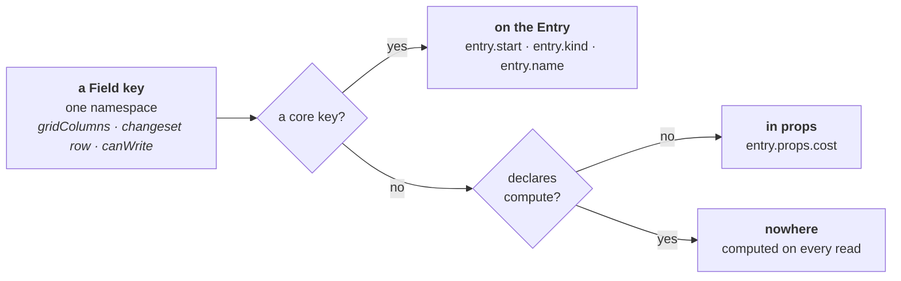
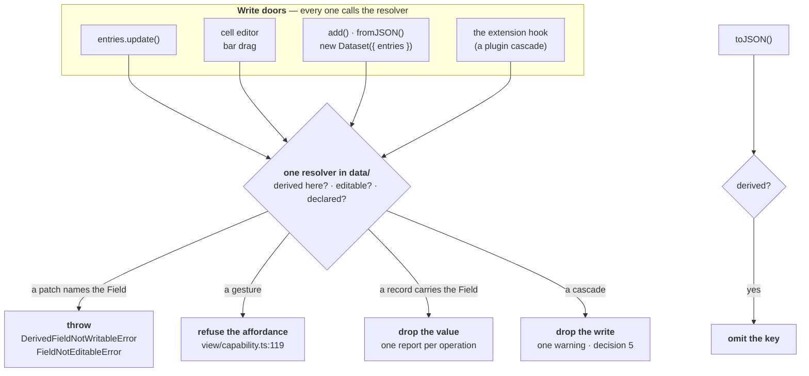
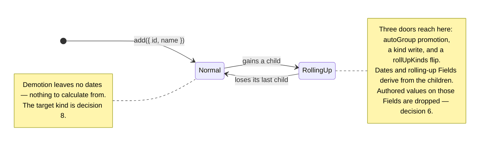
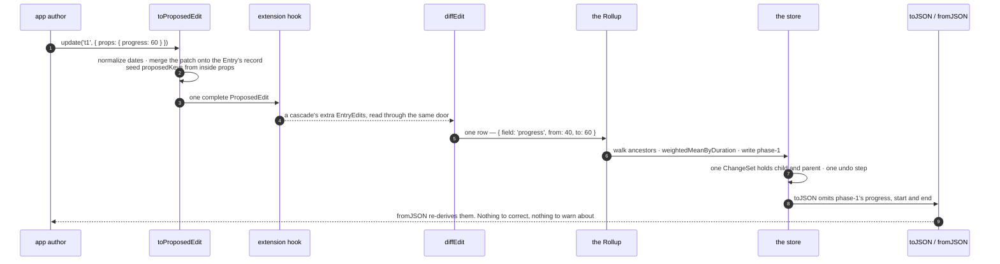

# Consumer values live in `props`, and a derived value never persists

This file holds the decision and the reasoning. The detail sits beside it in `plans/adr-0011-field-redesign/`, one job per file. Read the one you need.

| File | Read it when |
|---|---|
| [`open-decisions.md`](../../plans/adr-0011-field-redesign/open-decisions.md) | You want what is still unmade, or you are about to answer one |
| [`closed-decisions.md`](../../plans/adr-0011-field-redesign/closed-decisions.md) | You want a ruling and the evidence behind it |
| [`work-plan.md`](../../plans/adr-0011-field-redesign/work-plan.md) | You are about to write code |
| [`api.md`](../../plans/adr-0011-field-redesign/api.md) | You want the call sites, before and after |
| [`types.md`](../../plans/adr-0011-field-redesign/types.md) | You are about to write the edit types or the Field union |
| [`evidence.md`](../../plans/adr-0011-field-redesign/evidence.md) | You want the product survey these decisions cite |
| [`refuted.md`](../../plans/adr-0011-field-redesign/refuted.md) | You are about to re-derive something. Check here first |

## Context

ADR 0005 gives a consumer Field a declaration and no home. `FieldSource`'s stored arm is `{ from: 'entry'; field: CoreFieldKey }`, and `CoreFieldKey` is `keyof Omit<Entry, 'id'>`. So `source: { from: 'entry', field: 'cost' }` is a type error, and every consumer value lands in `meta`. ADR 0005 promises that `'start'` and `'cost'` take one code path. The promise holds for the declaration and fails for the storage. The half a consumer cannot reach is the half that works.

The bag then costs more than it pays.

| What goes wrong | Where |
|---|---|
| `update('t1', { cost: 7 })` merges and keeps `owner`. `update('t1', { meta: { cost: 7 } })` replaces and drops it. Both compile, and the destructive one reads better in English | the write door |
| A `meta` holding an array is replaced by an object, because `metaRecord` answers `{}` for an array | `metaRecord` |
| Two generics name one set of values and nothing links them | `harness/planner.ts:31` — the two halves disagree about `critical`, and nothing notices |
| Every read of a `meta` Field allocates, because `metaStrategy.read` spreads the bag for one property lookup | `metaStrategy.read` |
| `meta` names four things at once: a storage location, a Field key, a `FieldSource.from` value, and a Document key | [#266](https://github.com/Pawel-IT/FreeGantt/issues/266) |

## Decision

**A number in ADR 0011 is always a decision number.** These sections carry no numbers, so *decision 6* is the `rollUpKinds` ruling in [`closed-decisions.md`](../../plans/adr-0011-field-redesign/closed-decisions.md) and never the section on dates. Cite a section by its title. The sections were numbered until 2026-09-09, and the two systems collided: *decision 1* named both the address rule and the undeclared-key question, and *decision 8* named both the read doors and the demotion kind.

### A Field key is the whole address

`{ key: 'cost' }` reads and writes `entry.props.cost`. `{ key: 'start' }` reads and writes `entry.start`. Nothing declares a `source`. The key decides the home, and which home that is stays the library's business. **Declaring a key does not create it. Declaring says what the library may do with it.**



**One key space, two homes.** One name serves `field` on a changeset row, `canWrite(entry, field)`, and `gridColumns: ['name', 'cost']`. Storage is namespaced underneath. A consumer key cannot shadow a core key, a core key added in a later release cannot land on a consumer's value, and the Document reader keeps the rule it has today.

`FieldSource` retires with all three arms. `meta` is renamed to `props` on `Entry`, `EntryInput` and `EntryDocument`. The `meta` **core Field** is deleted with no successor, because a whole bag is not a value a grid shows or a Rollup aggregates. The name `props` is decision 17, closed — see [`closed-decisions.md`](../../plans/adr-0011-field-redesign/closed-decisions.md).

### The library writes into `props` only at a declared `rollUp` key

The Rollup writes a derived value into the consumer's own bag. That is the same shape as a library writing into a consumer's namespace, and the field reports on that shape are bad (see [`evidence.md`](../../plans/adr-0011-field-redesign/evidence.md), the Vaadin rename). It is safe here for one reason: the consumer asked for it, in the declaration.

**An undeclared key is never written by the library, ever.** State this wherever `props` is documented. Without it, decision 9's *prefix the plugin* mitigation looks complete, and it is not — a plugin is not the only second writer in the bag.

### An edit carries the Entry's own shape, and `props` merges

`update(id, { start: '2026-01-06', props: { owner: 'Sam' } })` writes one date and one consumer value. Every other key in `props` survives. Nesting is not what makes today's write destructive; **replacing** is.

`toProposedEdit` merges the patch onto the Entry's own record, so a `ProposedEdit` always carries a **complete** `props`. The merge sits on the read side, not the apply side. An explicit `undefined` inside a patch clears that one key.

**The patch merges one level deep, and never recurses.** `update(id, { props: { address: { city: 'Ely' } } })` replaces the whole `address` object. The reason is the ChangeSet, not convenience: a row is `{ field, from, to }`, and `field` is a Field key. `props.address.city` is a name no Field key carries, so no row describes it, no undo replays it and no subscriber observes it. **A patch may only name what the model can name.** A consumer who wants a nested value tracked declares it as its own Field key.

The types, and why each one is shaped as it is, live in [`types.md`](../../plans/adr-0011-field-redesign/types.md).

### One write rule, and every door calls it

Three rules meet at one question — is this Field derived here, is it editable, does it exist at all. `data/` exports **one resolver**, and every write door calls it. Do not re-ask the question in a second place.



**Four answers, seven call sites.** The boxes above group the call sites by the answer each one gets, so the box count is not the call list. The seven are `entries.update()`, the cell editor, a bar drag, `entries.add()`, `Dataset.fromJSON()`, `new Dataset({ entries })` and the extension hook. **Build the resolver's call list from the seven** — reading *four doors* as the call list skips `add()`, `fromJSON()` and the constructor, which is the half that drops rather than throws.

**`update()` refuses; `add()` drops. A patch is not a record.** Name a Field and the library answers. Hand it a record and the library keeps what is yours. That is PATCH against PUT, and it is the whole rule. `update()` names `cost`, so refusing tells the caller the exact thing they asked for is not theirs to set. `add()`, `new Dataset({ entries })` and `fromJSON()` carry records: an Entry's shape has a `start`, an `end` and a `props`, and carrying them is not naming them. A file exported by another tool dates its parents, and throwing at it would reject an ordinary import over a key the author never chose. A **mixed** patch — `{ start, props: { cost } }` where `cost` is derived — is refused **whole, before any write**. A partial apply would leave a transaction in a state no `before*` event described.

**The refusal lives at `EntryStore.update()`, not in `toProposedEdit`.** That placement is the whole of the plugin-author story. The extension hook reads through the same conversion, so a refusal there would bind a cascade, and a refusal at the public door cannot. A plugin author learns no rule, checks no predicate and passes no flag. What the exemption buys the plugin is nothing: decision 5 ruled that the cascade's write is then dropped where the hook's writes are read, with one warning. **Exempt from the throw was never the same as the write surviving.**

`toJSON` is not a write. It asks the derived half only, so it is a caller of that half and not a fifth `canWrite`. **Do not claim I14 for the omission.**

Two rules feed the resolver and both are already ruled:

- **A rolling-up Field on a rolling-up parent refuses the write.** `view/capability.ts` already answers this for gestures. `entries.update()` answers the opposite today: probed, `update('p', { cost: 999 })` stores `999`, and an unrelated rename of a child puts it back to `10`. One question, one answer, at both doors (I14).
- **`editable: false` refuses `entries.update()` too, and that is the same rule.** Ruled 2026-09-09. `editable` is read at exactly one place in `src/`, `view/capability.ts:120`, and nothing in `data/` consults it. The error is `FieldNotEditableError`.

What an **absent** `editable` does is decision 18. What replaces the deleted `{ key: 'start', editable: false }` is decision 19. Both change the default posture of a public door, so neither follows from the ruling.

### A derived value lives in the store and never reaches the Document

The Rollup writes a parent's `start`, `end` and `cost` today, and `toJSON` writes all three out as though a person authored them. `fromJSON` reads them back and the Rollup overwrites them. When the stored answer and the written one disagree, the written one loses in silence: a parent `cost: 999` over a child `cost: 10` imports as `10`, with no warning and no `rollup-corrected` report — **that pass compares `start` and `end` only**. **A value the Rollup would reproduce exactly is not written.** A stale derived value stops being possible rather than being detected.

The two rulings hold each other up. The refusal means nothing but the Rollup can put a value in a rolling-up parent's cell, so omitting it loses nothing a person authored. Without the refusal, omission drops user edits.

**One report per operation, not per value.** A hand-written Document with 500 groups over three rolling-up Fields would otherwise raise 1,500 warnings. A consumer fixes their whole export at once. The report names the count, the Field keys, and up to three Entry ids. It goes through `raiseError` at `severity: 'warning'` (ADR 0009), **always** — `reportCorrectedRollUps` was gated on `isDevMode()`, which resolves when *this repo* builds `dist/`, so no consumer ever saw a line of it (D-S5-41).

**On a rolling-up parent, an Aggregator's `undefined` means _no value_.** It is documented as *no opinion — keep the stored value*. Once nothing but the Rollup can write that cell, "keep" means "keep the previous derived answer", which is stale by construction. Elsewhere the current reading stands.

### Dates are optional on every kind, and dates are Segments

**An Entry has dates if and only if it holds at least one Segment**, and `start`/`end` are always the envelope. One biconditional keeps the blast radius to one rule.

| Call | Result |
|---|---|
| `add({ start, end })` | mints one Segment, as today |
| `add({ segments })`, no dates | derives the envelope from them |
| `add({})` | stores no dates and no Segments |
| `update(id, { start: undefined, end: undefined })` | the un-date verb. It clears the Segments in the same write |
| `add({ start })` | `InvalidInstantError` — one date without the other |
| `update(id, { segments: [] })` | `EmptySegmentsError` — *never empty*, [#212](https://github.com/Pawel-IT/FreeGantt/issues/212) |

An author adds a row now and dates it later, which is ordinary use, and today's `InvalidInstantError` for a dateless `'span'` refuses it. An Entry with no span **draws no bar and still shows its grid row**.

Four consequences are visible to a consumer, so each gets an answer here rather than a file to visit:

- A dateless Entry sorts **last** under every comparator, and the order is stable.
- A dateless row is **inert to a gesture**. It draws no bar, so there is no grip to grab and no drag creates one.
- `range: 'fitDataset'` over a dataset where nothing is dated shows the range an empty dataset already shows.
- An S7 link naming a dateless endpoint raises a diagnostic and draws nothing.

`FieldContext.durationOf` becomes `Duration | undefined`, and a dateless row's `duration` cell is **blank**. That needs a guard, not nothing: `field-access.ts:92` computes `diffMs(entry.end, entry.start)` with no guard, and `diffMs` is `a - b`, so an absent date yields **`NaN`, not a throw**. The cell then renders `"NaN d"` and `weightedMeanByDuration` poisons the parent's aggregate. Guard `durationOf` first. The full call-site list is in [`work-plan.md`](../../plans/adr-0011-field-redesign/work-plan.md) group D — **do not re-derive it**.

**A zero-length span stays legal, and D-S5-46 needs no rewrite.** Its two stated reasons are the half-open interval `[start, end)` and `layout/gesture-draft.ts`'s resize clamp. Neither is the `referenceDate` fill. A milestone is one instant, and that is an authored shape.

`entry-reader.ts:170` gives a childless group a zero-length span at `referenceDate` today — a clock reading taken when the Dataset was built, never saved, so an empty group reloads somewhere else. **The fill is deleted.** It is written down under D-S2-10 **and** D-S2-22.

### Promotion runs both ways, and stays automatic



**Promotion is a door, and nobody aimed at it.** An Entry authored with dates becomes a rolling-up kind the moment it gains a child under autoGroup — `fixtures/hierarchy-dataset.ts` authors exactly that shape. Its dates were authored, they are derived from that commit on, and no call named a derived Field.

**Demotion does not happen today.** `hierarchy.test.ts:116` pins the current rule by name: *"removing every child demotes nothing."* An Entry that gains a child and loses it again then stays a rolling-up kind for life, and under the omission rule it holds no dates and draws no bar, with no call responsible. `plans/01` §2.5 chose promote-only on purpose — *demoting on losing the last child would reintroduce exactly the flickering identity this rule exists to prevent*. **This ADR overrules that clause**, and group F rewrites the sentence. No comparable product ships promotion without demotion (see [`evidence.md`](../../plans/adr-0011-field-redesign/evidence.md)).

On demotion the Entry becomes a **normal Entry with no dates**. There are no children to calculate from, and it can be dated later. What **kind** it returns to is decision 8. Whether `'group'` survives as an authored kind at all is decision 20.

**An Entry that starts rolling up drops its authored values, and the Rollup recalculates them.** Decision 6, closed 2026-09-09. The library never refuses this, at any of the three doors. The drop is an ordinary ChangeSet row in the same transaction as its cause, so undo reverses both and the authored value is legal again. **History is never cleared, and `rollUpKinds` is not a destructive setter.** One follow-up stays open on one door: a `rollUpKinds` flip's cause is a config assignment, and `ChangeSet` has no row for one. That is **decision 24**.

**An authored value on a derived cell is dropped, and the library says so.** `{ id: 'p', kind: 'group', props: { cost: 500 } }` gets no `cost` on `p`. Keeping it needs a second storage slot beside the derived value — the old bag again under a worse name. Echoing it back on `toJSON` is worse: the moment a child changes, the echoed number is a wrong answer wearing an authored value's clothes. The `EntityAdded` row carries the Entry **as stored** — after the drop, and after ingest fills `props: {}` and the Segments.

### Two doors read one value, and each answers a different question

```ts
dataset.entries.get('t1')?.props.owner       // the stored bag, typed by TProps
dataset.entries.fieldValue('t1', 'owner')    // any Field key: core, compute, plugin
```

The record door returns storage. The by-key door resolves getters and aggregates. Every comparable library publishes the same pair.

**Two on the app-author surface, four in all.** The plugin surface adds `ctx.read(entry, key)` and `ctx.durationOf(entry)`. Decision 13 covers all four, and the two counts describe two audiences rather than disagreeing.

**The by-key door keeps its type.** `FieldValue` maps over the **generic**, never over the registry, so one generic carries `model/dataset.ts:41` across unchanged as `FieldValue<TProps, K>`. Two value classes stay `unknown`, and both own no `TProps` key — a `compute` Field's answer, and a plugin's Field. That residue is [#267](https://github.com/Pawel-IT/FreeGantt/issues/267).

**Declare a Field when the library has a job to do with the value, not to make the value exist.** A `phase` that only a bar renderer reads needs no type bundle, no rollup, no editor and no column, so it needs no Field. Whether it is still *writable* with no declaration is decision 1.

**The Field union is exclusive.** A stored Field may roll up and may be edited. A computed Field may do neither. A `compute` Field runs on **every** row, a rolling-up parent included — decision 10, closed. The union closes *storage*, not *reading*. The real limit is that a `compute` Field cannot ask *am I a parent?*, which is [#214](https://github.com/Pawel-IT/FreeGantt/issues/214). The union's declaration, and what it does and does not enforce, are in [`types.md`](../../plans/adr-0011-field-redesign/types.md).

**A `compute` arm takes the row and the context, and each carries what the other cannot.** `entry.props.x` reaches a stored consumer value and nothing else — not a core key, not `duration`, and not another Field's `compute` arm. `ctx.read(entry, key)` reaches all three. **Read a _value_ through `entry.props`, and read a _Field_ through `ctx.read`.** The name is `compute`, not `get`: `get` already names three unrelated jobs here, and `compute` keeps the vocabulary `source: { from: 'compute' }` already teaches.

## The flow, once

`dataset.entries.update('t1', { props: { progress: 60 } })`, on a child of a rolling-up phase.



**Step 1 seeds `proposedKeys` from inside the namespace** — the edit's top-level keys except `props`, plus every key of `edit.props` this write may name. Whether an **undeclared** key may be among them is decision 1.

**Step 5 emits one row per Field key, never a path into `props`.** Today a whole-`meta` write emits two rows for one value — one for `meta` itself, one for the key inside it. The `meta` Field is deleted, so the second row has nothing to come from.

**Step 7 asks one structural question.** Is this Entry a rolling-up kind, and is this a rolling-up Field? Nothing compares values, nothing tracks what a pass produced, and nothing depends on how many children a parent has right now.

## Considered options

| Option | Verdict |
|---|---|
| **Flat consumer properties on the Entry**, in one key space with `start` | **Rejected.** The previous draft's ruling. One gain — a single storage home — charged at four places: the Document reader's unknown-key rule inverts; three reserved name sets appear at three doors; an older file whose consumer key a later release promotes needs its own migration door; and `Entry` needs an index signature, which makes `entry.strat` compile |
| **Flat consumer keys on the edit alone**, with `props` everywhere else | **Rejected**, and it was this draft's first answer. It saves one unwrap at the differ and costs a shape: the object a consumer writes most often would disagree with the object the library holds. A **narrower variant is live as decision 11** — flat for *declared* keys only — and is not covered by this rejection |
| **Keep the namespace under its current name, `meta`** | **Rejected.** `meta` names four things ([#266](https://github.com/Pawel-IT/FreeGantt/issues/266)) and three of them go here. It is also the wrong word: *meta* says *about the data*, and the contents are the data |
| **Keep the namespace in the Document only**, flat at runtime | **Rejected.** The reader and the writer would each move every consumer key across a boundary, and every seam between them would have to know which side it stood on |
| **Keep `meta` and open `FieldSource`'s entry arm to any key** (the small fix) | **Rejected.** The declaration keeps an address the library should own, so the strategy table, the second generic and the whole-bag write all survive. The bag stops being mandatory and stays available — the worst of both |
| **Read consumer values through an accessor and never store them** | **Rejected.** Reads alone carry four of the planner's five fields, and a Gantt that edits, undoes and aggregates a consumer value has to hold it |
| **A nested accessor path** (`accessor: ['finance', 'approved']`) | **Deferred.** It costs a compiled reader, an immutable path writer, path equality, undo through a path and a Document rule. It is an additive optional key whenever a real consumer needs one |
| **Record what the Rollup wrote, and omit that set** | **Rejected.** It needs a cumulative set that no `ChangeSet` carries and that five reachable seams invalidate |
| **Persist derived values and report a correction on import** | **Rejected.** It keeps a value whose meaning depends on declarations that may not travel with it. Not writing the value stops the disagreement existing |
| **Let a rolling-up parent cell be edited, and distribute down to the children** | **Rejected as a default.** It is a real model, and a comparable data grid ships it. A distribution rule is a per-Field policy with no defensible default — split evenly, by duration, by current share? Refusal is honest until a consumer names the policy |
| **Let a per-entry flag turn derivation off, so the write sticks** | **Deferred. The layer is open as decision 21.** A stored flag beats a `rollUpKinds` flip on the one point decision 6 left open: it emits an ordinary Field row, so undo reverses the flag and the values in one step. **Where the flag lives is not settled.** This row used to answer that in one clause — *the analogue is the per-entry pin flag, which is scheduling-plugin data (ADR 0002)*. That reads as a ruling and it never was one. The pin flag governs scheduling propagation. The Rollup is core `data/`, and `rollUpKinds` is a core config, so a core flag has a defence this row never heard. Until 21 closes, a Field-wide `rollUp: 'none'` is the only opt-out. **This also carries decision 6's surviving half**: two comparable products put *"do my values derive?"* on the record and neither ships anything like `rollUpKinds`, so the flag may be the axis rather than the escape hatch. That half stays parked beside decision 20 |
| **Publish an ownership ladder now** (managed, custom setter, controlled writes) | **Rejected for this ADR.** It is an escape hatch from a storage model being replaced. Revisit when a consumer asks |
| **`internal: true` for `parentId` and `segments`** | **Rejected.** An absent `column` already means *not a column*, and `gridColumns` naming such a Field already throws `FieldNotColumnableError`. A second key for one job breaks *one config tree per job* |

## Consequences

**Storage and types**

- **The write path is the one that already exists.** `metaStrategy.write` already builds a complete record from the Entry's own values plus the one key it is given, and `diffEdit` already emits one changeset row per declared key through `proposedKeys`. Deleting the strategy table removes a **dispatch**, not a mechanism. **This is the smallest half of the change.** The Document, the derived-value rule and the optional dates are the large ones.
- **Every new error is a named `FreeGanttError`** with a `code:` and a `plans/02` §7 row, like every other: `DerivedFieldNotWritableError`, `ComputedFieldCannotBeWrittenError`, `FieldNotEditableError`.
- **`props` is the one reserved key, and there is no reserved *set*.** `{ key: 'props' }` throws at **runtime** only. `FieldKey` is `CoreFieldKey | (string & {})`, so the literal type-checks — that is the brand doing its job, and it is written here so nobody later "fixes" `FieldKey` into a closed union and flattens the brand. A consumer key never sits at the top level of an edit, so `proposedKeys` needs no guard of its own.
- **`CoreFieldValues` omits `'props'` alongside `CoreFieldKey`, or neither does.** `model/field.ts:19` is `Omit<Entry, 'id'>` and `FieldValue` resolves its first arm against it. Change one and not the other, and `fieldValue(id, 'props')` **types as the whole bag** while the runtime throws. It is public at `api/index.ts:57`.
- **The internal `Entry` describes its own object.** `props` defaults to `Readonly<Record<string, unknown>>`, so `entry.props.phase` compiles inside `layout/` and `view/` and answers `unknown` under `noUncheckedIndexedAccess`. No cast, no index signature, and `entry.strat` still fails to compile. `Entry` stays non-generic in those layers, which is what ADR 0005 ruled.
- **`Entry.props` is always present; `EntryInput.props` is optional.** Ingest fills `{}`, the same rule `segments` already follows, so no reader carries a "no props" branch.
- **`TProps` says which keys may exist, never which keys must.** `props` is `Partial<TProps>` at every door. `Readonly<TProps>` beside an ingest fill of `{}` is a lie the compiler cannot see, and a required key cannot survive a door that accepts `add({ id })`.
- **`props` is copied at ingest, and immutable afterwards.** Deleting `metaRecord` would otherwise leave the store holding the consumer's own object, and a consumer mutating their input array would mutate the store outside a transaction, outside the ChangeSet and outside undo. Ingest takes a shallow copy, and a read becomes one property lookup — which is what the deletion was for.
- **One generic, written by hand, and it types two things.** `Dataset<ConsumerEntryProps>` types `entry.props` and the `props` patch. The `harness/planner.ts:31` disagreement becomes unrepresentable. Inferring the shape from the `entries` array stays possible later and is no longer load-bearing.
- **A removal is an ordinary write.** The stored record loses the key rather than holding `undefined`, because a record holding `undefined` and a record missing the key serialize to one file. The row is `{ field: 'owner', from: 'Jo', to: undefined }`, so undo restores the key by replaying `from`. The removed key **sits in `proposedKeys`**: an extender reading `EditRequest.proposed` has to see a proposal rather than an absent key.
- **The library does not read `null` as a removal.** A patch that arrives as JSON — from a server, from a form — cannot say *remove*. A consumer who accepts wire patches translates `null` to `undefined` at their own edge, or calls `update` twice. Reading `null` as a removal would buy wire compatibility by forbidding a stored `null` forever. The reasoning against RFC 7396 is in [`evidence.md`](../../plans/adr-0011-field-redesign/evidence.md).

**Ingest and the Document**

- **The file this work ends at is `schema: 5`.** Four things change in it: `meta` becomes `props`, `SerializedField.source` leaves, `start` and `end` become optional, and a rolling-up parent's rolling-up keys are omitted. A `schema: 4` reader refuses what this writer produces rather than misreading it. **Whether the four land under one bump or one bump per group is decision 25** — a per-group answer ends at a higher number, and this line names the count of changes, not the count of bumps. **The numbering restarts at `1` on release** — decision 3, closed. One rule joins the release gate and retires the pre-release-`3`-against-released-`3` hazard permanently: **a released reader refuses a file it did not write.**
- **The Document reader's rules do not change, and that is the point of the namespace.** An unknown key inside `props` is passenger data and is kept. An unknown top-level key stays unknown, so `plans/02:738`'s rule survives with one word renamed. ADR 0008's ruling stands: a legacy `progress` is consumer data inside `props`, with no core key to collide with.
- **An unknown top-level key at ingest raises a warning, and the key is ignored.** `EntryInput` is closed, so the compiler already refuses one in a written literal. Data arriving from a server is the real case. Throwing turns one uninteresting column into a crash, and silence hides a typo'd `strat`. The check is one `Object.keys(input)` walk per Entry against `CORE_FIELDS` plus `'props'` — no second list to keep in step.
- **A `props` key that names a core key gets the same warning, and the core definition wins.** Ruled 2026-09-09. `entry.props.start` would store without complaint and then be unreachable, because `fieldValue(id, 'start')` answers the Entry's own `start`. The value is ignored and it never throws — a consumer feeds this Dataset from an API they do not own, and a column added upstream must not break their page. **One sentence, one loop: a key inside `props` never names a core key, and a key at the top level is never a consumer's.**
- **An undeclared key round-trips under both answers to decision 1.** It stores at ingest, survives `toJSON`/`fromJSON`, and is never dropped. The two answers differ at one door only, `update()`.
- **`props` is carried by reference, except on a rolling-up parent.** D-S2-12 says the namespace is never walked field by field. The derived-value rule bends that in exactly one place. Say so where D-S2-12 is written, rather than leaving two rules to disagree in silence.
- **The key-order contract holds.** `toJSON` writes the core keys in their fixed order and `props` last; inside `props`, order follows the consumer's own object. `serialization/index.ts`'s rule that `Object.keys` never walks a store entity stands, with the single exception a rolling-up parent's `props` needs.
- **`toJSON` output is no longer byte-identical to the input for a rolling-up parent.** `toJSON → fromJSON → toJSON` is still stable, because the structural test is a pure function of kind, hierarchy and declarations.
- **A Document is our save format. It is not an interchange format, and that is now a decision.** A third-party reader sees a group with no span and no rolled-up values, and would need the same Aggregator *implementations*, referenced by name only. Today the file carries the numbers; after, it carries the recipe.

**Deletions and renames**

- **The deleted surface.** `FieldSource` and all three arms, `SerializedField.source`, the `meta` core Field, `DuplicateFieldSourceError`, `InvalidFieldSourceError`, `source-strategy.ts`'s strategy table, `normalize-source.ts`, `metaRecord`/`metaKey`/`metaSlot`, `Field.source`, and `reportCorrectedRollUps` — with no reproducible derived value in the Document there is nothing to correct. `TMeta` becomes `TProps` and loses its second generic across 101 references. **One successor is easy to miss:** `encodeFieldDocument` keeps a `compute` Field out of the Document *through* the strategy table, so `'compute' in field` replaces it.
- **A consumer Field never names a core key.** `#mergeCoreFieldOverride`, `#consumerOverriddenCoreKeys`, `CORE_FIELD_OVERRIDABLE_KEYS` and `illegalCoreOverrideKey` are deleted. A consumer declaration on a core key then falls through to the `DuplicateFieldKeyError` already sitting there — **and whether it should throw at all is decision 23**, because a `props` *value* naming a core key was ruled a warning. **The reason for the deletion is unchanged:** with the override in place, promoting a consumer key to a core key in a later release relocates that Field's storage from `props.colour` to `entry.colour` and leaves the stored values unreachable, with nothing raised. The window is narrow, and a silent window is the wrong size at any width.
- **That deletes one capability — `{ key: 'start', editable: false }` — and `interactions.edit` no longer replaces it.** `editable` is the only key the override ever allowed. The 2026-09-09 ruling makes `editable` a **data-level** gate, and `interactions.edit` is a Gantt-level, view-level policy that `data/` may not import (`plans/01` §1). So the deletion removes a data-level capability with nothing standing in for it. That is **decision 19**.
- **`parentId` and `segments` keep their declarations.** Three mechanisms read them out of the registry: `entryAfterEdit` iterates `CORE_FIELDS` as an allow-list, `widenSegmentsToEnvelope` gates on `registry.get('segments')`, and `segmentsEqual` supplies the equality rule that puts an id-only Segment write into the changeset ([#212](https://github.com/Pawel-IT/FreeGantt/issues/212), ADR 0010). Undeclaring them is not an available option.
- **`StoredEdit` is renamed `ProposedEdit`.** This ADR gives the word *stored* to the Field union — *a **stored** Field may roll up and may be edited* — beside the sense `storedValue` and `storedSourceOf` already carry. The edit type would then hold the word twice for two meanings, and it is the weaker claim: **a `StoredEdit` is never stored.** It is a write nobody has applied. About 184 occurrences. The conversion name gets weaker — *convert the edit to a proposed edit* names no change — and the published call site wins, because a plugin author reads `request.proposed`. **The rename costs one enforcement, and paying it is decision 22:** a complete `props` and a `props` patch become the same shape, so a plugin that spreads `proposed.props` into a returned edit proposes every key by accident. See [`types.md`](../../plans/adr-0011-field-redesign/types.md).
- **`ComputedFieldCannotBeWrittenError` fires at two doors, under one name.** Registration is the first — `compute` beside `rollUp`, and `compute` beside `editable`. Neither is about storage; both are about writing. `entries.update()` is the second. **The message names the door**, and a second error type would be two names for one concept. `compute` beside `column` stays legal: a computed column is an ordinary read-only column. **The message says `compute`, never *derived*** — that word covers a rolled-up value too, and a derived parent cell is `DerivedFieldNotWritableError`. **The write resolver checks `compute` before `editable`**, or decision 18's first answer refuses a `compute` Field twice and the surviving message tells a consumer to declare an `editable` the register door rejects. See [`closed-decisions.md`](../../plans/adr-0011-field-redesign/closed-decisions.md).
- **Two names, two levels.** `dataset.toJSON()` and `Dataset.fromJSON()` are the public doors (`src/api/dataset.ts:312,326`). `toDocument` and `fromDocument` are the `data/serialization` functions behind them. This ADR names the public door except where it names a file to change.

**Superseded elsewhere**

- ADR 0005's `meta` rulings, if this is accepted.
- `plans/01:273-281` (the `FieldSource` type and its default), `plans/01:330` and `plans/02:454` (*"Source decides stored or computed"*), and `plans/02` §7's two `FieldSource` errors.
- **D-S4-35 is retired** — *"Omitted `source` is `meta` under the Field key"*. The key is the whole address, so there is no `source` to omit.
- **D-S2-7's `meta` carve-out** goes with the `meta` Field, and so does the *"Whole-`meta` write after a declared Field exists"* rule row.
- **D-S4-2 is retired, and its title is _"one adapter reads and writes a `FieldSource`"_.** The `& Partial<TFields>` arm on `EntryEdit` is a paragraph inside it, not the decision's name. Retire the adapter; do not pin the wrong title on it.
- **D-S2-22's _precedence clause_ is retired. D-S2-22 is not.** The decision itself rules that the span Rollup is a **core step** in the commit path, not an extender — retiring it would take the Rollup out of core. What retires is the yield-to-the-body paragraph: `entries.update()` now refuses the exact cell that guard protects, so nothing reaches it. `editProposesField`, `RollUpEditSets.body` and the `body`/`merged` split go with the clause. **Unify the proposed-Field predicate first** — decision 5 turned on the same code.
- **D-S2-22 also restates the `referenceDate` fill**, and *that* half is retired by the optional dates. Name both halves separately or a reader retires the wrong sentence.
- `plans/01` §2.5's promote-only / flickering-identity sentence. Group F rewrites it.

**Known holes**

- **A dateless row cannot be dated through the UI.** It draws no bar, so no gesture reaches it, and the default `gridColumns` is `['name']`, so no cell editor reaches `start`. The motivating story needs a code call or a `gridColumns` change. Dating from the timeline is its own gesture, with its own capability and veto surface, and it does not belong in a storage redesign. Recorded as a hole, the way #235 is.
- **[#192](https://github.com/Pawel-IT/FreeGantt/issues/192)'s hazard survives one level down**, and it is about declarations rather than storage. Install the S7 plugin on a Dataset whose `props` carries a legacy `progress`, and the plugin registers `progress` over values it did not write, with nothing recording who wrote them. `read.ts` already rules that an undeclared-provenance **row** is unrepairable and throws `PluginSetupError`. Values have no equivalent, and this ADR does not give them one.
- **A plugin loses a *derived* value, because its declaration does not travel.** An S7 group's rolled-up `progress` is omitted, and a Document read without the plugin cannot re-derive it (D-S5-33). The leaf values still round-trip. Judged acceptable: without the plugin there is no `progress` semantics to preserve, and installing it re-derives every parent.
- **The library has never shipped, so this lands as one change.** Staging the storage rename behind the current interface is discipline for a library with users.

## Issues this ADR depends on

Remove a row once it is closed, and remove this section when it is empty.

| Issue | What this ADR needs from it |
|---|---|
| [#213](https://github.com/Pawel-IT/FreeGantt/issues/213) | A `compute` write is dropped in silence. The registry refusal for `compute` + `rollUp` must land **before** #213's own fix, or the Rollup starts throwing instead of writing a phantom row |
| [#270](https://github.com/Pawel-IT/FreeGantt/issues/270) | A declining Aggregator leaves a stale rolled-up value. `rollup.ts:208` skips an Aggregator **that saw children**; a childless parent never reaches one. Once the Document omits derived values, a re-read answers *no value* while the live store still answers `10`. **The re-read is correct** |
| [#267](https://github.com/Pawel-IT/FreeGantt/issues/267) | A renderer casts `entry.meta`. Typing `props` as a record removes the three casts in `harness/planner.ts`. It does **not** close the issue: a `compute` Field owns no `props` key, so it stays unreachable at paint, and no declared `type` is applied. A Field-aware renderer read is still owed |
| [#266](https://github.com/Pawel-IT/FreeGantt/issues/266) | `meta` names four things. Three go, and the survivor is renamed. The `Document`/DOM collision half stays open |
| [#264](https://github.com/Pawel-IT/FreeGantt/issues/264) | Core ships one Field type and its own Fields bypass the layer. The Field union here settles the shape a type bundle attaches to |
| [#214](https://github.com/Pawel-IT/FreeGantt/issues/214) | `FieldContext` cannot reach a second Entry, so a `compute` Field cannot depend on the tree. The `compute` arm published here inherits that limit |
| [#256](https://github.com/Pawel-IT/FreeGantt/issues/256) | This ADR extends *"may this value change"* to `entries.update()` |
| [#242](https://github.com/Pawel-IT/FreeGantt/issues/242) | Optional dates change what `InvalidInstantError` guards. Group D lands first |
| [#208](https://github.com/Pawel-IT/FreeGantt/issues/208) | **Closed by this work.** `EntryInput` cannot carry a declared Field value. Deleting `FieldSource` removes the aliasing, so the key *is* the address. Its proposed flat `cost: 1500` on `EntryInput` is rejected: ingest supplies a record |
