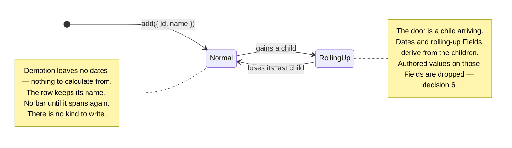

# What decides that a row derives its values

> **Narrowed on 2026-09-12 by [ADR 0022](0022-core-ships-variants-and-a-variant-answers-about-itself.md) (proposed).** Read every *"core does not ship a diamond"* below as the sentence this record produced in 2026-09-10, not as the rule today. Core ships `diamond()` among its shipped variants; no row wears it until a rule claims it; and core still reads no stored word to decide a look. This record's own decision — an Entry carries no stored classification — stands untouched.

> **Vocabulary note, added 2026-09-21.** This record predates the `distribute` → `writeToChildren` rename. Read every `distribute` below as `writeToChildren`, and `FieldDistributor` as `FieldWriteToChildren`. **Do not rewrite the body.**

**Lands after [0016](0016-the-library-holds-no-save-format.md), [0012](0012-dates-are-optional-on-every-kind.md) and [0011](0011-consumer-values-live-in-props.md).** The working material is [`plans/field-redesign/0013-what-decides-derivation/`](../../plans/field-redesign/0013-what-decides-derivation/README.md). **No schema number** — ADR 0016 deleted the Document.

## Context

The Rollup writes a parent's `start`, `end` and `cost` today, and `toJSON` writes all three out as though a person authored them. `fromJSON` reads them back and the Rollup overwrites them. When the stored answer and the written one disagree, the written one loses in silence.

Underneath sits one predicate, and the single-ADR draft asked about it four separate times:

```ts
// rollup.ts:69 and :75
if (kinds.has(entry.kind)) parents.add(entry.id);
// rollup.ts:184
if (!childIds || childIds.length === 0) continue;
```

`entry.kind` is stored per row. `kinds` is the `rollUpKinds` config set. Having children is structure. **Decision 26, closed 2026-09-10, keeps only the third.** An Entry derives when it has children. `kind` leaves the record. `rollUpKinds` is deleted. `hierarchy.autoGroup` is deleted. Core does not ship a diamond. A plugin that needs a look that is not parent-or-bar stores which ids it owns. Do not publish a calculated `kind` Field — that restates `childrenOf`. **Grill 2026-09-10:** a zero-length span is still a bar of no width (0012). Core does not paint a diamond for it.

## Decision

### Nothing but the Rollup writes a rolling-up parent's cell

HEAD writes a parent's `start`, `end` and `cost` as though a person authored them, and `toJSON` / `fromJSON` round-trip them. When the stored answer and the written one disagree, the written one loses in silence: a parent `cost: 999` over a child `cost: 10` imports as `10`, with no warning — **that pass compares `start` and `end` only**.

**[ADR 0016](0016-the-library-holds-no-save-format.md) deleted the Document.** The half that remains is the write rule: nothing but the Rollup writes a rolling-up parent's cell. A stale derived value in a file is no longer possible, because there is no file. The refusal at `entries.update()` still is.

**The refusal stands on its own.** Nothing but the Rollup writes a rolling-up parent's cell. A constructor `entries` array of 500 parents over three rolling-up Fields would otherwise raise 1,500 warnings. A consumer fixes the whole ingest at once. The report names the count, the Field keys, and up to three Entry ids. It goes through `raiseError` at `severity: 'warning'` (ADR 0009), **always** — `reportCorrectedRollUps` was gated on `isDevMode()`, which resolves when *this repo* builds `dist/`, so no consumer ever saw a line of it (D-S5-41).

**On a rolling-up parent, an Aggregator's `undefined` means _no value_.** It is documented as *no opinion — keep the stored value*. Once nothing but the Rollup can write that cell, "keep" means "keep the previous derived answer", which is stale by construction. Elsewhere the current reading stands.

### An Entry derives when it has children, and `kind` leaves the record

**Decision 26, closed 2026-09-10.** The predicate is structure. A parent with children draws the parent look. A childless row is a normal Entry: name, no dates, no bar. Name is required. No `'kind'` on `Entry`, no `update({ kind })`. Core does not ship a diamond. `rollUpKinds` and `hierarchy.autoGroup` are deleted. No opt-out in this ADR. Do not write **phase** or **grouped entry** — `{ source: 'group', groupBy }` is a row source.

Do not replace `kind` with a calculated Field. A plugin calls `childrenOf`. A plugin that needs another look stores ids itself (ADR 0002).

Branches **8**, **20**, **21**, and **24** close with this: no kind to write on demotion; kind is not authored; no derive-off flag; no `rollUpKinds` flip.

A Dataset that used `rollUpKinds: []` to keep parents as authored starts deriving. Decision 6 drops the authored values. Accepted. **No schema number** — [ADR 0016](0016-the-library-holds-no-save-format.md) deleted the Document.

### Promotion runs both ways, and stays automatic



**Promotion is a door, and nobody aimed at it.** An Entry authored with dates becomes a parent the moment it gains a child. Its dates were authored, they are derived from that commit on, and no call named a derived Field.

**Demotion does not happen today.** `hierarchy.test.ts:116` pins the current rule by name: *"removing every child demotes nothing."* **This ADR overrules that**, and the prose sweep rewrites `plans/01` §2.5's promote-only / flickering-identity clause. Look follows children. A parent that loses its last child is a normal Entry: name, no dates, no bar.

On demotion the Entry becomes a **normal Entry with no dates**. There are no children to calculate from, and it can be dated later through the grid. There is no kind to write.

**An Entry that starts rolling up drops its authored values, and the Rollup recalculates them.** Decision 6, closed 2026-09-09. The library never refuses this. The drop is an ordinary ChangeSet row in the same transaction as its cause — a `parentId` write — so undo reverses both. **History is never cleared.** Decision 24 closed with 26: `rollUpKinds` is gone, so there is no config flip.

**An authored value on a derived cell is dropped, and the library says so.** `{ id: 'p', props: { cost: 500 } }` with a child gets no `cost` on `p`. The `EntityAdded` row carries the Entry **as stored** — after the drop, and after ingest fills `props: {}` and the Segments.


### The derived arm of the write resolver is this ADR's

[ADR 0011](0011-consumer-values-live-in-props.md) moves the write resolver into `data/` with HEAD's policies unchanged — `view/capability.ts` calls it; `entries.update()` still throws `UnknownFieldError` only. `rollsUp` already lives in `data/` (`field-registry.ts:97`). **This ADR fills the derived arm and wires `entries.update()` to it**, so a write to a rolling-up parent's rolling-up Field throws `DerivedFieldNotWritableError`. [ADR 0015](0015-what-the-write-door-refuses.md) owns the editable arm. One function, three owners, one at a time.

**`update()` refuses; `add()` drops. A patch is not a record.** Name a Field and the library answers. Hand it a record and the library keeps what is yours. That is PATCH against PUT, and it is the whole rule. A **mixed** patch — `{ start, props: { cost } }` where `cost` is derived — is refused **whole, before any write**. A partial apply would leave a transaction in a state no `before*` event described.

The six call sites are `entries.update()`, the cell editor, a bar drag, `entries.add()`, `new Dataset({ entries })` and the extension hook. **Build the derived answers from those six.** `Dataset.fromJSON()` went with [ADR 0016](0016-the-library-holds-no-save-format.md). Reading *four doors* still skips `add()` and the constructor, which drop rather than throw.

**Do not claim I14 for the derived refusal until [ADR 0015](0015-what-the-write-door-refuses.md) has wired the editable arm.** This ADR closes the derived half only.

### Parent bar drag translates descendants, and does not write the parent

**Grill 2026-09-10.** Parent **cells** stay refused (`DerivedFieldNotWritableError`) while the Field rolls up. Do not distribute a typed parent value down to children. *— amended 2026-09-11, reversed 2026-09-21: see [the second amendment](#amendment-2026-09-21--distribute-reverses-the-parent-move-rule-reads-the-resolver) for the standing rule. A parent cell stays refused from every direction, batched or not, while its Field rolls up. A Field with `rollUp: 'none'` is an ordinary cell instead, owned by the consumer.*

Dragging a parent bar is a different job. It translates every descendant date that exists, in one transaction, one undo. A child with only start: that start moves. A child with only end: that end moves. Spanning children move as a span. Children with neither date are skipped. Writes land on the descendants. The parent envelope rolls up.

**The next two sentences hold only while the parent's dates roll up.** The parent's `start` / `end` are not written. `event.entries` names each descendant. When the parent owns its own dates instead (`rollUp: 'none'`), the drag also writes the parent's own cell — see the second amendment's three rulings.

Reuse `beforeEntryMove` / `entryMove`. No new pair. No `isGroup` flag. `event.entry` is the parent you grabbed. `event.entries` is each descendant that will move, with its proposed `start` / `end` — plus the parent itself, grabbed first, when it owns its own dates instead of rolling them up (see the second amendment's three rulings). A handler that needs the tree calls `dataset.childrenOf(event.entry)`. One veto refuses the whole gesture.

**No schema number.** [ADR 0016](0016-the-library-holds-no-save-format.md) deleted the Document. `reportCorrectedRollUps` deletes with that ADR, not here. Decision 5's warning is still this ADR's.

## Amendment, 2026-09-11 — a derived cell is read-only until the Field says what a write there means

**Why this amendment exists.** The build wired the derived arm into `entries.update()`, and the refusal
then also caught two of the library's own writes. The fix separated a consumer's write from the
library's by asking **how deeply nested the call was** (`TransactionData.openTransactions === 1`).
`dataset.transaction()` is public, so a consumer reaches that lever in one call: the identical write
that throws on its own lands silently inside a transaction body (Q7, in the appendix below — still open).
Permission was being read off the **shape of the call**. It must be read off the **thing being written**.

### The rule

**A Field that rolls up is read-only on a parent, from every direction.** Standalone or batched,
nested or not, the answer is the same. **Grouping changes when writes land together, never what is
allowed.** A transaction is a commit boundary and an undo step. It is not a permission.

**Declaring `distribute` on the Field makes that cell writable, and the declaration says what the
write means.** This is continuity, not a reversal. The *Considered options* table already rejected
distribution **as a default**, in these words: *"A distribution rule is a per-Field policy with no
defensible default… Refusal is honest until a consumer names the policy."* `distribute` is the
consumer naming the policy. With no policy named, the refusal is unchanged.

**Nothing but the Rollup writes a rolling-up parent's cell** — the head decision is untouched.
`distribute` never writes the parent. It writes the children, and the Rollup reads the parent's cell
back off them.

### What a consumer writes

```ts
const dataset = new Dataset({
  entries,
  fields: [
    {
      key: 'cost',
      type: 'money',
      rollUp: 'sum',
      // A written total means: give every child an equal share.
      distribute: (total, children) =>
        new Map(children.map((child) => [child.id, { cost: (total ?? 0) / children.length }])),
    },
  ],
});

dataset.entries.update('phase-1', { cost: 900 }); // three children, 300 each; `phase-1.cost` rolls back up to 900
```

- **It receives** the proposed value, the parent's **direct** children, the parent, and the Rollup's
  own `RollUpContext`. The parameter order mirrors `Aggregator(children, parent, ctx)`, because
  `distribute` is that Aggregator read backwards. `RollUpContext` is the right context and not a new
  one: a distribution needs the zone, `read`, `values`/`numericValues`, and `ctx.field` — a Field
  **type** bundle declares one `distribute` for many keys, so the key has to come from the context.
- **It returns `EntryEdits`** — `ReadonlyMap<EntryId, EntryEdit>`, the same shape an `EditExtender`
  returns and the same `EntryEdit` `update()` takes. One write shape, one knob.
- **It declines by returning `undefined`, or an empty map.** A decline is refused exactly as an
  undeclared `distribute` is refused: `DerivedFieldNotWritableError`, on the same Field key. A
  consumer catches one error, never two. A policy with nothing to write is a policy that says no —
  "split a total over zero children" has no answer, and the Field says so by declining.
- **It is declared inline, like `compute`, not registered by name like an Aggregator.** `rollUp` is a
  name because a name serializes; `distribute` sits beside `compute`, `equals` and `formatValue`,
  which are functions on the declaration already.
- **Its edits go through the same door they would have come in by.** Each returned edit is applied as
  an ordinary write on that child, so a child that is itself a rolling-up parent distributes again, or
  refuses. The recursion terminates on the leaves. **An edit aimed back at the Entry being written is
  refused** (`DerivedFieldNotWritableError`): that cell is the Rollup's, and a `distribute` that
  returned one would loop.
- **It answers a patch, never a record.** `update()` refuses or distributes; `add()` and the Dataset
  constructor still **drop** an authored value on a deriving Entry (decision 6). A record is not a
  patch, and that half of the ADR does not move.
- **A mixed patch is still refused whole, before any write.** `{ start, cost }` with a refused `cost`
  writes neither. Every Field in the patch resolves, and every `distribute` runs, before anything
  stages.

### Decision 5's fate: (b) refused

Decision 5 — *the Rollup yields to a field the caller proposed in the same transaction* — is a
**Rollup precedence** rule. It is not a permission to write a derived cell. Under this amendment a
consumer can no longer put a rolling-up field of a **parent** into a transaction body at all, so for a
parent that already has children the answer is **(b): refused**, batched or not. Nothing here is a
silent exception that only works because of nesting.

**The yield still has a real case, and it is structure, not depth.** Derivation is read at the moment
the write is proposed, against the transaction's own staged state. An Entry that is a **leaf** when
the write is proposed accepts it, and it may gain a child later in the same transaction — at which
point decision 5 decides, and the proposal wins over the cascade:

```ts
dataset.transaction(() => {
  dataset.entries.update('x', { start, end });        // `x` is a leaf here — allowed
  dataset.entries.add({ id: 'c', parentId: 'x', … }); // `x` derives from here on
});                                                    // `x` keeps the proposed span (decision 5)
```

This is the case decision 5's own wording describes — the proposal wins **over the cascade**, so there
has to be a cascade. It is honest under one rule: the write was legal when it was made.

### The origin signal is not used

`data/entry-reader.ts` carries `EditOrigin { entryId, operation }`, threaded through every write and
read only by error messages. It **is** the right signal if the library's own bookkeeping ever needs an
exemption from a consumer rule, because no consumer can set it. **This amendment needs no exemption,
so it takes none.** One rule, one path, no library-only door.

The one internal caller that appeared to need an exemption did not. `#removeSegmentsFrom` clears both
dates when an Entry's last Segment goes (ADR 0012). On an Entry **with children** those dates are the
Rollup's, so the clear had nothing to clear — and it did real damage: the clear is a proposal in the
transaction body, so decision 5 made the Rollup yield to it, and a parent with a dated child committed
with **no dates at all**. Measured 2026-09-11: a parent whose child spans `100…200` committed
`start: undefined, end: undefined`. **The clear now runs only where the Entry owns its own dates.**
That is the same rule this amendment states, applied by the library to itself, and the parent keeps the
rolled-up envelope its children give it.

### One code path

The derived answer resolves in `data/write-rule.ts`, from the Field declaration and one structural
fact. It reads no transaction state.

```ts
type WriteTarget = 'entry' | 'children' | 'refused';
function resolveWriteTarget(hasChildren: boolean, field: Field): WriteTarget;
```

**Narrowed 2026-09-21 (#470): `'children'` leaves the union.** `WriteTarget` is `'entry' | 'refused'`
now — see the second amendment, below.

`entries.update()` reads it, and so does the capability resolver behind a cell's affordance — the cell
editor opens on a parent cell exactly when a write there would land. One resolution, gestures and
affordances together (I14). The **editable** arm stays [ADR 0015](0015-what-the-write-door-refuses.md)'s,
untouched here: `update()` reads the derived arm only.

`#opensOwnTransaction` is deleted, and `TransactionData.openTransactions` returns to one reader,
`runTransaction`.

### Consequences of the amendment

- **`Field` gains one optional key**, `distribute`, on the stored arm only. A `compute` Field has no
  cell to write, so the key is `never` there.
- **`plans/01` §2.6's rollup-precedence bullet needs the prose sweep.** *"The rollup yields to a field
  the caller proposed in the same transaction"* is still true, and it now needs the sentence above it:
  a consumer cannot propose a deriving parent's rolling-up field in the first place.
- **A consumer who wants the old bypass writes the policy.** That is the whole point: the write that
  used to land silently now lands where the consumer said it should, or does not land.
- **The extension hook is a door this amendment never ruled on.** `toEditsReading`
  (`src/data/entry-reader.ts`) checks that the Field is declared, and nothing else. So a cascade
  neither splits a `distribute` cell (the key is `writeToChildren` since #467) nor meets `editable`'s
  thresholds, where `entries.update()` does both.
  [#469](https://github.com/freegantt/freegantt/issues/469) tracked both disagreements, and closed
  on 2026-09-21: #470 deleted `writeToChildren`, so the split half has no key left to disagree
  about. The `editable` half is [#473](https://github.com/freegantt/freegantt/issues/473).
- **[#470](https://github.com/freegantt/freegantt/issues/470) reverses the `distribute`
  half of this amendment**, and keeps the permission rule above. See the second amendment, below.

## Amendment, 2026-09-21 — `distribute` reverses; the parent-move rule reads the resolver

**The permission rule from 2026-09-11 stands, unchanged.** A Field that rolls up is read-only on a
parent, from every direction. Grouping changes when writes land together, never what is allowed.

**The policy seam that rode along on it goes.** `Field.distribute` (and its `FieldWriteToChildren`
type) is deleted. `WriteTarget` narrows from three values to two: `'entry' | 'refused'`. A write to a
rolling-up parent's cell throws `DerivedFieldNotWritableError` again, from every direct-write door,
with no declared policy that reopens it. The extension hook is a separate door, and stays unruled:
see [the amendment above](#amendment-2026-09-11--a-derived-cell-is-read-only-until-the-field-says-what-a-write-there-means)
and [#473](https://github.com/freegantt/freegantt/issues/473).

**Why.** Nobody named a policy in ten months of use. Its first and only caller was a harness button
written afterward to exercise the key, not a consumer need. The *Considered options* table already
gave the standing answer, and it is the answer again: *"A distribution rule is a per-Field policy
with no defensible default… Refusal is honest until a consumer names the policy."* [The plan's "The
decision"](https://github.com/freegantt/freegantt/issues/470) states this as a rule, not a case
count: **core writes downward only where the arithmetic has exactly one answer.** A move under
translation has one inverse. A resize (stretch an envelope) and a split (a total over children) do
not, so core refuses both and leaves the Field to the consumer who wants one.

**A consumer who wants to own a parent's value declares `rollUp: 'none'`, or no `rollUp` at all.**
`CORE_FIELD_OVERRIDABLE_KEYS` grows by that one key ([ADR 0015](0015-what-the-write-door-refuses.md)),
so `{ key: 'start', rollUp: 'none' }` is legal even on a core Field. The parent's cell is then an
ordinary cell, written like any other — including from an `EditExtender` that keeps it current on
every child change, one undo step per user action.

**The parent-move rule reads the resolver, not `hasChildren`.** A grabbed parent's own dates write
when, and only when, that row owns the Field (`resolveWriteTarget(entry.hasChildren, field) ===
'entry'`) and may write it (`canWrite`) — the same two questions a leaf answers. The descendant walk
skips a row on the first question, not on `hasChildren`, so an owning intermediate parent moves with
the rest and a deriving one does not. Three rulings follow, all dated 2026-09-21:

- **Resize.** An owning parent is an ordinary bar: the handle opens on an edge it owns and may write,
  and the resize writes the parent alone. The subtree does not stretch — an envelope has no unique
  inverse, so that half of the decision table stays true even for an owning parent.
- **Mixed mode** (`start: 'none'`, `end: 'max'`). A move shifts a span, and half a span cannot shift.
  The parent writes its own dates only when both Fields answer `'entry'` and both may be written.
  Otherwise the move writes descendants only, and the derived half re-rolls at commit. Resize follows
  per edge.
- **A locked descendant under an owning parent** refuses the whole gesture. The preview paints the
  whole subtree translated, and a parent that moved without its child would land where the drag never
  showed.

So the gesture keeps one meaning at every setting: move the bar you grabbed, and what it covers. A
consumer writes no gesture code in either mode.

## Considered options

| Option | Verdict |
|---|---|
| **Record what the Rollup wrote, and omit that set** | **Rejected.** It needs a cumulative set that no `ChangeSet` carries and that five reachable seams invalidate |
| **Persist derived values and report a correction on import** | **Rejected.** It keeps a value whose meaning depends on declarations that may not travel with it. Not writing the value stops the disagreement existing |
| **Let a rolling-up parent cell be edited, and distribute down to the children** | **Rejected as a default.** A distribution rule is a per-Field policy with no defensible default — split evenly, by duration, by current share? Refusal is honest until a consumer names the policy. *— amended 2026-09-11: still rejected as a default, and now **accepted as a declaration**. `Field.distribute` is the consumer naming the policy* |
| **Read permission off the shape of the call — a nested write is the library's, a standalone write is a consumer's** | **Rejected 2026-09-11** (the amendment). `dataset.transaction()` is public, so the signal is a consumer's to set: the same write throws alone and lands wrapped (Q7). Permission follows the thing written, never the call that wrapped it |
| **Let a per-entry flag turn derivation off, so the write sticks** | **Rejected for this ADR.** Answer (c) of decision 26. Decision 21 closed with 26: no flag. A later ADR may add one. |
| **Keep `kind` as an authored look key, structure-only for derivation** | **Rejected.** The combined spike's (b). The author ruled look follows children too, and the Field goes. |
| **A calculated `kind` Field** | **Rejected.** Restates `childrenOf`. Two names for one fact (#7). |

## Consequences

- **One report per operation, not per value.** The report names the count, the Field keys, and up to three Entry ids. It goes through `raiseError` at `severity: 'warning'`, **always**.
- **`props` is carried by reference, except on a rolling-up parent.** [ADR 0011](0011-consumer-values-live-in-props.md) states the flat rule; this is the one exception. D-S2-12 says the namespace is never walked field by field — say so where D-S2-12 is written, rather than leaving two rules to disagree in silence.
- **There is no Document.** [ADR 0016](0016-the-library-holds-no-save-format.md) deleted it. The omission half of this ADR's head decision has nowhere to omit to. The write-refusal half stands.
- **`plans/01` §2.5's authored-kind rule, the promote-only clause, and the shipped `'milestone'` are overruled.** The prose sweep rewrites those sentences. `kind` leaves `Entry`. Core does not ship a diamond.
- **`reportCorrectedRollUps` is already gone** — ADR 0016 deleted it with the reader. Decision 5's warning is a different thing, and this ADR still writes it.
- **D-S5-22's four seams lose `entry.kind` as their join.** They ask structure, or a plugin store. [0015](0015-what-the-write-door-refuses.md) decision 18 loses its `kind` row.
- **When every child is dateless, the parent's dates clear.** An Aggregator's `undefined` means no value, not *keep the last envelope*. HEAD keep-stale leaves a parent that lies about dates. Combined spike Improvement D.

## Ordering constraints

1. **[ADR 0016](0016-the-library-holds-no-save-format.md) lands first**, then [ADR 0012](0012-dates-are-optional-on-every-kind.md). Demotion leaves an Entry with no dates, which `Entry` cannot represent today.
2. **[#270](https://github.com/Pawel-IT/FreeGantt/issues/270) lands inside this build** — BUILD-SPEC V15. The `body`/`merged` split stays. Unifying that predicate was a misread — [`refuted.md`](../../plans/field-redesign/shared/refuted.md) item 8. This ADR writes decision 5's warning; it does not unify the two sets.

## Issues this ADR depends on

| Issue | What this ADR needs from it |
|---|---|
| [#270](https://github.com/Pawel-IT/FreeGantt/issues/270) | A declining Aggregator leaves a stale rolled-up value. `rollup.ts:208` skips an Aggregator **that saw children**; a childless parent never reaches one. Land the fix inside this build — BUILD-SPEC V15 |

## Appendix — the build's calls, and one question still open

These entries were `plans/field-redesign/BUILD-LOG.md`. That log is deleted; what this ADR cites
lives here.

| | The call |
|---|---|
| `J34` | the parent drag as built: one draft, split into what it writes and what it paints |
| `J35` | the parent-drag e2e corrected two things the log said, and one of them was the agent's |
| `N12` | the six `.fg-bar-summary` e2e exclusions: all six stay, and none of them is a drag test |
| `N13` | no e2e covered the parent bar drag — closed 2026-09-11, `e2e/parent-bar-drag.spec.ts` |

### Q7 — the moved guard is bypassable by any consumer who wraps the write in `dataset.transaction()`

**Raised:** 2026-09-11, coordinator, verifying the Q6 fix. **Status:** open, needs the author.

The Q6 fix works and both acceptance tests pass unmodified. But the signal it separates on —
transaction depth (`TransactionData.openTransactions === 1`) — is **reachable by a consumer**, because
`dataset.transaction()` is public API. Measured with a throwaway probe (since deleted), on `p1` with
one child `c1`:

| Call | Result |
|---|---|
| `entries.update('p1', {start, end})` standalone | throws `DerivedFieldNotWritableError` — correct |
| the **same lone write** inside `state.transaction(() => { … })` | **no throw, and the consumer's value sticks on the derived cell** |

So ADR 0013 line 91 — *"Parent **cells** stay refused"* — no longer holds for any consumer who wraps.
The refusal is now opt-out, and the opt-out is one public call.

**This is not a failed task.** The two internal callers Q6 named are genuinely fixed, the quadratic
regression is genuinely fixed, and the fix agent recorded the `dataset.transaction()` case in its own
comment as deliberate. The question is whether that consequence is acceptable.

**Why transaction depth cannot be the whole rule.** Decision 5's protected case does go through the
**public** `entries.update()` inside a transaction, so "internal method for internal callers" cannot
separate them — the fix agent tested that and was right to reject it. But decision 5's case is a
proposal that *accompanies a cause* (the child's own change in the same transaction). A lone write to
a derived cell has no cause; it is an ordinary refused write that happens to be wrapped.

**Candidate rule, for the author:** refuse unless the same transaction also carries a **cause** — a
change to a descendant, or a structural change that makes the Rollup run for this Entry. That matches
decision 5's wording ("the same-transaction proposal wins **over the cascade**" — there must be a
cascade) and restores line 91 for the bare-write case. It is more work than the current check and it
is a design decision, so it is not an agent's to make.

**Alternative:** accept the current behaviour and amend ADR 0013 line 91 to say the refusal is a
consumer-door convenience, not an invariant. Honest, but it weakens a stated guarantee.
