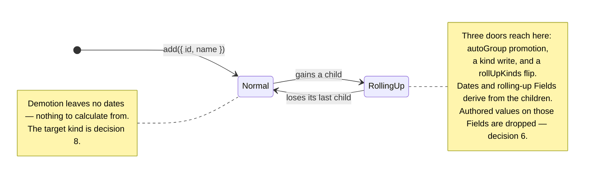

# What decides that a row derives its values

**Lands third**, after [0012](0012-dates-are-optional-on-every-kind.md) and [0011](0011-consumer-values-live-in-props.md). The working material is [`plans/field-redesign/0013-what-decides-derivation/`](../../plans/field-redesign/0013-what-decides-derivation/README.md).

## Context

The Rollup writes a parent's `start`, `end` and `cost` today, and `toJSON` writes all three out as though a person authored them. `fromJSON` reads them back and the Rollup overwrites them. When the stored answer and the written one disagree, the written one loses in silence.

Underneath sits one predicate, and the single-ADR draft asked about it four separate times:

```ts
// rollup.ts:69 and :75
if (kinds.has(entry.kind)) parents.add(entry.id);
// rollup.ts:184
if (!childIds || childIds.length === 0) continue;
```

`entry.kind` is stored per row. `kinds` is the `rollUpKinds` config set. Having children is structure. **Which of those three decides derivation, and which of them are stored, is decision 26** — and decisions 8, 20, 21 and 24 are its branches, not its peers.

## Decision

### A derived value lives in the store and never reaches the Document

The Rollup writes a parent's `start`, `end` and `cost` today, and `toJSON` writes all three out as though a person authored them. `fromJSON` reads them back and the Rollup overwrites them. When the stored answer and the written one disagree, the written one loses in silence: a parent `cost: 999` over a child `cost: 10` imports as `10`, with no warning and no `rollup-corrected` report — **that pass compares `start` and `end` only**. **A value the Rollup would reproduce exactly is not written.** A stale derived value stops being possible rather than being detected.

The two rulings hold each other up. The refusal means nothing but the Rollup can put a value in a rolling-up parent's cell, so omitting it loses nothing a person authored. Without the refusal, omission drops user edits.

**One report per operation, not per value.** A hand-written Document with 500 groups over three rolling-up Fields would otherwise raise 1,500 warnings. A consumer fixes their whole export at once. The report names the count, the Field keys, and up to three Entry ids. It goes through `raiseError` at `severity: 'warning'` (ADR 0009), **always** — `reportCorrectedRollUps` was gated on `isDevMode()`, which resolves when *this repo* builds `dist/`, so no consumer ever saw a line of it (D-S5-41).

**On a rolling-up parent, an Aggregator's `undefined` means _no value_.** It is documented as *no opinion — keep the stored value*. Once nothing but the Rollup can write that cell, "keep" means "keep the previous derived answer", which is stale by construction. Elsewhere the current reading stands.

### Promotion runs both ways, and stays automatic



**Promotion is a door, and nobody aimed at it.** An Entry authored with dates becomes a rolling-up kind the moment it gains a child under autoGroup — `fixtures/hierarchy-dataset.ts` authors exactly that shape. Its dates were authored, they are derived from that commit on, and no call named a derived Field.

**Demotion does not happen today.** `hierarchy.test.ts:116` pins the current rule by name: *"removing every child demotes nothing."* An Entry that gains a child and loses it again then stays a rolling-up kind for life, and under the omission rule it holds no dates and draws no bar, with no call responsible. `plans/01` §2.5 chose promote-only on purpose — *demoting on losing the last child would reintroduce exactly the flickering identity this rule exists to prevent*. **This ADR overrules that clause**, and the prose sweep rewrites the sentence. No comparable product ships promotion without demotion (see [`evidence.md`](../../plans/field-redesign/shared/evidence.md)).

On demotion the Entry becomes a **normal Entry with no dates**. There are no children to calculate from, and it can be dated later. What **kind** it returns to is decision 8. Whether `'group'` survives as an authored kind at all is decision 20.

**An Entry that starts rolling up drops its authored values, and the Rollup recalculates them.** Decision 6, closed 2026-09-09. The library never refuses this, at any of the three doors. The drop is an ordinary ChangeSet row in the same transaction as its cause, so undo reverses both and the authored value is legal again. **History is never cleared, and `rollUpKinds` is not a destructive setter.** One follow-up stays open on one door: a `rollUpKinds` flip's cause is a config assignment, and `ChangeSet` has no row for one. That is **decision 24**.

**An authored value on a derived cell is dropped, and the library says so.** `{ id: 'p', kind: 'group', props: { cost: 500 } }` gets no `cost` on `p`. Keeping it needs a second storage slot beside the derived value — the old bag again under a worse name. Echoing it back on `toJSON` is worse: the moment a child changes, the echoed number is a wrong answer wearing an authored value's clothes. The `EntityAdded` row carries the Entry **as stored** — after the drop, and after ingest fills `props: {}` and the Segments.


### The derived arm of the write resolver is this ADR's

[ADR 0011](0011-consumer-values-live-in-props.md) moves the write resolver into `data/` with HEAD's policies unchanged — `view/capability.ts` calls it; `entries.update()` still throws `UnknownFieldError` only. `rollsUp` already lives in `data/` (`field-registry.ts:97`). **This ADR fills the derived arm and wires `entries.update()` to it**, so a write to a rolling-up parent's rolling-up Field throws `DerivedFieldNotWritableError`. [ADR 0015](0015-what-the-write-door-refuses.md) owns the editable arm. One function, three owners, one at a time.

**`update()` refuses; `add()` drops. A patch is not a record.** Name a Field and the library answers. Hand it a record and the library keeps what is yours. That is PATCH against PUT, and it is the whole rule. A **mixed** patch — `{ start, props: { cost } }` where `cost` is derived — is refused **whole, before any write**. A partial apply would leave a transaction in a state no `before*` event described.

The seven call sites are `entries.update()`, the cell editor, a bar drag, `entries.add()`, `Dataset.fromJSON()`, `new Dataset({ entries })` and the extension hook. **Build the derived answers from those seven** — reading *four doors* skips `add()`, `fromJSON()` and the constructor, which drop rather than throw.

`toJSON` is not a write. It asks the derived half only, so it is a caller of that half and not a fifth `canWrite`. **Do not claim I14 for the omission, and do not claim I14 for the derived refusal until [ADR 0015](0015-what-the-write-door-refuses.md) has wired the editable arm.** This ADR closes the derived half only.

This ADR writes schema **7**.

## Considered options

| Option | Verdict |
|---|---|
| **Record what the Rollup wrote, and omit that set** | **Rejected.** It needs a cumulative set that no `ChangeSet` carries and that five reachable seams invalidate |
| **Persist derived values and report a correction on import** | **Rejected.** It keeps a value whose meaning depends on declarations that may not travel with it. Not writing the value stops the disagreement existing |
| **Let a rolling-up parent cell be edited, and distribute down to the children** | **Rejected as a default.** A distribution rule is a per-Field policy with no defensible default — split evenly, by duration, by current share? Refusal is honest until a consumer names the policy |
| **Let a per-entry flag turn derivation off, so the write sticks** | **This is answer (c) of decision 26**, and it is no longer a deferred row. A stored flag emits an ordinary Field row, so undo reverses flag and values in one step. Where the flag lives is branch 21 |

## Consequences

- **One report per operation, not per value.** A hand-written Document with 500 groups over three rolling-up Fields would otherwise raise 1,500 warnings. The report names the count, the Field keys, and up to three Entry ids. It goes through `raiseError` at `severity: 'warning'`, **always** — `reportCorrectedRollUps` was gated on `isDevMode()`, which resolves when *this repo* builds `dist/`, so no consumer ever saw a line of it (D-S5-41).
- **`props` is carried by reference, except on a rolling-up parent.** [ADR 0011](0011-consumer-values-live-in-props.md) states the flat rule; this is the one exception. D-S2-12 says the namespace is never walked field by field — say so where D-S2-12 is written, rather than leaving two rules to disagree in silence.
- **`toJSON` output is no longer byte-identical to the input for a rolling-up parent.** `toJSON → fromJSON → toJSON` is still stable, because the structural test is a pure function of kind, hierarchy and declarations.
- **A Document is our save format. It is not an interchange format, and that is now a decision.** A third-party reader sees a group with no span and no rolled-up values, and would need the same Aggregator *implementations*, referenced by name only.
- **`plans/01` §2.5's promote-only / flickering-identity clause is overruled.** The prose sweep rewrites the sentence.
- **`reportCorrectedRollUps` is deleted** — with no reproducible derived value in the Document there is nothing to correct. **Delete it in this ADR, not in 0011.** 0011 still writes derived keys; deleting the report there leaves `fromJSON` silent.
- **A plugin loses a *derived* value, because its declaration does not travel.** An S7 group's rolled-up `progress` is omitted, and a Document read without the plugin cannot re-derive it (D-S5-33). The leaf values still round-trip. Judged acceptable.

## Ordering constraints

1. **[ADR 0012](0012-dates-are-optional-on-every-kind.md) lands first.** Demotion leaves an Entry with no dates, which `Entry` cannot represent today.
2. **Unify the proposed-Field predicate before this ADR deletes the `body`/`merged` split.** `rollup.ts:196` reads `body`; `build-commit-change-set.ts:301` binds `body: proposed`, the transaction body alone, so a cascade's edits reach only `merged`. An independent fix — land it on `main`.
3. **[#270](https://github.com/Pawel-IT/FreeGantt/issues/270) before or with this ADR.**

## Issues this ADR depends on

| Issue | What this ADR needs from it |
|---|---|
| [#270](https://github.com/Pawel-IT/FreeGantt/issues/270) | A declining Aggregator leaves a stale rolled-up value. `rollup.ts:208` skips an Aggregator **that saw children**; a childless parent never reaches one. Once the Document omits derived values, a re-read answers *no value* while the live store still answers `10`. **The re-read is correct** |
