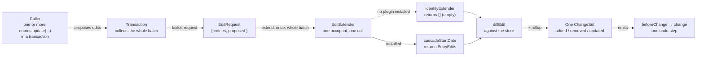

# The extension hook — flow and sample usage

**Scope:** `data/edit-extension.ts` (D-S2-6, `plans/s2-data-core`). This doc illustrates the mechanism
closed in **OQ1** (`plans/s2-data-core/OPEN-QUESTIONS.md`), revised 2026-08-27 at the user's explicit
direction — a plain, usable API now over pre-matching an S7 scheduling contract that doesn't exist yet.
It is a walkthrough, not a spec — the authoritative shape is
`plans/s2-data-core/s2.2-transactions-and-changesets.md` §2.2.

Every mutation runs through **one** hook before it commits. With no plugin installed it is the
identity function — the proposed edits become the committed edits, unchanged. An installed extender
gets one chance to return extra edits, layered on top of what the caller asked for, folded into the
same `ChangeSet`, the same undo step. A transaction can carry any number of proposed edits — one or
many — and the hook always sees the whole batch at once, never one edit at a time.

## Vocabulary

| Name | Shape | What it is |
|---|---|---|
| `EntryEdit` | `Partial<EntryInput>` minus `id` | **The write shape.** One Entry's proposed field changes, dates loose — the same object `dataset.entries.update(id, edit)` takes |
| `EntryEdits` | `ReadonlyMap<EntryId, EntryEdit>` | A batch of those, keyed by Entry — what an extender returns, whether the batch holds one entry or many |
| `StoredEdit` / `StoredEdits` | dates as `Instant`, `proposedKeys` stated | **The read shape.** The same edit after core read it. A plugin author reads one off `request.proposed` and never builds one |
| `EditRequest` | `{ entries, proposed, entryAfterEdits }` | What goes into the hook: the pre-transaction entries (a `Map`), the caller's whole proposed batch as `StoredEdits`, and a per-id lookup for post-body state (D-S5-45) |
| `EditExtender` | `(request: EditRequest) => EntryEdits` | The function occupying the hook — `identityExtender` when nothing is installed |

There is no wrapper type around the extender's return value. An extender returns extra writes, in the
same shape a caller already writes to `dataset.entries.update()` — one vocabulary for "an edit,"
whoever produces it, and whether it's one entry or a batch (#209). `data/` diffs both the caller's
edits and the extender's edits against the store into `FieldUpdated` rows itself (`diffEdit`), so
nobody who writes an edit has to compute a diff by hand.

**Read one way, write the other.** The two shapes are not interchangeable, and the asymmetry is the
point: every `StoredEdit` is a legal `EntryEdit` (an `Instant` is an `InstantInput`), and no
`EntryEdit` is a legal `StoredEdit`. So a forgotten normalization is a compile error, and no `as` sits
on the hook boundary. Normalization has **one** door: `DatasetState.extraEditsFor` calls the occupant
and then `readEdits`, and both the commit path and the drag preview come through it. A plugin author
therefore never resolves a date, never states `proposedKeys`, and never computes an envelope.

**What a plugin author writes for the two cases that are easy to get wrong:**

- Two plugins on one Entry — `mergeEntryEdits(next(request), mine(request))`, never a `Map` spread or
  an object spread. A spread drops the earlier plugin's write outright (#197, #238).
- A whole-Entry move — `moveEntryTo(entry, start)`. An envelope-only write against
  an Entry that draws several Segments is refused (`SegmentsOutOfSyncError`, D-S5-44), because
  `start`/`end` alone name no Segment to move. `moveEntryTo` returns every Segment translated rigidly,
  each keeping its own `SegmentId`, and it names `segments` and nothing else — core derives the
  envelope (D-S5-50, #239). Stating the envelope here used to overwrite an earlier plugin's `end` and
  commit that write away with no error.

**One known hole.** A cascade onto an Entry the *same transaction adds* is dropped in silence:
`diffEdit` finds no base Entry for that id in the committed store, so it produces no rows and the
author sees no error. Ruled deferred to **S7** and tracked as **#235**.

## Flow



The same hook, two occupants: with nothing installed the extender returns no edits; with
`cascadeStartDate` installed it returns one entry per cascade, for as many proposed edits as it finds
a dependent for. Either way the return value is diffed against the store the same way the caller's own
edits are — the caller's code never branches on which is active, and never branches on batch size
either.

## Sample usage

A consumer moves two entries' start dates together, in one transaction — a caller reschedules a whole
phase, not just one bar. Grouping matters here: without it, each `update()` would commit (and undo)
separately, so a shared "undo the reschedule" click would only undo the second entry.

```ts
// caller — harness/main.ts
dataset.transaction(() => {
  dataset.entries.update('pour-foundation', { start: '2026-09-03' });
  dataset.entries.update('site-survey', { start: '2026-08-29' });
});
```

A single edit needs none of that — it's still worth showing, because it's the more common call and it
needs no ceremony at all. D-S2-8 auto-wraps a lone mutation in its own transaction, the same
convenience `plans/02` §2 promises: "Single mutations outside an explicit transaction are auto-wrapped
in one — no second code path."

```ts
dataset.entries.update('pour-foundation', { start: '2026-09-03' });
```

Nothing about either call changes whether an extender is installed — the cascade, if any, happens
inside the hook, not at the call site. `cascadeStartDate` below runs inside whichever transaction is
open, auto-wrapped or explicit, and sees the **whole** proposed batch in one call — not once per edit:

```ts
// an installed extender — a Dataset plugin claims the hook in its own setup(), with
// ctx.edits.setExtender((next) => (request) => mergeEntryEdits(next(request), cascadeStartDate(request)))
const cascadeStartDate: EditExtender = ({ entries, proposed }) => {
  const extraEdits = new Map<EntryId, EntryEdit>();

  for (const [id, edit] of proposed) {
    if (edit.start === undefined) continue;

    const dependent = findDependent(entries, id);
    if (dependent) {
      extraEdits.set(dependent.id, { start: edit.start });
    }
  }

  return extraEdits;
};
```

Run against the two-entry transaction above, this extender loops twice — once per proposed edit — and
can return up to two extra edits (`frame-walls` cascading from `pour-foundation`, `permit-review`
cascading from `site-survey`), all folded into the one `ChangeSet` the transaction commits.

S5.10 shipped the public way to install one: `new Dataset({ entries, plugins: [myPlugin()] })`, with
the plugin claiming the hook through `ctx.edits.setExtender` (D-S5-23). Installing **composes** — the
wrapper receives the current occupant, so a second plugin adds to the first's writes instead of
evicting it. `harness/plugins/lock-entries.ts` is the worked example.

### Walkthrough

1. **The caller** writes plain `dataset.entries.update(...)` calls — one alone, or several grouped in
   `dataset.transaction(() => { ... })`. It has no idea an extender is installed, and no branch for "if
   a plugin is present" or "if there's more than one edit."
2. **The transaction collects the whole batch** — one proposed edit if the call was auto-wrapped
   (D-S2-8), or however many the body made — and, at commit, builds **one** `EditRequest`: the current
   entries plus every proposed edit together.
3. **`cascadeStartDate` runs once**, given the entire batch. It loops `proposed`, and for each entry
   with a proposed `start` and a dependent, adds one extra edit. Nothing outside the loop's matches is
   touched.
4. **The transaction diffs every edit map against the store** (`diffEdit` — the caller's `proposed` and
   the extender's returned edits alike), then rolls up derived spans, and commits everything as one
   `ChangeSet` — one `change` event, one undo step, no matter how many entries moved.
5. **With no extender installed**, `identityExtender` returns an empty `EntryEdits` regardless of batch
   size: same request, same commit path, nothing extra to diff. The caller's code above does not change
   either way.

## Rendered diagram

A designed version of the flow above (graph-paper/blueprint diagram + annotated code, matching the
`EntryEdits` shape and the multi-edit sample) is published at:
<https://claude.ai/code/artifact/229eddd0-6b41-4e37-85b3-e41e08d8af5f>
