# FreeGantt — Specification Overview

**Status:** Approved direction — spec for a clean build in this repo.
**Documents:**

| Doc | Contents |
|---|---|
| `00-overview.md` (this) | Goals, locked decisions, design principles, slice map |
| `01-domain-architecture.md` | Layer map, domain model, module contracts, invariants, diagrams |
| `02-public-api.md` | External API design: configuration, events, customization, serialization |
| `03-slices.md` | The vertical slices: scope, acceptance criteria, and demo for each |
| `04-implementation.md` | Dependency decisions, repo bootstrap order, tooling config, CI pipeline |

---

## 1. What this is

A **framework-free TypeScript Gantt/timeline library**, built library-first: our own app is the first consumer, but the API, docs, and packaging are designed for external consumers from day one.

It makes **no assumptions about the user's planning methodology**. The core understands tasks, time, dependencies, and rows — universal concepts. Everything opinionated (how conflicts resolve, what "critical" means, how deep resource modeling goes) is a **pluggable policy or extension**, never a baked-in rule.

## 2. Locked decisions

These were decided explicitly and the rest of the spec depends on them. Changing one means revisiting the documents that cite it.

| # | Decision | Choice |
|---|---|---|
| D1 | Consumer model | **Library-first.** Our app consumes it, but it is a real library: stable API, semver, docs. |
| D2 | Scale posture | **Design for growth.** Architecture targets ~10k tasks smoothly, with named seams (height index, worker, dense rendering) for more. Validated by a measured spike, not assumed. |
| D3 | Initial scheduling depth | **Bars + dependencies**: hierarchy, dependency links with lag, cascade propagation, cycle detection. Calendars, constraints, and resources are later slices behind existing seams. |
| D4 | Scheduling isolation | Scheduling is a **pure, DOM-free module**. It never imports rendering; rendering never imports it. They meet only through the data store. |
| D5 | Host environment | **Framework-free TS core.** Wrappers (React etc.) are possible later as thin adapters; nothing in core may depend on one. |
| D6 | Time model | **Absolute timestamps (epoch ms) + project-owned IANA timezone.** All civil arithmetic (day boundaries, snapping, week starts) resolves through the project zone via a dedicated time module. A helper API gives users civil-date ergonomics. |
| D7 | Persistence | **Host-owned via changesets.** Versioned `toJSON`/`fromJSON` + well-defined changeset events in core. An official sync adapter can be layered on later as an extension — the changeset contract is designed so that requires no core change. |
| D8 | Layout | **Split-pane: grid (task table) + timeline**, sharing one row-geometry source. Grid starts minimal (label column) and grows. |
| D9 | Multi-chart sync | Two or more charts must eventually **scroll together on x, y, or both** (e.g., task chart above a workforce chart) **without core changes**. Therefore the time scale and scroll state are standalone, shareable objects a chart *binds to*, never private internals. |
| D10 | Editing | Programmatic mutation + **transactions + undo/redo live in the data core from slice one** (they shape everything). Pointer manipulation (drag/resize/link) arrives early but lives in its **own interaction module**. |
| D11 | A11y / browsers | Evergreen browsers. **Solid accessibility built in as slices land** (keyboard nav, focusable bars, grid semantics) — never a retrofit pass. |
| D12 | Stack | TypeScript strict, Vite (dev harness + build), Vitest, Playwright for E2E later. Module boundaries enforced by lint rules in CI, not convention. Core runtime dependencies: at most one (the reactive primitive, behind a façade). |

## 3. Design principles

1. **Authored vs. derived, and never confuse them.** Tasks, dependencies, calendars are authored and persisted. Rows, bars, lanes, geometry are derived every frame and never persisted. This one separation is what makes multiple bars per row, resource views, and grouping cheap later.
2. **Pure layers below the DOM line.** Model, time, data, scheduling, and layout run in Node with no DOM. Every geometry or scheduling bug is a unit test against a plain object.
3. **Policies, not opinions.** Wherever planning methodologies disagree (conflict precedence, criticality, calendar semantics), the core exposes a policy seam with a sensible neutral default. The default is documented as *a* choice, not *the* truth.
4. **The delta is the interface.** Every mutation flows through a transaction that produces a changeset (`{ from, to }` per field). Undo, persistence, animation, sync, and multi-view consistency all consume the same changesets.
5. **Two channels for rendering.** Cold path: data/viewport changes rebuild memoized geometry. Hot path: hover/selection/drag apply as class toggles and transforms on existing nodes — zero allocation, no geometry rebuild.
6. **Diagnostics over silent fixes.** The scheduling engine never silently rewrites what the user asked for. It reports conflicts as machine-readable diagnostics; the view (or host) decides what to do.
7. **Every slice ends on screen.** No slice is "pure infrastructure." Each cuts vertically (model → layout → render → API) and its acceptance criteria include something a human can see and poke in the dev harness.
8. **Honest API.** Nothing appears in the public type surface that throws "not implemented." Every mutating interaction has a cancelable `before*` event. Every option is live-reconfigurable or it isn't an option.
9. **One classification, many meanings.** `Task.kind` (task, group, milestone, host-defined) is authored data declared once; each layer maps kind to its own behavior — schedule semantics, item shape, renderer, interaction capabilities — through registries and seams (`01` §2.5). A new kind of task is configuration, never a core edit; per-task looks and actions are the same mechanism at per-task granularity (`02` §4.1).

## 4. Slice map

Eight slices. Each is independently reviewable and lands something visible. Detail in `03-slices.md`.

```mermaid
flowchart LR
  S0["<b>S0 Walking skeleton</b><br/>repo · layers · harness<br/>static bars on screen"]
  S1["<b>S1 Timeline & viewport</b><br/>time axis · presets · scrolling<br/>split pane · shared viewport objects"]
  S2["<b>S2 Data core</b><br/>stores · transactions<br/>undo/redo · changesets · JSON"]
  S3["<b>S3 Dependencies & scheduling</b><br/>links · lag · propagation<br/>cycles · diagnostics · arrows"]
  S4["<b>S4 Direct manipulation</b><br/>drag · resize · link-create<br/>select · before* events"]
  S5["<b>S5 Hierarchy & rows</b><br/>tree · collapse · grouping<br/>multi-item rows · lane packing"]
  S6["<b>S6 Extensibility & polish</b><br/>plugin API · renderers<br/>theming · keyboard/a11y complete"]
  S7["<b>S7 Scale & sync</b><br/>perf validation · virtualization<br/>linked multi-chart demo"]

  S0 --> S1 --> S2 --> S3 --> S4 --> S5 --> S6 --> S7

  classDef s fill:#e8f4ea,stroke:#4a7a58,color:#1c2b20
  class S0,S1,S2,S3,S4,S5,S6,S7 s
```

**Gates between slices** (hard, in CI where possible):

| Gate | Condition |
|---|---|
| S0 → S1 | Layer-boundary lint rules active and failing on violation; harness renders fixture bars; layout tested headlessly. |
| S1 → S2 | Grid and timeline provably share row geometry (single source, pixel-identical); viewport/scale objects are external and injectable. |
| S2 → S3 | Undo round-trips are exact (property test); JSON round-trip is byte-stable; changesets carry `from` and `to`. |
| S3 → S4 | Golden scheduling fixtures pass, including a 5,000-link chain with no recursion-depth failure; cycles reported with member ids. |
| S4 → S5 | Every gesture = exactly one transaction; every gesture cancelable via `before*`; undo reverts a gesture completely (user + engine effects). |
| S5 → S6 | Two charts on one page with independent state (isolation test); deterministic item identity asserted. |
| S6 → S7 | A non-trivial feature exists as a plugin using only the public plugin API (dogfooding proof). |
| S7 → 1.0 | Performance budgets met in CI on reference hardware; linked-scroll demo works x, y, and both. |

## 5. Deferred, with seams reserved

Not in these slices, but the architecture names where each plugs in so none requires a core change:

- **Working-time calendars & date constraints** — scheduling policy seam + time module (`01` §6, §7).
- **Resources / assignments / workload views** — the Row/Item split and row-source config (`01` §4).
- **Sync adapter** (batched load/save against host endpoints) — consumes the changeset contract (`02` §6).
- **Dense/aggregate rendering backend** (canvas) — behind the `RenderBackend` interface (`01` §8).
- **Non-linear axis** (e.g., collapsing non-working time) — behind the `TimeScale` interface (`01` §6).
- **Export (image/PDF)** — via the null/static render path (`01` §8).
- **Framework wrappers** — thin adapters over the public API (`02` §8).
