# FreeGantt — Specification Overview

**Status:** Approved direction — spec for a clean build in this repo.
**Documents:**

| Doc | Contents |
|---|---|
| `00-overview.md` (this) | Goals, locked decisions, design principles, slice map |
| `01-domain-architecture.md` | Layer map, domain model, module contracts, invariants, diagrams |
| `02-public-api.md` | External API design: configuration, events, customization, serialization |
| `03-slices.md` | The vertical slices: scope, acceptance criteria, and demo for each |
| `04-implementation.md` | Dependency decisions, repo bootstrap order, tooling config, CI pipeline |

---

## 1. What this is

A **framework-free TypeScript Gantt/timeline library**, built library-first: our own app is the first consumer, but the API, docs, and packaging are designed for external consumers from day one.

It makes **no assumptions about the user's planning methodology**. The core understands entries, time, and rows — universal concepts. Dependency links, lag, and cascade propagation belong to the first-party scheduling plugin (D3/D4), not to core. Everything opinionated (how conflicts resolve, what "critical" means, how deep resource modeling goes) is a **pluggable policy or extension**, never a baked-in rule.

## 2. Locked decisions

These were decided explicitly and the rest of the spec depends on them. Changing one means revisiting the documents that cite it.

| # | Decision | Choice |
|---|---|---|
| D1 | Consumer model | **Library-first.** Our app consumes it, but it is a real library: stable API, semver, docs. |
| D2 | Scale posture | **Design for growth.** Architecture targets ~10k entries smoothly, with named seams (height index, worker, dense rendering) for more. Validated by a measured spike, not assumed. |
| D3 | Initial scheduling depth | FreeGantt ships an official **bars + dependencies** scheduler as its first-party default scheduling plugin: hierarchy, dependency links with lag, cascade propagation, cycle detection. Working calendars, constraints, and resources are later slices behind existing seams. Core does not require this (or any) scheduling plugin to function — see D4. |
| D4 | Scheduling isolation | Scheduling is a **pure, DOM-free plugin boundary**, not a mandatory core layer. Core exposes one generic, synchronous extension hook that may add extra field writes to a proposed edit — adding nothing when no plugin occupies it, decided once at setup (exact contract tracked in issue #12). The hook has **one occupant at a time**; a scheduling plugin is one candidate occupant, with no special claim on it (D-S5-23, S5.10). Installing composes: a plugin's wrapper receives the current occupant, so a second plugin adds to the first's writes instead of evicting it. A scheduling plugin never imports rendering, rendering never imports it, and the two meet only through the data store. |
| D5 | Runtime environment | **Framework-free TS core.** Wrappers (React etc.) are possible later as thin adapters; nothing in core may depend on one. |
| D6 | Time model | **Absolute timestamps (epoch ms) + dataset-owned IANA timezone.** All zone-aware date arithmetic (day boundaries, snapping, week starts) resolves through the dataset zone via a dedicated time module. A helper API gives users plain-date ergonomics. |
| D7 | Persistence | **Consumer-owned. The library holds no save format** (ADR 0016, 2026-09-10). A consumer reads `entries.all`, `fields.all` and `pluginStore(id).all`, and saves its own shape. Well-defined changeset events stay in core, and an official sync adapter can be layered on later as an extension — the changeset contract is designed so that requires no core change. **This row read *"versioned `toJSON`/`fromJSON`"* until ADR 0016. The headline — persistence is the consumer's — is what that ADR makes truer; only the mechanism is retired.** |
| D8 | Layout | **Split-pane: grid (entry table) + timeline**, sharing one row-geometry source. Grid starts minimal (label column) and grows. |
| D9 | Multi-Gantt sync | Two or more Gantt instances must eventually **scroll together on both axes** (e.g., a delivery-schedule Gantt above a workforce Gantt) **without core changes**. Therefore the time scale and scroll state are standalone, shareable objects a Gantt *binds to*, never private internals. Sharing a `ScrollModel` links both axes (S1.5, D-S1.5-3) — partial (x-only/y-only) sharing is deferred until a caller actually needs it. |
| D10 | Editing | Programmatic mutation + **transactions + undo/redo live in the data core from slice one** (they shape everything). Pointer manipulation (drag/resize/select) arrives in **S3** in its own interaction module. Link-create writes plugin-owned `Dependency` data, so it lands with the scheduling plugin in **S7**. |
| D11 | A11y / browsers | Evergreen browsers. **Solid accessibility built in as slices land** (keyboard nav, focusable bars, grid semantics) — never a retrofit pass. |
| D12 | Stack | TypeScript strict, Vite (dev harness + build), Vitest, Playwright for E2E later. Module boundaries enforced by lint rules in CI, not convention. Core runtime dependencies: a small, explicitly budgeted set — currently two (the reactive primitive; zone-aware plain-time arithmetic), each behind a façade, each justified in writing in `plans/04` §1. |

## 3. Design principles

1. **Authored vs. derived, and never confuse them.** Entries, dependencies, calendars are authored and persisted. Rows, bars, lanes, geometry are derived every frame and never persisted. This one separation is what makes multiple bars per row, resource views, and grouping cheap later.
2. **Pure layers below the DOM line.** Model, time, data, and layout run in Node with no DOM — and so does scheduling, whenever a scheduling plugin is installed: the plugin boundary is pure and DOM-free by construction (D4), the same guarantee the mandatory layers carry. Every geometry or scheduling bug is a unit test against a plain object.
3. **Policies, not opinions.** Wherever planning methodologies disagree (conflict precedence, criticality, calendar semantics), the core exposes a policy seam with a sensible neutral default. The default is documented as *a* choice, not *the* truth.
4. **The delta is the interface.** Every mutation flows through a transaction that produces a changeset (`{ from, to }` per field). Undo, persistence, animation, sync, and multi-view consistency all consume the same changesets.
5. **Two channels for rendering.** Cold path: data/viewport changes rebuild memoized geometry. Hot path: hover/selection/drag apply as class toggles and transforms on existing nodes — zero allocation, no geometry rebuild.
6. **Diagnostics over silent fixes.** The scheduling engine never silently rewrites what the user asked for. It reports conflicts as machine-readable diagnostics; the view (or consumer) decides what to do.
7. **Every slice ends on screen.** No slice is "pure infrastructure." Each cuts vertically (model → layout → render → API) and its acceptance criteria include something a human can see and poke in the dev harness.
8. **Honest API.** Nothing appears in the public type surface that throws "not implemented." Every mutating interaction has a cancelable `before*` event. Every option is live-reconfigurable or it isn't an option.
9. **One structure, many meanings.** An Entry carries no stored classification (ADR 0013): it has children, or it does not, and that one fact answers derivation and the default look. Each layer maps it to that layer's own behavior — schedule semantics, item shape, renderer, interaction capabilities — through registries and seams (`01` §2.5), never through an `if (kind === ...)` chain. A look that is not parent-or-leaf comes from a plugin that stores the ids it owns: configuration, never a core edit. Per-entry looks and actions are the same mechanism at per-entry granularity (`02` §4.1). *(ADRs 0011–0015 are `proposed`; `src/` still ships `Entry.kind` until 0013 builds.)*

## 4. Slice map

Eight slices. Each is independently reviewable and lands something visible. Detail in `03-slices.md`.

**Scheduling is last on purpose.** S3–S6 land with the identity extender (or a test-injected one). They call `data/`'s extension hook for extra field writes. They never name `schedule()`, successors, lag, or `Dependency`. The first-party scheduling plugin occupies the hook in **S7**, after the public plugin contract exists (S5), so the engine is a consumer of that contract — not a reason to put scheduling types in core.

```mermaid
flowchart LR
  S0["<b>S0 Walking skeleton</b><br/>repo · layers · harness<br/>static bars on screen"]
  S1["<b>S1 Timeline & viewport</b><br/>time axis · presets · scrolling<br/>split pane · shared viewport objects"]
  S2["<b>S2 Data core</b><br/>stores · transactions<br/>undo/redo · changesets · JSON"]
  S3["<b>S3 Direct manipulation</b><br/>drag · resize · select<br/>before* events · extender preview"]
  S4["<b>S4 Hierarchy & rows</b><br/>tree · collapse · grouping<br/>multi-item rows · lane packing"]
  S5["<b>S5 Extensibility & polish</b><br/>plugin API · renderers<br/>theming · keyboard/a11y complete"]
  S6["<b>S6 Scale & sync</b><br/>perf validation · virtualization<br/>linked multi-Gantt demo"]
  S7["<b>S7 Scheduling plugin</b><br/>links · lag · propagation<br/>cycles · diagnostics · arrows"]

  S0 --> S1 --> S2 --> S3 --> S4 --> S5 --> S6 --> S7

  classDef s fill:#e8f4ea,stroke:#4a7a58,color:#1c2b20
  class S0,S1,S2,S3,S4,S5,S6,S7 s
```

**Gates between slices** (hard, in CI where possible):

| Gate | Condition |
|---|---|
| S0 → S1 | Layer-boundary lint rules active and failing on violation; harness renders fixture bars; layout tested headlessly. |
| S1 → S2 | Grid and timeline provably share row geometry (single source, pixel-identical) — `[S1-A2]`; viewport/scale objects are external and injectable — `[S1-A4]`. `pnpm gate` proves both (plans/s1.11-close-the-gate/README.md D-S1.11-9). |
| S2 → S1.12 | Undo round-trips are exact (property test, `[S2-A1]`); ~~JSON round-trip is byte-stable (`[S2-A2]`)~~ — **retired by ADR 0016 (2026-09-10): there is no JSON round-trip. The library holds no save format, and `[S2-A2]`'s property test went with it.** Changesets carry `from` and `to` (`[S2-A4]`). Discharged. |
| S1.12 → S3 | Timeline density, zoom navigation, and date formatting (`[S1-A6]`–`[S1-A10]`, `plans/s1.12-timeline-navigation/README.md`). Discharged. |
| S1.13 → S3 | Date lines public shape (`[S1-A11]`–`[S1-A14]`, `plans/s1.13-date-lines/README.md`). Discharged. |
| S3 → S4 | Every data gesture is cancelable `before*` → one transaction → after (`[S3-A1]`); Escape restores (`[S3-A2]`); hover allocates nothing (`[S3-A3]`); extender extras ghost (`[S3-A4]`); capabilities gate pointer and keyboard (`[S3-A5]`); undo reverts user edit + extras (`[S3-A6]`); viewport gestures write nothing (`[S3-A7]`); Cursor line during drag (`[S3-A8]`). Identity extender is enough; no scheduling plugin. |
| S4 → S5 | Field registry live; tree and grouped row sources; pack-mode row heights; item identity deterministic. |
| S5 → S6 | A non-trivial feature exists as a plugin using only the public plugin API (dogfooding proof). **Discharged:** the built-in tooltips and context menu are ordinary `GanttPlugin`s with zero private imports (`extensions-public-only` depcruise rule + `extensions/features/*.test.ts`, gate line 1); the harness's weekend-shading plugin (`harness/plugins/weekend-shading.ts`) is a third-party-style plugin written against that same public contract alone (`e2e/plugins.spec.ts`, gate line 2). |
| S6 → S7 | Performance budgets met in CI on reference hardware; linked-scroll demo works x, y, and both. **Extender composition is public and law-tested (#197):** `mergeEntryEdits` is exported, no example composes with a `Map` spread, and two extenders that write one entry keep both writes. S7 is the first slice with a second occupant on the hook (D-S5-23, D-S5-30/D-S5-31), so it must not be the slice that discovers this. |
| S7 → 1.0 | Golden scheduling fixtures pass, including a 5,000-link chain with no recursion-depth failure; cycles reported with member ids; the first-party plugin uses only the public plugin contract. |

## 5. Deferred, with seams reserved

Not in these slices, but the architecture names where each plugs in so none requires a core change:

- **Working-time calendars & date constraints** — scheduling policy seam + time module (`01` §6, §7).
- **Resources / assignments / workload views** — the Row/Item split and row-source config (`01` §4).
- **Sync adapter** (batched load/save against consumer endpoints) — consumes the changeset contract (`02` §6).
- **Dense/aggregate rendering backend** (canvas) — behind the `RenderBackend` interface (`01` §8).
- **Non-linear axis** (e.g., collapsing non-working time) — behind the `TimeScale` interface (`01` §6).
- **Export (image/PDF)** — via the null/static render path (`01` §8).
- **Framework wrappers** — thin adapters over the public API (`02` §8).
