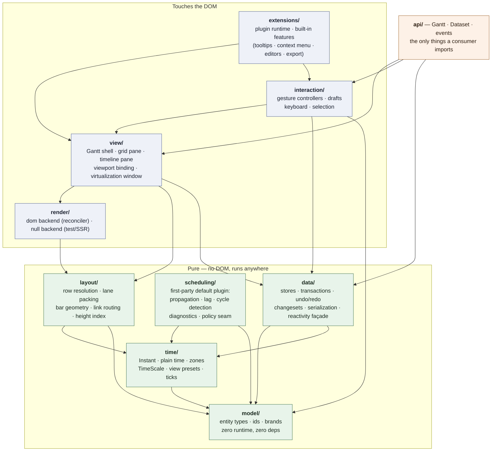
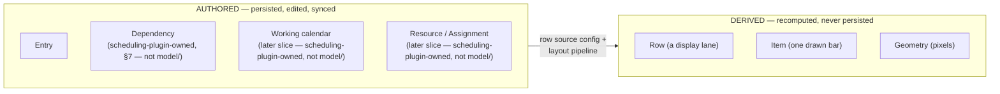
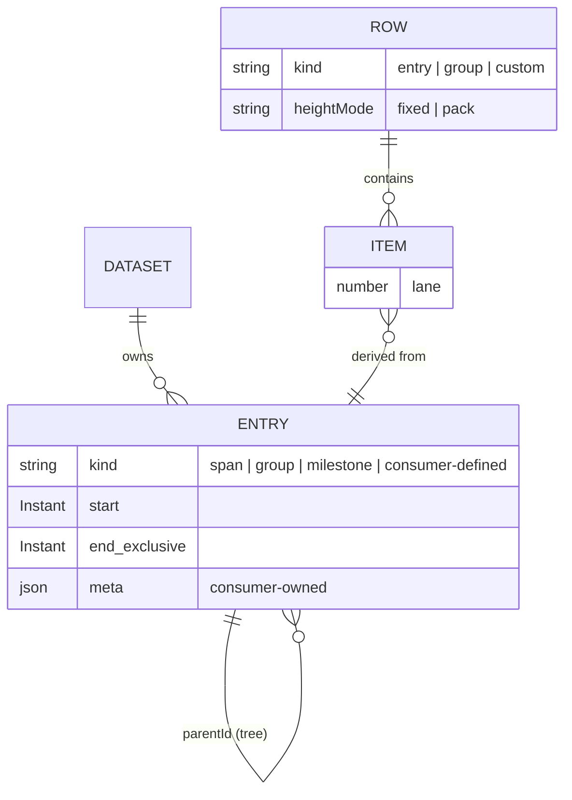
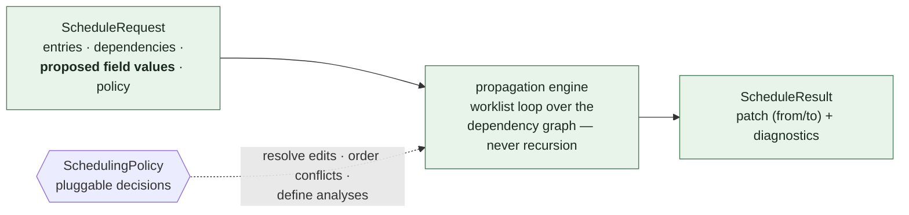
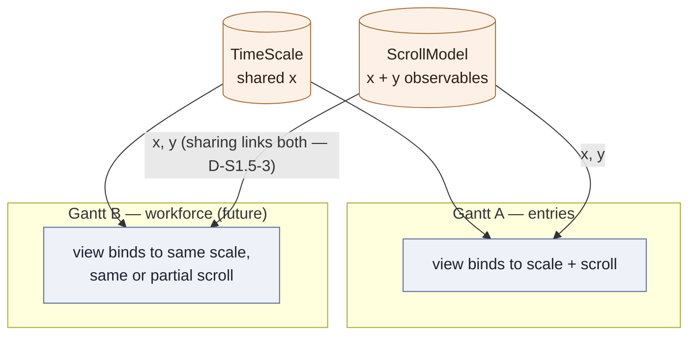

# FreeGantt — Domain & Architecture

Companion to `00-overview.md` (decisions D1–D12 are cited by number). This document defines the layers, the domain model, the contracts between modules, and the invariants that CI enforces.

---

## 1. Layer map

Each layer depends only on layers below it. Everything below the DOM line runs in Node — testable without a browser, usable in a worker or on a server.



`data/ --> TIME` (S2.1, D-S2-1, `plans/s2-data-core`): serialization (Instant⇄ISO) and mutation-time input reading (resolving a Plain string, advancing a date-only `end`) are both zone-aware date arithmetic, and I10 confines that to `time/`. `time/` sits below `data/` in the pure stack, and `scheduling/` already has the same arrow — nothing about the layering changes, only the drawing catches up with what `data/` now does.

There is deliberately no `data/ --> scheduling/` edge: `data/` has no static dependency on scheduling at all. Instead, `data/` calls the generic extension hook (D4; exact contract tracked in issue #12), which may add extra field writes to a proposed edit before it commits. `scheduling/` stays a directory in `src/`: it's where the first-party default scheduling plugin's pure engine lives, still DOM-free and still isolated from `render/`/`view/`/`interaction/`, but it is no longer a privileged layer every Gantt is wired to by default — a Gantt with no scheduling plugin installed never loads it.

`interaction/ --> MODEL` (S3, D-S3-4/D-S3-5, `plans/s3-direct-manipulation/README.md` P3): a gesture controller names `Entry`, `EntryId` and `ItemId` — all three live in `model/` — as type-only params, the same rationale `view/`'s own `model/` edge already carries. One arrow, nothing else: `interaction/` still may not reach `time/`, `layout/` or `render/` — every date/pixel computation a gesture needs is a pure `layout/` function the shell hands back through `EntryGestureContext`.

`api/ --> INT` (S3, `plans/s3-direct-manipulation/README.md` §0): `interaction/` sits one layer *above* `view/` (`INT --> VIEW`, not the reverse), so nothing inside `view/` may import it to wire the default pointer-gesture attachments into `GanttShell` — and `extensions/`, the other layer that reaches both `view/` and `interaction/`, does not exist until S5. `api/gantt.ts` is the composition root that supplies `attachEntryGestures` to `GanttShell` by constructor injection (the shell itself takes it structurally-typed, with no import of its own), the same role it already plays wiring `view/`, `data/`, `model/`, `time/` and `layout/` together for a plain `new Gantt(...)`.

**Enforcement (D12):** an import-boundary lint rule in CI (dependency-cruiser or `no-restricted-imports`). Any arrow not in this diagram fails the build. Notably:

- `scheduling/` never imports `render/`, `view/`, or `interaction/` — and vice versa (D4). A scheduling plugin, when installed, meets `data/` only through that hook, never a static import.
- `model/` is types only: zero runtime exports beyond id/brand helpers and the `FreeGanttError` base, zero dependencies.
- Only `api/` and the type surface of `model/` are public entry points; everything else is internal and free to change.
- **Removable leaves (D-S2-23, S2.7):** `span-rollup.ts`, `view/dataset-change-subscription.ts`, `data/history.ts`, and `data/serialization/**` each have exactly one legitimate importer, enforced the same way as the layer arrows above (dependency-cruiser `*-is-removable` rules, red-tested by `scripts/guard-red-test.mjs`). Each is provably deletable: its one caller goes away with it, and the rest of the system is unaffected (`plans/s2-data-core/README.md` §9's compatibility table names what each deletion degrades to).
- **The commit path ends at `change`; `History` subscribes like any other consumer (D-S2-24):** `data/transaction.ts` commits a `ChangeSet` and emits `change`; it imports no history and no view. `History` and `view/dataset-change-subscription.ts` are both ordinary `on('change')` subscribers, not privileged callers on the commit path — the same discipline that makes both removable leaves above.

### 1.1 Directory shape

```
src/
  model/         entity types, ids, brands, geometry primitives (Point/Size/PixelSpan/Rect),
                 Dataset (the structural contract api/dataset.ts's class satisfies — S1.7 §3.2,
                 formerly DatasetLike in view/gantt-shell.ts)                                (pure)
  time/          instants, zones, TimeScale, presets  (pure)
  data/          stores, transactions, undo, changesets, serialization (pure)
                 (S2.1: reactivity.ts, event-bus.ts, entry-reader.ts, entry-store.ts,
                 dataset-state.ts — the only file layer that may additionally import time/, D-S2-1)
  scheduling/    propagation engine + policies        (pure)
  layout/        geometry: rows, lanes, bars, routing (pure)
  render/
    dom/         default backend + reconciler
    null/        headless backend (tests, SSR, export seam)
  view/          Gantt shell, panes, viewport binding
  interaction/   gesture controllers, keyboard, selection
  extensions/    plugin runtime + built-in features
  api/           public façade: Gantt, Dataset, events
fixtures/        sample projects + golden scheduling fixtures
harness/         Vite dev app — every slice demos here
plans/           these documents
```

One published package, multiple entry points via the `exports` map. Package splitting is a later, demand-driven step; the layer boundaries are the asset, the package boundaries are cost.

---

## 2. Domain model

### 2.1 The central separation: authored vs. derived



`Entry` is an authored, dated record that has no idea it will ever be drawn. `Row` is a horizontal display lane. `Item` is one drawn bar on a row. **A row may carry many items, and one entry may produce items on several rows.** Today's classic Gantt (one row per entry, one bar per row) is just the default configuration of that pipeline — not a structural assumption. This is what makes split bars, grouped views, and future workload views configuration rather than rewrites.

### 2.2 Entities

```ts
// model/ — types only. TMeta lets consumers attach typed domain data without forking the model.

/** Absolute instant, epoch ms. Branded to prevent naked-number mixing. */
type Instant = number & { readonly __brand: 'Instant' };

interface TimeSpan { start: Instant; end: Instant }   // half-open [start, end)

interface Duration { value: number; unit: TimeUnit }  // 'ms'|'m'|'h'|'d'|'w'|'M'|'y'

/** Open classification — see §2.5. 'span' | 'group' | 'milestone' ship; consumers add their own. */
type EntryKind = 'span' | 'group' | 'milestone' | (string & {});

interface Entry<TMeta = unknown> {
  id: EntryId;
  parentId?: EntryId;           // hierarchy; roots have none
  /** What sort of thing this is. Authored, never derived — see §2.5. Default 'span'. */
  kind?: EntryKind;
  name: string;
  /** Always present in the store. For kinds whose span the policy derives (default `group`),
   *  The Span rollup maintains these; input may omit them and they are initialized (§2.5, §2.6). */
  start: Instant;
  end: Instant;                // exclusive — see §5
  /** Interrupted work — renders as multiple bars on one row. */
  segments?: readonly TimeSpan[];
  meta?: TMeta;                // consumer-owned, typed via generic; a declared key is a Field (§2.6)
}
```

`Dataset.entries` is a store view, not a bare array (S2.1, D-S2-2, `plans/s2-data-core`):
`dataset.entries.update('t2', { … })` is the published call site, so `dataset.entries` is the
collection itself. `EntryStoreView` (`model/dataset.ts`) is the read half — `all`, `get`,
`has`, `size`, `childrenOf` — and `data/`'s `EntryStore` adds the mutators. `all`'s
returned array is cached and rebuilt once per commit, not once per read (D-S2-3), so a caller
comparing two reads of `all` by reference is a correct "did anything change" check.

```ts
/** DERIVED. One display lane. */
interface Row {
  id: RowId;
  kind: 'entry' | 'group' | 'custom';
  cells: readonly string[];       // one per configured grid column, in display order — §2.6
  heightMode: 'fixed' | 'pack';   // 'pack' grows to fit lanes
}

/** DERIVED. One drawn bar. Always traces back to an entry. */
interface Item {
  id: ItemId;                  // deterministic — see §2.4
  rowId: RowId;
  entryId: EntryId;
  kind: EntryKind;              // carried through so backends/renderers never refetch the entry
  segmentIndex?: number;
  start: Instant; end: Instant;
  lane: number;                // sub-lane within the row
}
```

`Dependency` (predecessor/successor link, with `type`/`lag`/`active`) and the per-entry pin flag formerly on `Entry.scheduling` are **not** defined here. Both are scheduling-plugin-owned data now, not `model/` — pulling scheduling out of the mandatory core layers means `model/` stays scheduling-agnostic, and a consumer with no scheduling plugin installed never sees either type. They're still authored, persisted data in the sense of §2.1's separation — just owned by the plugin's storage rather than core's — and their shape is described alongside the engine in §7 (exact contract tracked in issue #12).

Reserved for later slices, designed-for now (fields and stores exist as named seams, not dead code) and scheduling-plugin-owned, not `model/` (same treatment as `Dependency` above): `Working calendar` (which days/hours count as workable), `Constraint` (date restrictions, policy-defined vocabulary), `Resource` + `Assignment` (staffing), `Baseline` (snapshots).



`Dependency` (predecessor/successor, `type`, `lag`, `active`) and the per-entry pin flag live in scheduling-plugin-owned storage when a scheduling plugin is installed — not in this diagram, which covers `model/`'s entities. See §7.

### 2.3 Row sources — the flexibility mechanism

The layout pipeline is `row resolution → item emission → lane packing → geometry`. The **row source** is configuration:

```ts
rowSource: { source: 'entries', tree: true }                        // classic Gantt (default)
rowSource: { source: 'group', groupBy: t => t.meta.team }         // one row per group value
rowSource: { source: 'custom', resolve: myRowResolver }           // consumer-defined rows entirely
```

Item emission then places entries (or entry segments) onto rows; overlapping items on one row auto-pack into sub-lanes. Future workload/resource views are simply another row source — no new rendering or interaction code.

Item emission is itself a per-kind seam, mirroring rendering (§10): the pipeline maps `Entry.kind` to an `ItemEmitter` that turns one Entry into its Item(s). Shipped kinds (`span`, `group`, `milestone`) ship a default emitter; a consumer-defined kind registers its own via `layout.registerItemEmitter` (§10) — unregistered kinds fall back to the `span` emitter (§2.5).

```ts
type ItemEmitter = (entry: Entry) => readonly Item[];
```

### 2.4 Item identity is deterministic

`Item.id = `${entryId}:${segmentIndex ?? 0}`` (extended if future sources add dimensions). Regenerated every layout pass, so it **must** be stable across passes or node recycling, CSS transitions, and in-flight drag state all break. Asserted by a layout test from slice S0.

### 2.5 Entry kinds — one authored field, per-layer meaning

`Entry.kind` answers "what sort of thing is this?" exactly once, in the model. Every other layer maps that answer to layer-local behavior through a registry or seam it already has — never `if (kind === ...)` chains scattered across the codebase:

| Layer | What `kind` selects | Seam |
|---|---|---|
| `scheduling/` | schedule semantics, *when a scheduling plugin is installed* — e.g. a `group` spans its children via rollup (default) vs. directly schedulable | `SchedulingPolicy` (§7), plugin-owned |
| `layout/` | item emission — bar vs. summary bracket vs. milestone diamond; whether items are emitted at all | kind → item-emitter registration in the §2.3 pipeline |
| `render/` | appearance — per-kind default renderer; `data-kind` on the element for CSS | renderer registry (`02` §4) |
| `interaction/` | which gestures the entry affords (move / resize / link / edit …) | capability resolver (§9) |

Rules:

- **Kind is authored, never derived.** A `group` is a group because the user said so — not because it currently has children. An empty group is legal and renders as one (that is how "add a phase, then fill it" works). For kinds in `rollUpKinds`, input may omit `start`/`end`: the store initializes a zero-length span (at the dataset's reference date) and the Span rollup owns it from then on — the *stored* model always has both fields, so no layer downstream handles absence. `parentId` (tree position) and `kind` (what it is) are orthogonal; "every parent is a group" is a convention, not a model rule — and `hierarchy: { autoGroup: true }` (`02` §2, the default) maintains that convention automatically: an entry gaining its first child is promoted to `group` in the same transaction. **Promote only, never demote** — demoting on losing the last child would reintroduce exactly the flickering identity this rule exists to prevent; demotion stays an explicit edit.
- **`rollUpKinds`** (`Dataset` option, default `['group']`) names which kinds get a rolled-up value for **every** rolling-up Field (`start`/`end` and a consumer `cost` alike). A consumer's own kind (say `'phase'`) opts in the same way. `'none'` or `[]` keeps authored parent values. The Rollup that reads it is `data/`'s own commit step — it runs on every transaction and at construction, whether or not a scheduling plugin is installed, and nothing installable can occupy or displace it (D-S2-22, closes OQ7). `scheduling/`'s engine moves children and nothing else; it never reaches the rollup, because the rollup already ran by the time anyone reads the result (`02.6` below, `s2.3-mutation-api.md` §1.5).
- **The set is open.** Shipped kinds: `'span'`, `'group'`, `'milestone'`. A consumer-defined kind (say `'buffer'`) gets full behavior by registering at the four seams above — no core edits. Anything not registered at a seam falls back to `'span'` behavior there, so partial registration degrades gracefully instead of erroring.
- **Group *entry* ≠ row *grouping*.** `rowSource: { source: 'group', groupBy }` is a view-side arrangement of any entries and persists nothing; a `kind: 'group'` entry is a model entity that persists, schedules, and syncs. They compose — a grouped view of a dataset containing group entries is well-defined, because one is authored and the other is derived (principle 1).

### 2.6 Fields and grid columns — what a value **is**, and where a Gantt **shows** it

`Entry` is a closed shape, so a consumer's `cost` has nowhere to be a first-class value: it can be stored in `meta`, but it cannot roll up, cannot be compared per field, and cannot appear in a changeset. A **Field** fixes that. It is a declared, named value on an entry, and core's own fields are declarations of the same kind (ADR 0005). A **Grid column** is where one Gantt shows a field.

One sentence separates them, and it is the only one a reader has to hold: **a field is what a value *is*; a grid column is where a Gantt *shows* it.** Fields belong to the `Dataset`, because the rollup writes into stored, serialized, undoable values and runs at construction, before any Gantt exists. Grid columns belong to the `Gantt`, because which values this view shows, and in what order, is a view question.

```ts
// model/field.ts — types only
type FieldKey = string & {};                        // a field's name; also the changeset's `field`
type CoreFieldKey = keyof Omit<Entry, 'id'>;        // the shipped subset

/** Where the value lives. The choice decides whether a rolled-up parent value is stored. */
type FieldSource =
  | { from: 'entry'; field: CoreFieldKey }          // name, start, end — shipped; progress is S7's
  | { from: 'meta'; key?: string }                  // key defaults to the Field key
  | { from: 'compute'; read(entry: Entry, ctx: FieldContext): unknown };

interface Field<TValue = unknown> {
  key: FieldKey;
  type?: FieldTypeName;                             // a bundle; the field's own keys win over it
  source?: FieldSource;                             // default: meta under this Field's key
  rollUp?: AggregatorName;                          // 'min' | 'max' | 'sum' | 'count' | 'none' | yours
  equals?(a: TValue | undefined, b: TValue | undefined): boolean;   // default Object.is
  compare?(a: TValue | undefined, b: TValue | undefined): number;   // sort; default is the stored value
  formatValue?(value: TValue | undefined, ctx: FormatContext): string;   // text for a cell; DOM-free; locale only here
  column?: Omit<GridColumn, 'field'>;               // presentation defaults, declared once with the field
}

/** Presentation only. Never carries an aggregate — see the rules below. */
interface GridColumn {
  field: FieldKey;
  header?: string;
  width?: number; flex?: number;
  align?: 'start' | 'end';
  // cellRenderer and editable arrive in S5, on the Gantt column, when code honours them (I11).
}

/** Registered by name, never passed inline — a name serializes, a function does not. */
type Aggregator<TValue = unknown> = (
  children: readonly Entry[],      // already rolled up; the walk is bottom-up
  parent: Entry,
  ctx: RollUpContext,
) => TValue | undefined;           // undefined = no opinion, leave the stored value alone

/** Compute and store access. No locale. */
interface FieldContext {
  readonly timeZone: string;
  read<T>(entry: Entry, key: FieldKey): T | undefined;
  durationOf(entry: Entry): Duration;
}

/** FieldContext plus the Field currently rolling up. Shipped Aggregators read `ctx.field`. */
interface RollUpContext extends FieldContext {
  readonly field: FieldKey;
}

/** Built only at Gantt column-resolve time. `formatValue` reads this, never a Dataset locale. */
interface FormatContext extends FieldContext {
  readonly locale: Intl.LocalesArgument;
}
```

Rules:

- **Core fields are ordinary declarations.** `name`, `start` (`min`), `end` (`max`), and `duration` (computed from `start` and `end`) ship in the registry a consumer adds to. `kind` ships with a text column; `parentId`, `segments` and `meta` ship as data-only Fields (no `column`). There is no separate path for core, which is what makes a `cost` column and a `start` column the same code. **`progress` is not in this list** — it is scheduling-plugin data (ADR 0008). `weightedMeanByDuration` still ships as an Aggregator name.
- **A Field is columnable only when it declares `column`.** `gridColumns` names columnable Fields in display order. Default `gridColumns` is `['name']`. A Field with no `column` still rolls up and still appears in the changeset; naming it in `gridColumns` throws `FieldNotColumnableError`.
- **Source decides stored or computed.** A field sourced from `entry` or `meta` has a stored home, so its rolled-up parent value is stored — changeset, undo, document — exactly as the Span rollup already does for `start`/`end`. A field sourced from `compute` has no home, so its parent value is computed on read, cached against **dataset revision** in S4 (D-S4-10 — coarser, never stale), and never reaches the document. A per-entry subtree-revision key returns at S6 if the spike says so. A consumer who wants an aggregate without document bytes declares a computed field; there is no flag to set.
- **A computed field reads the dataset only, never view state.** No zoom, no visible range, no selection. Its cache is then keyed on dataset revision (S4) or subtree revision (S6), which is what makes the value the same for every reader of that dataset. A value that depends on the view is not a field — it is a renderer's business.
- **`meta` is opaque unless you declare a key.** Undeclared keys keep §6's rule — carried by reference, never walked, compared by `===`. A write to a declared key emits a changeset row keyed on the **field key**, never a `meta` row.
- **Edits name fields, not shapes.** `update('t1', { start: X, cost: 500 })` is one transaction, one changeset and one undo step across a core field and a consumer field. A key that is not registered is an `UnknownFieldError` — never a silent write.
- **Rollup precedence is §7's rule, unchanged.** The rollup yields to a field the caller proposed in the same transaction and wins over one the extension hook proposed. Bottom-up, one pass, so nested groups settle together. `rollUpKinds` says which **kinds** derive (`'none'` or `[]` opts every Kind out); the registry says how each **field** derives. The two are orthogonal and both are needed.
- **Aggregation never lives on a grid column.** A stored value must not depend on whether a column is visible, and the rollup has already run before any Gantt is constructed.
- **A columnable Field declares its own column defaults, so `gridColumns` is mostly ordering.** `gridColumns: ['name', 'start', 'cost']` names fields in display order; the object form (`{ field: 'cost', header: 'Budget — site A' }`) overrides this Gantt's presentation only, and never the data half.
- **Text and structure stay separate.** `formatValue` returns a string, is DOM-free, and fills the frame's row cells; `cellRenderer` returns element descriptions and is applied by `render/`. Same split as `FrameBar.label` and `barRenderer` (§8).
- **A Field that omits `source` lives in `meta` under the Field key.** `{ key: 'cost', type: 'money' }` is the common call. Write `{ from: 'meta', key }` only when the Document key differs. `{ from: 'entry' }` and `{ from: 'compute', read }` stay explicit.
- **A Field type supplies the default `rollUp`, `formatValue`, `compare`, and column defaults.** The registry merges the Field onto its type first; the Field's own keys win. After that merge, absent `rollUp` or `'none'` means the Field does not participate. The type's `rollUp` is an Aggregator name — shipped or a consumer name in `aggregators`. Core does not ship primitive Field types, and there is no global default Aggregator — `sum` is what a consumer puts on `money`, not what an Instant uses. The Span rollup stays `start` as `min` and `end` as `max` on those core Fields (D-S4-3).
- **One registry, whole declaration.** A field (and a field type) carries both halves, `column` included. `data/` stores those bytes and does not interpret them — it never formats and never paints. `view/` reads `column` at Grid resolve time. `api/` is the composition root. Do not open a second registry. ADR 0005's "split at `api/`" is who sends what where at read time, not two copies.

---

## 3. Data flow — the two channels


**Invariants:**

- Hover/selection **never** rebuilds a frame. `applyState` is O(changed nodes), zero allocation.
- A drag previews via CSS transforms on existing nodes; **exactly one transaction commits at gesture end** (D10). Never mid-gesture.
- One rAF pipeline: at most one `sync(frame)` per animation frame.

---

## 4. `layout/` — headless geometry

Takes model + time scale + viewport window; returns pure serializable geometry. No drawing calls, no interaction state, no user render output.

```ts
interface GeometryFrame {
  revision: number;            // monotonic; backends discard stale async work
  visible: Rect;                // the culled region, in timeline-content coordinates — was `viewport`
  /** Header bands, coarsest first — one per `preset.headers` entry, positioned and labelled from the
   *  resolved TimeScale + preset (D-S1.7-6). The render seam's only route for header state (#19); a
   *  backend never builds tick DOM itself. Each tick carries `width` to the next boundary at that
   *  band's step (D-S1.7-4). */
  header: { bands: readonly { unit: TimeUnit; increment: number; ticks: readonly { x: number; width: number; label: string }[] }[] };
  /** Only rows in the vertical window; `top` in absolute content coordinates. `cells` holds one
   *  library-formatted string per configured grid column, in column order, produced by each field's
   *  `formatValue` (§2.6). It is derived text on the `a11yLabel` precedent, not consumer render
   *  output — a `cellRenderer` is applied by `render/`, never here. */
  rows: Array<{ id: RowId; index: number; top: number; height: number; laneCount: number; cells: readonly string[] }>;
  /** Total row count across the whole dataset (`entries.length`), not the windowed `rows.length` —
   *  feeds `aria-setsize` (S1.10, D-S1.10-5): virtualization without it announces "row 3" with no
   *  "of 30" over a large dataset. */
  rowCount: number;
  contentHeight: number;       // across ALL rows, from the height index — always the full extent
  contentWidth: number;        // full horizontal extent of the bound TimeScale's range — always the full extent
  bars: Array<{
    id: ItemId; entryId: EntryId; rowId: RowId;
    kind: EntryKind;              // backends stamp it as data-kind — per-kind CSS with zero JS
    /** The entry's name — what a backend renders as the bar's label (#26). */
    label: string;
    x: number; y: number; width: number; height: number; lane: number;
    /** Static classification only (`conflict`, `cycle` — renamed from `hasConflict`/`inCycle` at
     *  S1.10 so the field names double as the `data-flag` CSS vocabulary directly, D-S1.10-3) —
     *  never hover/selection. */
    flags: BarFlags;
    /** What a screen reader announces: `${entry.name}, ${formatDate(zone, start)} – ${formatEndInclusive(zone, end)}`
     *  (S1.10, D-S1.10-5). Library-derived text, not consumer render output — same precedent as `label`. */
    a11yLabel: string;
  }>;
  /** `id` was `DependencyId` (a `model/` brand) pre-#13; `Dependency` is now scheduling-plugin-owned
   *  (§7, #13), so link geometry needs a plugin-contributed emission seam mirroring `registerItemEmitter`
   *  above — exact registration contract (a `registerLinkEmitter`-shaped seam) and `id`'s brand type are
   *  tracked in #16, not yet settled here. Shape lands in S1 (#30), contents in S7. */
  links: readonly Array<{ id: string; path: PathCommand[]; flags: LinkFlags }>;
  decorations: readonly Array<DateLine | RangeBand | RowStripe>;
}

interface LayoutInput {
  entries: readonly Entry[];
  scale: TimeScale;              // #20 — the bound scale, not a bare xForInstant function
  preset: ViewPreset;             // governs header bands (#19)
  visible: Rect;                  // the culling window, in timeline-content coordinates — was `viewport`
  overscan?: Overscan;            // live; default { verticalRows: 2, horizontalPx: 128 } (S1.7 §3.4)
  rowHeight: number;
  tickBoxFloorPx?: number;        // Tick box floor; default DEFAULT_TICK_BOX_FLOOR_PX (S1.12)
  revision: number;
}

/** Pure and stateless. `heights` is the row-top index this pass reads from; omitted, one is built
 *  and discarded within the call. Production callers never pass it — `FrameLayout` does. */
function computeFrame(input: LayoutInput, heights?: RowHeightIndex): GeometryFrame;

/** One Gantt's layout pass, and the one thing that pass must remember between renders: the row-height
 *  index. `view/` states what to draw and holds no layout bookkeeping — the index, its cache key and
 *  its invalidation never cross the seam. One instance per Gantt; nothing about it is shareable. */
class FrameLayout {
  computeFrame(input: LayoutInput): GeometryFrame;
}
```

Rules that keep it honest:

- **No user render output in the frame.** Custom renderers are invoked by the DOM backend at sync time (see `02-public-api.md` §5), keyed by `Item.id`. The frame stays pure geometry, snapshot-testable, backend-neutral.
- **No materialized hit-region array.** The bars array *is* the hit index; DOM backends get hit-testing from event delegation.
- **Row heights and virtualization:** a cumulative row-height index gives O(log n) "top of row i" and "row at offset y" even with pack-mode variable heights. Slice S1 ships a simple prefix-sum implementation behind the index interface; the O(log n) structure replaces it in S6 **only if the measured spike says so** (D2). The index is O(log n) only when one instance survives across renders, so `layout/` owns that lifetime in `FrameLayout` rather than instructing callers to keep it: a doc comment telling `view/` to build one index, cache it by entry count and row height, and invalidate it itself is implementation knowledge pushed across the seam, and it put four bookkeeping fields in `GanttShell` until the 2026-08-25 review. S4's variable-height `invalidateFrom` calls land in `FrameLayout` for the same reason — beside the index, where `layout/`'s own tests reach them.
- **Grid and timeline consume the same `frame.rows`.** Both position rows absolutely from `top`/`height`; neither uses flow layout or computes a height. One vertical window, one scroll owner. This is the #1 defect source in split-pane Gantts and it is closed by construction (D8).

---

## 5. Time policy (D6)

Three rules, in force from the first commit, because all three are retrofit-hostile:

1. **Storage is half-open `[start, end)`; display is inclusive.** An entry "ending Friday" stores `end` = Saturday 00:00 in dataset time. Exactly one formatting helper (`formatEndInclusive`) renders inclusive ends; code review rejects inline `end - 1` arithmetic. Shipped at S1.10 (`src/time/format.ts`) alongside `formatDate` (plain zone-aware display for a start, which needs no half-open→inclusive conversion — not a second instance of the "exactly one" rule, D-S1.10-4) — closes the promise this bullet made since S0.
2. **The dataset owns an IANA timezone; viewer-local is opt-in.** All zone-aware date arithmetic — day floors, week starts, snapping, shading — resolves through the dataset zone, so two users in different zones see identical day boundaries. `Instant` stays absolute.
3. **No naked time arithmetic.** `time/` exposes `add`, `startOf`, `diff`, etc., all zone-aware and DST-correct. A lint rule bans magic time constants (`86400000` and friends) outside `time/`.

Ergonomics: `time/` ships `instant(v: Date | number | string): Instant`, `toISO(i: Instant): string`, and a plain-date helper set so consumers work with "days" and "Mondays," not epoch math. Zone-aware arithmetic is memoized (offset table per zone/day) — budgeted for in the S6 spike.

### 5.1 `TimeScale` — instants ⇄ pixels, shareable (D9)

```ts
/** Pure and standalone. Gantt instances BIND to one; two sharing one scale are x-synced by construction. */
interface TimeScale {
  readonly range: TimeSpan;                 // full content span — 'fitDataset' min/max or a pinned TimeSpan
  readonly timeZone: string;
  /** Density: content px per ms, constant across the whole range at this zoom (S1.9, D-S1.9-5). */
  readonly pxPerMs: number;
  xForInstant(i: Instant): number;
  instantForX(x: number): Instant;
  widthForDuration(d: Duration, at: Instant): number;
  ticks(step: TickStep, span: PixelSpan): readonly Tick[];
  readonly contentWidth: number;             // px extent of the whole range at this zoom
}

interface ViewPreset {                       // data, not a switch statement
  id: string;
  tickUnit: TimeUnit; tickIncrement: number;
  headers: Array<{ unit: TimeUnit; increment: number; format: DateFormat }>;
  preferredTickWidthPx: number;
  minTickWidthPx?: number;
  snap?: { unit: TimeUnit; increment: number } | 'tick' | 'none';
}
```

Shipped presets cover hour→year zoom levels; custom presets are config objects, never a library edit. `preferredTickWidthPx` is the density the preset intends; `minTickWidthPx` floors every Fit mode so labels stay legible and the timeline scrolls rather than squishes (S1.12). A content-width ceiling (`MAX_CONTENT_PX` in `layout/`) caps `pxPerMs` so `zoomIn` cannot exceed browser scroll geometry. A non-linear scale (e.g., collapsing non-working time) is a future *implementation* of `TimeScale` — the interface is the seam; nothing else may assume linearity except through it.

---

## 6. `data/` — stores, transactions, changesets

- **`DatasetState`** (named `DatasetData` in earlier drafts of this doc; renamed in S2.1, OQ5) owns normalized stores (`entries`, plus reserved stores for scheduling-plugin-owned data such as `dependencies` — S3 adds these; S2 has `entries` alone) with indexes (`byId`, `byParent`, `byPredecessor`, `bySuccessor` — the latter two populated only when a plugin uses them), the dataset timezone, and the generic edit-extension binding (identity when unoccupied; §1). Fully headless (D4): constructible and usable in Node with no view. `api/Dataset` is a thin façade delegating every read and the `transaction`/`on`/`off` trio to it.
- **Transactions**: `dataset.transaction(() => { ...mutations })` batches mutations, runs the extension hook once, emits **one changeset**. Every mutation path — API and gesture — goes through a transaction. No exceptions.
- **Changesets** are the universal delta (D7, principle 4) — an open-by-construction discriminated union, per store entity kind, so a `field` typo on `updated` and a stray property on `added`/`removed` are both caught at the type level rather than only at runtime:

```ts
type StoreName = 'entries'; // S3 adds `plugin:${string}/${string}`
type ChangeOrigin = 'user' | 'undo' | 'redo'; // 'engine' and 'load' arrive with their producers (D-S2-11)

// FieldKey stays open (D-S2-26): the core Entry keys are named for autocomplete and the
// per-field comparator table's exhaustiveness check, but a consumer- or plugin-declared field
// (S5's field registry) is equally legal and validated at runtime, not by the type.
type FieldKey = keyof Omit<Entry, 'id'> | (string & {});

interface EntityAdded   { store: 'entries'; entity: Entry; }
interface EntityRemoved { store: 'entries'; entity: Entry; }
interface FieldUpdated  { store: 'entries'; id: EntryId; field: FieldKey; from: unknown; to: unknown; }

interface ChangeSet {
  id: ChangeSetId;
  origin: ChangeOrigin;
  added:   readonly EntityAdded[];
  removed: readonly EntityRemoved[];
  updated: readonly FieldUpdated[];
}
```

A field whose `from` equals `to` under its per-field comparator (`===` for primitives/`Instant`s, element-wise on `segments`, reference-only on `meta`) is never recorded — an empty changeset commits nothing, emits no event, and pushes no history entry.

- **Undo/redo**: the transaction is the atomic unit, and it records the **complete post-scheduling changeset — user edits and engine cascades together**. Undo that reverts only the user's edit while the cascade stays applied corrupts the dataset; this is the corruption class the design closes. Redo replays the recorded changeset (deterministic even if engine behavior changes between versions).
- **Reactivity**: a thin internal `signal`/`computed`/`effect` façade in `data/`, backed by one small dependency, swappable in one file. Instance-scoped — **zero module-level singletons anywhere** (two Gantt instances on one page with independent state is a standing CI test).
- **Serialization**: versioned `toJSON()`/`fromJSON()` with a declared schema (`{ schema: 1, ... }`), brands stripped at the boundary. The JSON shape is public API and semver-governed. See `02-public-api.md` §6.

---

## 7. `scheduling/` — pure engine, pluggable policy

This section describes FreeGantt's **first-party default scheduling plugin** — the bars + dependencies engine bundled with the library (D3) — not a mandatory core layer (D4). It occupies the extension hook (D4; §1) exclusively when installed; when nothing is installed, none of what follows runs. The hook's own contract (where per-entry plugin data like the pin flag lives, how hot-path preview and commit-time resolution share one call) is separate, ongoing design work tracked in issue #12. The plugin's own public API and its re-spec against that hook are tracked in issue #14. What follows is still an accurate description of the engine's internals — propagation, cycle detection, the policy seam — just reframed as *this plugin's* internals rather than a core module's.



```ts
interface ScheduleRequest {
  entries: readonly Entry[];
  dependencies: readonly Dependency[];
  /**
   * WHAT THE USER JUST SET, per field — not merely which entries are dirty.
   * A proposed start with no proposed end means the bar moved; proposing
   * start and end means it was resized. Empty ⇒ full recompute.
   */
  proposed: ReadonlyMap<EntryId, Partial<EntryEditableFields>>;
  policy: SchedulingPolicy;
  options: ScheduleOptions;
}

interface ScheduleResult {
  patch: Array<{ id: EntryId; field: string; from: unknown; to: unknown }>;
  diagnostics: Diagnostic[];          // conflicts, cycles — surfaced, never silently fixed
}

function schedule(request: ScheduleRequest): ScheduleResult;   // pure, deterministic
```

**Engine (deterministic and pure — slice S7, as the default plugin's internals):**

- Propagation over the dependency graph in topological order via an **explicit worklist loop, never recursion** — long chains blow the JS stack otherwise; a 5,000-link chain fixture forecloses it permanently. Module-header invariant: *this file contains no recursive call; chain depth is unbounded by design.*
- Lag applied per dependency `type`; negative lag (overlap) is legal.
- **Cycle detection names the members**: if the worklist drains with entries unvisited, those entries are the cycle — `{ code: 'cycle', entryIds }`, never "a cycle exists somewhere."
- An entry pinned in the plugin's own per-entry storage (the pin flag is no longer `Entry.scheduling` — that field is gone, see §2.2; where it lives instead is part of the #12 contract) is never moved; the engine reports what it *would* have done as a diagnostic.
- The Rollup (a parent's value for a field derived from its children — §2.6) is `data/`'s own commit step, not the engine's: the engine moves children and stops there (D-S2-22). Pass ordering, not mutual recursion. A dependency attached to a `group` entry resolves against its rolled-up span by default.

**Kind semantics live in the policy, not the engine.** The engine knows graphs and lag; what a `group` or `milestone` (or consumer-defined kind) *means* for scheduling is a policy decision. The default policy: `group` spans derive from children (direct edits to a derived span are reported as diagnostics, not applied); `milestone` keeps `start === end`; unknown kinds behave as `'span'`. A consumer methodology that wants directly schedulable groups ships a policy — the engine and contract do not change.

**Policy (pluggable — where methodologies differ):**

```ts
interface SchedulingPolicy {
  /** Given what the user proposed on an entry, decide which fields move.
   *  MUST NOT move a proposed field — never overwrite user input (assert in dev). */
  resolveEdit(proposed: ReadonlySet<Field>, entry: Entry): EditResolution;
  /** Precedence when rules conflict (pin vs. dependency vs. future constraint). */
  precedence: readonly RuleKind[];
  /** Optional analyses (e.g., slack/critical computation) — later slices. */
  analyses?: readonly ScheduleAnalysis[];
}
```

The shipped `defaultPolicy` is deliberately minimal and neutral: dependencies push successors forward as early as their predecessors allow; pinned beats dependency; edits move the fields the user didn't touch. Working calendars, constraint vocabularies, criticality definitions, and resource-driven durations all arrive later as richer policies/analyses — **the request/result contract does not change.**

**Speculative evaluation is free by purity:** during a drag, `interaction/` calls the extension hook (the installed plugin's extender, or identity) with a synthetic `proposed`, paints the returned `EntryEdits` as a preview, and discards on cancel. Throttled to one call per animation frame. The first-party scheduler, when installed, runs `schedule()` **inside** that extender. `interaction/` never imports `scheduling/`. This is a load-bearing reason `schedule()` must never mutate its input — write it in the module header.

---

## 8. `render/` and `view/`

### 8.1 Backend contract

```ts
interface RenderSurfaces<THost> {
  grid: THost;      // the grid pane's row layer
  timeline: THost;  // the timeline pane's content layer: header bands, bars, links, decorations
  gridHeader?: THost; // column header row in the grid pane; omitted by tests that only paint body cells
}

interface RenderBackend {
  mount(surfaces: RenderSurfaces<HTMLElement>): void;
  sync(frame: GeometryFrame): void;           // cold: structure + geometry
  applyState(state: InteractionState): void;  // hot: classes/transforms only
  hitTest(x: number, y: number): HitResult | null;
  destroy(): void;
}
```

`mount` takes two required surfaces plus an optional grid header (S1.8, D-S1.8-1/D-S1.8-2): the grid pane's row layer, the timeline pane's content layer, and — when column headers are shown — the grid pane's header row. They are elements `view/pane-layout.ts` builds, not one container this backend reserves a gutter inside. `render/dom` puts body rows in `grid`, column headers in `gridHeader` when present, and header/bar/sizer layers in `timeline`, at `x = 0` — no gutter offset; the grid pane's own width is the gutter now. `render/null` takes the same signature and ignores all three.

Backends: `dom` (default — absolutely-positioned virtualized rows, SVG for link paths), `null` (tests, SSR of data, future export path). A dense canvas backend is a *possible future implementation* of this interface, built only if measurement demands it (D2).

**DOM rendering approach:** bars and rows are plain positioned elements — CSS-themeable (custom properties + parts), accessible (focusable bars, grid semantics — D11), framework-friendly. Updates go through a small keyed reconciler that diffs a plain-object element description against the config last applied to that same element (stored on the node) — no shadow tree, no per-frame vDOM allocation, because the changeset already says what changed. Hard scope boundary in the module header: attribute/class/style/text diffing and keyed child recycling only; anything needing lifecycle hooks or a component model means we are rebuilding a framework and should adopt one instead.

**Text is text.** Renderer output defaults to `textContent`; raw HTML requires an explicit opt-in flag. Entry names come from databases; the default must not be an XSS hole.

**Inline writes are geometry-only; everything else ships as a base stylesheet (S1.10, D-S1.10-6).** `render/dom`'s `node.style.*` writes are pruned to exactly `transform`/`width`/`height` — the per-frame/per-instance numbers nothing but this backend knows. Structure (`position`, `display`, `overflow`, colour, background, border) moves to class rules in `view/styles.ts`'s base stylesheet, injected once per document by `ensureBaseStyles` (idempotent via a `<style data-freegantt-styles>` document marker — not `data/`'s kind of shared mutable state, I2 unaffected). `freegantt/no-inline-style-outside-geometry` (`src/render/**`, `src/view/**`) lints the split so it can't regress.

**`mount`/`sync` write ARIA roles, not just geometry (S1.10, D-S1.10-5).** The container gets `role="group"`, a live `aria-label` (from `Gantt.a11yLabel`), and the one honest `tabindex="0"` this step defines (no roving tabindex until S3's keyboard controller exists to move one). `.fg-row` gets `role="listitem"` plus `aria-posinset`/`aria-setsize` (the latter from `GeometryFrame.rowCount`, the *total* row count, not the windowed slice). `.fg-bar` gets `role="img"` and an `aria-label` from `FrameBar.a11yLabel` — not the ARIA `grid`/`row`/`gridcell` pattern, because `.fg-row` and `.fg-bar` render into different scroll surfaces under the split-pane architecture (§8.3) and are DOM cousins, never ancestor/descendant, so no placement of `grid`/`row`/`gridcell` roles across them is spec-conformant.

### 8.2 Viewport & multi-Gantt sync (D9)



`TimeScale` and `ScrollModel` are **standalone observable objects**. Every Gantt binds to one of each; by default the Gantt constructs its own privately, so single-Gantt usage never sees the concept. Passing the same instance to two Gantt instances syncs them on that axis — x, y, or both — with zero special-casing in either. **Rule:** no view or interaction code reads or writes scroll position except through the bound `ScrollModel`; no code converts time to pixels except through the bound `TimeScale`. That rule is what makes D9 free later, and it is lintable.

**D-A — viewport models are pure observables; the DOM binding is separate.** "Observable" above is literal, not aspirational: `TimeScaleModel.bind(binding, onChange)` and `ScrollModel.bind(binding, onChange)` invalidate the memoized resolution *and* run every bound `onChange`, so every other Gantt sharing the model re-renders without anything external calling `render()` again (#6). `onChange` is supplied at bind time, not through a separate `subscribe()` — the reaction is part of what a Gantt states when it joins the shared axis, not a second lifecycle a caller wires up afterward. Each model keeps one `Map<Binding, onChange>`, so binding membership and change notification are the same collection instead of two kept in sync by hand. That mechanism is **implemented once**, in `layout/viewport/bound-value.ts`: a `BoundValue` owns one such map, the value resolved from it, and the contract itself — bind notifies the newcomer always, every other notification fires iff the resolved value changed — and each model supplies only what is its own, a `resolve` and an `equals`. Its batching half is `BatchedNotifier` (depth, pending flag, flush in a `finally`), which `Viewport` uses alone: `Viewport` has one subscriber and no resolved value of its own to compare, so it must not have `BoundValue`'s binding side at all. Until the 2026-08-25 review this paragraph read "there is no standalone notify primitive" and the contract was hand-copied into `TimeScaleModel`, `ScrollModel` and `Viewport`, kept aligned only by comments citing each other; one map per model instance is what the rule was protecting, and that is unchanged. **The scope is a hard boundary:** `BoundValue` serves `layout/viewport/`'s models and nothing else. It is deliberately minimal, not `data/`'s `alien-signals` façade — `layout/` has no edge to `data/` (§1, I1) — and it is not a general subscribe/notify primitive to reach for elsewhere. If a shareable model needs more than "call my reaction when I might be stale," that is still the signal to consolidate under the `data/` façade rather than widening this or growing a second one beside it. A resolved value handed out of a model is **frozen**, not merely `readonly`: `ScrollModel.state` returns the model's own `position` and `max` objects, and `readonly` is a compile-time claim that a consumer writing `state.position.x` would walk straight through — moving the shared position with nobody notified. Frozen, that write throws. `bind()` returns a small handle (`{ unbind(), setPaneWidth(width) }` / `{ unbind(), setContentSize(size), setPaneSize(size) }`) rather than a bare unbind closure, so a bound Gantt can push re-measured geometry without unbind+rebind churn — this is what lets the DOM-facing bindings (`view/scroll-attachment.ts`, shipped S1.5; `view/pane-size-attachment.ts`, #8) stay thin wrappers with no knowledge of `layout/`'s internals.

**One notification contract for both models (S1.5, D-S1.5-4):** `bind` always notifies the newcomer — including when nothing measurably changed, since that call *is* the newcomer's first render. Every other notification (another binding's `bind`/`unbind`, a `setPaneWidth`/`setContentSize`/`setPaneSize`) fires iff the resolved value actually changed. Both models also expose `batch(run)`: several writes inside `run` deliver at most one notification, flushed in a `finally` so a throwing `run` cannot wedge the model.

**`Viewport` (`layout/viewport/viewport.ts`, shipped S1.7) is the fan-in that owns both models.** A shell holding `TimeScaleModel` and `ScrollModel` separately also holds two reactions — the god object arriving on schedule the moment a third measurement (pane size, #8) joins them. `Viewport` gives `view/` one `bind(dataset, onChange)`, one handle, one reaction: **one measurement, three destinations.** A single `ViewportHandle.setPaneSize(size)` call fans out to `TimeScaleModel`'s `paneWidth`, `ScrollModel`'s `ScrollBinding.pane`, and `Viewport.visible`'s `width`/`height` — all three read from the one measurement instead of three callers each re-deriving it, and the fan-out is coalesced so the consumer still sees exactly one notification (D-S1.7-1). `Viewport.visible` resolves the culling window from the **locally clamped** position — this Gantt's own pushed `{content, pane}` extents, not `ScrollModel`'s loosest-bound-across-bindings `max` (D-S1.7-2) — straight into `LayoutInput.visible`, and it is also what `attachScroll` writes back to the DOM. `Viewport` is not exported from `api/` (D-S1.7-10); `view/` is its only caller. It is also **single-subscriber, on purpose**, unlike the two models it fans into: a `Viewport` holds one Gantt's pane size and content size, so a second shell binding to it would resolve `visible` from the other shell's box. The shareable objects are the models (D9); the fan-in is per Gantt, and a second `bind()` throws (`code: 'viewport-already-bound'`) instead of silently replacing the reaction.

**The binding/attachment split (S1.7):** `Viewport.bind` owns the *binding* — `TimeScaleModel` and `ScrollModel` membership, one reaction. `view/scroll-attachment.ts`'s `attachScroll(element, viewport)` owns the *attachment* — the DOM edge, and nothing else: it reads the already-locally-clamped `viewport.visible` and writes/reads `element.scrollLeft`/`scrollTop` (the only file exempted from I12's scroll-manipulation lint), returning `{ writePosition(), detach() }`. It holds no binding of its own — `Viewport` already bound scale and scroll before `attachScroll` is ever called, so the attachment recomputes nothing, it only echoes.

`ScrollModel` resolves `{ position, max }` (`layout/viewport/scroll-model.ts`, shipped S1.5): **one shared `position`**, clamped to `[0, max]` only at `panTo` write time — a later shrink of `max` (a filter, a collapse) never rewrites `position`, so restoring the extent restores the place with zero remembered state. `max` is the **loosest** bound across every bound Gantt's measured `{content, pane}` — not a claim about any one chart's scroller. Each bound Gantt clamps the shared `position` to its own `content`/`pane` locally (in `view/scroll-attachment.ts`, comparing against what *that* element should show, never the raw shared value — the local clamp is what lets two Gantts with different row counts share one `ScrollModel` without the shorter one vetoing the taller one's range, or a pinned chart's native browser clamp destroying the shared position every frame).

**`Viewport.zoomTo`/`zoomBy`/`reveal` (S1.9) and D-F′.** D-F (locked at S1.7: `TimeScaleModel.zoomTo` recomputes `range.start` to keep an anchored instant under the cursor) is struck and replaced by D-F′: `range` stays the full content span — `'fitDataset'`'s min/max, or a pinned `TimeSpan` — and is never written by a zoom. The visible slice is `[scroll.x, scroll.x + paneWidth]`; anchored zoom moves *that*, not `range`. `Viewport.zoomTo(pxPerMs, anchorX?)` reads the instant currently under `anchorX` before writing anything, then inside one `batch()` writes `scale.zoom`, pushes the new `contentWidth` through the `ScrollBindingHandle` it keeps from `bind()`, and pans `scroll` so the same instant is back under `anchorX` — one notification, `range.start` untouched. `zoomBy(factor, anchorX?)` is `zoomTo(timeScale.pxPerMs * factor, anchorX)`. `reveal(target: Rect)` is nearest-edge, not center: a no-op if `target` is already inside `visible`, otherwise `panTo` moves exactly enough to align the nearest off-screen edge, on either axis or both. All three live on `Viewport` (not `TimeScaleModel`) because they need `scroll` to move the visible slice — a scale alone can only reshape the content it maps, never the window onto it.

### 8.3 Split pane (D8)

`GanttShell` composes the split; `view/pane-layout.ts`'s `PaneLayout` holds it (S1.8): grid pane (columns over `frame.rows`) · splitter · timeline pane (header + bars + links + decorations). The timeline pane is the single native scroller for both axes (D-D, D-S1.8-1) — the grid pane has no scrollbar of its own. Its row layer follows the timeline pane's scroll position by one `translateY(-frame.visible.y)` transform per frame instead of a second real scroller; both panes read `top` from the same `frame.rows`/`frame.bars`, so pixel identity between them (I9) is structural rather than a property either side maintains by hand. The grid starts as a single column (S1) and grows columns/editors in S4–S5 without structural change: `FrameRow.cells` carries one library-formatted string per configured column (§2.6), so adding a column adds a cell rather than a frame shape (#81).

---

## 9. `interaction/` — gestures as drafts (D10)

S3 ships two attachments over one pointer stream and one keyboard stream, not named `Drag`/`Resize`/`Select` classes. `createPointerGesture` owns the shared invariants (threshold, capture, Escape, touch long-press). `attachEntryGestures` is the pointer attachment: click-to-select, drag-move, and edge-resize on that one stream. `attachKeyboardEditing` is the keyboard attachment: arrow nudge and row-to-row selection. `LinkCreate` waits for S7.

Read-only viewport gestures live in `view/` (`attachWheelNavigation`, `attachKeyboardNavigation`) — they write nothing to the dataset, so the arm-threshold / escape-cancel / one-transaction invariants do not apply to them (D-S3-14).

Invariants the data-gesture attachments own:

- **Arm on slack threshold** (4px; touch waits 400ms) so click/double-click survive pointer jitter.
- **Never write model or selection state on `pointerdown`** — it can rebuild DOM under the pointer and cancel the gesture.
- Gesture lifecycle: `pointerdown → draft → (preview via hot path) → before* event (cancelable, may be async) → one transaction → after event`.
- Escape cancels; pointer capture always; touch works.
- Keyboard is a first-class attachment, not an afterthought: arrow-key nudge by the preset's snap, through the same `session().nudge()` commit path as a pointer commit (D11, D-S3-23).
- **Capabilities gate gestures and affordances from one resolution.** Before arming, every attachment asks the Gantt's capability resolver — `can('move' | 'resize' | 'select' | …, entry)` — built from the `interactions` config (`02` §4.1) over per-kind defaults (e.g. a `group` with a derived span doesn't resize). The **same** resolution drives visual affordances (resize handles, grab cursor), so nothing is shown that can't be done and nothing hidden can be triggered — pointer or keyboard (invariant I14). `select` has no affordance; the refuse half still applies. `before*` events remain the *contextual* veto (this drop, this target, this moment); capabilities are the *static* per-entry answer. The public `gantt.selection` setter is not a controller and does not consult `can('select')`.

Attachments talk to `data/` only through drafts and transactions (the shell's `commitEntryEdits`), and to the screen only through `InteractionState` — they import neither `render/` internals nor `scheduling/`. `view/` never imports `interaction/`; `api/gantt.ts` injects the attachments into `GanttShell`.

---

## 10. `extensions/` — the plugin contract

"Everything is extensible" is only true if the extension contract is specified. It is:

```ts
interface GanttPlugin {
  id: string;
  /** Called once after the Gantt mounts. Returns a disposer. */
  setup(ctx: PluginContext): () => void;
}

interface PluginContext {
  dataset: DatasetApi;               // full data access via public API (transactions, queries)
  events: EventBus;                 // subscribe to everything, including before* (may veto)
  view: {
    registerDecoration(layer: 'underBars' | 'overBars', d: DecorationProvider): void;
    registerGridColumn(column: GridColumn): void;   // names a field (§2.6); presentation only
    registerRenderer(kind: 'bar' | 'cell' | 'header' | 'tooltip', r: Renderer): void;
    overlay: OverlayHost;           // positioned DOM (popups, tooltips) with anchoring/flipping
  };
  data: {
    registerField(field: Field): void;   // §2.6 — a plugin's field rolls up like a core one
  };
  layout: {
    registerItemEmitter(kind: string, emitter: ItemEmitter): void;
  };
  interaction: {
    registerController(c: InteractionControllerSpec): void;
    registerKeybinding(b: KeyBinding): void;
  };
  commands: CommandRegistry;        // named, invokable actions (also powers context menus)
  disposables: DisposableStore;     // everything registered auto-unregisters on dispose
}
```

Rules:

- Plugins are configured declaratively (`features: { tooltips: true, contextMenu: {...} }`) and are tree-shakeable — an unused feature costs zero bytes.
- Setup order = registration order; plugins must not depend on sibling load order (communicate via events/commands only).
- A plugin may not reach into another plugin or any internal module — the `PluginContext` is its entire world. Enforced by the same import-boundary lint.
- **Dogfooding is the test:** built-in features (tooltips, context menu, editors) use this contract with no private back-doors. If a built-in needs a back-door, the contract is wrong — fix the contract (gate S5 → S6). The first-party scheduling plugin (S7) is a second consumer of the same contract.

---

## 11. Invariants — the short list CI enforces

| # | Invariant | Enforced by |
|---|---|---|
| I1 | Layer imports match §1 exactly | dependency lint in CI |
| I2 | No module-level singletons; two Gantt instances coexist independently | isolation test (mounts two Gantt instances); `freegantt/no-module-level-state` lint rule (S2.7) |
| I3 | The first-party scheduling plugin's propagation contains no recursion | 5,000-link chain fixture + review rule |
| I4 | Its `schedule()` never mutates its input; policy never moves a proposed field | dev-mode asserts + property test |
| I5 | Hot path allocates nothing and never rebuilds a frame | perf test on `applyState` |
| I6 | One transaction per gesture, at commit | interaction tests |
| I7 | Undo reverts user + engine effects atomically (when a scheduling plugin is installed) | round-trip property test (`[S2-A1]`, `src/data/history.property.test.ts`) |
| I8 | `Item.id` deterministic across layout passes | layout snapshot test |
| I9 | Grid and timeline share one row geometry | pixel-equality test on row tops |
| I10 | No time math outside `time/`; no magic time constants | lint rule |
| I11 | Public `.d.ts` contains nothing unimplemented | type-surface snapshot test |
| I12 | All pixels-from-time via `TimeScale`; all scroll via `ScrollModel` | lint + review rule |
| I13 | Renderer output is text-safe by default | reconciler unit test |
| I14 | Gesture arming and visual affordances come from one capability resolution | shared resolver + interaction test |
