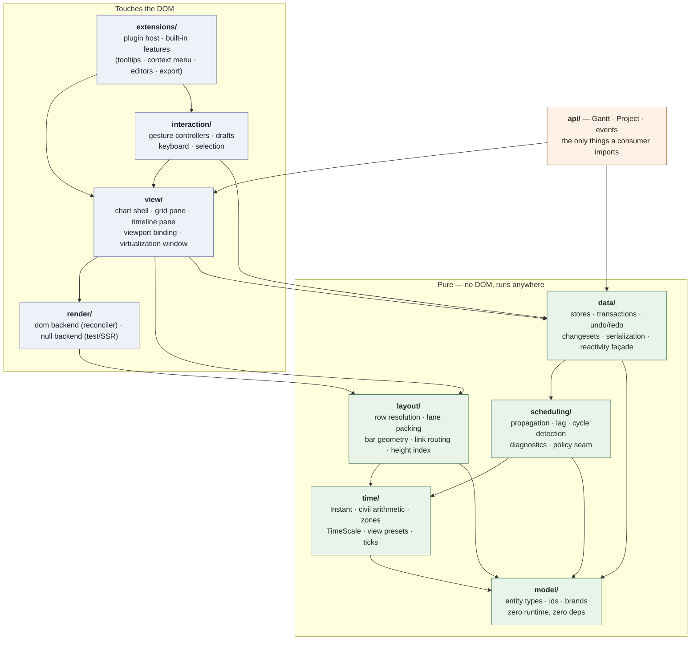
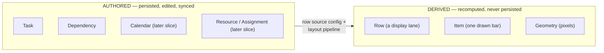
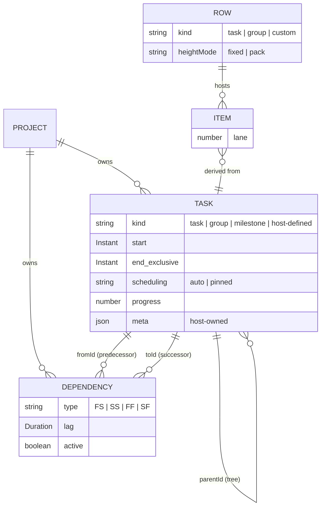
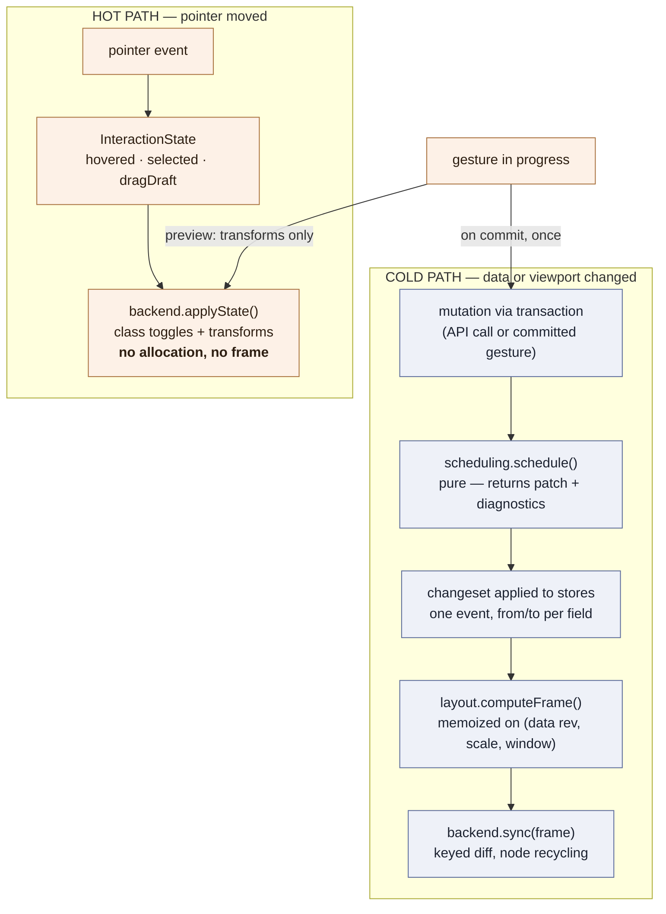
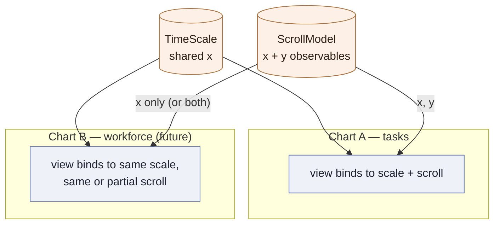

# FreeGantt — Domain & Architecture

Companion to `00-overview.md` (decisions D1–D12 are cited by number). This document defines the layers, the domain model, the contracts between modules, and the invariants that CI enforces.

---

## 1. Layer map

Each layer depends only on layers below it. Everything below the DOM line runs in Node — testable without a browser, usable in a worker or on a server.



**Enforcement (D12):** an import-boundary lint rule in CI (dependency-cruiser or `no-restricted-imports`). Any arrow not in this diagram fails the build. Notably:

- `scheduling/` never imports `render/`, `view/`, or `interaction/` — and vice versa (D4). They meet only through `data/`.
- `model/` is types only: zero runtime exports beyond id/brand helpers, zero dependencies.
- Only `api/` and the type surface of `model/` are public entry points; everything else is internal and free to change.

### 1.1 Directory shape

```
src/
  model/         entity types, ids, brands           (pure)
  time/          instants, zones, TimeScale, presets  (pure)
  data/          stores, transactions, undo, changesets, serialization (pure)
  scheduling/    propagation engine + policies        (pure)
  layout/        geometry: rows, lanes, bars, routing (pure)
  render/
    dom/         default backend + reconciler
    null/        headless backend (tests, SSR, export seam)
  view/          chart shell, panes, viewport binding
  interaction/   gesture controllers, keyboard, selection
  extensions/    plugin host + built-in features
  api/           public façade: Gantt, Project, events
fixtures/        sample projects + golden scheduling fixtures
harness/         Vite dev app — every slice demos here
plans/           these documents
```

One published package, multiple entry points via the `exports` map. Package splitting is a later, demand-driven step; the layer boundaries are the asset, the package boundaries are cost.

---

## 2. Domain model

### 2.1 The central separation: authored vs. derived



`Task` is a schedulable entity that has no idea it will ever be drawn. `Row` is a horizontal display lane. `Item` is one drawn bar on a row. **A row may host many items, and one task may produce items on several rows.** Today's classic Gantt (one row per task, one bar per row) is just the default configuration of that pipeline — not a structural assumption. This is what makes split bars, grouped views, and future workload views configuration rather than rewrites.

### 2.2 Entities

```ts
// model/ — types only. TMeta lets hosts attach typed domain data without forking the model.

/** Absolute instant, epoch ms. Branded to prevent naked-number mixing. */
type Instant = number & { readonly __brand: 'Instant' };

interface TimeSpan { start: Instant; end: Instant }   // half-open [start, end)

interface Duration { value: number; unit: TimeUnit }  // 'ms'|'m'|'h'|'d'|'w'|'M'|'y'

/** Open classification — see §2.5. 'task' | 'group' | 'milestone' ship; hosts add their own. */
type TaskKind = 'task' | 'group' | 'milestone' | (string & {});

interface Task<TMeta = unknown> {
  id: TaskId;
  parentId?: TaskId;           // hierarchy; roots have none
  /** What sort of thing this is. Authored, never derived — see §2.5. Default 'task'. */
  kind?: TaskKind;
  name: string;
  /** Always present in the store. For kinds whose span the policy derives (default `group`),
   *  the rollup pass maintains these; input may omit them and they are initialized (§2.5). */
  start: Instant;
  end: Instant;                // exclusive — see §5
  /** 'auto': the engine may move it. 'pinned': the engine reports conflicts but never moves it. */
  scheduling: 'auto' | 'pinned';
  progress?: number;           // 0..1
  /** Interrupted work — renders as multiple bars on one row. */
  segments?: readonly TimeSpan[];
  meta?: TMeta;                // host-owned, typed via generic
}

/** First-class entity, never an array embedded on a task. */
interface Dependency {
  id: DependencyId;
  fromId: TaskId;              // predecessor
  toId: TaskId;                // successor
  /** Which endpoints relate: finish→start (default), start→start, finish→finish, start→finish. */
  type: 'FS' | 'SS' | 'FF' | 'SF';
  /** Delay (or overlap, if negative) between the related endpoints. Zero-valued, never absent. */
  lag: Duration;
  active: boolean;             // soft-disable without deleting
}

/** DERIVED. One display lane. */
interface Row {
  id: RowId;
  kind: 'task' | 'group' | 'custom';
  label: string;
  heightMode: 'fixed' | 'pack';   // 'pack' grows to fit lanes
}

/** DERIVED. One drawn bar. Always traces back to a task. */
interface Item {
  id: ItemId;                  // deterministic — see §2.4
  rowId: RowId;
  taskId: TaskId;
  kind: TaskKind;              // carried through so backends/renderers never refetch the task
  segmentIndex?: number;
  start: Instant; end: Instant;
  lane: number;                // sub-lane within the row
}
```

Reserved for later slices, designed-for now (fields and stores exist as named seams, not dead code): `Calendar` (working time), `Constraint` (date restrictions, policy-defined vocabulary), `Resource` + `Assignment` (staffing), `Baseline` (snapshots).



### 2.3 Row sources — the flexibility mechanism

The layout pipeline is `row resolution → item emission → lane packing → geometry`. The **row source** is configuration:

```ts
rows: { source: 'tasks', tree: true }                        // classic Gantt (default)
rows: { source: 'group', groupBy: t => t.meta.team }         // one row per group value
rows: { source: 'custom', resolve: myRowResolver }           // host-defined rows entirely
```

Item emission then places tasks (or task segments) onto rows; overlapping items on one row auto-pack into sub-lanes. Future workload/resource views are simply another row source — no new rendering or interaction code.

### 2.4 Item identity is deterministic

`Item.id = `${taskId}:${segmentIndex ?? 0}`` (extended if future sources add dimensions). Regenerated every layout pass, so it **must** be stable across passes or node recycling, CSS transitions, and in-flight drag state all break. Asserted by a layout test from slice S0.

### 2.5 Task kinds — one authored field, per-layer meaning

`Task.kind` answers "what sort of thing is this?" exactly once, in the model. Every other layer maps that answer to layer-local behavior through a registry or seam it already has — never `if (kind === ...)` chains scattered across the codebase:

| Layer | What `kind` selects | Seam |
|---|---|---|
| `scheduling/` | schedule semantics — e.g. a `group` spans its children via rollup (default) vs. directly schedulable | `SchedulingPolicy` (§7) |
| `layout/` | item emission — bar vs. summary bracket vs. milestone diamond; whether items are emitted at all | kind → item-emitter registration in the §2.3 pipeline |
| `render/` | appearance — per-kind default renderer; `data-kind` on the element for CSS | renderer registry (`02` §4) |
| `interaction/` | which gestures the task affords (move / resize / link / edit …) | capability resolver (§9) |

Rules:

- **Kind is authored, never derived.** A `group` is a group because the user said so — not because it currently has children. An empty group is legal and renders as one (that is how "add a phase, then fill it" works). For derived-span kinds, input may omit `start`/`end`: the store initializes a zero-length span (at the project's reference date) and the rollup pass owns it from then on — the *stored* model always has both fields, so no layer downstream handles absence. `parentId` (tree position) and `kind` (what it is) are orthogonal; "every parent is a group" is a convention a host can enforce with a `before*` veto, not a model rule.
- **The set is open.** Shipped kinds: `'task'`, `'group'`, `'milestone'`. A host-defined kind (say `'buffer'`) gets full behavior by registering at the four seams above — no core edits. Anything not registered at a seam falls back to `'task'` behavior there, so partial registration degrades gracefully instead of erroring.
- **Group *task* ≠ row *grouping*.** `rows: { source: 'group', groupBy }` is a view-side arrangement of any tasks and persists nothing; a `kind: 'group'` task is a model entity that persists, schedules, and syncs. They compose — a grouped view of a project containing group tasks is well-defined, because one is authored and the other is derived (principle 1).

---

## 3. Data flow — the two channels



**Invariants:**

- Hover/selection **never** rebuilds a frame. `applyState` is O(changed nodes), zero allocation.
- A drag previews via CSS transforms on existing nodes; **exactly one transaction commits at gesture end** (D10). Never mid-gesture.
- One rAF pipeline: at most one `sync(frame)` per animation frame.

---

## 4. `layout/` — headless geometry

Takes model + time scale + viewport window; returns pure serializable geometry. No drawing calls, no interaction state, no user render output.

```ts
interface GeometryFrame {
  revision: number;            // monotonic; backends discard stale async work
  viewport: { x: number; y: number; width: number; height: number };
  /** Only rows in the vertical window; `top` in absolute content coordinates. */
  rows: Array<{ id: RowId; index: number; top: number; height: number; laneCount: number; label: string }>;
  contentHeight: number;       // across ALL rows, from the height index
  bars: Array<{
    id: ItemId; taskId: TaskId; rowId: RowId;
    kind: TaskKind;              // backends stamp it as data-kind — per-kind CSS with zero JS
    x: number; y: number; width: number; height: number; lane: number;
    /** Static classification only (hasConflict, inCycle) — never hover/selection. */
    flags: BarFlags;
  }>;
  links: Array<{ id: DependencyId; path: PathCommand[]; flags: LinkFlags }>;
  decorations: Array<TodayLine | RangeBand | RowStripe>;
}

function computeFrame(input: LayoutInput): GeometryFrame;
```

Rules that keep it honest:

- **No user render output in the frame.** Custom renderers are invoked by the DOM backend at sync time (see `02-public-api.md` §5), keyed by `Item.id`. The frame stays pure geometry, snapshot-testable, backend-neutral.
- **No materialized hit-region array.** The bars array *is* the hit index; DOM backends get hit-testing from event delegation.
- **Row heights and virtualization:** a cumulative row-height index gives O(log n) "top of row i" and "row at offset y" even with pack-mode variable heights. Slice S1 ships a simple prefix-sum implementation behind the index interface; the O(log n) structure replaces it in S7 **only if the measured spike says so** (D2).
- **Grid and timeline consume the same `frame.rows`.** Both position rows absolutely from `top`/`height`; neither uses flow layout or computes a height. One vertical window, one scroll owner. This is the #1 defect source in split-pane Gantts and it is closed by construction (D8).

---

## 5. Time policy (D6)

Three rules, in force from the first commit, because all three are retrofit-hostile:

1. **Storage is half-open `[start, end)`; display is inclusive.** A task "ending Friday" stores `end` = Saturday 00:00 in project time. Exactly one formatting helper (`formatEndInclusive`) renders inclusive ends; code review rejects inline `end - 1` arithmetic.
2. **The project owns an IANA timezone; viewer-local is opt-in.** All civil arithmetic — day floors, week starts, snapping, shading — resolves through the project zone, so two users in different zones see identical day boundaries. `Instant` stays absolute.
3. **No naked time arithmetic.** `time/` exposes `add`, `startOf`, `diff`, etc., all zone-aware and DST-correct. A lint rule bans magic time constants (`86400000` and friends) outside `time/`.

Ergonomics: `time/` ships `instant(v: Date | number | string): Instant`, `toISO(i: Instant): string`, and a civil-date helper set so consumers work with "days" and "Mondays," not epoch math. Zone-aware arithmetic is memoized (offset table per zone/day) — budgeted for in the S7 spike.

### 5.1 `TimeScale` — instants ⇄ pixels, shareable (D9)

```ts
/** Pure and standalone. Charts BIND to one; two charts sharing one scale are x-synced by construction. */
interface TimeScale {
  readonly range: TimeSpan;                 // visible + buffered span
  xForInstant(i: Instant): number;
  instantForX(x: number): Instant;
  widthForDuration(d: Duration, at: Instant): number;
  ticks(preset: ViewPreset): readonly Tick[];
}

interface ViewPreset {                       // data, not a switch statement
  id: string;
  tickUnit: TimeUnit; tickIncrement: number;
  headers: Array<{ unit: TimeUnit; increment: number; format: HeaderFormat }>;
  tickWidthPx: number;
  snap?: { unit: TimeUnit; increment: number } | 'tick' | 'none';
}
```

Shipped presets cover hour→year zoom levels; custom presets are config objects, never a library edit. A non-linear scale (e.g., collapsing non-working time) is a future *implementation* of `TimeScale` — the interface is the seam; nothing else may assume linearity except through it.

---

## 6. `data/` — stores, transactions, changesets

- **`ProjectData`** owns normalized stores (`tasks`, `dependencies`, plus reserved stores) with indexes (`byId`, `byParent`, `byPredecessor`, `bySuccessor`), the project timezone, and the scheduling binding. Fully headless (D4): constructible and usable in Node with no view.
- **Transactions**: `project.transaction(() => { ...mutations })` batches mutations, runs scheduling once, emits **one changeset**. Every mutation path — API and gesture — goes through a transaction. No exceptions.
- **Changesets** are the universal delta (D7, principle 4):

```ts
interface ChangeSet {
  id: ChangeSetId;
  origin: 'user' | 'engine' | 'undo' | 'redo' | 'load';
  added:   Array<{ store: StoreName; entity: unknown }>;
  removed: Array<{ store: StoreName; entity: unknown }>;
  updated: Array<{ store: StoreName; id: EntityId; field: string; from: unknown; to: unknown }>;
}
```

- **Undo/redo**: the transaction is the atomic unit, and it records the **complete post-scheduling changeset — user edits and engine cascades together**. Undo that reverts only the user's edit while the cascade stays applied corrupts the project; this is the corruption class the design closes. Redo replays the recorded changeset (deterministic even if engine behavior changes between versions).
- **Reactivity**: a thin internal `signal`/`computed`/`effect` façade in `data/`, backed by one small dependency, swappable in one file. Instance-scoped — **zero module-level singletons anywhere** (two charts on one page with independent state is a standing CI test).
- **Serialization**: versioned `toJSON()`/`fromJSON()` with a declared schema (`{ schema: 1, ... }`), brands stripped at the boundary. The JSON shape is public API and semver-governed. See `02-public-api.md` §6.

---

## 7. `scheduling/` — pure engine, pluggable policy


```ts
interface ScheduleRequest {
  tasks: readonly Task[];
  dependencies: readonly Dependency[];
  /**
   * WHAT THE USER JUST SET, per field — not merely which tasks are dirty.
   * A proposed start with no proposed end means the bar moved; proposing
   * start and end means it was resized. Empty ⇒ full recompute.
   */
  proposed: ReadonlyMap<TaskId, Partial<TaskEditableFields>>;
  policy: SchedulingPolicy;
  options: ScheduleOptions;
}

interface ScheduleResult {
  patch: Array<{ id: TaskId; field: string; from: unknown; to: unknown }>;
  diagnostics: Diagnostic[];          // conflicts, cycles — surfaced, never silently fixed
}

function schedule(request: ScheduleRequest): ScheduleResult;   // pure, deterministic
```

**Engine (fixed, universal — slice S3):**

- Propagation over the dependency graph in topological order via an **explicit worklist loop, never recursion** — long chains blow the JS stack otherwise; a 5,000-link chain fixture forecloses it permanently. Module-header invariant: *this file contains no recursive call; chain depth is unbounded by design.*
- Lag applied per dependency `type`; negative lag (overlap) is legal.
- **Cycle detection names the members**: if the worklist drains with tasks unvisited, those tasks are the cycle — `{ code: 'cycle', taskIds }`, never "a cycle exists somewhere."
- `scheduling: 'pinned'` tasks are never moved; the engine reports what it *would* have done as a diagnostic.
- Parent/group rollup (summary spans from children) is a separate bottom-up pass after propagation settles — pass ordering, not mutual recursion. A dependency attached to a `group` task resolves against its rolled-up span by default.

**Kind semantics live in the policy, not the engine.** The engine knows graphs and lag; what a `group` or `milestone` (or host-defined kind) *means* for scheduling is a policy decision. The default policy: `group` spans derive from children (direct edits to a derived span are reported as diagnostics, not applied); `milestone` keeps `start === end`; unknown kinds behave as `'task'`. A host methodology that wants directly schedulable groups ships a policy — the engine and contract do not change.

**Policy (pluggable — where methodologies differ):**

```ts
interface SchedulingPolicy {
  /** Given what the user proposed on a task, decide which fields move.
   *  MUST NOT move a proposed field — never overwrite user input (assert in dev). */
  resolveEdit(proposed: ReadonlySet<Field>, task: Task): EditResolution;
  /** Precedence when rules conflict (pin vs. dependency vs. future constraint). */
  precedence: readonly RuleKind[];
  /** Optional analyses (e.g., slack/critical computation) — later slices. */
  analyses?: readonly ScheduleAnalysis[];
}
```

The shipped `defaultPolicy` is deliberately minimal and neutral: dependencies push successors forward as early as their predecessors allow; pinned beats dependency; edits move the fields the user didn't touch. Calendars, constraint vocabularies, criticality definitions, and resource-driven durations all arrive later as richer policies/analyses — **the request/result contract does not change.**

**Speculative evaluation is free by purity:** during a drag, call `schedule()` with a synthetic `proposed`, render the returned patch as a preview, discard on cancel. Throttled to one call per animation frame. This is a load-bearing reason `schedule()` must never mutate its input — write it in the module header.

---

## 8. `render/` and `view/`

### 8.1 Backend contract

```ts
interface RenderBackend {
  mount(host: HTMLElement): void;
  sync(frame: GeometryFrame): void;           // cold: structure + geometry
  applyState(state: InteractionState): void;  // hot: classes/transforms only
  hitTest(x: number, y: number): HitResult | null;
  destroy(): void;
}
```

Backends: `dom` (default — absolutely-positioned virtualized rows, SVG for link paths), `null` (tests, SSR of data, future export path). A dense canvas backend is a *possible future implementation* of this interface, built only if measurement demands it (D2).

**DOM rendering approach:** bars and rows are plain positioned elements — CSS-themeable (custom properties + parts), accessible (focusable bars, grid semantics — D11), framework-friendly. Updates go through a small keyed reconciler that diffs a plain-object element description against the config last applied to that same element (stored on the node) — no shadow tree, no per-frame vDOM allocation, because the changeset already says what changed. Hard scope boundary in the module header: attribute/class/style/text diffing and keyed child recycling only; anything needing lifecycle hooks or a component model means we are rebuilding a framework and should adopt one instead.

**Text is text.** Renderer output defaults to `textContent`; raw HTML requires an explicit opt-in flag. Task names come from databases; the default must not be an XSS hole.

### 8.2 Viewport & multi-chart sync (D9)



`TimeScale` and `ScrollModel` are **standalone observable objects**. Every chart binds to one of each; by default the chart constructs its own privately, so single-chart usage never sees the concept. Passing the same instance to two charts syncs them on that axis — x, y, or both — with zero special-casing in either chart. **Rule:** no view or interaction code reads or writes scroll position except through the bound `ScrollModel`; no code converts time to pixels except through the bound `TimeScale`. That rule is what makes D9 free later, and it is lintable.

### 8.3 Split pane (D8)

The chart shell owns: grid pane (columns over `frame.rows`) · splitter · timeline pane (header + bars + links + decorations). One scroll owner drives both panes' vertical position from the same row geometry (§4). The grid starts as a single label column (S1) and grows columns/editors in S6 without structural change.

---

## 9. `interaction/` — gestures as drafts (D10)

Small, single-purpose controllers — `Drag`, `Resize`, `LinkCreate`, `Select`, `Keyboard` — over a shared base that owns the invariants:

- **Arm on slack threshold** (~14px) so click/double-click survive pointer jitter.
- **Never write model or selection state on `pointerdown`** — it can rebuild DOM under the pointer and cancel the gesture.
- Gesture lifecycle: `pointerdown → draft → (preview via hot path) → before* event (cancelable, may be async) → one transaction → after event`.
- Escape cancels; pointer capture always; touch works.
- Keyboard is a first-class controller, not an afterthought: arrow-key nudge by the preset's snap, full gesture parity (D11).
- **Capabilities gate gestures and affordances from one resolution.** Before arming, every controller asks the chart's capability resolver — `canMove(task)`, `canResize(task)`, `canLink(task)`, … — built from the `interactions` config (`02` §4.1) over per-kind defaults (e.g. a `group` with a derived span doesn't resize). The **same** resolution drives visual affordances (resize handles, link ports, cursors), so nothing is shown that can't be done and nothing hidden can be triggered — pointer or keyboard (invariant I14). `before*` events remain the *contextual* veto (this drop, this target, this moment); capabilities are the *static* per-task answer.

Controllers talk to `data/` only through drafts and transactions, and to the screen only through `InteractionState` — they import neither `render/` internals nor `scheduling/`.

---

## 10. `extensions/` — the plugin contract

"Everything is extensible" is only true if the extension contract is specified. It is:

```ts
interface GanttPlugin {
  id: string;
  /** Called once after the chart mounts. Returns a disposer. */
  setup(ctx: PluginContext): () => void;
}

interface PluginContext {
  project: ProjectApi;              // full data access via public API (transactions, queries)
  events: EventBus;                 // subscribe to everything, including before* (may veto)
  view: {
    registerDecoration(layer: 'underBars' | 'overBars', d: DecorationProvider): void;
    registerColumn(col: ColumnSpec): void;
    registerRenderer(kind: 'bar' | 'cell' | 'header' | 'tooltip', r: Renderer): void;
    overlay: OverlayHost;           // positioned DOM (popups, tooltips) with anchoring/flipping
  };
  interaction: {
    registerController(c: InteractionControllerSpec): void;
    registerKeybinding(b: KeyBinding): void;
  };
  commands: CommandRegistry;        // named, invokable actions (also powers context menus)
  disposables: DisposableStore;     // everything registered auto-unregisters on dispose
}
```

Rules:

- Plugins are configured declaratively (`features: { tooltips: true, contextMenu: {...} }`) and are tree-shakeable — an unused feature costs zero bytes.
- Setup order = registration order; plugins must not depend on sibling load order (communicate via events/commands only).
- A plugin may not reach into another plugin or any internal module — the `PluginContext` is its entire world. Enforced by the same import-boundary lint.
- **Dogfooding is the test:** built-in features (tooltips, context menu, editors) use this contract with no private back-doors. If a built-in needs a back-door, the contract is wrong — fix the contract (gate S6 → S7).

---

## 11. Invariants — the short list CI enforces

| # | Invariant | Enforced by |
|---|---|---|
| I1 | Layer imports match §1 exactly | dependency lint in CI |
| I2 | No module-level singletons; two charts coexist independently | isolation test (mounts two charts) |
| I3 | Scheduling contains no recursive propagation | 5,000-link chain fixture + review rule |
| I4 | `schedule()` never mutates its input; policy never moves a proposed field | dev-mode asserts + property test |
| I5 | Hot path allocates nothing and never rebuilds a frame | perf test on `applyState` |
| I6 | One transaction per gesture, at commit | interaction tests |
| I7 | Undo reverts user + engine effects atomically | round-trip property test |
| I8 | `Item.id` deterministic across layout passes | layout snapshot test |
| I9 | Grid and timeline share one row geometry | pixel-equality test on row tops |
| I10 | No time math outside `time/`; no magic time constants | lint rule |
| I11 | Public `.d.ts` contains nothing unimplemented | type-surface snapshot test |
| I12 | All pixels-from-time via `TimeScale`; all scroll via `ScrollModel` | lint + review rule |
| I13 | Renderer output is text-safe by default | reconciler unit test |
| I14 | Gesture arming and visual affordances come from one capability resolution | shared resolver + interaction test |
