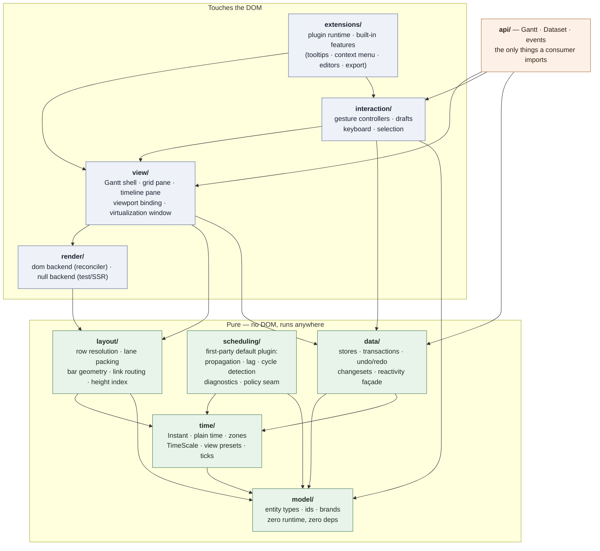
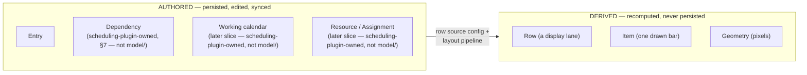
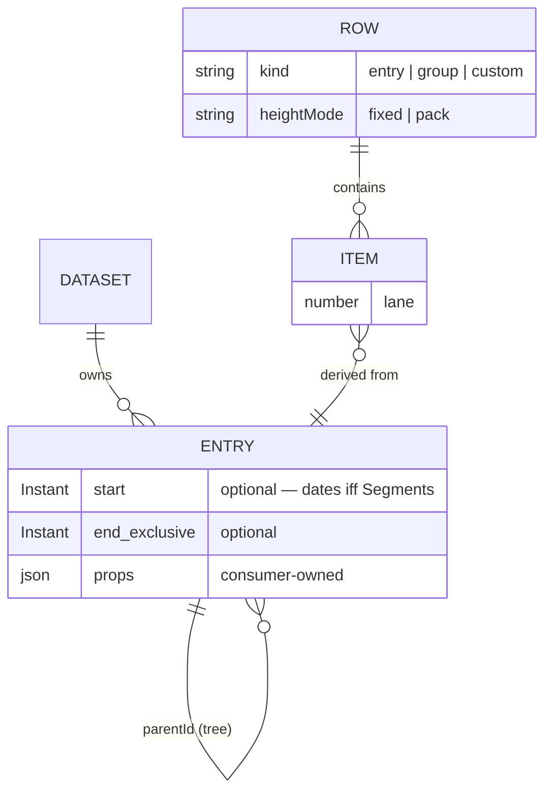
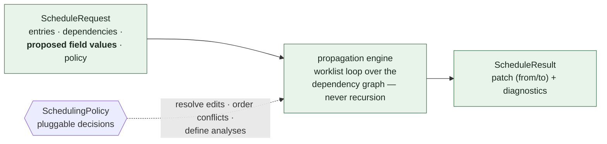
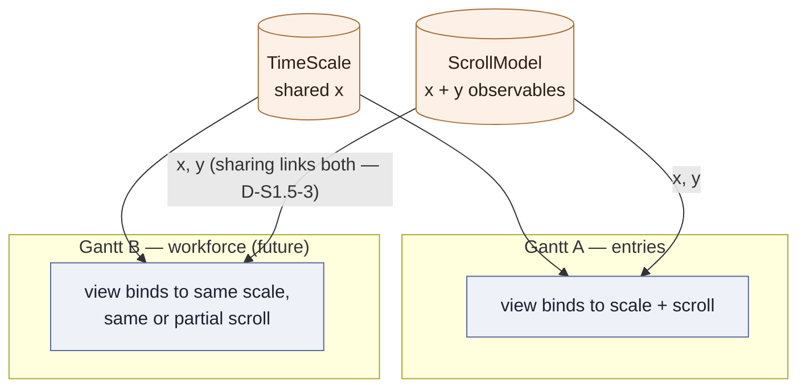

# FreeGantt — Domain & Architecture

Companion to `00-overview.md` (decisions D1–D12 are cited by number). This document defines the layers, the domain model, the contracts between modules, and the invariants that CI enforces.

---

## 1. Layer map

Each layer depends only on layers below it. Everything below the DOM line runs in Node — testable without a browser, usable in a worker or on a server.



`data/ --> TIME` (S2.1, D-S2-1, `plans/s2-data-core`): mutation-time input reading (resolving a Plain string, advancing a date-only `end`) is zone-aware date arithmetic, and I10 confines that to `time/`. `time/` sits below `data/` in the pure stack, and `scheduling/` already has the same arrow — nothing about the layering changes, only the drawing catches up with what `data/` now does.

There is deliberately no `data/ --> scheduling/` edge: `data/` has no static dependency on scheduling at all. Instead, `data/` calls the generic extension hook (D4; exact contract tracked in issue #12), which may add extra field writes to a proposed edit before it commits. `scheduling/` stays a directory in `src/`: it's where the first-party default scheduling plugin's pure engine lives, still DOM-free and still isolated from `render/`/`view/`/`interaction/`, but it is no longer a privileged layer every Gantt is wired to by default — a Gantt with no scheduling plugin installed never loads it.

`interaction/ --> MODEL` (S3, D-S3-4/D-S3-5, `plans/s3-direct-manipulation/README.md` P3): a gesture controller names `Entry`, `EntryId` and `ItemId` — all three live in `model/` — as type-only params, the same rationale `view/`'s own `model/` edge already carries. One arrow, nothing else: `interaction/` still may not reach `time/`, `layout/` or `render/` — every date/pixel computation a gesture needs is a pure `layout/` function the shell hands back through `EntryGestureContext`.

`api/ --> INT` (S3, `plans/s3-direct-manipulation/README.md` §0): `interaction/` sits one layer *above* `view/` (`INT --> VIEW`, not the reverse), so nothing inside `view/` may import it to wire the default pointer-gesture attachments into `GanttShell` — and `extensions/`, the other layer that reaches both `view/` and `interaction/`, does not exist until S5. `api/gantt.ts` is the composition root that supplies `attachEntryGestures` to `GanttShell` by constructor injection (the shell itself takes it structurally-typed, with no import of its own), the same role it already plays wiring `view/`, `data/`, `model/`, `time/` and `layout/` together for a plain `new Gantt(...)`.

**Enforcement (D12):** an import-boundary lint rule in CI (dependency-cruiser or `no-restricted-imports`). Any arrow not in this diagram fails the build. Notably:

- `scheduling/` never imports `render/`, `view/`, or `interaction/` — and vice versa (D4). A scheduling plugin, when installed, meets `data/` only through that hook, never a static import.
- `model/` is types only: zero runtime exports beyond id/brand helpers, the `FreeGanttError` base, and the span predicate `spansTime`, zero dependencies. The author widened the carve-out for that predicate on 2026-09-11 (Q5 in `plans/field-redesign/BUILD-LOG.md`). It states ADR 0012's span invariant — an Entry spans time when it holds both dates — in one place, for `data/`, `layout/`, `view/` and `extensions/` alike. It is one pure total function over its argument, with no state and no dependency, and it answers a question about a type this layer declares. The rule it replaced was guard arithmetic at about ten sites, plus six casts that asserted it without testing it.
- Only `api/` and the type surface of `model/` are public entry points; everything else is internal and free to change.
- **Removable leaves (D-S2-23, S2.7):** `span-rollup.ts`, `view/dataset-change-subscription.ts` and `data/history.ts` each have exactly one legitimate importer, enforced the same way as the layer arrows above (dependency-cruiser `*-is-removable` rules, red-tested by `scripts/guard-red-test.mjs`). Each is provably deletable: its one caller goes away with it, and the rest of the system is unaffected (`plans/s2-data-core/README.md` §9's compatibility table names what each deletion degrades to).
- **The commit path ends at `change`; `History` subscribes like any other consumer (D-S2-24):** `data/transaction.ts` commits a `ChangeSet` and emits `change`; it imports no history and no view. `History` and `view/dataset-change-subscription.ts` are both ordinary `on('change')` subscribers, not privileged callers on the commit path — the same discipline that makes both removable leaves above.
- **`render/ --> data/dev-mode.ts` and `extensions/ --> data/dev-mode.ts` (leaf-only widening, S5.4 QC):** neither layer gains a `data/` edge — `data/dev-mode.ts` is the one file dependency-cruiser lets both reach, because it is a zero-dependency, one-line `import.meta.env.DEV` read with no state and no further imports of its own, the same shape that already justifies `model/`'s `FreeGanttError` carve-out. Before this, `render/dom/index.ts` and `extensions/plugin-runtime.ts` each hand-copied the check with a comment citing the boundary; two copies of one line is the smaller problem, so this stays a named single-file exception rather than a general `render --> data` or `extensions --> data` arrow — every other `data/` file is still unreachable from either layer.

### 1.1 Directory shape

```
src/
  model/         entity types, ids, brands, geometry primitives (Point/Size/PixelSpan/Rect),
                 Dataset (the structural contract api/dataset.ts's class satisfies — S1.7 §3.2,
                 formerly DatasetLike in view/gantt-shell.ts)                                (pure)
  time/          instants, zones, TimeScale, presets  (pure)
  data/          stores, transactions, undo, changesets (pure)
                 (S2.1: reactivity.ts, event-bus.ts, entry-reader.ts, entry-store.ts,
                 dataset-state.ts — the only file layer that may additionally import time/, D-S2-1)
  scheduling/    propagation engine + policies        (pure)
  layout/        geometry: rows, lanes, bars, routing (pure)
  render/
    dom/         default backend + reconciler
    null/        headless backend (tests, SSR, export seam)
  view/          Gantt shell, panes, viewport binding
  interaction/   gesture controllers, keyboard, selection
  extensions/    plugin runtime + built-in features
  api/           public façade: Gantt, Dataset, events
fixtures/        sample projects + golden scheduling fixtures
harness/         Vite dev app — every slice demos here
plans/           these documents
```

One published package, multiple entry points via the `exports` map. Package splitting is a later, demand-driven step; the layer boundaries are the asset, the package boundaries are cost.

---

## 2. Domain model

### 2.1 The central separation: authored vs. derived



`Entry` is an authored, dated record that has no idea it will ever be drawn. `Row` is a horizontal display lane. `Item` is one drawn bar on a row. **A row may carry many items, and one entry may produce items on several rows.** Today's classic Gantt (one row per entry, one bar per row) is just the default configuration of that pipeline — not a structural assumption. This is what makes split bars, grouped views, and future workload views configuration rather than rewrites.

### 2.2 Entities

```ts
// model/ — types only. TMeta lets consumers attach typed domain data without forking the model.

/** Absolute instant, epoch ms. Branded to prevent naked-number mixing. */
type Instant = number & { readonly __brand: 'Instant' };

interface TimeSpan { start: Instant; end: Instant }   // half-open [start, end)

interface Duration { value: number; unit: TimeUnit }  // 'ms'|'m'|'h'|'d'|'w'|'M'|'y'

interface Entry<TProps extends object = Record<string, unknown>> {
  id: EntryId;
  parentId?: EntryId;           // hierarchy; roots have none
  name: string;
  /** Present iff the Entry holds at least one Segment (ADR 0012). Exclusive end — see §5. */
  start?: Instant;
  end?: Instant;
  /** Interrupted work — renders as multiple bars on one row. Absent when dateless. */
  segments?: readonly TimeSpan[];
  /** Consumer bag; always present. Declared keys are Fields (§2.6). */
  props: Readonly<Partial<TProps>>;
}
```

`Dataset.entries` is a store view, not a bare array (S2.1, D-S2-2, `plans/s2-data-core`):
`dataset.entries.update('t2', { … })` is the published call site, so `dataset.entries` is the
collection itself. `EntryStoreView` (`model/dataset.ts`) is the read half — `all`, `get`,
`has`, `size`, `childrenOf` — and `data/`'s `EntryStore` adds the mutators. `all`'s
returned array is cached and rebuilt once per commit, not once per read (D-S2-3), so a caller
comparing two reads of `all` by reference is a correct "did anything change" check.

```ts
/** DERIVED. One display lane. */
interface Row {
  id: RowId;
  kind: 'entry' | 'group' | 'custom';
  cells: readonly string[];       // one per configured grid column, in display order — §2.6
  heightMode: 'fixed' | 'pack';   // 'pack' grows to fit lanes
}

/** DERIVED. One drawn bar. Always traces back to an entry. */
interface Item {
  id: ItemId;                  // deterministic — see §2.4
  rowId: RowId;
  entryId: EntryId;
  variant: string;             // the Variant this Gantt resolved — stamped as data-variant (ADR 0018)
  segmentIndex?: number;
  start: Instant; end: Instant;
  lane: number;                // sub-lane within the row
}
```

`Dependency` (predecessor/successor link, with `type`/`lag`/`active`) and the per-entry pin flag formerly on `Entry.scheduling` are **not** defined here. Both are scheduling-plugin-owned data now, not `model/` — pulling scheduling out of the mandatory core layers means `model/` stays scheduling-agnostic, and a consumer with no scheduling plugin installed never sees either type. They're still authored, persisted data in the sense of §2.1's separation — just owned by the plugin's storage rather than core's — and their shape is described alongside the engine in §7 (exact contract tracked in issue #12).

Reserved for later slices, designed-for now (fields and stores exist as named seams, not dead code) and scheduling-plugin-owned, not `model/` (same treatment as `Dependency` above): `Working calendar` (which days/hours count as workable), `Constraint` (date restrictions, policy-defined vocabulary), `Resource` + `Assignment` (staffing), `Baseline` (snapshots).



`Dependency` (predecessor/successor, `type`, `lag`, `active`) and the per-entry pin flag live in scheduling-plugin-owned storage when a scheduling plugin is installed — not in this diagram, which covers `model/`'s entities. See §7.

### 2.3 Row sources — the flexibility mechanism

The layout pipeline is `row resolution → item emission → lane packing → geometry`. The **row source** is configuration:

```ts
rowSource: { source: 'entries', tree: true }                        // classic Gantt (default)
rowSource: { source: 'group', groupBy: t => t.props.team }         // one row per group value
rowSource: { source: 'custom', resolve: myRowResolver }           // consumer-defined rows entirely
```

Item emission then places entries (or entry segments) onto rows; overlapping items on one row auto-pack into sub-lanes. Future workload/resource views are simply another row source — no new rendering or interaction code.

Item emission is a seam, mirroring rendering (§10): the pipeline resolves one Variant per row and calls that Variant's own `items` (ADR 0018). Core's `parent` draws a summary and core's `leaf` draws a bar. A plugin or a consumer that needs another shape declares a Variant whose `when` rule claims the rows. Every row resolves, because core's `leaf` carries no `when`.

```ts
type ItemProducer = (entry: Entry) => readonly Item[];
```

### 2.4 Item identity is deterministic

`Item.id = `${entryId}:${segmentIndex ?? 0}`` (extended if future sources add dimensions). Regenerated every layout pass, so it **must** be stable across passes or node recycling, CSS transitions, and in-flight drag state all break. Asserted by a layout test from slice S0.

### 2.5 Entry structure — children decide derivation and the default Variant

An Entry has children, or it does not. That structure answers derivation and the default bar shape. Every other layer maps that answer through a registry or seam it already has — never `if (kind === ...)` or `if (variant === ...)` chains in core (ADR 0013, ADR 0018):

| Layer | What structure or a Variant rule selects | Seam |
|---|---|---|
| `scheduling/` | a parent spans its children via rollup vs. a leaf that is directly schedulable, *when a scheduling plugin is installed* | `SchedulingPolicy` (§7), plugin-owned |
| `layout/` | item emission — bar vs. summary; whether items are emitted at all | the resolved Variant's `items` (ADR 0018) |
| `render/` | appearance — default renderer; `data-variant` on the element for CSS (the Variant this Gantt resolved, not an Entry classification) | the Variant's `paint`, then the renderer registry (`02` §4) |
| `interaction/` | which gestures the entry affords (move / resize / link / edit …) | the Variant's `can`, then the capability resolver (§9) |

Rules:

- **Derivation is structure.** An Entry derives when it has children. An empty phase is a bar until a child arrives. Losing the last child leaves a normal Entry with no dates. There is no stored classification, no `rollUpKinds`, and no `hierarchy.autoGroup`. Dates are optional (ADR 0012): a dateless parent is legal; the store does not mint a fake span. The Rollup is `data/`'s own commit step — it runs on every transaction and at construction, whether or not a scheduling plugin is installed, and nothing installable can occupy or displace it (D-S2-22, closes OQ7). `scheduling/`'s engine moves children and nothing else; it never reaches the rollup, because the rollup already ran by the time anyone reads the result (`02.6` below, `s2.3-mutation-api.md` §1.5).
- **The shape follows children, or a Variant rule.** A parent with children draws core's own `parent` Variant. A leaf draws a bar. Core does not ship a diamond. A plugin or a consumer that needs a shape that is not parent-or-bar declares a Variant whose `when` rule claims the rows (ADR 0018) — it stores no list of the ids it owns, so a row added later is claimed too. One object answers all four seams above. Every row resolves, because core's `leaf` carries no `when`.
- **A painted-span floor is a lookup, not a classification check.** `layout/frame.ts`'s `barSpan` widens a bar's true `[x, x + width)` extent to a floor when it is too narrow to paint or to grab. Every bar floors at `minBarWidthPx` (`--fg-bar-min-width`, default `DEFAULT_MIN_BAR_WIDTH_PX`), `max`'d against a diamond floor when a Variant paints one (`diamondSizePx * √2`). `FrameBar.minimumSpan` states the fact for every bar this floor touched. `render/` stamps it as `data-span="minimum"` (CONTEXT.md, `02` §4).
- **Parent *entry* ≠ row *grouping*.** `rowSource: { source: 'group', groupBy }` is a view-side arrangement of any entries and persists nothing. A parent Entry is a model entity that persists, schedules, and syncs. They compose — a grouped view of a dataset containing parents is well-defined, because one is structure and the other is derived (principle 1).

### 2.6 Fields and grid columns — what a value **is**, and where a Gantt **shows** it

`Entry` is a closed shape, so a consumer's `cost` has nowhere to be a first-class value: it can sit in `props` undeclared, but it cannot roll up, cannot be compared per field, and cannot appear in a changeset. A **Field** fixes that. It is a declared, named value on an entry, and core's own fields are declarations of the same kind (ADR 0005, ADR 0011). A **Grid column** is where one Gantt shows a field.

One sentence separates them, and it is the only one a reader has to hold: **a field is what a value *is*; a grid column is where a Gantt *shows* it.** Fields belong to the `Dataset`, because the rollup writes into stored, serialized, undoable values and runs at construction, before any Gantt exists. Grid columns belong to the `Gantt`, because which values this view shows, and in what order, is a view question.

```ts
// model/field.ts — types only
type FieldKey = string & {};                        // a field's name; also the changeset's `field`
type CoreFieldKey = keyof Omit<Entry, 'id' | 'props'>;  // the shipped subset

interface Field<TValue = unknown> {
  key: FieldKey;
  type?: FieldTypeName;                             // a bundle; the field's own keys win over it
  compute?(entry: Entry, ctx: FieldContext): TValue | undefined;  // no stored home when present
  rollUp?: AggregatorName;                          // 'min' | 'max' | 'sum' | 'count' | 'none' | yours
  /** How far a value may change. Stored as the enum. `true`/`false` are input aliases for `'anywhere'`/`'never'`. Default `'anywhere'`. */
  editable?: 'never' | 'api' | 'anywhere' | boolean;
  equals?(a: TValue | undefined, b: TValue | undefined): boolean;   // default Object.is
  compare?(a: TValue | undefined, b: TValue | undefined): number;   // sort; default is the stored value
  formatValue?(value: TValue | undefined, ctx: FormatContext): string;   // text for a cell; DOM-free; locale only here
  column?: Omit<GridColumn, 'field' | 'hidden' | 'editable'>;    // presentation defaults, declared once with the field; which columns show is the Gantt's question
}

/** Presentation only. Never carries an aggregate — see the rules below. */
interface GridColumn {
  field: FieldKey;
  header?: string;
  width?: number; flex?: number;
  align?: 'start' | 'end' | 'center';
  hidden?: boolean;                                 // S5, D-S5-34: declared and not painted; keeps its width and its place
  // cellRenderer arrives in S5, on the Gantt column, when code honours it (I11).
  // #142: editable lives on the Field only, not here — a Grid column carries no override of its own.
}

/** Registered by name, never passed inline — a name serializes, a function does not. */
type Aggregator<TValue = unknown> = (
  children: readonly Entry[],      // already rolled up; the walk is bottom-up
  parent: Entry,
  ctx: RollUpContext,
) => TValue | undefined;           // undefined = no opinion, leave the stored value alone — except on a rolling-up parent, where it means no value (ADR 0013)

/** Compute and store access. No locale. Duration is a compute Field; aggregators call `read(entry, 'duration')`. */
interface FieldContext {
  readonly timeZone: string;
  read<T>(entry: Entry, key: FieldKey): T | undefined;
}

/** FieldContext plus the Field currently rolling up. Shipped Aggregators read `ctx.field`. */
interface RollUpContext extends FieldContext {
  readonly field: FieldKey;
}

/** Built only at Gantt column-resolve time. `formatValue` reads this, never a Dataset locale. */
interface FormatContext extends FieldContext {
  readonly locale: Intl.LocalesArgument;
}
```

Rules:

- **The key is the address.** `{ key: 'cost' }` is `entry.props.cost`. `{ key: 'start' }` is `entry.start`. `{ key: 'duration', compute }` has no stored home. There is no `source` object.
- **Core fields are ordinary declarations.** `name`, `start` (`min`), `end` (`max`), and `duration` (computed from `start` and `end` through `time/`, I10) ship in the registry a consumer adds to. `parentId` and `segments` ship as data-only Fields (no `column`). There is no `kind` Field and no `props` Field. There is no separate path for core, which is what makes a `cost` column and a `start` column the same code. **`progress` is not in this list** — it is scheduling-plugin data under `scheduling:progress` (ADR 0008). `weightedMeanByDuration` still ships as an Aggregator name. Duration returns `undefined` when a date is absent (ADR 0012). One unit: millisecond.
- **A Field is columnable only when it declares `column`.** `gridColumns` names columnable Fields in display order. Default `gridColumns` is `['name', 'start', 'end']` (ADR 0012). The date path is the grid: the date editor opens on a blank cell and writes one Field. Plugin Field keys in `gridColumns` carry their prefix (`scheduling:progress`). A Field with no `column` still rolls up and still appears in the changeset; naming it in `gridColumns` throws `FieldNotColumnableError`.
- **Stored or computed follows the declaration.** A core key or a `props` key has a stored home, so its rolled-up parent value is stored — changeset, undo — exactly as the Span rollup already does for `start`/`end`. Nothing but the Rollup writes a rolling-up parent's cell (ADR 0013). A `compute` Field has no home, so its parent value is computed on read, cached against **dataset revision** in S4 (D-S4-10 — coarser, never stale), and is never stored. A per-entry subtree-revision key returns at S6 if the spike says so. A consumer who wants an aggregate the store never holds declares a computed field; there is no flag to set.
- **A computed field reads the dataset only, never view state.** No zoom, no visible range, no selection. Its cache is then keyed on dataset revision (S4) or subtree revision (S6), which is what makes the value the same for every reader of that dataset. A value that depends on the view is not a field — it is a renderer's business. The duration arm must not call `ctx.read(entry, 'duration')`.
- **`props` is opaque unless you declare a key.** Undeclared keys keep §6's rule — carried by reference, never walked, compared by `===`. `update()` never names an undeclared key (`UnknownFieldError`). A write to a declared key emits a changeset row keyed on the **field key**, never a whole-bag row. Plugin keys share this bag under a prefix.
- **Edits name fields, not shapes.** `update('t1', { start: X, cost: 500 })` is one transaction, one changeset and one undo step across a core field and a consumer field. Nested `props:` at `update()` is refused. A key that is not registered is an `UnknownFieldError` — never a silent write.
- **Rollup precedence is §7's rule, unchanged.** The rollup yields to a field the caller proposed in the same transaction and wins over one the extension hook proposed. Bottom-up, one pass, so nested parents settle together. Structure says which **entries** derive (has children); the registry says how each **field** derives. The two are orthogonal and both are needed.
- **Aggregation never lives on a grid column.** A stored value must not depend on whether a column is visible, and the rollup has already run before any Gantt is constructed.
- **A columnable Field declares its own column defaults, so `gridColumns` is mostly ordering.** `gridColumns: ['name', 'start', 'cost']` names fields in display order; the object form (`{ field: 'cost', header: 'Budget — site A' }`) overrides this Gantt's presentation only, and never the data half.
- **Text and structure stay separate.** `formatValue` returns a string, is DOM-free, and fills the frame's row cells; `cellRenderer` returns element descriptions and is applied by `render/`. Same split as `FrameBar.label` and `barRenderer` (§8).
- **`{ key: 'cost', type: 'money' }` is the common call.** The key decides the home. A `compute` Field is the explicit other shape.
- **A Field type supplies the default `rollUp`, `formatValue`, `compare`, and column defaults.** The registry merges the Field onto its type first; the Field's own keys win. After that merge, absent `rollUp` or `'none'` means the Field does not participate. The type's `rollUp` is an Aggregator name — shipped or a consumer name in `aggregators`. `percent` is the one shipped Field type, and it carries no `rollUp` — a default aggregator would overwrite an authored parent value on every dataset naming it (ADR 0008); there is no global default Aggregator — `sum` is what a consumer puts on `money`, not what an Instant uses. The Span rollup stays `start` as `min` and `end` as `max` on those core Fields (D-S4-3).
- **Writability is one key, two thresholds (ADR 0015).** Gestures ask `canWrite` — writable iff `'anywhere'`. `entries.update()` refuses only `'never'`. Default is `'anywhere'`. Check `compute` before `editable`. Core `name`/`start`/`end` declare `'anywhere'`. `{ editable: false }` still constructs and stores as `'never'`.
- **One registry, whole declaration.** A field (and a field type) carries both halves, `column` included. `data/` stores those bytes and does not interpret them — it never formats and never paints. `view/` reads `column` at Grid resolve time. `api/` is the composition root. Do not open a second registry. ADR 0005's "split at `api/`" is who sends what where at read time, not two copies.

---

## 3. Data flow — the two channels


**Invariants:**

- Hover/selection **never** rebuilds a frame. `applyState` is O(changed nodes), zero allocation.
- A drag previews via CSS transforms on existing nodes; **exactly one transaction commits at gesture end** (D10). Never mid-gesture.
- One rAF pipeline: at most one `sync(frame)` per animation frame.

---

## 4. `layout/` — headless geometry

Takes model + time scale + viewport window; returns pure serializable geometry. No drawing calls, no interaction state, no user render output.

```ts
interface GeometryFrame {
  revision: number;            // monotonic; backends discard stale async work
  visible: Rect;                // the culled region, in timeline-content coordinates — was `viewport`
  /** Header bands, coarsest first — one per `preset.headers` entry, positioned and labelled from the
   *  resolved TimeScale + preset (D-S1.7-6). The render seam's only route for header state (#19); a
   *  backend never builds tick DOM itself. Each tick carries `width` to the next boundary at that
   *  band's step (D-S1.7-4). */
  header: { bands: readonly { unit: TimeUnit; increment: number; ticks: readonly { x: number; width: number; label: string }[] }[] };
  /** Only rows in the vertical window; `top` in absolute content coordinates. `cells` holds one
   *  library-formatted string per configured grid column, in column order, produced by each field's
   *  `formatValue` (§2.6). It is derived text on the `a11yLabel` precedent, not consumer render
   *  output — a `cellRenderer` is applied by `render/`, never here. */
  rows: Array<{
    id: RowId; kind: PlannedRowKind; index: number; top: number; height: number; laneCount: number;
    depth: number; expandable: boolean; expanded: boolean;
    matched?: boolean;   // false when kept only because a descendant matched the filter
    cells: readonly string[];
    /** Every Entry the row owns, and every Segment those Entries own, in the same order (#212,
     *  ADR 0010, #230 R5). A row click selects the Segment set, and `render/dom` diffs it against
     *  the Selection to decide the row's own paint. The frame states both, so the row paint never
     *  reads a second Entry source. Both are empty for a header row, which stands for no Entry. */
    entryIds: readonly EntryId[]; segmentIds: readonly SegmentId[];
  }>;
  /** Total row count across the whole dataset (`entries.length`), not the windowed `rows.length` —
   *  feeds `aria-setsize` (S1.10, D-S1.10-5): virtualization without it announces "row 3" with no
   *  "of 30" over a large dataset. */
  rowCount: number;
  contentHeight: number;       // across ALL rows, from the height index — always the full extent
  contentWidth: number;        // full horizontal extent of the bound TimeScale's range — always the full extent
  bars: Array<{
    id: ItemId; entryId: EntryId; rowId: RowId;
    variant: string;             // backends stamp it as data-variant — CSS with zero JS; not an Entry classification
    /** The one Segment this bar *draws*, carried through from its Item (#212, ADR 0010). Absent on
     *  a bar that drew its Entry's whole span — a group, a milestone, a plugin's own kind. */
    segmentId?: SegmentId;
    /** Every Segment this bar *stands for* — the Segments that select it and paint it (#230). One
     *  Segment for a Segment bar; every Segment of the Entry for a whole-span bar. The frame states
     *  it, so no reader derives it from an Entry source of its own; `FrameLayout.segmentIdsForItem`
     *  answers the same fact for a lookup by id. */
    segmentIds: readonly SegmentId[];
    /** The entry's name — what a backend renders as the bar's label (#26). */
    label: string;
    x: number; y: number; width: number; height: number; lane: number;
    /** Static classification only (`conflict`, `cycle` — renamed from `hasConflict`/`inCycle` at
     *  S1.10 so the field names double as the `data-flag` CSS vocabulary directly, D-S1.10-3) —
     *  never hover/selection. */
    flags: BarFlags;
    /** What a screen reader announces: `${entry.name}, ${formatDate(zone, start)} – ${formatEndInclusive(zone, end)}`
     *  (S1.10, D-S1.10-5). Library-derived text, not consumer render output — same precedent as `label`. */
    a11yLabel: string;
  }>;
  /** `id` was `DependencyId` (a `model/` brand) pre-#13; `Dependency` is now owned by the
   *  `entryDependencies()` plugin, not `scheduling()` (S5.0 grill, #111), so link geometry needs a
   *  plugin-contributed emission seam — `ctx.layout.registerLinkEmitter(emitter)`, aggregating like
   *  `decorationProviders` rather than replacing like a Variant's own `items`. `id` stays a plain
   *  `string`: a brand would make `layout/` depend on plugin-owned types. The emitter reads the
   *  Dataset-side plugin's store through the Gantt-side `ctx.store.read(pluginId)`, D-S5-30's own
   *  name on the second surface. Full design in #136 (supersedes #16); it lands in S7, after S5.10
   *  ships `PluginStore`. Shape lands in S1 (#30), contents in S7. */
  links: readonly Array<{ id: string; path: PathCommand[]; flags: LinkFlags }>;
  decorations: readonly Array<DateLine | RangeBand | RowStripe>;
}

interface LayoutInput {
  entries: readonly Entry[];
  scale: TimeScale;              // #20 — the bound scale, not a bare xForInstant function
  preset: ViewPreset;             // governs header bands (#19)
  visible: Rect;                  // the culling window, in timeline-content coordinates — was `viewport`
  overscan?: Overscan;            // live; default { verticalRows: 2, horizontalPx: 128 } (S1.7 §3.4)
  rowHeight: number;
  tickBoxFloorPx?: number;        // Tick box floor; default DEFAULT_TICK_BOX_FLOOR_PX (S1.12)
  revision: number;
  /** Visible Grid columns — resolved in `view/`, plain data here (D-S4-13). Default `['name']` lives on the Gantt. */
  columns?: readonly ResolvedColumn[];
  /** Which rows to draw. Omitted → `{ source: 'entries', tree: false }` (S1's flat list). */
  rows?: RowSource;
  /** Collapsed `RowId`s. Omitted → none (D-S4-22). */
  collapsed?: readonly RowId[];
  itemProducerRegistry: ItemProducerRegistry;
  fieldCompares?: readonly FieldCompare[];
}

/** Pure and stateless. `memory` is what this pass remembers between calls — `FrameLayout` keeps one
 *  alive across renders. Production callers never pass it — `FrameLayout` does. */
function computeFrame(input: LayoutInput, memory?: FrameMemory): GeometryFrame;

/** One Gantt's layout pass, and the one thing that pass must remember between renders: the row-height
 *  index. `view/` states what to draw and holds no layout bookkeeping — the index, its cache key and
 *  its invalidation never cross the seam. One instance per Gantt; nothing about it is shareable. */
class FrameLayout {
  computeFrame(input: LayoutInput): GeometryFrame;
}
```

Rules that keep it honest:

- **No user render output in the frame.** Custom renderers are invoked by the DOM backend at sync time (see `02-public-api.md` §5), keyed by `Item.id`. The frame stays pure geometry, snapshot-testable, backend-neutral.
- **No materialized hit-region array.** The bars array *is* the hit index; DOM backends get hit-testing from event delegation.
- **Row heights and virtualization:** a cumulative row-height index gives O(log n) "top of row i" and "row at offset y" even with pack-mode variable heights. Slice S1 ships a simple prefix-sum implementation behind the index interface; the O(log n) structure replaces it in S6 **only if the measured spike says so** (D2). The index is O(log n) only when one instance survives across renders, so `layout/` owns that lifetime in `FrameLayout` rather than instructing callers to keep it: a doc comment telling `view/` to build one index, cache it by entry count and row height, and invalidate it itself is implementation knowledge pushed across the seam, and it put four bookkeeping fields in `GanttShell` until the 2026-08-25 review. S4's variable-height `invalidateFrom` calls land in `FrameLayout` for the same reason — beside the index, where `layout/`'s own tests reach them.
- **Grid and timeline consume the same `frame.rows`.** Both position rows absolutely from `top`/`height`; neither uses flow layout or computes a height. One vertical window, one scroll owner. This is the #1 defect source in split-pane Gantts and it is closed by construction (D8).

---

## 5. Time policy (D6)

Three rules, in force from the first commit, because all three are retrofit-hostile:

1. **Storage is half-open `[start, end)`; display is inclusive.** An entry "ending Friday" stores `end` = Saturday 00:00 in dataset time. Exactly one formatting helper (`formatEndInclusive`) renders inclusive ends; code review rejects inline `end - 1` arithmetic. Shipped at S1.10 (`src/time/format.ts`) alongside `formatDate` (plain zone-aware display for a start, which needs no half-open→inclusive conversion — not a second instance of the "exactly one" rule, D-S1.10-4) — closes the promise this bullet made since S0.
2. **The dataset owns an IANA timezone; viewer-local is opt-in.** All zone-aware date arithmetic — day floors, week starts, snapping, shading — resolves through the dataset zone, so two users in different zones see identical day boundaries. `Instant` stays absolute.
3. **No naked time arithmetic.** `time/` exposes `add`, `startOf`, `diff`, etc., all zone-aware and DST-correct. A lint rule bans magic time constants (`86400000` and friends) outside `time/`.

Ergonomics: `time/` ships `instant(v: Date | number | string): Instant`, `toISO(i: Instant): string`, and a plain-date helper set so consumers work with "days" and "Mondays," not epoch math. Zone-aware arithmetic is memoized (offset table per zone/day) — budgeted for in the S6 spike.

### 5.1 `TimeScale` — instants ⇄ pixels, shareable (D9)

```ts
/** Pure and standalone. Gantt instances BIND to one; two sharing one scale are x-synced by construction. */
interface TimeScale {
  readonly range: TimeSpan;                 // full content span — 'fitDataset' min/max or a pinned TimeSpan
  readonly timeZone: string;
  /** Density: content px per ms, constant across the whole range at this zoom (S1.9, D-S1.9-5). */
  readonly pxPerMs: number;
  xForInstant(i: Instant): number;
  instantForX(x: number): Instant;
  widthForDuration(d: Duration, at: Instant): number;
  ticks(step: TickStep, span: PixelSpan): readonly Tick[];
  readonly contentWidth: number;             // px extent of the whole range at this zoom
}

interface ViewPreset {                       // data, not a switch statement
  id: string;
  tickUnit: TimeUnit; tickIncrement: number;
  headers: Array<{ unit: TimeUnit; increment: number; format: DateFormat }>;
  preferredTickWidthPx: number;
  minTickWidthPx?: number;
  snap?: { unit: TimeUnit; increment: number } | 'tick' | 'none';
}
```

Shipped presets cover hour→year zoom levels; custom presets are config objects, never a library edit. `preferredTickWidthPx` is the density the preset intends; `minTickWidthPx` floors every Fit mode so labels stay legible and the timeline scrolls rather than squishes (S1.12). A content-width ceiling (`MAX_CONTENT_PX` in `layout/`) caps `pxPerMs` so `zoomIn` cannot exceed browser scroll geometry. A non-linear scale (e.g., collapsing non-working time) is a future *implementation* of `TimeScale` — the interface is the seam; nothing else may assume linearity except through it.

---

## 6. `data/` — stores, transactions, changesets

- **`DatasetState`** (named `DatasetData` in earlier drafts of this doc; renamed in S2.1, OQ5) owns normalized stores (`entries`, plus reserved stores for scheduling-plugin-owned data such as `dependencies` — S5's plugin runtime; S7's `Dependency` store) with indexes (`byId`, `byParent`, `byPredecessor`, `bySuccessor` — the latter two populated only when a plugin uses them), the dataset timezone, and the generic edit-extension binding (identity when unoccupied; §1). Fully headless (D4): constructible and usable in Node with no view. `api/Dataset` is a thin façade delegating every read and the `transaction`/`on`/`off` trio to it.
- **Transactions**: `dataset.transaction(() => { ...mutations })` batches mutations, runs the extension hook once, emits **one changeset**. Every mutation path — API and gesture — goes through a transaction. No exceptions.
- **The envelope has one function, and now one owner on every write path** (#212, finding 4; closed by the 2026-09-06 fix-plan review, R2, findings B1 and its remainder): an Entry's `start`/`end` are meant to be the envelope over its Segments — the earliest `start` and the latest `end` among them (ADR 0010) — and `time/`'s `envelopeOfSegments` is the one function that computes it. Every path that writes `start`/`end` now goes through it or a function built on it. Ingest, a plain `entries.update(id, { segments })`, and a drag/resize gesture call it directly. The Rollup (`data/rollup.ts`, `widenSegmentsToEnvelope`) restores the invariant on a rolling-up parent in two steps: every Segment first clamps into the parent's newly rolled-up `[start, end)` (a Segment the new span has moved past collapses to the nearest edge, rather than keeping a stretch the parent no longer covers), and then whichever Segment does not yet reach an edge exactly widens to it — the earliest-starting Segment supplies the new `start`, the latest-ending one the new `end`. One Segment plays both roles when the parent draws only one, which is why a several-Segment parent was the harder case: a rolled-up span can shrink past an interior Segment as easily as it can grow past every one, so widening only the two extremal Segments (with no clamp) is not enough on its own. Rejecting a several-Segment roll-up parent at ingest, or making the rolled-up value computed-on-read for that case only, were both considered and rejected: the first makes derivation and "how many Segments a consumer authors" interact for no reason a consumer could predict, and the second would split `start`/`end` between stored and computed depending on Segment count, which is exactly the kind of special case the seams below exist to avoid. The **`EditExtender`** (`data/edit-extension.ts`) owes the same invariant a consumer's `entries.update()` does, and now gets it, on one refusal rather than two answers for one input (D-S5-44; a caller-identity split — a computed translate for the extender's cascade, a refusal for `entries.update()` — was tried and rejected): `data/entry-reader.ts`'s `reconcileEnvelope` is the one function that decides a `ProposedEdit` against an Entry's Segments, and every caller reaches it. `toProposedEdit` calls it directly for `entries.update()`. An `EditExtender`'s cascade reaches it through `reconcileExtenderEdits`, called once per edit from both `build-commit-change-set.ts` at commit and, as `reconcileExtenderEditsForPreview`, from `view/gesture-pipeline.ts`'s drag preview — the preview's copy runs inside a rAF callback with nothing to catch a throw, so it drops a refused edit instead of throwing (that Entry paints no ghost for the frame) while the commit path still throws for real. A direct `start`/`end` write against a several-Segment Entry with no `segments` of its own is refused (`SegmentsOutOfSyncError`, `'ambiguous'`) from every one of these callers alike, because a `ProposedEdit` is one shape with one meaning regardless of who wrote it. `data/entry-reader.ts`'s `moveEntryTo` is the escape a plugin author reaches for instead: it writes every Segment of an Entry translated rigidly to a new `start`, which is what the refused envelope-only write could not say. `envelopeOfSegments` itself lives in `time/`, not in `data/` or `layout/` (both call it): those two layers may not import each other (§1), and `time/` is the one layer both already reach through for zone-aware date arithmetic (I10) — this is a plain numeric min/max over two `Instant`s, not date arithmetic, but the placement still keeps every caller on one function instead of a copy in each layer.
- **Changesets** are the universal delta (D7, principle 4) — an open-by-construction discriminated union, per store entity kind, so a `field` typo on `updated` and a stray property on `added`/`removed` are both caught at the type level rather than only at runtime:

```ts
type StoreName = 'entries'; // S3 adds `plugin:${string}/${string}`
type ChangeOrigin = 'user' | 'undo' | 'redo'; // 'engine' and 'load' arrive with their producers (D-S2-11)

// FieldKey stays open (D-S2-26): the core Entry keys are named for autocomplete and the
// per-field comparator table's exhaustiveness check, but a consumer- or plugin-declared field
// (S4's field registry, `01` §2.6, ADR 0005) is equally legal and validated at runtime, not by the type.
type FieldKey = keyof Omit<Entry, 'id'> | (string & {});

interface EntityAdded   { store: 'entries'; entity: Entry; }
interface EntityRemoved { store: 'entries'; entity: Entry; }
interface FieldUpdated  { store: 'entries'; id: EntryId; field: FieldKey; from: unknown; to: unknown; }

interface ChangeSet {
  id: ChangeSetId;
  origin: ChangeOrigin;
  added:   readonly EntityAdded[];
  removed: readonly EntityRemoved[];
  updated: readonly FieldUpdated[];
}
```

A field whose `from` equals `to` under its per-field comparator (`===` for primitives/`Instant`s, element-wise on `segments`, per-key on `props` / the Field's `equals`) is never recorded — an empty changeset commits nothing, emits no event, and pushes no history entry.

- **Undo/redo**: the transaction is the atomic unit, and it records the **complete post-scheduling changeset — user edits and engine cascades together**. Undo that reverts only the user's edit while the cascade stays applied corrupts the dataset; this is the corruption class the design closes. Redo replays the recorded changeset (deterministic even if engine behavior changes between versions).
- **Reactivity**: a thin internal `signal`/`computed`/`effect` façade in `data/`, backed by one small dependency, swappable in one file. Instance-scoped — **zero module-level singletons anywhere** (two Gantt instances on one page with independent state is a standing CI test).
- **Persistence**: the library holds no save format (ADR 0016). A consumer reads `entries.all`, `fields.all` and `dataset.pluginStore(id)`, and saves its own shape. See `02-public-api.md` §6.

---

## 7. `scheduling/` — pure engine, pluggable policy

This section describes FreeGantt's **first-party default scheduling plugin** — the bars + dependencies engine bundled with the library (D3) — not a mandatory core layer (D4). The hook (D4; §1) has one occupant at a time, and this plugin is one candidate occupant with no special claim on it (D-S5-23, S5.10): installing composes, so a second plugin wraps this one's writes rather than evicting them. When nothing is installed, none of what follows runs. The hook's own contract (where per-entry plugin data like the pin flag lives, how hot-path preview and commit-time resolution share one call) is separate, ongoing design work tracked in issue #12. The plugin's own public API and its re-spec against that hook are tracked in issue #14. What follows is still an accurate description of the engine's internals — propagation, cycle detection, the policy seam — just reframed as *this plugin's* internals rather than a core module's.



```ts
interface ScheduleRequest {
  entries: readonly Entry[];
  dependencies: readonly Dependency[];
  /**
   * WHAT THE USER JUST SET, per field — not merely which entries are dirty.
   * A proposed start with no proposed end means the bar moved; proposing
   * start and end means it was resized. Empty ⇒ full recompute.
   */
  proposed: ReadonlyMap<EntryId, Partial<EntryEditableFields>>;
  policy: SchedulingPolicy;
  options: ScheduleOptions;
}

interface ScheduleResult {
  patch: Array<{ id: EntryId; field: string; from: unknown; to: unknown }>;
  diagnostics: Diagnostic[];          // conflicts, cycles — surfaced, never silently fixed
}

function schedule(request: ScheduleRequest): ScheduleResult;   // pure, deterministic
```

**Engine (deterministic and pure — slice S7, as the default plugin's internals):**

- Propagation over the dependency graph in topological order via an **explicit worklist loop, never recursion** — long chains blow the JS stack otherwise; a 5,000-link chain fixture forecloses it permanently. Module-header invariant: *this file contains no recursive call; chain depth is unbounded by design.*
- Lag applied per dependency `type`; negative lag (overlap) is legal.
- **Cycle detection names the members**: if the worklist drains with entries unvisited, those entries are the cycle — `{ code: 'cycle', entryIds }`, never "a cycle exists somewhere."
- An entry pinned in the plugin's own per-entry storage (the pin flag is no longer `Entry.scheduling` — that field is gone, see §2.2; where it lives instead is part of the #12 contract) is never moved; the engine reports what it *would* have done as a diagnostic.
- The Rollup (a parent's value for a field derived from its children — §2.6) is `data/`'s own commit step, not the engine's: the engine moves children and stops there (D-S2-22). Pass ordering, not mutual recursion. A dependency attached to a `group` entry resolves against its rolled-up span by default.

**Kind semantics live in the policy, not the engine.** The engine knows graphs and lag; what a `group` or `milestone` (or consumer-defined kind) *means* for scheduling is a policy decision. The default policy: `group` spans derive from children (direct edits to a derived span are reported as diagnostics, not applied); `milestone` keeps `start === end`; unknown kinds behave as `'span'`. A consumer methodology that wants directly schedulable groups ships a policy — the engine and contract do not change.

**Policy (pluggable — where methodologies differ):**

```ts
interface SchedulingPolicy {
  /** Given what the user proposed on an entry, decide which fields move.
   *  MUST NOT move a proposed field — never overwrite user input (assert in dev). */
  resolveEdit(proposed: ReadonlySet<Field>, entry: Entry): EditResolution;
  /** Precedence when rules conflict (pin vs. dependency vs. future constraint). */
  precedence: readonly RuleKind[];
  /** Optional analyses (e.g., slack/critical computation) — later slices. */
  analyses?: readonly ScheduleAnalysis[];
}
```

The shipped `defaultPolicy` is deliberately minimal and neutral: dependencies push successors forward as early as their predecessors allow; pinned beats dependency; edits move the fields the user didn't touch. Working calendars, constraint vocabularies, criticality definitions, and resource-driven durations all arrive later as richer policies/analyses — **the request/result contract does not change.**

**Speculative evaluation is free by purity:** during a drag, `interaction/` calls the extension hook (the installed plugin's extender, or identity) with a synthetic `proposed`, paints the returned `EntryEdits` as a preview, and discards on cancel. Throttled to one call per animation frame. The first-party scheduler, when installed, runs `schedule()` **inside** that extender. `interaction/` never imports `scheduling/`. This is a load-bearing reason `schedule()` must never mutate its input — write it in the module header.

---

## 8. `render/` and `view/`

### 8.1 Backend contract

```ts
interface RenderSurfaces<THost> {
  grid: THost;      // the grid pane's row layer
  timeline: THost;  // the timeline pane's content layer: header bands, bars, links, decorations
  gridHeader?: THost; // column header row in the grid pane; omitted by tests that only paint body cells
}

interface RenderBackend {
  mount(surfaces: RenderSurfaces<HTMLElement>): void;
  sync(frame: GeometryFrame): void;           // cold: structure + geometry
  applyState(state: InteractionState): void;  // hot: classes/transforms only
  hitTest(x: number, y: number): HitResult | null;
  destroy(): void;
}
```

`mount` takes two required surfaces plus an optional grid header (S1.8, D-S1.8-1/D-S1.8-2): the grid pane's row layer, the timeline pane's content layer, and — when column headers are shown — the grid pane's header row. They are elements `view/pane-layout.ts` builds, not one container this backend reserves a gutter inside. `render/dom` puts body rows in `grid`, column headers in `gridHeader` when present, and header/bar/sizer layers in `timeline`, at `x = 0` — no gutter offset; the grid pane's own width is the gutter now. `render/null` takes the same signature and ignores all three.

Backends: `dom` (default — absolutely-positioned virtualized rows, SVG for link paths), `null` (tests, SSR of data, future export path). A dense canvas backend is a *possible future implementation* of this interface, built only if measurement demands it (D2).

**DOM rendering approach:** bars and rows are plain positioned elements — CSS-themeable (custom properties + parts), accessible (focusable bars, grid semantics — D11), framework-friendly. Updates go through a small keyed reconciler that diffs a plain-object element description against the config last applied to that same element (stored on the node) — no shadow tree, no per-frame vDOM allocation, because the changeset already says what changed. Hard scope boundary in the module header: attribute/class/style/text diffing and keyed child recycling only; anything needing lifecycle hooks or a component model means we are rebuilding a framework and should adopt one instead.

**Text is text.** Renderer output defaults to `textContent`; raw HTML requires an explicit opt-in flag. Entry names come from databases; the default must not be an XSS hole.

**Inline writes are geometry-only; everything else ships as a base stylesheet (S1.10, D-S1.10-6).** `render/dom`'s `node.style.*` writes are pruned to exactly `transform`/`width`/`height` — the per-frame/per-instance numbers nothing but this backend knows. Structure (`position`, `display`, `overflow`, colour, background, border) moves to class rules in `view/styles.ts`'s base stylesheet, injected once per document by `ensureBaseStyles` (idempotent via a `<style data-freegantt-styles>` document marker — not `data/`'s kind of shared mutable state, I2 unaffected). `freegantt/no-inline-style-outside-geometry` (`src/render/**`, `src/view/**`) lints the split so it can't regress.

**`mount`/`sync` write ARIA roles, not just geometry (S1.10, D-S1.10-5).** The container gets `role="group"`, a live `aria-label` (from `Gantt.a11yLabel`), and the one honest `tabindex="0"` this step defines (no roving tabindex until S3's keyboard controller exists to move one). `.fg-row` gets `role="listitem"` plus `aria-posinset`/`aria-setsize` (the latter from `GeometryFrame.rowCount`, the *total* row count, not the windowed slice). `.fg-bar` gets `role="img"` and an `aria-label` from `FrameBar.a11yLabel` — not the ARIA `grid`/`row`/`gridcell` pattern, because `.fg-row` and `.fg-bar` render into different scroll surfaces under the split-pane architecture (§8.3) and are DOM cousins, never ancestor/descendant, so no placement of `grid`/`row`/`gridcell` roles across them is spec-conformant.

### 8.2 Viewport & multi-Gantt sync (D9)



`TimeScale` and `ScrollModel` are **standalone observable objects**. Every Gantt binds to one of each; by default the Gantt constructs its own privately, so single-Gantt usage never sees the concept. Passing the same instance to two Gantt instances syncs them on that axis — x, y, or both — with zero special-casing in either. **Rule:** no view or interaction code reads or writes scroll position except through the bound `ScrollModel`; no code converts time to pixels except through the bound `TimeScale`. That rule is what makes D9 free later, and it is lintable.

**D-A — viewport models are pure observables; the DOM binding is separate.** "Observable" above is literal, not aspirational: `TimeScaleModel.bind(binding, onChange)` and `ScrollModel.bind(binding, onChange)` invalidate the memoized resolution *and* run every bound `onChange`, so every other Gantt sharing the model re-renders without anything external calling `render()` again (#6). `onChange` is supplied at bind time, not through a separate `subscribe()` — the reaction is part of what a Gantt states when it joins the shared axis, not a second lifecycle a caller wires up afterward. Each model keeps one `Map<Binding, onChange>`, so binding membership and change notification are the same collection instead of two kept in sync by hand. That mechanism is **implemented once**, in `layout/viewport/bound-value.ts`: a `BoundValue` owns one such map, the value resolved from it, and the contract itself — bind notifies the newcomer always, every other notification fires iff the resolved value changed — and each model supplies only what is its own, a `resolve` and an `equals`. Its batching half is `BatchedNotifier` (depth, pending flag, flush in a `finally`), which `Viewport` uses alone: `Viewport` has one subscriber and no resolved value of its own to compare, so it must not have `BoundValue`'s binding side at all. Until the 2026-08-25 review this paragraph read "there is no standalone notify primitive" and the contract was hand-copied into `TimeScaleModel`, `ScrollModel` and `Viewport`, kept aligned only by comments citing each other; one map per model instance is what the rule was protecting, and that is unchanged. **The scope is a hard boundary:** `BoundValue` serves `layout/viewport/`'s models and nothing else. It is deliberately minimal, not `data/`'s `alien-signals` façade — `layout/` has no edge to `data/` (§1, I1) — and it is not a general subscribe/notify primitive to reach for elsewhere. If a shareable model needs more than "call my reaction when I might be stale," that is still the signal to consolidate under the `data/` façade rather than widening this or growing a second one beside it. A resolved value handed out of a model is **frozen**, not merely `readonly`: `ScrollModel.state` returns the model's own `position` and `max` objects, and `readonly` is a compile-time claim that a consumer writing `state.position.x` would walk straight through — moving the shared position with nobody notified. Frozen, that write throws. `bind()` returns a small handle (`{ unbind(), setPaneWidth(width) }` / `{ unbind(), setContentSize(size), setPaneSize(size) }`) rather than a bare unbind closure, so a bound Gantt can push re-measured geometry without unbind+rebind churn — this is what lets the DOM-facing bindings (`view/scroll-attachment.ts`, shipped S1.5; `view/pane-size-attachment.ts`, #8) stay thin wrappers with no knowledge of `layout/`'s internals.

**One notification contract for both models (S1.5, D-S1.5-4):** `bind` always notifies the newcomer — including when nothing measurably changed, since that call *is* the newcomer's first render. Every other notification (another binding's `bind`/`unbind`, a `setPaneWidth`/`setContentSize`/`setPaneSize`) fires iff the resolved value actually changed. Both models also expose `batch(run)`: several writes inside `run` deliver at most one notification, flushed in a `finally` so a throwing `run` cannot wedge the model.

**`Viewport` (`layout/viewport/viewport.ts`, shipped S1.7) is the fan-in that owns both models.** A shell holding `TimeScaleModel` and `ScrollModel` separately also holds two reactions — the god object arriving on schedule the moment a third measurement (pane size, #8) joins them. `Viewport` gives `view/` one `bind(dataset, onChange)`, one handle, one reaction: **one measurement, three destinations.** A single `ViewportHandle.setPaneSize(size)` call fans out to `TimeScaleModel`'s `paneWidth`, `ScrollModel`'s `ScrollBinding.pane`, and `Viewport.visible`'s `width`/`height` — all three read from the one measurement instead of three callers each re-deriving it, and the fan-out is coalesced so the consumer still sees exactly one notification (D-S1.7-1). `Viewport.visible` resolves the culling window from the **locally clamped** position — this Gantt's own pushed `{content, pane}` extents, not `ScrollModel`'s loosest-bound-across-bindings `max` (D-S1.7-2) — straight into `LayoutInput.visible`, and it is also what `attachScroll` writes back to the DOM. `Viewport` is not exported from `api/` (D-S1.7-10); `view/` is its only caller. It is also **single-subscriber, on purpose**, unlike the two models it fans into: a `Viewport` holds one Gantt's pane size and content size, so a second shell binding to it would resolve `visible` from the other shell's box. The shareable objects are the models (D9); the fan-in is per Gantt, and a second `bind()` throws (`code: 'viewport-already-bound'`) instead of silently replacing the reaction.

**The binding/attachment split (S1.7):** `Viewport.bind` owns the *binding* — `TimeScaleModel` and `ScrollModel` membership, one reaction. `view/scroll-attachment.ts`'s `attachScroll(element, viewport)` owns the *attachment* — the DOM edge, and nothing else: it reads the already-locally-clamped `viewport.visible` and writes/reads `element.scrollLeft`/`scrollTop` (the only file exempted from I12's scroll-manipulation lint), returning `{ writePosition(), detach() }`. It holds no binding of its own — `Viewport` already bound scale and scroll before `attachScroll` is ever called, so the attachment recomputes nothing, it only echoes.

`ScrollModel` resolves `{ position, max }` (`layout/viewport/scroll-model.ts`, shipped S1.5): **one shared `position`**, clamped to `[0, max]` only at `panTo` write time — a later shrink of `max` (a filter, a collapse) never rewrites `position`, so restoring the extent restores the place with zero remembered state. `max` is the **loosest** bound across every bound Gantt's measured `{content, pane}` — not a claim about any one chart's scroller. Each bound Gantt clamps the shared `position` to its own `content`/`pane` locally (in `view/scroll-attachment.ts`, comparing against what *that* element should show, never the raw shared value — the local clamp is what lets two Gantts with different row counts share one `ScrollModel` without the shorter one vetoing the taller one's range, or a pinned chart's native browser clamp destroying the shared position every frame).

**`Viewport.zoomTo`/`zoomBy`/`reveal` (S1.9) and D-F′.** D-F (locked at S1.7: `TimeScaleModel.zoomTo` recomputes `range.start` to keep an anchored instant under the cursor) is struck and replaced by D-F′: `range` stays the full content span — `'fitDataset'`'s min/max, or a pinned `TimeSpan` — and is never written by a zoom. The visible slice is `[scroll.x, scroll.x + paneWidth]`; anchored zoom moves *that*, not `range`. `Viewport.zoomTo(pxPerMs, anchorX?)` reads the instant currently under `anchorX` before writing anything, then inside one `batch()` writes `scale.zoom`, pushes the new `contentWidth` through the `ScrollBindingHandle` it keeps from `bind()`, and pans `scroll` so the same instant is back under `anchorX` — one notification, `range.start` untouched. `zoomBy(factor, anchorX?)` is `zoomTo(timeScale.pxPerMs * factor, anchorX)`. `reveal(target: Rect)` is nearest-edge, not center: a no-op if `target` is already inside `visible`, otherwise `panTo` moves exactly enough to align the nearest off-screen edge, on either axis or both. All three live on `Viewport` (not `TimeScaleModel`) because they need `scroll` to move the visible slice — a scale alone can only reshape the content it maps, never the window onto it.

### 8.3 Split pane (D8)

`GanttShell` composes the split; `view/pane-layout.ts`'s `PaneLayout` holds it (S1.8): grid pane (columns over `frame.rows`) · splitter · timeline pane (header + bars + links + decorations). The timeline pane is the single native *vertical* scroller (D-D, D-S1.8-1) — the grid pane never becomes a second one. Horizontally the grid pane is its own independent native scroller when fixed-width columns overflow it, unsynced with the timeline's own time-axis horizontal scroll (D-S1.8-13, #126). Its row layer follows the timeline pane's scroll position by one `translateY(-frame.visible.y)` transform per frame instead of a second real scroller; both panes read `top` from the same `frame.rows`/`frame.bars`, so pixel identity between them (I9) is structural rather than a property either side maintains by hand. The grid starts as a single column (S1) and grows columns/editors in S4–S5 without structural change: `FrameRow.cells` carries one library-formatted string per configured column (§2.6), so adding a column adds a cell rather than a frame shape (#81).

**`GanttShell` composes; it does not own the Selection (#230 R4).** `view/segment-selection.ts`'s `SegmentSelection` holds the selected Segment ids, the row-rank cache, and the pane rule that decides what a pointer hit would add to them (ADR 0010). The shell keeps the composition — it builds the class and passes it the ports it needs — but the six members that answer "what is selected" moved out, because a shell that changes for selection reasons changes for every reason. `interaction/entry-gestures.ts` asks `selectableSegmentsOf` rather than re-deriving the pane rule with a second switch on hit kind. `SegmentSelection` publishes `segmentIds` and `entryIds` on one object, and that object is structurally the `ActedOn` a Command already takes, so the gesture path and the Command path read one shape instead of two (#216 Q3).

---

## 9. `interaction/` — gestures as drafts (D10)

S3 ships two attachments over one pointer stream and one keyboard stream, not named `Drag`/`Resize`/`Select` classes. `createPointerGesture` owns the shared invariants (threshold, capture, Escape, touch long-press). `attachEntryGestures` is the pointer attachment: click-to-select, drag-move, and edge-resize on that one stream. `attachKeyboardEditing` is the keyboard attachment: arrow nudge and row-to-row selection. `LinkCreate` waits for S7.

Read-only viewport gestures live in `view/` (`attachWheelNavigation`, `attachKeyboardNavigation`) — they write nothing to the dataset, so the arm-threshold / escape-cancel / one-transaction invariants do not apply to them (D-S3-14).

Invariants the data-gesture attachments own:

- **Arm on slack threshold** (4px; touch waits 400ms) so click/double-click survive pointer jitter.
- **Never write model or selection state on `pointerdown`** — it can rebuild DOM under the pointer and cancel the gesture.
- Gesture lifecycle: `pointerdown → draft → (preview via hot path) → before* event (cancelable, may be async) → one transaction → after event`.
- Escape cancels; pointer capture always; touch works.
- Keyboard is a first-class attachment, not an afterthought: arrow-key nudge by the preset's snap, through the same `session().nudge()` commit path as a pointer commit (D11, D-S3-23).
- **Capabilities gate gestures and affordances from one resolution.** Before arming, every attachment asks the Gantt's capability resolver — `can('move' | 'resize' | 'select', entry)` — built from the `interactions` config (`02` §4.1), over the resolved Variant's own `can` (ADR 0018), over the library rule. ADR 0013 deleted `Entry.kind`, so no stored classification is left to build over, and a predicate at any level may answer `undefined` for "no opinion". The **same** resolution drives visual affordances (resize handles, grab cursor), so nothing is shown that can't be done and nothing hidden can be triggered — pointer or keyboard (invariant I14). `select` has no affordance; the refuse half still applies. `before*` events remain the *contextual* veto (this drop, this target, this moment); capabilities are the *static* answer.

  **A gesture is two questions, not one (#256).** `can()` asks whether the gesture is *offered* for this Entry, and `canWrite(entry, field)` asks whether the values it writes *may change*. A gesture needs both: `move` writes `start` and `end`, so it needs both cells; `resize` writes the dragged edge's own Field; `select` writes nothing. A write names a cell — one Entry, one Field, which is the changeset's own shape — so the cell is where that answer lives, and it is the only place it lives. An Entry with children refuses `move` and `resize` when both of its dates roll up. No stored classification decides it (ADR 0013). The public `gantt.selectedSegmentIds` setter is not a controller and does not consult `can('select')` (`gantt.selectedIds` retired in #212, ADR 0010).

Attachments talk to `data/` only through drafts and transactions (the shell's `commitEntryEdits`), and to the screen only through `InteractionState` — they import neither `render/` internals nor `scheduling/`. `view/` never imports `interaction/`; `api/gantt.ts` injects the attachments into `GanttShell`.

---

## 10. `extensions/` — the plugin contract

"Everything is extensible" needs one extension contract for each object a plugin installs into.
FreeGantt ships two: a **Gantt plugin** joins a mounted Gantt, and a **Dataset plugin** joins a
Dataset while it constructs. Both shipped in S5 (`plans/s5-extensibility-and-editing`).

### 10.1 The Gantt plugin

```ts
interface GanttPlugin {
  id: PluginId;
  /** Called once after the Gantt mounts. Returns a Disposer for a resource the plugin owns
   *  itself, or nothing at all — every register* call below already files its own removal. */
  setup(ctx: PluginContext): Disposer | void;
}

interface PluginContext {
  dataset: Dataset;                  // the public Dataset: no privileged access, no second surface
  gantt: Gantt;                      // the public façade: live config and public methods
  events: GanttEvents;               // subscribe to everything, including before* (may veto)
  raiseError(report: PluginErrorReport): void;   // reports one Error report on this Gantt's own error event
  commands: CommandRegistry;         // named, invokable actions (also powers context menus)
  disposables: DisposableStore;      // everything registered auto-unregisters on dispose
  view: {
    registerDecoration(layer: 'underBars' | 'overBars', d: DecorationProvider): Disposer;
    registerGridColumn(column: GridColumnInput): Disposer;   // names a field (§2.6); presentation only
    registerRenderer(point: 'bar' | 'cell' | 'header' | 'tooltip', r: Renderer): Disposer;
    resolveTooltipContent(entryId: EntryId): ElementDescription | undefined;   // the body, not a tooltip
    resolveTooltipColumns(entry: Entry): readonly TooltipColumn[];
    resolvedColumns(): readonly GridColumn[];   // every column this Gantt paints now, consumer's and every plugin's
    overlay: MountLayer;            // #168: the mount layer that escapes the pane
    rowLayer: MountLayer;           // #158: the mount layer that travels with the rows
    renderElement(d: ElementDescription): HTMLElement;   // D-S5-10: the one seam extensions/ has to the reconciler
    dom: GanttDom;                  // this Gantt's own DOM, as questions — see below
    onDomEvent<K extends keyof DocumentEventMap>(   // one document listener, scoped to this Gantt
      type: K,
      handler: (event: DocumentEventMap[K], target: DomTarget | undefined) => void,
      options?: { capture?: boolean },
    ): Disposer;
  };
  variants: {
    add(variant: EntryVariant): Disposer;   // ADR 0018: one object answers `when`, `items`, `paint` and `can` — it replaced four registrations that each repeated the name
  };
  interaction: {
    registerKeybinding(b: KeyBinding): Disposer;
    registerKeyHandler(chord: string, handler: (e: KeyEventLike) => void): () => void;
    canWrite(entry: Entry, field: FieldKey): WriteVerdict;   // #256: one answer per cell, the same one the handles ask
    proposeEntryEdit(payload: EntryFieldEdit): boolean | Promise<boolean>;   // asks; the answer is a Veto
    announceEntryEdit(payload: EntryFieldEdit): void;                        // tells; nothing comes back
  };
}
```

A Gantt plugin declares no Field. `registerField` moved off this contract during S5 — a Gantt plugin
shows a Field through `view.registerGridColumn` alone, and a Dataset plugin declares the Field
itself (§10.2). `PluginContextParts` (`view/plugin-ports.ts`) declares every member above in the
group a plugin reads it in; `api/gantt.ts` adds only `dataset` and `gantt`, which `view/` may not
name (D-S5-5).

### 10.2 The Dataset plugin

A Dataset plugin sees only the data a Dataset holds. It stays DOM-free and runs wherever a Dataset
runs — it never meets a pane, the overlay, or a gesture.

```ts
interface DatasetPlugin {
  id: PluginId;
  /** Plugin ids that must also be installed. Installation resolves setup order from `requires`
   *  alone (D-S5-31), so `[a, b]` and `[b, a]` install identically. A required id nobody installs
   *  throws MissingPluginError; a requirement cycle throws PluginRequirementCycleError. */
  requires?: readonly PluginId[];
  /** Called once while the Dataset constructs. Returns a Disposer, or nothing. */
  setup(ctx: DatasetPluginContext): Disposer | void;
}

interface DatasetPluginContext {
  dataset: Dataset;
  events: DatasetEvents;              // on/off over beforeChange/change; a false return vetoes the ChangeSet
  fields: {
    register(field: Field): void;              // §2.6 — rolls up exactly like a core Field
    registerType(name: FieldTypeName, type: FieldType): void;
    registerAggregator(name: AggregatorName, fn: Aggregator): void;
  };
  edits: {
    setExtender(wrap: ExtenderWrapper): void;  // D-S5-23: wraps the current occupant; installs compose
  };
  store: {
    reserve<T extends object>(): PluginStore<T>;                              // this plugin's own reserved store
    read<T extends object>(pluginId: PluginId): PluginStoreView<T> | undefined; // another plugin's, read-only
  };
  disposables: DisposableStore;
}
```

`Dataset.plugins` is read-only, unlike `Gantt.plugins`: a plugin may declare a Field, and a Field
must exist before the first Rollup, so a consumer who wants a different plugin set builds a new
Dataset instead of reconfiguring one live. Every register* call above is legal only while `setup`
runs (D-S5-4); a later call throws `RegistrationClosedError`. Every plugin's `ctx.disposables`
retracts its own registrations on uninstall, so a plugin returns a Disposer only for a resource it
owns itself — a socket, a timer, a subscription. A `PluginStore`'s rows are the one exception to
"a plugin remakes its own registrations": they are data the plugin cannot rebuild, so the Dataset
keeps them under the plugin's own id for as long as it lives (D-S5-24), and `store.read` lets a later
plugin — the setup order `requires` fixes — read an earlier plugin's rows.

`ctx.view.dom` is the whole plugin-to-DOM contract (review N1/A3):

```ts
interface GanttDom {
  owns(node: Node): boolean;                        // is this event mine? (I2)
  targetUnder(node: Node): DomTarget | undefined;   // { kind, element, entry?, field? }
  barFor(id: EntryId): HTMLElement | undefined;
  cellFor(id: EntryId, field: FieldKey): HTMLElement | undefined;
  cellText(cell: HTMLElement): string;
  readonly bounds: DOMRect;                                       // the container's rect
  readonly paneBounds: { grid: DOMRect; timeline: DOMRect };      // each pane's own rect
  paneOf(node: Node): PaneName | undefined;                       // #177: which pane holds it, by identity
}
```

Both mount layers are one shape (#168):

```ts
interface MountLayer {
  present(content: HTMLElement): Disposer;    // mount here; the Disposer un-mounts
  onResize(callback: () => void): Disposer;   // the container resized, so re-place your content
  readonly bounds: DOMRect;                   // this layer's own rect — the frame content sits in
}
```

Rules:

- **One seam answers "is this node mine, and what is it?"** `extensions/` may not import `render/`,
  so a class name crossing that boundary is a contract. `render/dom/dom-contract.ts` declares every
  such class and `data-*` key; `view/gantt-dom.ts` is the only reader; `view/gantt-dom.test.ts`
  paints a real frame and asserts the two still agree. A plugin names none of them.
- **`DomTarget.kind` is `model/`'s `TargetKind`** — the same five words `CommandTarget.kind` uses.
  One vocabulary for "what did this land on", so a resolved right-click fills a `CommandContext`
  directly.
- **A document listener is scoped, or it is a bug.** `ctx.view.onDomEvent` filters to this Gantt,
  hands the handler the resolved target, and files its own removal (capture flag included) in
  `ctx.disposables`. A plugin that must hear events *outside* its Gantt — a dismiss-on-outside-pointer
  — is the one exception, and `extensions/popup.ts` is the only place that takes it. It took it twice
  until #177: the scroll dismissal stayed unscoped because it asked "whose pane scrolled?" as
  geometry. `paneOf` answers that by identity, so the listener moved onto `onDomEvent`.
- **Identity questions go to `paneOf`, geometric ones to `paneBounds`.** "Whose scroll was that" and
  "which pane did the user act in" are about ownership, so they are a `contains` check that costs no
  layout. "Where do I place and clamp this box" is geometry, and reads the rects.
- **One mount shape, two instances (#168).** `MountLayer` answers "where do I mount, and how do I
  stay put": `present`, `onResize`, `bounds`. Identity and whole-Gantt geometry stay on
  `ctx.view.dom` (review N1): `overlay.elementForEntry(id)` returned a timeline bar that was never in
  the overlay, which is the #7 failure of one word covering two concepts. A layer's *own* rect is
  the exception, and it lives on the layer it describes.
- **The scroll decides which layer (#158).** `ctx.view.rowLayer.present(node)` mounts beside the
  rows, inside the pane. The scroll that moves the rows moves that node in the same frame, so nothing
  repositions it from a scroll listener. The Cell editor and its refusal notice mount here, and they
  position once against `ctx.view.rowLayer.bounds`. `ctx.view.overlay` stays the layer for content
  that must escape the pane box — a tooltip and a menu, which dismiss on a scroll rather than follow
  it. Reposition-on-resize belongs to whatever you mounted into, so both layers carry `onResize`.
- **One module declares the groups.** `view/plugin-ports.ts` types every member a plugin sees, in the group a plugin reads it in, and `buildPluginPorts(shellPorts, pluginId)` builds one set per installed plugin. `api/gantt.ts` adds `dataset` and `gantt` — the two api-level members `view/` may not name (D-S5-5) — and nothing else. So a new seam is one edit in one file, and a member declared in the wrong group does not compile.
- **One gated shape, once.** `registerWhileOpen` in that same file asserts the gate, registers, invalidates, builds the `Disposer`, and files it with the plugin's own `DisposableStore`. A new `register*` names what registers and what must run again. It transcribes nothing.
- **A verb says whether an answer comes back.** `propose*` asks, and the caller must read the Veto. `announce*` tells, and returns `void`. `emit*` said neither, so it is retired from the plugin surface.

- Plugins are values a consumer imports and lists (`plugins: [tooltips(), contextMenu({...})]` on a `Gantt`, `plugins: [lockEntries([...])]` on a `Dataset`; S5.1 D-S5-2 — supersedes the `features: { tooltips: true, ... }` name table sketched here originally) and are tree-shakeable — an unused feature costs zero bytes because nothing names it.
- A Gantt plugin's setup order is registration order; siblings must not depend on load order and talk only through events and commands. A Dataset plugin's setup order comes from `requires` alone (D-S5-31), because a later plugin composing onto an earlier one, or reading its `PluginStore`, needs that plugin to exist first.
- A plugin may not reach into another plugin or any internal module — its own `PluginContext` (or `DatasetPluginContext`) is its entire world. Enforced by the same import-boundary lint.
- **Dogfooding is the test:** built-in features (tooltips, context menu, editors) use the Gantt plugin contract with no private back-doors. If a built-in needs a back-door, the contract is wrong — fix the contract (gate S5 → S6). The first-party scheduling plugin (S7) is the Dataset plugin contract's own second consumer, occupying the extension hook the identity extender holds today.

---

## 11. Invariants — the short list CI enforces

| # | Invariant | Enforced by |
|---|---|---|
| I1 | Layer imports match §1 exactly | dependency lint in CI |
| I2 | No module-level singletons; two Gantt instances coexist independently | isolation test (mounts two Gantt instances); `freegantt/no-module-level-state` lint rule (S2.7) |
| I3 | The first-party scheduling plugin's propagation contains no recursion | 5,000-link chain fixture + review rule |
| I4 | Its `schedule()` never mutates its input; policy never moves a proposed field | dev-mode asserts + property test |
| I5 | Hot path allocates nothing and never rebuilds a frame | perf test on `applyState` |
| I6 | One transaction per gesture, at commit | interaction tests |
| I7 | Undo reverts user + engine effects atomically (when a scheduling plugin is installed) | round-trip property test (`[S2-A1]`, `src/data/history.property.test.ts`) |
| I8 | `Item.id` deterministic across layout passes | layout snapshot test |
| I9 | Grid and timeline share one row geometry | pixel-equality test on row tops |
| I10 | No time math outside `time/`; no magic time constants | lint rule |
| I11 | Public `.d.ts` contains nothing unimplemented | type-surface snapshot test |
| I12 | All pixels-from-time via `TimeScale`; all scroll via `ScrollModel` | lint + review rule |
| I13 | Renderer output is text-safe by default | reconciler unit test |
| I14 | One key answers *may this value change*. Every write path reads `Field.editable`, and no other source. The grid writes at `'anywhere'` only. `entries.update()` writes at anything but `'never'`. Gesture arming and visual affordances come from one resolution. | shared resolver + interaction test + `e2e/write-refusal.spec.ts` (must call `entries.update()`, local gate only) |
