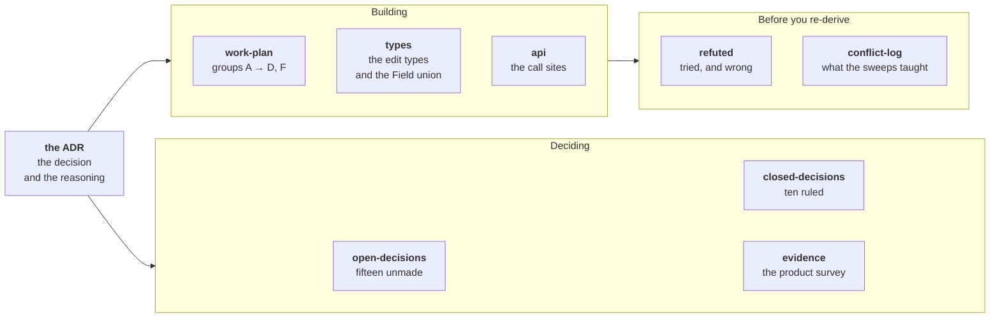

# ADR 0011 — the consumer Field redesign

A consumer's values move from `meta` to **`props`**, a Field key becomes the whole address so `FieldSource` retires, a derived value stops reaching the Document, and dates become optional on every kind.

**The decision is [`docs/adr/0011-…`](../../docs/adr/0011-consumer-values-live-in-props-and-a-derived-value-never-persists.md)** — status `proposed`, still a draft. This folder holds everything around it, one job per file.

## Read the one you need

| File | Read it when |
|---|---|
| [`open-decisions.md`](open-decisions.md) | You want what is still unmade, or you are about to answer one |
| [`closed-decisions.md`](closed-decisions.md) | You want a ruling and the evidence behind it |
| [`work-plan.md`](work-plan.md) | You are about to write code |
| [`types.md`](types.md) | You are about to write the edit types or the Field union |
| [`api.md`](api.md) | You want the call sites, before and after |
| [`evidence.md`](evidence.md) | You want the product survey the decisions cite |
| [`refuted.md`](refuted.md) | You are about to re-derive something. **Check here first** |
| [`conflict-log.md`](conflict-log.md) | You are running another sweep over these files |

## Five rules for anyone editing this folder

1. **Nothing undecided lives outside [`open-decisions.md`](open-decisions.md).** That file is the only list of what is open. A question you cannot answer gets a number there, not a paragraph where you found it.
2. **A number never moves.** A closed decision keeps its number and moves to [`closed-decisions.md`](closed-decisions.md). Do not renumber the survivors.
3. **A recommendation is not a ruling.** Do not write a recommendation's consequence into a plan file, and do not attribute one to the ADR.
4. **Delete a resolved row.** A settled disagreement kept in a log is a second, staler copy of the decision.
5. **One numbering system.** A number in ADR 0011 land is a decision number. The ADR's sections carry titles and no numbers, so *decision 8* never means *the eighth section*. Cite a section by its title.

## Where it stands

**Fifteen decisions are open: 1, 8, 9, 11, 12, 13, 16, 18, 19, 20, 21, 22, 23, 24, 25.** Ten are closed: 2, 3, 4, 5, 6, 7, 10, 14, 15, 17.

Seven of the fifteen gate the first line of code: 9, 12, 18, 19, 22, 23, 25. **9 and 12 are one decision**, **18** and **19** set the posture of a public write door, and **22**, **23** and **25** were unnumbered until 2026-09-09 — they sat as loose questions in the plan, the types and a closed ruling. See [`open-decisions.md`](open-decisions.md#what-gates-what).

Nothing in this ADR is implemented. One independent fix has landed: `mergeColumn` now spreads `sizingPairOf(…)` alone — see [`work-plan.md`](work-plan.md).

## Parked — do not design against this here

**Let the consumer decide how a value rolls up, in the Rollup callback, groups included.** Group C ships the blanket rule. A per-call Aggregator answer is a later ADR.

**Whether `rollUpKinds` is the right axis at all**, or whether a per-entry flag should carry *"do my values derive?"*. It sits beside decision 20 in [`open-decisions.md`](open-decisions.md). **Which layer stores that flag is decision 21** — core `data/`, or scheduling-plugin data the way ADR 0002 ruled for the pin flag.

## Issues

The issues this work depends on, closes, or leaves open are one table in the [ADR](../../docs/adr/0011-consumer-values-live-in-props-and-a-derived-value-never-persists.md#issues-this-adr-depends-on). It is not restated here.
