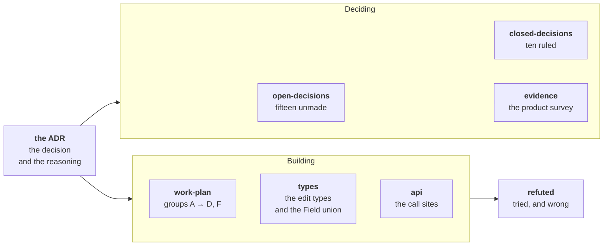

# ADR 0011 — the consumer Field redesign

A consumer's values move from `meta` to **`props`**, a Field key becomes the whole address so `FieldSource` retires, a derived value stops reaching the Document, and dates become optional on every kind.

**The decision is [`docs/adr/0011-…`](../../docs/adr/0011-consumer-values-live-in-props-and-a-derived-value-never-persists.md)** — status `proposed`, still a draft. This folder holds everything around it, one job per file.

## Read the one you need

| File | Read it when |
|---|---|
| [`open-decisions.md`](open-decisions.md) | You want what is still unmade, or you are about to answer one |
| [`closed-decisions.md`](closed-decisions.md) | You want a ruling and the evidence behind it |
| [`work-plan.md`](work-plan.md) | You are about to write code |
| [`types.md`](types.md) | You are about to write the edit types or the Field union |
| [`api.md`](api.md) | You want the call sites, before and after |
| [`evidence.md`](evidence.md) | You want the product survey the decisions cite |
| [`refuted.md`](refuted.md) | You are about to re-derive something. **Check here first** |

## Seven rules for anyone editing this folder

1. **Nothing undecided lives outside [`open-decisions.md`](open-decisions.md).** That file is the only list of what is open. A question you cannot answer gets a number there, not a paragraph where you found it. **A decision that recommends itself off the list is not open**, and neither is one whose whole body points at another decision — counting those hid how much was actually undecided.
2. **A number never moves.** A closed decision keeps its number and moves to [`closed-decisions.md`](closed-decisions.md). Do not renumber the survivors.
3. **A recommendation is not a ruling.** Do not write a recommendation's consequence into a plan file, and do not attribute one to the ADR.
4. **Delete a resolved row.** A settled disagreement kept in a log is a second, staler copy of the decision.
5. **One numbering system.** A number in ADR 0011 land is a decision number. The ADR's sections carry titles and no numbers, so *decision 8* never means *the eighth section*. Cite a section by its title.
6. **A pointer file deletes safely. A file holding findings does not.** `reviews/2026-09-09.md` held both, only its pointer half was checked, and two audit findings went with it — the `durationOf` call-site list and the `EditOf` warning. Both had to be restored rather than re-derived, and both now sit in [`refuted.md`](refuted.md) and [`work-plan.md`](work-plan.md).
7. **State a fact once.** Every file here has one job, and a fact belongs to the file whose job it is: the survey to [`evidence.md`](evidence.md), a refused approach to [`refuted.md`](refuted.md), a type to [`types.md`](types.md), a call site to [`api.md`](api.md). Elsewhere, link to it.

Four sweeps ran on 2026-09-09 against `35b3d73`, and everything they deleted is recoverable from that commit.

## Where it stands

**Fifteen decisions are open and ten are closed.** The numbers, what each one gates, and the rulings behind the closed ten are in [`open-decisions.md`](open-decisions.md) and [`closed-decisions.md`](closed-decisions.md). This file does not restate them — see rule 7.

Nothing in this ADR is implemented. One independent fix has landed: `mergeColumn` now spreads `sizingPairOf(…)` alone — see [`work-plan.md`](work-plan.md).

## Parked — do not design against this here

Two questions are recorded and neither is scheduled. **Let the consumer decide how a value rolls up, in the Rollup callback** — group C ships the blanket rule, and a per-call Aggregator answer is a later ADR. **Whether `rollUpKinds` is the right axis at all**, or whether a per-entry flag should carry *"do my values derive?"* — that sits beside decision 20, and the flag's layer is decision 21.

## Issues

The issues this work depends on, closes, or leaves open are one table in the [ADR](../../docs/adr/0011-consumer-values-live-in-props-and-a-derived-value-never-persists.md#issues-this-adr-depends-on). It is not restated here.
