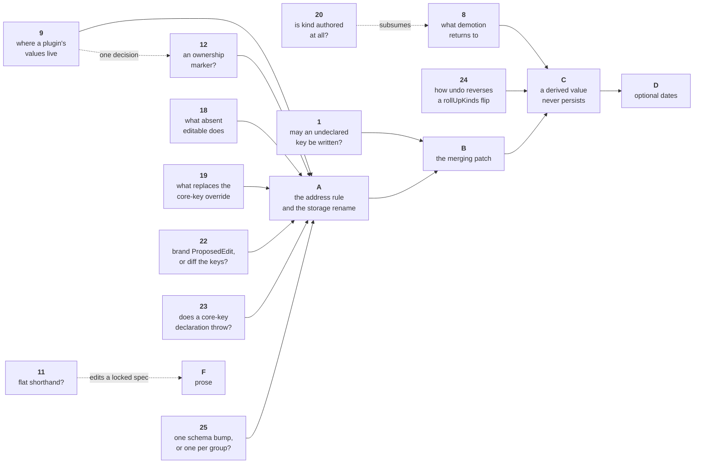

# Open decisions — ADR 0011

**This is the only list of what is open.** It merges what the ADR held open, the plan's Blocking B1–B3, the working review's D1–D7, and the questions raised against [`api.md`](api.md) on 2026-09-09. Rulings and their evidence go to [`closed-decisions.md`](closed-decisions.md) once a decision closes. The survey behind the evidence is in [`evidence.md`](evidence.md). The folder's editing rules are in [`README.md`](README.md) — a number never moves, and a recommendation is never a ruling.

**Fifteen are open: 1, 8, 9, 11, 12, 13, 16, 18, 19, 20, 21, 22, 23, 24, 25.** Ten are closed: 2, 3, 4, 5, 6, 7, 10, 14, 15, 17.

Three numbers carry an older name that other documents still use: **1** is plan Open 1, **9** is plan Blocking B1 and review D1, and **11** is review D5. Everything from 8 upward was raised on 2026-09-09.

## What gates what



**13, 16 and 21 gate no group.** 13 renames published read doors and waits on 9. 16 reshapes the extender's signature and is held open at the author's request. 21 asks which layer stores a per-entry derive-off flag; nothing schedules that flag, but the answer is cheap before release and expensive after.

**9 and 12 are one decision.** Answer them together or the answers cancel. 9's case for sharing `props` rests on `entry.props.progress` reading as a typed dot access, and 12's plugin prefix takes the dot away.

**12 gates group A, not the schema bump.** A writes the Document key. A marker decided after A is a second rename of the same files.

---

## 1. May an undeclared key travel in a `props` patch?

Settled *yes* on 2026-09-08. **Re-opened 2026-09-09** by a survey of what ships elsewhere. **Blocks group B.**

Three patterns ship, and all three are coherent.

| Pattern | Who | Behaviour |
|---|---|---|
| Atomic bag | tldraw `meta`, Excalidraw `customData`, **this library at HEAD** | Undeclared, untyped, **replaced whole**. One identity, one change event, one undo step |
| Declared fields | Bryntum, AG Grid | Per-key merge, per-key change tracking, **declaration required** |
| Namespaced bag, per-key setter | FullCalendar `extendedProps` | Undeclared keys kept and never modified. `setExtendedProp` writes **one** key. **No changeset, no diff, no undo** |

**State the claim exactly.** It is not *"nobody does per-key writes on an undeclared key"* — FullCalendar does. It never pays what we would pay, because it has no ChangeSet, no diff and no undo, so an undeclared key needs no equality rule, no row and no order. **What nobody ships is per-key merge over an undeclared space _inside a transactional store_.** Per-key merge there needs per-key identity, equality and ordering, and the declaration is where all three come from. Bryntum shows the other end: an undeclared field gets no accessor, so no tracking and no re-render.

**What it costs us.** An undeclared key has no `equals`, so a `props` value holding an object emits a ChangeSet row on **every** write, changed or not. It has no deterministic row order. And group B(c) has to stop `fieldValue` throwing `UnknownFieldError`, so a row naming an undeclared key can be read back.

**Recommendation — reuse the ADR's own rule, _records carry and patches name_.** `add()`, `new Dataset({ entries })` and `fromJSON()` **carry** an undeclared key, store it and round-trip it. `update()` **names** a key, so naming an undeclared one keeps throwing `UnknownFieldError`. An undeclared value then never changes, so undo never needs it, no `equals` is needed, row order stays deterministic, and `fieldValue` keeps its guard. Group B's three edits are not needed at all.

**The objection, and the answer.** *A namespace a consumer may fill and never change is incoherent.* They can change it — by declaring it, which is one line, `{ key: 'phase' }`. Declaring is where a consumer says *I intend to change this*, and it gives *why declare a Field?* a one-sentence answer it does not have today. The cost: `harness/planner.ts`'s `phase` gains that line.

**Two further costs, both real, neither fatal.**

*A plugin that writes a Field it has not registered fails.* Registration closes when `setup()` returns (`RegistrationClosedError`). A plugin that computes a key name later, or writes for another plugin that is not installed, has no way to declare it, and its cascade throws. Today that write succeeds. Whether that is a defect or the rule working is part of this decision.

*The type says yes where the runtime says no.* `TProps` membership and Field declaration are two different things, and the type cannot see the registry.

```ts
interface PlannerProps { owner?: string; phase?: number }   // phase is in TProps…
fields: [{ key: 'owner' }]                                  // …and declared as no Field

update('t1', { props: { phase: 3 } })   // ✅ type-checks — PropsEdit maps keyof TProps
                                        // ❌ throws UnknownFieldError — nothing declares it
```

Closing that gap needs declared-key inference from a `fields` literal, which is #267's machinery and out of scope. It is the same posture `fieldValue` already takes at HEAD. If the recommendation lands, the error message carries the fix: *"'phase' is not a declared Field, so update() cannot name it. Declare it: `{ key: 'phase' }` — or write it at ingest, where undeclared keys are kept."*

---

## 8. What does demotion return an Entry to?

**Answer before group C.** Without a target kind, demotion cannot run, and a stale `'group'` under the omission rule is a rolling-up row with no dates rather than a normal Entry that can be dated later.

Two halves are already settled. The conversion runs **both ways** and stays automatic. The dates on demotion are **absent** — a normal Entry with no dates, which can be dated later. What is open is the **target kind**.

Promotion writes one kind, `'span'` → `'group'`. Demotion has no single answer:

- Returning every childless rolling-up Entry to `'span'` overwrites the kind of a group a consumer **authored** childless.
- Remembering that *we* promoted needs a stored marker, which is a fourth thing the Document carries.
- **The third answer deletes the question: stop storing parent-ness.** That takes `'group'` out of `EntryKind`, leaves `kind` naming only what a row *is*, and re-points `rollUpKinds`.

**Decision 20 subsumes this.** The third answer is the narrow form of 20's question, *should `kind` be authored at all?* If 20 lands on *calculated*, this decision dissolves rather than being answered. Do not settle 8 before 20 unless 20 is deferred on purpose.

---

## 9. Where does a plugin's own Field value live?

**Blocks group A**, because it decides what `Dataset<TProps>` promises.

**A probe removed the argument that carried this.** The honest-generic case for a separate plugin store rested on `entry.props` being a lie the moment a plugin installs. It need not be. Probed with `tsc`, with the app author's call site unchanged and nothing hand-written by them:

```ts
// the plugin package ships this line in its own .d.ts
declare module 'freegantt' { interface PluginEntryProps { progress?: number } }

// the app author, exactly as today
const dataset = new Dataset<TaskProps>({ entries, plugins: [scheduling()] });
dataset.entries.get('t1')?.props.progress    // number | undefined — nothing hand-written
```

`Entry.props` becomes `Readonly<Partial<TProps & PluginEntryProps>>`. tldraw ships this pattern for custom shape props. Augmentation is global to the TypeScript program, so an app that installs a plugin on one Dataset sees the key typed on every Dataset. Every augmented key is optional, so it over-approximates and never claims a value is present. **A plugin type parameter on the constructor is not available** — see [`refuted.md`](refuted.md).

**The three options, as calls.**

| | Option | Cost |
|---|---|---|
| **A** | **Share `props`** | One home, so a grid edit needs no routing and a cascade writes the same `EntryEdit` as any other write. With augmentation the generic is honest |
| **B** | **An `Entry.pluginData` sibling** | Honest, but a third Entry key and a fourth Document key. It does **not** stop two plugins colliding unless it is keyed by plugin id — at which point it is C with extra steps |
| **C** | **The plugin's own store** | `plugin-store.ts` already ships `PluginStores`, `reserve<T>()` and `read<T>()`, and `PluginDocument` already serializes it. *Every* door that names a Field key must route — `entries.update`, the cell editor, the cascade, undo — and `toJSON` must learn that a leaf plugin value already lives in `PluginDocument`. Worse, `update('t1', { props: { progress: 60 } })` would type-check and write the consumer's bag while the grid reads the plugin's store. **If C is picked, `PluginFieldNotInDataError` is part of the pick, not a follow-up** |

**One recent field report runs against option A with nothing separating the writers: a shared bag with two writers and no marker gets split eventually**, and the split is a breaking rename for everyone using it. The report, with quotes, is in [`evidence.md`](evidence.md).

**What is true today, so the options are weighed against the code.** A plugin's Field values already sit in `props`, beside the consumer's. `field-registry.ts`'s `authored` excludes plugin-declared Fields from the Document on a stated premise — *"The plugin's values are not affected — those sit in `Entry.meta`, which round-trips whether the Field is declared or not."* One word changes and the guarantee does not. `PluginDocument` (D-S5-24) keeps its current job, the plugin's own non-Field rows. **This is a description of HEAD, not a ruling.**

ADR 0005 deferred a separate consumer store on the grounds that *"a consumer declaring their own key in their own `meta` has nobody to collide with"*. **With plugins installed, they do.** The registry already refuses a duplicate *declaration*. It does not refuse a *value* the consumer wrote before the plugin existed. **What sharing must gain, if it survives, is an error message that names the plugin.**

**Recommendation: A, with augmentation, and a required plugin prefix on the Field key (see 12).** The prefix is what stops A becoming the case above: one home for storage, two owners that cannot name the same key. Keep `PluginStores` for what it is good at — plugin state that is not a per-Entry Field, such as dependencies, baselines and caches. Bryntum keeps dependencies in a separate store for exactly that reason.

**Two findings against that recommendation. Neither is fatal; both have to be answered inside the pick.**

**First: 9's recommendation and 12's cancel each other.** A's whole proof is the probed call site above — `entry.props.progress`, a typed dot access. A prefixed key is not an identifier, so the read becomes `entry.props['scheduling:progress']` and the dot goes away. Every by-key call changes with it, `gridColumns` included. **So the prefix removes the reason to reject C and the reason to pick A in one stroke.** If both recommendations stand, say plainly that A is picked for its single storage home and not for the typed dot.

**Second: A was probed for reads and never for writes.** `PropsEdit<TProps>` maps `keyof TProps`, and a plugin's key is in the augmented `PluginEntryProps` instead. So `update(id, { props: { progress: 60 } })` does not type-check, and the grid cell editor writes plugin Fields on every editable declaration. A needs `PropsEdit<TProps & PluginEntryProps>` at the write door, which puts back the intersection that *one generic* was meant to remove. **Probe the write before picking A.**

---

## 11. Does *common case is a shorthand* survive for Field writes?

`plans/02:459` ships `update('t1', { start, cost })`. This ADR ships `update('t1', { start, props: { cost } })`. One sentence names two Fields; the other names one Field and a container. **This edits a locked spec either way**, so it needs an explicit ruling.

**Nobody nests at the write door**, and **FullCalendar ran the flat experiment to its end and it went wrong twice**. Both surveys are in [`evidence.md`](evidence.md).

**Read the FullCalendar lesson precisely, because it is narrower than _flat is bad_.** What broke it is an **open** top level, not flatness. **This ADR already closes that door:** `update('t1', { strat: … })` throws `UnknownFieldError`.

**It does not collide with 1's current recommendation.** 1 now recommends that `update()` throws for an undeclared key, so the typo guard *inside* `props` stays. Nesting and the declared-key shorthand are both still live. The collision returns only if 1 lands the other way — undeclared keys writable, inner guard dropped, outer guard kept — because the ADR cannot say *TProps is enough inside* and *we nest for a closed top level for the same typo reason*. **Settle 1 first only for that branch.**

**The third option: a flat shorthand for _declared_ keys only, with `props: {}` as the long form.** `update('t1', { start, cost })` is legal exactly when `cost` is declared; anything the registry does not know still throws. That keeps `plans/02`'s *common case is a shorthand*, and it is **not** FullCalendar's mistake, because the top level stays closed. **This is the option to weigh against the nesting, not the open flat form.**

**Its price, and half of what the first pass charged is not real.** FullCalendar shipped a write whose *meaning* depends on what the library knows about the key. The declared-key flat spelling keeps that shape and moves it one stage later: `update(id, { cost })` compiles always, and throws or writes depending on registry state at the moment of the call.

**The first pass charged this twice, on a false claim about the code.** It read *"`fields` is live-reconfigurable like every config key"*. **It is not.** `dataset.fields` is a read-only getter (`src/api/dataset.ts:240`), and the only two doors that add a Field — `DatasetOptions.fields` and `ctx.fields.register` — both close inside the constructor. See [the registration lock](closed-decisions.md#the-registration-lock--fields-and-plugins-are-fixed-at-construction) in [`closed-decisions.md`](closed-decisions.md).

**So the temporal half of the price is gone, and the cross-instance half survives.** `update(id, { cost })` means one thing on a given Dataset for that Dataset's whole life. It is still legal on one Dataset and a throw on another. **That surviving half does not separate the two options**, because `update(id, { props: { cost } })` throws on the same second Dataset under 1's recommendation. **Weigh the shorthand against the nesting on what is left: a top level that holds core keys and consumer keys side by side.**

---

## 12. Do consumer and plugin Field keys need a namespace marker?

**Raised 2026-09-09 by the author. Gates group A.** The question: should `{ key: 'owner' }` be `{ key: 'props.owner' }`, so the declaration says exactly where the value lives and a collision cannot happen?

**The first pass argued against it on evidence that is now withdrawn**, and its decisive objection dissolves too — both are [`refuted.md`](refuted.md) item 7.

**The real precedent is platforms that own part of a key space, and it is strong.** HTML, Kubernetes, OpenAPI and FullCalendar each split the space, and the table is in [`evidence.md`](evidence.md). Three lessons come out of it, pointing in different directions for our three writers:

- **For the consumer, a prefix buys forward compatibility.** HTML's `data-*` exists so authors avoid clashes with future versions of HTML — the hazard this ADR names when it deletes the core-key override. **HTML solved it with a prefix; SQL and CSS solved it with a reserved word list.** Both work.
- **For a third party, one shared prefix is not enough.** OpenAPI shipped a single `x-` space, vendors collided inside it, and the Initiative added a namespace registry. Kubernetes reached the same answer by rule. That is this library's plugin-versus-plugin collision, solved twice in the field.
- **A prefix that names _ownership_ costs less than one that names storage.** A consumer's `compute` Field and a consumer's stored Field then carry the same prefix, and nothing renames when a Field moves between them. What survives is smaller: a path needs escaping, and a consumer key holding the separator is ambiguous.

**Recommendation, and it is the Kubernetes shape:**

- **core keys stay bare and become a published, closed reserved list** — the SQL and CSS answer. Adding one in a later release is then a declared breaking change rather than a silent relocation.
- **consumer keys stay bare**, because both standards that split three ways leave the first-party author unprefixed. The app-author call site keeps `gridColumns: ['name', 'cost']`.
- **plugin keys carry a required prefix naming the plugin.** This half has the strongest evidence, it closed 7 at no cost, and it removes the main reason to consider a separate plugin store in 9.
- ~~`props: { start: … }` becomes an error~~ — **overruled 2026-09-09.** It is a warning, the value is ignored, and the core definition wins. See [`closed-decisions.md`](closed-decisions.md).

**Still open, and this is the ruling wanted:** may a consumer ever hold a key that shadows a core key? If **no**, the reserved list gives the same guarantee as a consumer prefix at no call-site cost. If **yes**, a bare consumer space cannot deliver it, and `props.`-prefixed consumer keys return to the table on HTML's exact reasoning.

---

## 13. `read` and `fieldValue` are one job under two names

`FieldContext.read(entry, key)` and `entries.fieldValue(id, key)` answer the same question on two surfaces. `plans/02` requires one name per concept; two names for one job is the failure #7 records. Every comparable library uses a verb here — `getValue`, `getCellValue`, `getDataValue`, `record.get`. `fieldValue` is a noun, so the call reads as a property access spelled as a call.

**There are four doors, not two.** `entry.props.k` is the stored bag. `entries.fieldValue(id, k)` resolves any Field key. `ctx.read(entry, k)` answers the same question on the plugin surface. `ctx.durationOf(entry)` answers it for one Field, by name. Widen this decision to all four before renaming anything.

**Two corrections, both checked against the code.** `durationOf` does **not** exist because `duration` owns no `Entry` key — `model/field.ts:19` declares `duration: Duration` on `CoreFieldValues` by hand, so both by-key doors are fully typed. What `durationOf` actually is, is the **implementation** of the `duration` core Field, published as a convenience beside the door it implements. One of the four doors is built out of another. Second, it answers in **two different units** depending on which builder made the context, which is [#274](https://github.com/Pawel-IT/FreeGantt/issues/274). **Settle 13 against that issue**, not against the assumption that `durationOf` earns its place.

**Recommendation: align the names across all four, and settle 9 first.** Whether the by-key doors merge or only share a name depends on whether a plugin's values need routing. Renaming a published door is not a decision to take in passing.

---

## 16. Two plugins write one field: what happens?

`edit-extension.ts:35` merges last-wins per Field key and reports nothing. Two installed plugins that both write `start` on one entry produce one value and no signal. The library raises a warning for smaller things — a dropped derived value, an unknown ingest key.

**Held open at the author's request**, together with the three ergonomic complaints beside it.

**Related, and confirmed as a defect rather than a preference.** The extension hook makes a plugin author do three things no comparable runtime asks for:

- It returns `new Map()` to say *nothing*, where ProseMirror's `appendTransaction` and CodeMirror's `transactionExtender` both return `null`.
- It brands ids by hand with `entryId('t1')`, against `plans/02`'s promise of loose input on every way in.
- It makes the author write the composition and the merge — `ctx.edits.wrap((next) => (request) => mergeEntryEdits(next(request), extender(request)))` — where CodeMirror combines returned specs itself and ProseMirror appends the returned transaction itself. **#197 exists because hand-rolled composition already lost edits once.**

**Recommendation: the runtime owns composition, merging and branding; the author returns a value or nothing.** A returned value keeps the purity story a mutable collector would blur.

```ts
extendEdits(request) {
  const moved = request.proposed.get('t1');          // plain string, no branding
  if (!moved) return;                                // nothing means nothing
  return new Map([['phase-1', { start: moved.start, props: { risk: 'high' } }]]);
}
```

**Keep the `Map`; an object keyed by Entry id is the wrong container** — [`refuted.md`](refuted.md) item 9. An array of `[id, edit]` pairs is the other safe shape, and **the three ergonomic complaints stand under either container.**

**The shape is a published plugin-author signature, so it needs a ruling.** Whether a contested write reports, and at what severity, is the other half.

---

## 18. Does an *absent* `editable` also refuse `entries.update()`?

**Raised 2026-09-09 by the `editable` ruling. Blocks group A**, where the gate moves into `data/`.

`Field.editable` is `boolean | undefined`, and `view/capability.ts:120` reads it as `field.editable === true ? WRITABLE : NOT_WRITABLE` — so absent and `false` are one answer there. The ruling says `editable: false` refuses `entries.update()`. It does not say what **absent** does, and the two answers are far apart.

**Copy the view rule.** `entries.update()` refuses unless a Field declares `editable: true`. One rule, one resolver, one answer at every door. The price is the default posture of a public door: `update(id, { props: { owner: 'Sam' } })` starts throwing for every Field that did not opt in. A data library whose write door is closed by default is a surprising shape, and `editable` was named for the *grid*, not for the API.

**The price is larger than consumer Fields, and it was measured.** Only three core Fields declare `editable: true` — `name`, `start`, `end`. Copying the view rule closes three **structural** doors that have nothing to do with a grid:

| Call | Field | Today |
|---|---|---|
| `update(id, { parentId })` — reparenting | `parentId` | no `editable`. Live at `harness/main.ts:181` and `hierarchy.ts:254` |
| `update(id, { segments: [...] })` — Segment writes | `segments` | no `editable`. #212, ADR 0010 |
| `update(id, { kind: 'milestone' })` | `kind` | no `editable` |

Keeping the view rule means declaring `editable: true` on `parentId` — a Field with **no column at all**. That is answering a grid question about something no grid shows, and it is the tell that `editable` is being asked to do two jobs.

**Decision 21 would add a fourth row, and the cleanest one.** A per-entry derive-off flag is written only through the API, and no grid will ever show it. If 21 lands on a core flag, this table gets a fourth entry that has nothing to do with a grid.

**Split absent from `false`.** Absent means *no opinion, the API may write*; `false` means *refused everywhere*. Today's writes keep working and the ruling still lands. The price is that `boolean | undefined` then carries three meanings at one door and two at another — the split the ruling just closed, moved from between the doors to inside the type.

**A third shape exists:** `editable` names the *grid's* answer and a second word names the API's. That is a new key on `Field`, so it needs its own justification against *one config tree per job*.

**No recommendation.** The first answer is the coherent one and the second is the compatible one. The choice is a posture, not a deduction.

---

## 19. What replaces `{ key: 'start', editable: false }` at the data door?

**Raised 2026-09-09 by the `editable` ruling. Blocks group A**, which deletes `CORE_FIELD_OVERRIDABLE_KEYS`.

Before the ruling, `editable` gated the grid only, so `interactions: { edit: … }` replaced the deleted capability exactly — one view-level gate for another. After the ruling `editable` is a **data-level** gate, and `interactions.edit` is a Gantt-level, view-level policy that `data/` may not import (`plans/01` §1). So the deletion removes something with nothing standing in for it: there is no way to say *`start` is not writable through the API* on this Dataset.

The deletion's own reason is unchanged and still good. A consumer key that a later release promotes to a core key relocates storage in silence, and the override is the window that lets it happen.

**Three shapes, each with a real cost.**

- **Keep the override for `editable` alone**, as `illegalCoreOverrideKey` already restricts it. Cheapest, and it keeps the silent window the deletion exists to close — narrower than the general case, because only a declaration carrying `editable` slips through.
- **A Dataset-level `readOnlyFields`**, naming keys the API refuses. A second way to say what `editable` says, which breaks *one name per concept*.
- **Accept the loss.** Core keys stay writable through `entries.update()`, and a consumer who wants them locked vetoes in `beforeChange` — already the cancelable door every mutation passes.

**Recommendation: the third, and check it first.** If `beforeChange` genuinely covers the case, 19 closes at no cost and the deletion proceeds as written. **Probe it before designing anything.**

---

## 20. Should `kind` be authored at all?

**Raised 2026-09-09 by the author, from decision 18's cost table. No recommendation — the question is being recorded, not answered.**

`kind` turned up in 18 as a core Field nothing declares editable, which put `update(id, { kind: 'milestone' })` on the list of calls that would start throwing.

**The question, in three parts.**

1. Should `kind` be a **calculated** Field rather than an authored one — derived from structure the way promotion and demotion already derive it?
2. If it is calculated, is a **milestone** then a custom column a consumer defines, rather than a built-in kind?
3. That assumes a custom column can change **the appearance of the bars on the chart**. If it cannot, that is a limit of our API, and the limit is the finding.

**Part 3's premise does not hold at HEAD, and it fails in a specific way.**

- Bar appearance is keyed by **`kind`**, not by a column. `barRenderer` takes `BarRenderer | RendererByKind`, and the renderer registry allocates one bar slot per kind (`view/renderer-registry.ts:34`, `bar:${kind}`, D-S5-12).
- A Grid column carries `cellRenderer`, which paints a **grid cell**. Nothing on a column reaches the timeline.
- So a consumer who wants a differently-drawn bar defines a **kind** and registers a renderer for it. Kinds are already open — `EntryKind` is `'span' | 'group' | 'milestone' | (string & {})` — and two plugins may each define their own and both install.

**Where it collides.** `plans/01` §2.5 rules *"`Entry.kind` is authored, never derived from having children"*, which default-on `autoGroup` already contradicts at HEAD. Decision **8**'s third answer is a narrower version of this question. If 20 is answered *calculated*, 8 dissolves. If *authored*, 8 still needs its own answer.

**This is larger than ADR 0011** and is recorded here because 18 surfaced it. It reaches `plans/01` §2.5, `EntryKind`, `rollUpKinds`, the renderer registry and the capability resolver.

**Parked beside it, from decision 6's surviving half:** whether `rollUpKinds` is the right axis at all, or whether a per-entry flag should carry *"do my values derive?"*. Two comparable products put it on the record and neither ships a kind set. Both questions ask whether structure or a stored value should decide how a row behaves. **Parked, not blocking.**

---

## 21. Which layer owns a per-entry *"do my values derive?"* flag?

**Raised 2026-09-09 by a review of a proposed `Entry.authoredValues`. Gates no group** — nothing schedules the flag. It gates the flag's design, and the answer is cheap now and expensive after release.

The flag turns the Rollup off for one Entry. That Entry's rolled-up values become authored: writable through the API, editable in the grid, written to the Document.

**The proposal put the flag on `Entry`, in `model/`, and in `CORE_FIELDS`.** ADR 0011's deferred row and [`evidence.md`](evidence.md) say the opposite — *the analogue is the per-entry pin flag, which is scheduling-plugin data (ADR 0002)*. ADR 0002 moved that flag out of the record on purpose.

**Neither placement is obviously right.**

- **Core.** The Rollup is `data/`'s own commit step, and `rollUpKinds` is a core `DatasetOptions` key. An opt-out from a core pass, gating a core config, is core data. A Gantt with no plugin installed still rolls up, and it has no way to say *stop*.
- **Plugin.** ADR 0002 pulled the pin flag out of the record because a host building a resource view paid for scheduling machinery it never used. A second per-Entry *"do not compute my dates"* flag, one layer away from the first, is the #7 failure: two concepts, near-identical names, and nothing says which.

**The two flags may be one flag. Answer that before answering the layer.** A consumer who pins an Entry and also opts it out of the Rollup holds two flags that say one thing.

**Verified against the code, and true whichever layer wins:**

- **A stored flag solves what a config cannot.** `ChangeSet.updated` is `FieldUpdated | StoreRowUpdated` (`model/change-set.ts`), and neither shape holds a config key. A flag emits an ordinary row. Decision 6's open follow-up does not arise.
- **The flip needs no new rule.** `collectTouchedIds` adds every edited id, so clearing the flag recalculates in the **same** transaction — one ChangeSet, one undo step, flag and values together. Flipping out is free, because rolled-up values already sit on the Entry (D-S4-6).
- **The Rollup skip is one predicate.** Per-Field, it sits beside `editProposesField` (`rollup.ts:196`). Whole-Entry, it sits in the kind filter (`rollup.ts:81`).
- **A leaf that carries the flag needs no warning.** `rollup.ts:184` skips a childless parent already. A warning would fire on every ordinary `remove()` of a last child, which decision 6's own reasoning refuses.
- **A core flag must be a `Field`.** `entryAfterEdit` (`fields/field-access.ts:163`) walks `CORE_FIELDS` as an allow-list, so an undeclared `Entry` key never survives an overlay. The flag then needs `editable: true` — see decision 18 — and no `column`.
- **An opt-out is not neutral about the axis.** It presupposes an opt-in, so shipping one fixes `rollUpKinds` as the base layer. If the flag is meant to **replace** the axis, the shape is a per-Entry tri-state — *derive / do not derive / follow the config* — not a boolean. That half stays in decision 20.

**Two keys, not one, whenever this ships.** `Entry.authoredValues` and `EntryDocument.authoredValues`. If decision 12 lands on a reserved list, both join it in the commit that writes the list.

**Widening the stored type later needs a schema bump.** Ship `true`, then write `['cost']` at the same schema, and a released build reads the array, tests `=== true`, and **silently re-derives the cell**. Decision 3's guard fires on the schema number alone. `readers` is a map, so the bump is one line (`serialization/read.ts`). A union-aware reader written today prevents nothing: the reader that will be wrong is the one already shipped.

**No recommendation.** The layer is a boundary question, and ADR 0002 is the document it answers to.

---

## 22. Does `ProposedEdit` carry a brand, or does an extender diff its proposed keys?

**Raised 2026-09-09. Gates group A**, which writes the `ProposedEdit` type.

**The trap, in one line.** After the rename a complete `props` and a `props` patch are the same shape, so a plugin that spreads `request.proposed.get(id)?.props` into a returned edit proposes **every** stored key by accident. The full statement, with the code, is in [`types.md`](types.md).

**Two candidate fixes, and one has to land with the type.**

- **Brand `ProposedEdit`**, so it is not assignable to the hook's return type. The compiler refuses the spread at the seam where it happens. The price is a brand on a published plugin-author type, and a plugin author who legitimately wants one key off `proposed` writes one unwrap.
- **Seed an extender's proposed keys by diffing against the pre-state**, instead of by key presence. The spread stays legal and stays harmless, because a key whose value did not change proposes nothing. The price is that a write of the same value stops being a proposal, which is a behaviour change at the hook, not only a type change.

**Do not close this after group A.** `plans/02`'s *one write shape, one knob* breaks at exactly this seam. A doc comment is not a third option: the spread reads as *keep everything and add one*, so a plugin author who never suspects a problem never looks for the comment that describes it.

---

## 23. Does a consumer *declaration* on a core key throw?

**Raised 2026-09-09 by the `props`-value ruling. Blocks group A**, which deletes `CORE_FIELD_OVERRIDABLE_KEYS` and lets the declaration fall through to `DuplicateFieldKeyError`.

The **value** case is closed: `props: { start: … }` is a **warning**, the value is ignored, and the core definition wins. See [`closed-decisions.md`](closed-decisions.md). What is open is the **declaration** — `fields: [{ key: 'start', editable: false }]`.

**The two sides are short, and they pull opposite ways.**

- **Throw.** A declaration is hand-written code, not data from an API the consumer does not own. The warning ruling's whole reason — *a column added upstream must not break their page* — does not reach a `fields` array the consumer typed themselves. A throw at construction is the earliest, clearest signal available.
- **Warn.** The ruling's posture is *warn, ignore, core wins, never break the consumer*, and one key at two doors with two answers is the split I14 exists to close. A consumer who generates their `fields` array from the same upstream schema that fed the entries is back in the data case.

**It is adjacent to decision 19**, which asks what replaces the deleted `{ key: 'start', editable: false }` at the data door. If 19 lands on *accept the loss*, this declaration has nothing left to express and a throw costs nothing. If 19 keeps the override for `editable`, this decision is already answered by it.

**Answer 19 first, then this.** No recommendation — the author asked to be asked.

---

## 24. How does undo reverse a `rollUpKinds` flip?

**Raised 2026-09-09 inside decision 6's ruling. Blocks group C**, which implements the drop at all three doors.

Decision 6 is closed: an Entry that starts rolling up **drops** its authored values and the Rollup recalculates them, at all three doors, with no error. This is the one door where that ruling does not complete.

**Why the flip is different from the other two doors.** Promotion and a `kind` write carry their cause inside the transaction — a `parentId` write, a `kind` write — so undo reverses the cause and the drops together. A `rollUpKinds` flip's cause is a **config assignment**, and `ChangeSet` has no row shape for one: `added`, `removed` and `updated` each name a store entity. So undoing that step restores the values while `rollUpKinds` still rolls them up, and the next commit that touches the subtree drops them again.

**Two ways out, and the flip needs one.**

- **The undo step reverses the config key beside the values.** This matches decision 6's own logic — undo reverses the user's action, and the action was *turn rolling-up on*. `DatasetState.setRollUpKinds:289-293` swaps two references today, so the transaction is work this ruling already gives itself. The price is a `ChangeSet` that carries something that is not a store entity, or an undo step that holds a side effect the ChangeSet does not describe.
- **The flip's drops stay out of history, and `rollUpKinds`'s own documentation says so.** Cheapest, and honest as long as it is written down. The price is one config key whose edits are not undoable, against `plans/02`'s posture that every mutation is one transaction.

**Decision 21 would close this at no cost, and that is worth weighing before either option.** A stored per-entry derive-off flag emits an ordinary Field row, so undo reverses the flag and the values in one step and this decision does not arise. 21 gates no group, so it can be answered here or ignored here.

---

## 25. One schema bump, or one per group?

**Raised 2026-09-09 by the work plan. Blocks group A**, which writes the first Document change. **The cheapest of the fifteen to answer**, and it is a review question, not a compatibility one.

Four file changes land across three groups: `meta` → `props` and `source` leaving `SerializedField` in A, rolling-up keys omitted in C, `start`/`end` optional in D.

**Bump once, at the end of D.** One version number spent, and no green commit between A and D writes a file at a number no reader claims. This is what the draft assumed, and the ADR's Consequences line reads as though it were settled.

**Bump per group.** The branch becomes reviewable. A renames about 101 references and 184 occurrences, and D makes dates optional across bar geometry, the Segment invariant, the sort comparators and `fitDataset`. A reader cannot check either against a running build if the whole branch is one commit. Decision 3 already ruled that the numbering **restarts at `1` on release**, and readers 1–4 are deleted, so nothing outside this repo's fixtures was written by them: **a version number costs nothing to spend before release.** The end state is then `schema: 7`, not `5`, and the ADR's line names the count of changes rather than the count of bumps.

**One constraint, whichever way it lands.** Bump per group **only if group A carries the nested ingest too** — see A's second bullet in [`work-plan.md`](work-plan.md). Without it the "reviewable" A commit is green and silently lossy, and a reviewable commit that drops every consumer Field write is worse than no intermediate commit at all.

**Recommendation: per group, with A carrying the nested ingest.** The risk here is review, not compatibility, and decision 3 already priced the numbers at zero.
