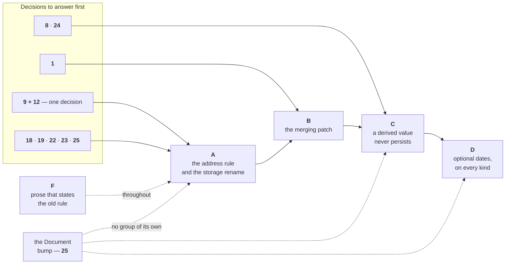

# Work plan — ADR 0011

**Governing:** [ADR 0011](../../docs/adr/0011-consumer-values-live-in-props-and-a-derived-value-never-persists.md). Open decisions are in [`open-decisions.md`](open-decisions.md) and nowhere else. Check [`refuted.md`](refuted.md) before you re-derive anything.

**Nothing here is undecided.** Every question this plan raised now carries a number and lives in [`open-decisions.md`](open-decisions.md) — the schema-bump timing is 25, the core-key declaration is 23. Where an older line in this folder disagreed with the ADR, the ADR won — see [`conflict-log.md`](conflict-log.md).

## Order, and what gates it



**Group E is dissolved.** Each Document change lands in the group that causes it.

**When the schema bumps is decision 25**, and it is weighed in [`open-decisions.md`](open-decisions.md), not here. Bumping once at the end of D spends one version number; bumping per group buys a reviewable branch and ends higher than `5`. **One constraint binds this plan either way:** bump per group only if A carries the nested ingest too — see A's second bullet — otherwise the "reviewable" A commit is green and silently lossy.

`pnpm verify:full` runs green before the PR merges, either way.

## Done first — 2026-09-09

`mergeColumn` now spreads `sizingPairOf(…)` — the `width`/`flex` pair alone — instead of the whole type-bundle column. Four test rows in `field-registry.test.ts`. `verify:full PASS — all 16 checks green, test:e2e included`. Independent of the ADR; cherry-picks to `main`.

## A. The address rule, and the storage rename

The key decides the home, so no declaration carries one.

- `Entry.meta` → `Entry.props`, non-optional, filled `{}` at ingest. `Entry.props: Readonly<Partial<TProps>>`. Input and Document keep `props?`.
- **A must move the nested ingest with the public shape, or A alone drops every consumer Field write in silence.** `writeDeclaredMetaFields` (`data/fields/field-access.ts:141-155`) finds a consumer Field value on an edit today, and it walks the edit's **top level**:
  ```ts
  for (const key of Object.keys(edit)) {
    const field = registry.get(key);
    if (!field || !storesInMeta(field)) continue;
    next = writeField(next, overlay, field, edit[key]);
  }
  ```
  Today `update({ cost: 500 })` is flat, so `cost` is found there. After A the only top-level key is `props`, and A **deletes** the `props` core Field — so `registry.get('props')` misses, `continue` fires, and the value is never written. No error, no ChangeSet row. The nested read is group B's `toProposedEdit`. **This is the constraint on splitting A from B.**
- Write the edit types from [`types.md`](types.md). Do **not** write `Partial` on either half, and do **not** factor them into one shared mapped type. Seven type tests.
- **`StoredEdit` → `ProposedEdit`, with serena.** About 184 occurrences. `ProposedEdits`, `toProposedEdit`/`toProposedEdits` and `EditReading.proposed` follow. Lands in A because A already renames the type's own field. Write `ProposedEdit`'s **type** too — `props` is required on it — and decide the branding trap in [`types.md`](types.md) at the same time.
- Public plugin generics lose the second type parameter: `DatasetPlugin`, `DatasetPluginContext`, `DatasetOptions`, `Dataset.fromJSON`.
- `change-set.ts`'s `fieldsWrittenBy` still skips `'meta'`. `isOptionalEntryKey` still names it. Both follow the rename.
- Delete `#mergeCoreFieldOverride`, `#consumerOverriddenCoreKeys`, `CORE_FIELD_OVERRIDABLE_KEYS`, `illegalCoreOverrideKey`. **Answer decision 19 first** — the deletion removes a data-level capability that `interactions.edit` cannot replace. What a consumer declaration on a core key then does — throw `DuplicateFieldKeyError`, or warn the way a `props` **value** does — is **decision 23**. Delete the override; write neither answer until 23 closes.
- **One write resolver in `data/`, and every door calls it. A builds the resolver and fills two of its three arms.** The three rules are *does this Field exist*, *is it editable*, *is it derived here*. A answers the first two: `entries.update()` refuses an uneditable write (`FieldNotEditableError`) and an undeclared one (`UnknownFieldError`), and `view/capability.ts` calls the resolver instead of restating the rule. **The derived arm is group C's, not A's** — the refusal is written against the merged patch, which group B builds. A leaves the arm unwired and C fills it. See ordering constraint 3.
- **Four answers, seven call sites**, and the ADR's flowchart groups them by answer. The call list is the seven: `entries.update()`, the cell editor, a bar drag, `entries.add()`, `Dataset.fromJSON()`, `new Dataset({ entries })`, the extension hook. **Do not build the list from the four boxes** — that skips `add()`, `fromJSON()` and the constructor, which drop rather than throw. **Do not write the test twice.**
- **Two merges shallow-spread, not one. Fix both together or plugin composition breaks in production.**
  - `data/edit-extension.ts:38` — `mergeEntryEdits`, the loose one a plugin author calls. With consumer keys inside `props`, two extenders writing different `props` keys lose one: #197 one level down, against that function's own stated promise (#238).
  - `data/fields/field-access.ts:49` — `mergeStoredEdits`, which the **commit path** uses to fold body + cascade + hierarchy. `{ ...base, ...extra }` has the identical hole, and here it breaks a contract written directly above it: *"`extra` wins per Field key; the proposed keys of both survive."* That is true today only because a top-level key **is** a Field key. Once `props` is one key holding many, `extra` wins per **namespace**, so a body write of `props.cost` beside a cascade write of `props.progress` loses `cost` — while `proposedKeys` still names it, so the ChangeSet emits a row carrying a stale value. **A wrong row is worse than a dropped write**, and only this one is reachable without a second plugin installed.
- Two ingest warnings, one `Object.keys(input)` walk per Entry against `CORE_FIELDS` plus `'props'`: an unknown top-level key, and a key inside `props` that names a core key.
- Delete `FieldSource` and all three arms, `Field.source`, `SerializedField.source`, `source-strategy.ts`, `normalize-source.ts`, `metaRecord` / `metaKey` / `metaSlot`, `DuplicateFieldSourceError`, `InvalidFieldSourceError`.
- Delete the `meta` core Field with **no successor**.
- `CoreFieldKey = keyof Omit<Entry, 'id' | 'props'>`, and `CoreFieldValues` omits `'props'` with it. The registry refuses `{ key: 'props' }` — the **one** reserved key.
- `'compute' in field` replaces `computeStrategy.serialize()` in `encodeFieldDocument`. **Follow the mechanism before deleting it:** `writeStoredSource` calls `computeStrategy.serialize()`, which answers `undefined`, and `encodeDeclaredField` drops the row. Delete the table and that test goes with it.
- **Every new error is a named `FreeGanttError` with a `code:` and a `plans/02` §7 row**, like every other: `DerivedFieldNotWritableError`, `ComputedFieldCannotBeWrittenError`, `FieldNotEditableError`.
- `view/capability.ts`'s `hasSomewhereToWrite` becomes `!('compute' in field)`.
- One generic. `harness/planner.ts:31` currently writes two that disagree about `critical`.
- Rename fixture types: `PlannerMeta` → `PlannerEntryProps`, `DemoMeta` → `DemoEntryProps`.
- The registry's `authored` comment states plugin values sit in `Entry.meta`. One word changes unless decision 9 lands on the plugin store, which deletes the sentence.
- **Not group A's:** the `harness/main.ts:89` double cast. Declare `window.__dataset` as the bare `Dataset` first, independently — see [`refuted.md`](refuted.md).

## B. The merging patch

Written in the new names: `toProposedEdit`, `ProposedEdit`.

- `toProposedEdit` merges the `props` patch onto the Entry's own record, so a `ProposedEdit` always carries a **complete** `props`. The merge belongs on the read side, not the apply side.
- `entryAfterEdit` merges `props` rather than replacing it.
- An explicit `undefined` inside a patch clears that one key.
- `diffEdit` emits one row per Field key, never a path into `props`.

**Decision 1 gates the rest of this group.** If an undeclared key may travel in a patch, three edits ship together or the write is silent — no ChangeSet row, no undo, no subscriber:

- **a.** Seed `proposedKeys` from inside `props`, not only from top-level keys.
- **b.** `diffEdit` keeps the registry walk for row order, then drains undeclared keys in the proposed set.
- **c.** `entries.fieldValue` and `ctx.read` answer `entry.props[key]` for an undeclared key — `undefined` if nothing holds it.

If decision 1 lands as the ADR recommends — `update()` throws, ingest still carries — **skip a–c**. `UnknownFieldError` stays on the top level of an edit either way.

## C. A derived value never persists

One structural question at every door: *is this a rolling-up kind, and is this a rolling-up Field?* I14 is the **write** half. `toJSON` is not a write.

**C fills the resolver's third arm.** Group A built the resolver and wired *exists* and *editable*; the derived arm lands here, because it is written against the merged patch group B produces. `DerivedFieldNotWritableError` is A's error to declare and C's to throw.

| Door | Answer | State |
|---|---|---|
| cell editor, bar drag | refused | already true (`view/capability.ts:119`) |
| `entries.update()` | refused | **the change** — move `rollsUp` into `data/` |
| `entries.add()`, `new Dataset({ entries })`, `fromJSON` | value **dropped**, report raised | **the change** |
| the extension hook | write **dropped**, warning raised | decision 5, closed — exempt from the throw only |
| autoGroup promotion | dates change owner mid-commit | **unowned until now** |
| `toJSON` | key **omitted** | **the change** |

- Promotion is the third door into a rolling-up kind. Conversion **promotes and demotes**, and stays automatic. What kind demotion returns to is **decision 8** — answer before this group. Dates on demotion are settled: a **normal Entry with no dates**, datable later.
- The report goes through `raiseError` at `severity: 'warning'`, **always**. Not `isDevMode()`-gated (D-S5-41).
- One report per operation, not per value.
- Delete `reportCorrectedRollUps`.
- On a rolling-up parent, an Aggregator's `undefined` means **no value**.
- **Unify the proposed-Field predicate before deleting the `body`/`merged` split** — decision 5's one code fix, see [`refuted.md`](refuted.md) item 8.

## D. Optional dates, on every kind

**An Entry has dates if and only if it holds at least one Segment**, and `start`/`end` are always the envelope.

- `add({ start, end })` mints one Segment. `add({ segments })` with no dates derives the envelope. `add({})` stores no dates and no Segments.
- `update(id, { start: undefined, end: undefined })` is the un-date verb; it clears the Segments.
- Two refusals stay: one date without the other, and `segments: []` (`EmptySegmentsError`).
- `start` and `end` join `isOptionalEntryKey`. Serialization and `entry-reader.ts` each gain a `length === 0` arm.
- Delete the `referenceDate` fill (`entry-reader.ts:168-172`). Written down under D-S2-10 **and** D-S2-22. Not under D-S5-46, which survives.
- Reaches bar geometry, the Segment invariant (#212), sort comparators, and `range: 'fitDataset'`.
- A dateless Entry sorts **last**. A dateless row is inert to a gesture. `fitDataset` over nothing dated shows the empty-dataset range. An S7 link to a dateless endpoint raises a diagnostic and draws nothing.

**`FieldContext.durationOf` returns `Duration | undefined`.** It is **plugin-author surface**, so it is a published change, and it reaches further than the signature. **This list is an audit's, not a re-derivation — do not rebuild it.**

| Site | What changes |
|---|---|
| `field-access.ts:92` | **The canonical implementation, and the guard goes here first.** Unguarded it yields `NaN`, not a throw — see [`refuted.md`](refuted.md) item 10 |
| `core-fields.ts:118` | The shipped **`duration` core Field** reads `ctx.durationOf(entry)` in its `compute` arm, so the column answers `undefined` on a dateless row. The cell is **blank** — `formatDuration` answers `''` for `undefined` (`core-fields.ts:44-45`). **Assert the blank cell.** Do not invent an em dash or a placeholder |
| `aggregators.ts:14` | `durationMs`, behind `weightedMeanByDuration` at `:51` — skips a dateless child rather than weighting it at zero |
| `inline-editing.ts:113` | **A provider, not a caller.** `fieldContextFor` builds a `FieldContext` and supplies its own `durationOf`. It changes as an implementation |
| `etc/freegantt.api.md` | The API report gates on I11, so the signature lands there or CI fails |
| four test stubs | `layout/rows/filter.test.ts`, `layout/rows/sort.test.ts`, `data/fields/field-types.test.ts`, `data/fields/field-access.test.ts` build a `FieldContext` by hand |

## Document — schema 5

Not a work group. Four file changes, each landing in the group that causes it: `meta` → `props`, `source` leaves `SerializedField`, `start`/`end` optional, rolling-up keys omitted.

- Readers 1–4 are deleted. Nothing outside this repo's fixtures was written by them.
- Unknown key inside `props` is passenger data and is kept. Unknown top-level key stays unknown.
- **`props` is carried by reference, except on a rolling-up parent.** Bend D-S2-12 in that one place, and say so where D-S2-12 is written.
- Key order: core keys in their fixed order, `props` last; inside `props`, the consumer's own order.
- `toJSON → fromJSON → toJSON` is stable. Byte-identical round-trip of the *input* is not, for a rolling-up parent.

## F. Prose that states the old rule

Group F may edit locked specs (`plans/00`–`02`, `CLAUDE.md`, `CONTEXT.md`). `protect-spec.sh` asks for permission. **Confirm before this group runs.**

| File | What it says |
|---|---|
| `CLAUDE.md:33` | "`meta` is the consumer's namespace in the document" |
| `CLAUDE.md:60` | "an `entry`- or `meta`-sourced field has a stored home, so its aggregate is stored, undoable and serialized" |
| `CONTEXT.md:16` | "anything of the consumer's goes in `meta`" |
| `CONTEXT.md:64` | Field entry — `meta` listed as a Field, "no reach into `entry.meta`" |
| `CONTEXT.md:72` | the whole **Field source** glossary entry — deleted; one entry for `entry.props` is owed. `props` collides with no layer name, so no disambiguation rule is owed |
| `CONTEXT.md:127` | names `DataEdit` and its `data` key from this ADR — both renamed (`PropsEdit`, `props`) |
| `plans/01:273-281` | the `FieldSource` type and its default |
| `plans/01:330` | "Source decides stored or computed" |
| `plans/01` §2.5 | the promote-only / flickering-identity clause, overruled by the both-ways conversion |
| `plans/02` §2.6 | the same source rule; `:454` reads *"Source decides what happens to a parent's aggregate"* |
| `plans/02:738` | "anything of yours goes in `meta` and survives byte for byte" — the rule survives, the word does not |
| `plans/02:749` | `DuplicateFieldSourceError` / `InvalidFieldSourceError` leave; `DerivedFieldNotWritableError` / `ComputedFieldCannotBeWrittenError` / `FieldNotEditableError` arrive. No `RollUpKindsWouldDropValuesError` — decision 6 closed as *drop and recalculate*. `PluginFieldNotInDataError` only if decision 9 lands on the store. `EmptySegmentsError` already ships |
| `plans/02` §"common case is a shorthand" | `update('t1', { start, cost })` stops compiling unless decision 11 keeps a declared-key flat spelling |
| `plans/02` Document section | a Document is our **save format**, not an interchange format |
| `plans/02` type rows | `PropsEdit<TProps>` and `EntryEdit<TProps>` are public |
| `plans/s2-data-core/s2.6-serialization.md:76` | consumer rule in the old word |
| `plans/s2-data-core/README.md` | D-S2-22's precedence clause; D-S2-10 / D-S2-22 `referenceDate` fill; D-S2-7's `meta` carve-out |
| `plans/s4-hierarchy-and-rows/README.md` | D-S4-35 / Q17, and the whole-`meta` write row |
| `plans/s4-hierarchy-and-rows/s4.1-field-registry.md` | D-S4-2's adapter |
| `plans/02-01-API-Redo.md` | already opens with *"This review is a stale."* Say **superseded by ADR 0011** in the same line |
| ADR 0005 | its `meta` rulings, superseded if this is accepted |

## Ordering constraints

1. **`mergeColumn` first.** Done.
2. **The `compute` + `rollUp` registry refusal lands before [#213](https://github.com/Pawel-IT/FreeGantt/issues/213)'s own fix.**
3. **Group B before group C.** The derived refusal at `entries.update()` is written against the merged patch, which is why the resolver's derived arm is C's and not A's.
4. **Group D before [#242](https://github.com/Pawel-IT/FreeGantt/issues/242).**
5. **Decisions 9 and 12 are answered together, before group A.** Not questions an implementer may answer in passing.
6. **Decisions 18 and 19 before group A.** 18 sets the default posture of `entries.update()`. 19 replaces the deleted core-key gate.
7. **Decisions 22, 23 and 25 before group A.** 22 shapes the `ProposedEdit` type A writes. 23 decides what a core-key declaration does once A deletes the override. 25 decides whether A bumps the schema. **19 before 23** — if 19 keeps the override for `editable`, 23 is already answered.
8. **Decision 8 before group C.**
9. **Decision 24 before or with group C**, which implements decision 6's drop at all three doors. 24 is the third door's undo, and decision 21 would close it for free.
10. **[#270](https://github.com/Pawel-IT/FreeGantt/issues/270) before or with group C.**
11. **Unify the proposed-Field predicate before group C deletes the `body`/`merged` split.**

## Gate

The prose sweep is mechanical. **Keep the F table** — it tells a reader what changed. The grep only proves nothing was missed.

Scope it to the live surface. ADR 0006 rules that an ADR is superseded, never edited, so history keeps the old word.

**Two greps, two groups.** Group A renames the code; group F rewrites the prose, and F cannot run before the author confirms it. One grep over both would fail group A's gate on locked specs A is not allowed to touch.

**Group A's gate — code only.** Returns **423** at HEAD, and must return **0** when A lands.

```
grep -rn '\bmeta\b\|FieldSource\|source: {' src/ harness/ | grep -v 'import\.meta'
```

**Group F's gate — the locked specs.** Returns **33** at HEAD, and must return **0** when F lands. Live spec is `plans/00`–`04` only.

```
grep -rn '\bmeta\b\|FieldSource\|source: {' CONTEXT.md CLAUDE.md \
  plans/00-overview.md plans/01-domain-architecture.md plans/02-public-api.md \
  | grep -v 'import\.meta'
```

Per file at HEAD: `plans/02` 15, `plans/01` 13, `CONTEXT.md` 4, `CLAUDE.md` 2, `plans/00` 0.

`pnpm verify:full`, and its **last line** is the answer. Capture it with a redirect, never a pipe: `pnpm verify:full > /tmp/v.log 2>&1; tail -3 /tmp/v.log`.

Review `harness/main.ts` and `harness/planner.ts` on every commit here, changed or not.

## Naming already landed

`9c3f704` renamed the conversion family. Write against: `toStoredEdit` / `toStoredEdits`, `toEditReading` / `toEditsReading`, `toEntry` / `toEntries`, `fromDocument`, `toDocument`, `entryAfterEdit`, `extraEditsReadingFor`.

**Still owed in group A:** `StoredEdit` → `ProposedEdit`, `toStoredEdit` → `toProposedEdit`. Until A lands, today's code still reads `toStoredEdit`.

**Two Document doors, two levels.** Public: `dataset.toJSON()` / `Dataset.fromJSON()`. Internal: `toDocument` / `fromDocument`. This plan names the function it changes; the ADR names the door a consumer calls.
