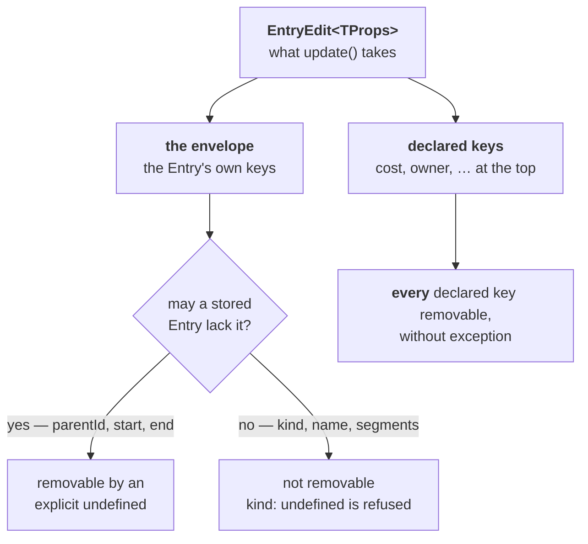

# Types after ADR 0011

**Governing:** [ADR 0011](../../../docs/adr/0011-consumer-values-live-in-props.md). Read this file before you write the edit types or the Field union. Approaches already tried and refused are in [`refuted.md`](../shared/refuted.md).

Nothing here is implemented.

## The two edit halves take opposite rules



**This file is 0011's types.** [0013](../0013-what-decides-derivation/README.md) decision 26 then **deletes `kind`**, so `{ kind: undefined }` leaves the refused set with that ADR. The seven type tests land here with `kind` still present.

**Decision 11, closed 2026-09-10. Grill 2026-09-10 extends it to `add()`.** `update()` and `add()` are flat. There is no `props` key on `EntryEdit`. `PropsEdit` still exists: a complete `ProposedEdit`, and constructor `entries` (passengers only — Q15). Constructor records also accept declared keys at the top. There is no Document.

**Do not factor the two halves into one shared mapped type.** They take opposite rules, so there is nothing to extract. It was tried twice — see [`refuted.md`](../shared/refuted.md).

## `PropsEdit` — every key is removable

```ts
/** A patch of `props`: every key optional, and every key removable by an explicit `undefined`.
 *  There is no protected key, because `props` is `Partial<TProps>` at every storage door — a key
 *  `TProps` marks required is still a key the stored record may not hold. */
export type PropsEdit<TProps> = { [K in keyof TProps]?: TProps[K] | undefined };
```

**`Partial<TProps>` cannot be this type.** Under `exactOptionalPropertyTypes` a `Partial` property accepts an absent key and refuses an explicit `undefined` (`TS2375`), so `Partial` deletes the remove verb.

**Every key of `props` is removable, without exception**, because the storage door already says so. `props` is `Partial<TProps>` everywhere, so *no* key of `TProps` is one the stored record must hold. A type that protected a required key would refuse a write into a state `add({ id, name })` reaches on its own — the same key, two doors, two answers.

**The name is `PropsEdit`, not `PropsPatch`.** This type sits on the object an app author writes, and `*Patch` names a pipeline step (`plans/02`). **It is exported**, because a consumer who factors a helper over a props edit otherwise reaches for `Partial<TProps>` — the one type that cannot say *remove*.

## `EntryEdit` — an edit removes exactly what a stored Entry may lack

```ts
type EntryEnvelope<TProps> = Omit<EntryInput<TProps>, 'id' | 'props'>;

/** **An edit may remove exactly what a stored Entry may lack.** Derived from `Entry`, never
 *  hand-listed: `EntryInput`'s optionality answers a different question — `kind` and `segments`
 *  are optional there only because ingest fills them, and a stored Entry always holds both. */
type OptionalKeysOf<T> = { [K in keyof T]-?: {} extends Pick<T, K> ? K : never }[keyof T];
type RemovableEntryKey = OptionalKeysOf<Entry> & keyof EntryEnvelope<unknown>;

export type EntryEdit<TProps> = {
  [K in keyof EntryEnvelope<TProps>]?: K extends RemovableEntryKey
    ? EntryEnvelope<TProps>[K] | undefined
    : EntryEnvelope<TProps>[K];
} & { [K in keyof TProps]?: TProps[K] | undefined };
```

**Decision 11, closed 2026-09-10.** Declared consumer keys sit on the envelope, not under `props`. `update(id, { start, cost })` is the write. `update(id, { props: { cost } })` is not an `EntryEdit`. `PropsEdit<TProps>` stays exported for constructor ingest and `ProposedEdit`. `add()` is flat and refuses nested `props:`.

**`Partial<Omit<EntryInput, 'id' | 'props'>>` cannot be the envelope.** `start` and `end` are optional after [ADR 0012](../0012-optional-dates/README.md), which lands first, so `update(id, { start: undefined, end: undefined })` is the un-date verb, and `Partial` refuses that call (`TS2379`) for the identical reason it refuses a removal inside `props`. Mapping *every* envelope key removable is wrong in the other direction: **optional at ingest does not mean removable by an edit.** `kind` is optional on `EntryInput` only because ingest defaults it to `'span'`. [0013](../0013-what-decides-derivation/README.md) decision 26 then **deletes the Field**. These tests land in 0011 with `kind` still present; 0013 removes `{ kind: undefined }` from the refused set because the key is gone.

**Deriving `RemovableEntryKey` is the point, not a trick.** The derivation states the rule a hand-written union only *encodes*, and it is self-maintaining: the moment `Entry.end` stops being optional, or a new optional key joins `Entry`, the edit type follows. This ADR already got the hand-written list wrong once.

**This ADR lands after [ADR 0012](../0012-optional-dates/README.md).** At HEAD `start` and `end` are required, so `RemovableEntryKey` resolves to `'parentId' | 'meta'`. After 0012 it resolves to `'parentId' | 'start' | 'end'`. The un-date verb is 0012's; `EntryEdit` follows `Entry`, so `{ start: undefined }` **must compile** in this ADR's type tests. Do not skip them. The old A-then-D warning — *inert until D, three groups in between* — is stale.

**`id` leaves the edit:** an edit names its Entry at the call, never inside the patch.

**`segments: undefined` is refused as a write of an empty list.** Un-dating is `{ start: undefined, end: undefined }`, which [0012](../0012-optional-dates/README.md) already lands. After 0012 an Entry may lack Segments; the missing key is dateless, not `segments: []`.

**Seven type tests, and each half is one.** These compile: `{ start: undefined }`, `{ parentId: undefined }`, `{ owner: undefined }` — the last with `owner` **required** on `TProps`. These do not: `{ kind: undefined }`, `{ name: undefined }`, `{ segments: undefined }`, `{ props: { owner: 'Sam' } }`.

**`PropsEdit` is exported. `EntryEnvelope` and `RemovableEntryKey` are not.**

## `ProposedEdit` — write its type, do not only rename it

`model/entry.ts:108` ships `StoredEdit = Partial<Omit<Entry, 'id'>> & { proposedKeys? }`. After the rename `proposed.props` would read `Partial<TProps> | undefined` — an absent value that never happens, because `toProposedEdit` builds a complete record. **`props` is required on a `ProposedEdit`.**

**The rename costs an enforcement, at the seam that matters most.** `model/entry.ts:98` states today's rule: *"Every `StoredEdit` is a legal `EntryEdit` — an `Instant` is an `InstantInput` — and the reverse is not. That asymmetry is the enforcement."* It holds because `Instant` and `InstantInput` are different types. **At the `props` key it stops holding:** a complete record and a patch are structurally the same shape, so *complete against patch* becomes prose.

**The footgun is concrete, it sits on the plugin-author surface, and a comment will not hold it.** A plugin reads a complete `props` off `request.proposed` and spreads it into a returned edit — the natural spelling, since that is the object it was handed:

```ts
return new Map([[id, { props: { ...request.proposed.get(id)?.props, risk: 'high' } }]]);
```

The spread is legal, reads as *keep everything and add one*, and turns **every** stored key into a proposed key — so every `props` key gets a ChangeSet row, derived cells included. That is decision 5's territory reached by accident, by a plugin author who never read it. **The patch already merges, so the spread is never needed, and nothing in the types says so.**

**Decision 22, closed 2026-09-10. Brand the whole `ProposedEdit`.** It is not assignable to `EntryEdit`. The spread above is a type error. `PropsEdit` carries no `__brand`. A plugin author who wants one key off `proposed` writes one unwrap. Diffing proposed keys against the pre-state lost: a write of the same value would stop being a proposal. [0014](../0014-plugin-author-surface/README.md) decision 16 closed against this type.

```ts
export type ProposedEdit<TProps> = {
  readonly __brand: 'ProposedEdit';
  readonly props: Readonly<Partial<TProps>>;
  readonly proposedKeys: ReadonlySet<string>;
  // …envelope keys, complete
};
```

## The Field union

```ts
type Field<TValue = unknown> =
  | { key: FieldKey; type?: FieldTypeName; rollUp?: AggregatorName; editable?: boolean;
      compute?: never; /* equals, compare, formatValue, parseValue, inputType, column */ }
  | { key: FieldKey; compute(entry: Entry, ctx: FieldContext): TValue | undefined;
      rollUp?: never; editable?: never; /* compare, formatValue, column */ };
```

**`editable` on the stored arm is [0015](../0015-write-door/README.md)'s.** Decision 18 closed: the stored Field holds `'never' | 'api' | 'anywhere'`; `boolean` is input-only. This ADR's type tests may keep `boolean` until 0015 lands.

**The union is a declaration-site aid, not the enforcement.** `FieldRegistry`, `DatasetOptions.fields` and `FieldLookup` all hold bare `Field`, so excess-property checking fires only where a literal is written. `FieldRegistry` throws `ComputedFieldCannotBeWrittenError` for `compute` beside `rollUp` or `editable`, the same way it already throws `UnknownAggregatorError`.

**`TValue` is a declaration-site aid too, and nothing reads it back.** Those same three holders take bare `Field`, so `read(id, 'ref')` answers `unknown` for a `compute` Field, whatever its arm returned. The parameter checks the function a consumer writes; it does not type the value a consumer reads. **The erasure at the registry is the cause, and it is not a limit of the read door** — a key `TProps` declares types through `FieldValue<TProps, K>` without the registry taking part. Closing the gap is a Field-aware renderer read, which is [#267](https://github.com/Pawel-IT/FreeGantt/issues/267).

## `CoreFieldKey` and `CoreFieldValues` move together

```ts
CoreFieldKey = keyof Omit<Entry, 'id' | 'props'>
```

`CoreFieldValues` (`model/field.ts:19`) is `Omit<Entry, 'id'>`, and `FieldValue` resolves its first arm against it. **Both omit `'props'`, or neither does.** Change one and not the other, and `read(id, 'props')` **types as the whole bag** while the runtime throws. `CoreFieldValues` is public at `api/index.ts:57`.

The registry refuses `{ key: 'props' }` at **runtime**. It cannot be a type error without closing `FieldKey` into a union and refusing consumer strings, which flattens the brand.
