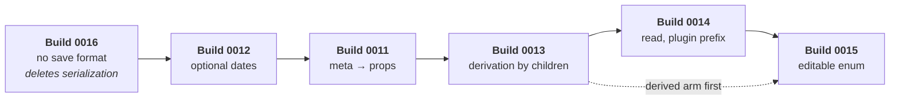

# BUILD-SPEC — the field redesign, ADRs 0016 → 0012 → 0011 → 0013 → 0014 → 0015

**Read this before you write code for the field redesign.** Every decision is closed. No line is built. This file holds the verification of the claims, the five builds in landing order, the target state, the issues, and the checklist.

**This file plans. It does not rule.** Where an ADR already ruled, this file cites the ADR. Where the working notes disagree with `src/`, section 1 says so and gives a resolution. Where the resolution needs the author, section 1 marks it **BLOCKED — author**.

> ## ADR 0016 lands first, and it makes every build after it smaller
>
> **[ADR 0016 — the library holds no save format](../../docs/adr/0016-the-library-holds-no-save-format.md), opened 2026-09-10.** It deletes `toJSON`, `fromJSON`, the Document types and `data/serialization/` entire. It is `proposed`, like the other five.
>
> **There is no schema counter, and no build spends a number.** This file is revised for that, on 2026-09-10. §1 V13 keeps the superseded ruling, as the record of a question asked twice.
>
> **One closed question re-opened, and closed again the same day.** `props` stands. ADR 0016 removed two of ADR 0011's four charges against flat consumer keys on the Entry; the two that survive never mentioned serialization, and they carry the decision on their own. **Ruled by the author, 2026-09-10.** See §1 V21.

| Where a builder goes | File |
|---|---|
| Why a decision was taken | `docs/adr/0011`–`0015` |
| The working material behind one decision | `plans/field-redesign/00xx-*/README.md` |
| Already refused — do not re-derive | [`shared/refuted.md`](shared/refuted.md) |
| ~~The schema counter~~ — dissolved by ADR 0016 | [`shared/rulings.md`](shared/rulings.md#3--the-schema-restarts-release-gate) |
| The spike gate and the prose-sweep changelog | [`shared/prose-sweep.md`](shared/prose-sweep.md) |
| What is still owed at close-out | [`CLOSE-OUT.md`](CLOSE-OUT.md) |

---

# 1 — Verification report

## 1.1 What was checked

Every load-bearing line reference, symbol name, count and gate that this file carries into sections 2–5 was opened in the file it names. The greps below were run at `58dd99e` on `adr-0011-field-redesign`.

**Claims that hold, checked one by one.** Do not re-check these.

| Claim | File | Result |
|---|---|---|
| `libraryWriteRule` holds the editable and derived arms in one function | `src/view/capability.ts:114-121` | **Holds.** `:119` reads `isRollUpKind(entry.kind) && rollsUp(field)`; `:120` reads `field.editable === true` |
| `rollsUp` already lives in `data/` | `src/data/fields/field-registry.ts:97` | **Holds** |
| `entries.update()` throws `UnknownFieldError` today | `src/data/entry-store.ts:358` | **Holds.** `entries.fieldValue` throws the same at `:195` |
| `start` and `end` are required on `Entry` | `src/model/entry.ts:31,33` | **Holds.** `kind` is at `:29`, `meta?: TMeta` at `:39` |
| `StoredEdit` is `Partial<Omit<Entry,'id'>> & { proposedKeys? }` | `src/model/entry.ts:108` | **Holds** |
| `CoreFieldValues extends Omit<Entry,'id'>` | `src/model/field.ts:19` | **Holds.** Public at `src/api/index.ts:57` |
| The `editable` comment still says *Default `false`* and claims I14 | `src/model/field.ts:125-127` | **Holds** |
| `fieldValue<K extends FieldKey>(id, field: K)` | `src/model/dataset.ts:41` | **Holds** |
| The `fieldValue` renderer payload sits on two context types | `src/model/field.ts:61-63`, `src/layout/renderer.ts:52-55` | **Holds** |
| `#fieldValueForCell` | `src/view/gantt-shell.ts:1551` | **Holds.** Two call sites, `:591` and `:600` |
| `#mergeCoreFieldOverride` merges `editable` and never reads `source` | `src/data/fields/field-registry.ts:211-226` | **Holds.** `CORE_FIELD_OVERRIDABLE_KEYS = ['editable']` at `:101` |
| `FieldRegistry.all` is one array identity for the registry's life | `src/data/fields/field-registry.ts:137-142` | **Holds** |
| `authored` drops core keys, so a core override never serializes | `src/data/fields/field-registry.ts:149-153` | **Holds.** This is 0015's API gap |
| The `authored` comment states plugin values sit in `Entry.meta` | `src/data/fields/field-registry.ts:148` | **Holds** |
| `metaRecord`, `metaKey`, `metaSlot` exist | `source-strategy.ts:19,103`, `field-registry.ts:50` | **Holds** |
| The `referenceDate` fill | `src/data/entry-reader.ts:170` | **Holds.** `InvalidInstantError` throws at `:172` and `:178` |
| `durationOf` is unguarded and yields `NaN` | `src/data/fields/field-access.ts:92`, `src/time/instant.ts:41` | **Holds.** `diffMs` is `a - b` |
| `isOptionalEntryKey` names `'meta'` | `src/data/fields/field-access.ts:26` | **Holds** |
| `mergeStoredEdits` shallow-spreads | `src/data/fields/field-access.ts:49` | **Holds** |
| `mergeEntryEdits` shallow-spreads | `src/data/edit-extension.ts:38` | **Holds.** The function opens at `:35` |
| `writeDeclaredMetaFields` walks the edit's top level | `src/data/fields/field-access.ts:141` | **Holds** |
| `fieldsWrittenBy` skips `'meta'` | `src/data/build-commit-change-set.ts:100,106` | **Holds** |
| The Rollup asks `kind` twice and structure once | `src/data/rollup.ts:69,75,184` | **Holds.** `:81` is a third `kinds.has` |
| `editProposesField` has one call site in `src/` | `src/data/rollup.ts:196` | **Holds.** `refuted.md` item 8 is correct |
| An Aggregator's `undefined` is skipped | `src/data/rollup.ts:208` | **Holds** |
| `body` and `merged` are two declared sets with two stated jobs | `src/data/rollup.ts:23-26` | **Holds** |
| `RegistrationClosedError` fires after `setup()` returns | `src/extensions/plugin-runtime.ts:54` | **Holds** |
| *"removing every child demotes nothing"* is pinned by name | `src/data/hierarchy.test.ts:116` | **Holds** |
| `MS` is public | `src/time/instant.ts:45`, `src/api/index.ts:365` | **Holds** |
| `dataset.fields` and `Dataset.plugins` are read-only getters | `src/api/dataset.ts:240`, `:182` | **Holds** |
| `toJSON` / `fromJSON` are the public doors | `src/api/dataset.ts:312`, `:326`, options at `:328` | **Holds** |
| `reportCorrectedRollUps` compares `start` and `end` only | `src/data/serialization/index.ts:86-105` | **Holds** |
| The build writes `schema: 4` and reads `1`–`4` | `src/data/serialization/read.ts:1-2`, `index.ts:69` | **Holds** |
| `e2e/write-refusal.spec.ts` exists | `e2e/write-refusal.spec.ts` | **Holds** |
| `harness/planner.ts:31` writes two generics that disagree about `critical` | `harness/planner.ts:31`, `:161` | **Holds.** `PlannerMeta` carries `critical`; the second generic does not |
| The harness double cast | `harness/main.ts:89` | **Holds** |
| The harness comment claims the lock rides in the Document | `harness/data.ts:39-40` | **Holds** |
| No spike path reaches `src/`, `harness/` or `e2e/` | grep | **Holds.** Returns 0 |
| The 0011 code gate returns 423 today | grep | **Holds** — but the gate is unreachable. See 1.2 **V1** |

## 1.2 Inconsistencies found

Each row gives the claim, where it sits, what the code says, and the resolution. Resolve each one before the build it belongs to.

---

### V1 — the 0011 build gate can never return 0 · **build 0011**

**The claim.** `CLOSE-OUT.md:110` and `shared/prose-sweep.md` publish the gate `grep -rn '\bmeta\b\|FieldSource\|source: {' src/ harness/ | grep -v 'import\.meta'`. It returns 423 today and *"must return 0 when 0011 lands."*

**What the code says.** 22 of the 423 hits are HTML, not TypeScript: `<meta charset="UTF-8">` and `<meta name="viewport">` in `harness/*.html` and `harness/docs/*.html`. `harness/docs/files.html:25` also carries `class="meta"`. None of them is a Field. The gate can never return 0.

**Resolution.** Scope the gate to TypeScript. It returns **356** today and must return **0** when 0011 lands:

```bash
grep -rn --include='*.ts' '\bmeta\b\|FieldSource\|source: {' src/ harness/ | grep -v 'import\.meta'
```

`harness/docs/*.html` still carries a `FieldSource` row at `files.html:130-132` that describes ADR 0005's Field surface. Update that prose in build 0011 as harness documentation, and do not put it in the gate.

---

### V2 — `#266` is not the `meta` issue · **no build**

**The claim.** ADR 0011's Context table says *"`meta` names four things at once ([#266])"*, and its dependency table says *"#266 — `meta` names four things. Three go, and the survivor is renamed."*

**What GitHub says.** #266 is titled *"Document names two things — the serialized Dataset and the DOM document"*. Its whole body is the `Document`-against-DOM-`document` name collision. It says nothing about `meta`.

**RULED — author, 2026-09-10. Drop the citation.** The redesign closes **no part of #266**. The *"`meta` names four things"* observation is the ADR's own, it is sound, and its own Context table already proves it with a file and a line for each of the four. The citation adds nothing the ADR does not carry, so both instances go. The dependency-table row is corrected to say the redesign leaves #266 untouched. No replacement issue is filed — an issue opened and closed inside one piece of work is paperwork. Editing here is legal because ADR 0011 is still `proposed`; ADR 0006's *supersede, never edit* rule guards an **accepted** ADR.

---

### V3 — the `StoredEdit` rename count is stale · **build 0011**

**The claim.** ADR 0011 and its work list say *"About 184 occurrences."*

**What the code says.** Word-boundary counts over `src/ harness/ e2e/ etc/`: `StoredEdit` 106, `StoredEdits` 91, `toStoredEdit` 40, `toStoredEdits` 8. The whole family is 267 occurrences.

**Resolution.** The number is not load-bearing. Serena does the rename and follows the symbol. Treat 267 as the size, not 184. Do not hand-count before starting.

---

### V4 — the `TMeta` rename count is stale · **build 0011**

**The claim.** ADR 0011 says `TMeta` *"loses its second generic across 101 references."*

**What the code says.** `TMeta` is 169 occurrences and `TFields` is 141, over `src/ harness/ e2e/ etc/`.

**Resolution.** Same as V3. Use serena. The count is a size estimate only.

---

### V5 — `refuted.md` item 5 names a file that does not exist · **build 0011**

**The claim.** `shared/refuted.md` (item 5) says *"`harness/hierarchy.ts:28` and `props.ts:30` declare the shared `window.__dataset` global."*

**What the code says.** `harness/props.ts` does not exist. The two declarations are `harness/hierarchy.ts:28` and **`harness/data.ts:30`**. Both read `Dataset<{ cost: number }, { cost: number }>`.

**Resolution.** Read the item as naming `harness/data.ts:30`. The item's finding is unchanged and correct: the cast at `harness/main.ts:89` is a harness declaration choice, not a library gap.

---

### V6 — the `durationOf` test-stub list is wrong in two places · **builds 0012 and 0014**

**The claim.** ADR 0012's work names *"four test stubs — `layout/rows/filter.test.ts`, `layout/rows/sort.test.ts`, `data/fields/field-types.test.ts`, `data/fields/field-access.test.ts`"* that build a `FieldContext` by hand. ADR 0014's work repeats the same four and tells the builder to drop the `durationOf` key from each.

**What the code says.**

| File | What is there |
|---|---|
| `src/data/fields/field-types.test.ts:10` | A `FieldContext` stub with a `durationOf` key. **Correct** |
| `src/layout/rows/filter.test.ts:78` | A `FieldContext` stub with a `durationOf` key. **Correct** |
| `src/data/fields/field-access.test.ts:75` | A **test name**, `'reads a compute Field through durationOf'`. There is no stub key. The test is rewritten, not edited |
| `src/layout/rows/sort.test.ts:28` | A **local helper function** named `durationOf`, passed as `readStored`. It is not a `FieldContext` key and it is not this ADR's |

**Resolution.** Two stubs drop the key. `field-access.test.ts` needs its test rewritten against the guarded helper. `sort.test.ts` needs nothing; leave its local helper alone or rename it for clarity only.

---

### V7 — `inline-editing.ts` has no path in any ADR · **build 0014**

**The claim.** ADR 0012, ADR 0014 and `refuted.md` item 13 all cite `inline-editing.ts:113` and `inline-editing.ts:108-117` with no directory.

**What the code says.** The file is `src/extensions/features/inline-editing.ts`. Line `:113` supplies a `durationOf` implementation inside `fieldContextFor`. The refuted item is correct that it is a **provider**, not a caller.

**Resolution.** Read every bare `inline-editing.ts` as `src/extensions/features/inline-editing.ts`.

---

### V8 — the prose-sweep F table states the overruled `editable` default · **build 0015**

**The claim.** `shared/prose-sweep.md`'s F table tells the sweep to write *"default `'api'`"* into `plans/01:283` and `plans/02:477`.

**What the specs say.** The sweep landed and wrote `'api'`. `plans/01:330` reads *"Default is `'api'`."* `plans/02:478` reads *"Default is `'api'`."* The 2026-09-10 grill then overruled that default to **`'anywhere'`** — ADR 0015's front matter, decision 18, and `README.md`'s grill table all say `'anywhere'`.

**What the code says.** `src/model/field.ts:125-127` still says *Default `false`*, which matches neither.

**RULED — author, 2026-09-10. The edits are authorized.** The F table is a changelog of a sweep that ran before the grill. It is not an instruction. Three edits are owed to one default:

- `plans/01:330` — `'api'` becomes `'anywhere'`. **Authorized 2026-09-10.**
- `plans/02:478` — `'api'` becomes `'anywhere'`. **Authorized 2026-09-10.**
- `src/model/field.ts:125-127` — **not now.** The comment describes what the code does today, and it is correct today. Build 0015 changes the code and the comment in one commit.

---

### V9 — `plans/01:330` declares `parentId` and `segments` as `'api'` · **build 0015**

**The claim.** ADR 0015's consequences say *"`parentId` and `segments` keep their declarations. They have no column, so `'anywhere'` does not put them in the grid. `update()` stays legal."* ADR 0015's work says *"`parentId` and `segments` have no column."*

**What the spec says.** `plans/01:330` reads *"`parentId`/`segments` stay `'api'`."*

**Why it matters, and how much.** The two agree on behaviour, and the agreement is stronger than it first reads. No gesture asks `canWrite` about either key: `mayWriteTheDatesItSets` (`view/capability.ts:169,172-173`) asks about `'start'` and `'end'`, and a segmented-bar drag writes `segments` **through** an envelope write it already gated on those two (`extensions/features/inline-editing.ts:86`). So `'api'` and `'anywhere'` are indistinguishable on these two keys today. The difference is latent, not live, and it runs one way: a future gesture that asks about `segments` is refused under `'api'` and allowed under `'anywhere'`.

**RULED — author, 2026-09-10. Delete the sentence; do not restate it.** Declare nothing on `parentId` and `segments`, and let the default answer. The absent `column` is what keeps them out of the grid. Updating the sentence to say `'anywhere'` would put the default value in a second place, with nothing checking that the two agree. **Authorized 2026-09-10**, in the same pass as V8.

---

### V10 — the spike gate's folder check can never fire · **every build**

**The claim.** `shared/prose-sweep.md`'s spike gate, check 2, derives an ADR's spike folder with `grep -o 'plans/field-redesign/[0-9a-z-]*/' "$adr" | head -1` and then tests `[ -d "$folder/spikes" ]`.

**What the repo says.** The only spike folder in the tree is `plans/field-redesign/combined/spikes`, and it holds one file, `NOTES.md`. No per-ADR folder holds a `spikes/` directory, so the test is always false. The real spike evidence is 14 branches on `origin`:

```
origin/spike/0011-0015-combined          origin/spike/0013-kind-times-config
origin/spike/0011-proposed-edit-brand    origin/spike/0013-per-entry-flag
origin/spike/0011-undeclared-props-patch origin/spike/0013-structure-derives
origin/spike/0011-write-shorthand        origin/spike/0015-absent-editable
origin/spike/0012-dateless-range-and-sort origin/spike/0015-beforechange-override
origin/spike/0012-dates-iff-segments     origin/spike/0015-core-key-declaration
origin/spike/0012-duration-of-dateless   origin/spike/0015-lock-doors
```

**Resolution.** Run the gate per build against the branch prefix, not the folder:

```bash
# At each acceptance. ADR is 0011..0015. Expect 0.
git branch -r --list "origin/spike/${ADR}-*" | wc -l
```

Delete `plans/field-redesign/combined/spikes` with the **last** build, because all five ADRs cite the combined spike. Keep the four rules; replace check 2 only.

---

### V11 — 0014 was never spiked, so it has no verdict report · **build 0014**

**The claim.** `shared/prose-sweep.md` says *"All five ADRs were spiked: thirteen per-ADR branches and one combined branch, and five verdict reports under `reviews/`."* The gate's rule 1 says *"The ADR names its verdict report."*

**What the repo says.** The 13 per-ADR branches split 3 / 3 / 3 / 4 across 0011, 0012, 0013 and 0015. **0014 has none.** `reviews/` holds five folders, and none of them is 0014's: `2026-09-09-0011-open-decision-spikes`, `2026-09-09-0012-optional-dates-spikes`, `2026-09-10-0013-derivation-spikes`, `2026-09-10-0015-write-door-spikes`, `2026-09-10-0011-to-0015-combined`, plus `2026-09-10-cross-adr-closure-review`.

**Resolution.** 0014's evidence is the combined report, `reviews/2026-09-10-0011-to-0015-combined/`, which covers decisions 9, 12, 13 and 16. Build 0014 links that report and passes rule 1 on it. Do not run a new spike wave to satisfy a gate.

---

### V12 — no ADR links a verdict report yet · **every build**

**The claim.** Spike gate rule 1: *"The ADR names its verdict report. A decision whose evidence a reader cannot reach is a claim."*

**What the repo says.** `grep -l 'field-redesign/reviews' docs/adr/001[1-5]*.md` returns nothing. Not one of the five ADRs links a report today.

**Resolution.** Each build adds one link when it flips its own `status` to `accepted`. Section 5 carries the item per build. The link is part of the acceptance commit, not a follow-up.

---

### V13 — which schema readers survive is unstated · **builds 0012 through 0015**

**The claim.** ADR 0011's work says *"Readers 1–4 are deleted. Nothing outside this repo's fixtures was written by them."* `shared/rulings.md` says *"The count restarts at `1` on release"* and *"a released reader refuses a file it did not write."*

**What is missing.** 0012 writes 5. 0011 then writes 6 and deletes readers 1–4. **No ADR says whether reader 5 survives build 0011.** The same question repeats at 7, 8 and 9. A builder must guess between *keep every number this repo ever wrote* and *keep only the number this build writes*.

> **Superseded by [ADR 0016](../../docs/adr/0016-the-library-holds-no-save-format.md), the same day.** The author asked why a save format exists at all, and the answer was that it should not. **No build spends a schema number, and no build owns a reader.** Every *"write schema N"* and *"delete reader N-1"* step in section 5 dies with this finding — see the banner at the head of this file. What follows is the record of the first answer.

**RULED — author, 2026-09-10. The library reads one schema, and no old one.** Each build leaves **exactly one reader**: the number that build writes. Every earlier reader is deleted with its fixtures, in the same commit. A Document at any other number raises `UnsupportedSchemaError`, which is what `fromDocument` already does for an unknown number.

Three facts price this at zero. The library has never shipped. No saved Document exists anywhere in the tree — every schema number in `src/` sits in a test literal, and the only `*.json` fixture is an ESLint `tsconfig.json`. And `rulings.md`'s release gate restarts the count at `1`, so 5 through 9 are throwaway numbers; a migration between two of them is work the release deletes.

**What stays.** The `readers` map in `src/data/serialization/read.ts:122` is the migration **seam**, and `plans/02` §6 calls a second schema *"a map addition, not a rewrite"*. Keep the seam and keep it a map. Old-schema support is what goes, not the mechanism that would add it back after release.

**Build 0012 deletes readers 1, 2, 3 and 4**, with `fromSchema1`, `fromSchema2`, `fromSchema3`, `fromSchema4` and the `doc.schema >= 2` / `>= 3` branches at `read.ts:135,137`. ADR 0011's work list gives that deletion to build 0011. **It moves forward one build**: 0012 lands first and writes 5, so 0012 is where four readers stop being current. Builds 0011, 0013, 0014 and 0015 each delete the one reader before them.

---

### V14 — `#213` closes, and no ADR says which build closes it · **build 0015**

**The claim.** ADR 0011's dependency table says *"#213 — A `compute` write is dropped in silence. The registry refusal for `compute` + `rollUp` must land **before** #213's own fix."* No ADR then names the build that lands #213's own fix.

**What the code and the issue say.** #213 is *"A write to a compute-sourced Field is dropped in silence, so `update(id, { duration })` reports success and writes nothing."* ADR 0015 throws `ComputedFieldCannotBeWrittenError` at `entries.update()`. That is exactly the fix #213 asks for.

**Resolution.** #213 closes with **build 0015**, not earlier. Build 0011 lands the ordering precondition — the registry refusal for `compute` beside `rollUp` — and closes nothing of it.

---

### V15 — `#270` is *"before or with"* build 0013 · **build 0013**

**The claim.** ADR 0013's ordering constraints say *"#270 before or with this ADR."*

**Why it is ambiguous.** *Before or with* leaves the builder to choose. #270 is a declining Aggregator that leaves a stale rolled-up value with no changeset row. ADR 0013's own Improvement D — *"when every child is dateless, the parent's dates clear"* — is the same class of stale value, and the ADR builds that half.

**Resolution — recommended, not ruled.** Land #270's fix **inside** build 0013. Two half-fixes to one staleness rule in two commits is worse than one. If the author prefers a separate PR, land it first; do not land it after.

---

### V16 — `reportCorrectedRollUps` is no longer `isDevMode()`-gated · **build 0013**

**The claim.** ADR 0013 says twice that `reportCorrectedRollUps` *"was gated on `isDevMode()`, which resolves when this repo builds `dist/`, so no consumer ever saw a line of it (D-S5-41)."*

**What the code says.** The tense is right and the gate is gone. `src/data/serialization/index.ts:82-85` records the removal: *"S5.12, D-S5-41: this used to return early unless `isDevMode()` … It now reports every correction."*

**Resolution.** No work is owed. The ADR cites it as a lesson for the **new** omission report, not as a defect to fix. Build 0013 must raise its new report through `raiseError` at `severity: 'warning'` unconditionally. Do not open `isDevMode()` looking for a gate to remove.

---

### V17 — the locked-spec sweep gate does not return 0, and that is correct · **no build**

**The claim.** `shared/prose-sweep.md` says *"Landed 2026-09-10. The locked-spec gate returned 0."*

**What the specs say.** The narrow gate returns **2**, and the widened gate returns **39**.

| Grep | Count | What the hits are |
|---|---|---|
| Narrow, `CONTEXT.md CLAUDE.md plans/00 plans/01 plans/02` | 2 | The two ahead-of-`src/` banners, `plans/01:5` and `plans/02:7`. Each names `meta` to say what `src/` still ships |
| Widened, all of `plans/0*.md` | 39 | 15 in `plans/02-01-API-Redo.md` (superseded), 9 in `plans/03-slices.md` (banner plus inline *Superseded by ADR 0013* markers), 7 in `CONTEXT.md` (`_Avoid_` lines that name the retired words on purpose), plus the two banners |

**Resolution.** The sweep is complete. Every surviving hit is a banner, an `_Avoid_` line, a superseded file, or a marker the sweep added on purpose. Do not "fix" one. Drop the banners with the **last** build, which is what `CLOSE-OUT.md` already says.

---

### V18 — `plans/03` acceptance rows still state retired rules · **build 0013**

**The claim.** `shared/prose-sweep.md` says `plans/03` *"takes the 0011–0015 banner and an inline marker … It is not rewritten. The gate reads a marked line as swept."*

**What the spec says.** The banner is at `plans/03:9` and covers the file. Two **scope** lines carry an inline *Superseded by ADR 0013* marker (`:186`, `:188`). Three **acceptance** rows state a retired rule with no marker of their own:

- `:198` `[S4-A1]` — *"A consumer-declared `meta` field sums up the tree."*
- `:206` `[S4-A8]` — *"An empty `kind: 'group'` entry renders as a group."*
- `:206` `[S4-A9]` — *"reparenting … promotes that parent to `group` … removing all children demotes nothing."*

**RULED — author, 2026-09-10. Mark each row.** A banner sits at the top of a long file, and a row does not carry it. An agent that greps for `S4-A9` reads a ticked, confident sentence with no warning — the same failure `CLAUDE.md` records twice under *a plan's account of the code is a claim*. Append one marker to each of the three rows. Keep the tick and keep the original text: the record of what S4 delivered stays true, and the reader learns the rule no longer holds.

**Authorized 2026-09-10.** The marker names the ADR that retires the row — `— retired by ADR 0013` on `[S4-A8]` and `[S4-A9]`, `— retired by ADR 0011` on `[S4-A1]`, whose subject is the `meta` Field. §5.3 and §5.7 carry the step.

---

### V19 — line drift after the sweep · **every build**

**The claim.** Several notes cite locked-spec lines by number: `plans/01:273-281`, `plans/01:283`, `plans/01:330`, `plans/01:926`, `plans/02:454`, `plans/02:467`, `plans/02:477`, `plans/02:738`, `plans/02:749`.

**What the specs say.** The sweep rewrote those files, so the numbers moved. `plans/01`'s `editable` declaration is at **`:273`**, the writability rule at **`:330`**, and the I14 row at **`:917`**. `plans/02`'s `editable` rule is at **`:478`**, the default `gridColumns` sentence at **`:480`**, and the error list at **`:757`**.

**Resolution.** Cite by section and by sentence, never by line, when you write against a locked spec. Open the file and search for the sentence.

---

### V20 — `harness/main.ts:89`'s cast is out of scope, and the note is easy to misread · **build 0011**

**The claim.** ADR 0011's work says *"Not ADR 0011's: the `harness/main.ts:89` double cast. Declare `window.__dataset` as the bare `Dataset` first, independently."*

**What the code says.** The cast is at `:89` and the comment above it at `:85-88` argues it is evidence. `refuted.md` item 5 already ruled the cast a harness declaration choice, not a library gap.

**Why it is a trap.** `CLAUDE.md`'s stop rule says harness code that compensates for the library is an API gap. A builder who reads only the stop rule will try to close this in `src/`. The refuted item already says the widening was never the problem.

**Resolution.** Leave the cast alone in build 0011. It is a one-line harness change — declare the two globals as the bare `Dataset` — and it belongs on `main` on its own, beside the two commits `README.md` already tracks.

---

### V21 — ADR 0016 removes two of ADR 0011's four reasons for `props` · **build 0011**

**The claim.** [ADR 0011](../../docs/adr/0011-consumer-values-live-in-props.md) rejects *flat consumer properties on the Entry* on four charges. ADR 0005 rejects the same option with *"the one thing a grid does not do: we serialize."*

**What ADR 0016 changes.** Two of ADR 0011's four charges are Document charges, and both die with the Document: *the Document reader's unknown-key rule inverts*, and *an older file whose consumer key a later release promotes needs its own migration door*. ADR 0005's whole stated reason dies with them.

**What survives, and it never mentions serialization.**

- **Three reserved name sets appear at three doors.** Without a namespace, `add()`, `update()` and the constructor each need to know which names are core and which are the consumer's.
- **`Entry` needs an index signature**, which makes `entry.strat` compile. A typo stops being a compile error.

**RULED — author, 2026-09-10. `props` stands.** The two surviving charges are the stronger pair: they are about the type system and the write doors, which is where a consumer meets the library every day. Serialization was always the weakest of the four, and ADR 0016 removes it rather than answering it.

**Build 0011 is unblocked.** Its work list does not change — the ruling confirms the target rather than moving it. **Write the two surviving reasons into ADR 0011's rejection row**, so that a later reader does not find four charges and discover two are void.

---

## 1.3 Two commits still sit off `main`

`README.md` records an unmet instruction, and it is still unmet. `624350d` (the `sizingPairOf` fix) and `9c3f704` (the conversion-naming rename) are on `adr-0011-field-redesign` and on every spike branch. Neither is an ancestor of `main`. They reach `main` through a PR. Open that PR before build 0012 starts, or build 0012 carries two unrelated commits into its own review.

## 1.4 Notes to the author — no decision is re-opened

Two observations. Both keep planning around the decision as it stands.

1. **V2.** ADR 0011 leans on #266 for *"`meta` names four things"*. The observation is right and the issue number is wrong. The redesign closes no part of #266.
2. **V13.** The reader-chain question is genuinely unanswered and it costs four migration functions if answered the other way. Ask before build 0011.

---

# 2 — Plan of action

**Landing order is fixed: 0016 → 0012 → 0011 → 0013 → 0014 → 0015.** **No build spends a schema number** — ADR 0016 deletes the format that carried them. Each build lands as **one change**: ADR 0011 rules that staging a rename behind the current interface is discipline for a library with users, and this library has never shipped.

**0016 lands first because it shrinks the five after it.** Every one of them owed a Document change, a reader and a fixture set. Land 0016 last and each of the five pays that cost, and then the last build deletes the lot.



**One rule holds across all five.** `pnpm verify:full` is the gate, and its last line is the answer. Capture it with a redirect, never a pipe:

```bash
pnpm verify:full > /tmp/v.log 2>&1; tail -3 /tmp/v.log
```

Report the verdict line. A run with no verdict line is unproven.

---

## Build 0 — ADR 0016, the library holds no save format

**The one question it answers.** Does this library save your data for you?

**Depends on.** Nothing. It lands first because the five builds after it each owed a Document change.

**Layers it changes.**

| Layer | What changes |
|---|---|
| `data/` | `src/data/serialization/` is **deleted whole** — 6 files, about 1,276 lines including tests. `PluginStores.toDocument` goes (`plugin-store.ts:220`), and with it the `PluginDocument` seed arm of its constructor (`:51-56`) |
| `model/` | `src/model/document.ts` deleted. `UnsupportedSchemaError` deleted from `errors.ts` and from the `model/index.ts` and `api/index.ts` re-exports |
| `api/` | `Dataset.toJSON` (`dataset.ts:312`) and `Dataset.fromJSON` (`:326`) deleted, with the `fromDocument`/`toDocument`/`reportCorrectedRollUps` import at `:26`. The `DatasetPluginOf` doc comment at `dataset-plugin.ts:94` stops citing the Document |
| `harness/` | Three `toJSON()` textarea dumps — `main.ts:309`, `data.ts:258`, `hierarchy.ts:277` — and the surface row in `docs/page-brief.ts:45`. A debug dump becomes `JSON.stringify(dataset.entries.all)` if the page still wants one |

**Nothing a plugin calls changes.** Checked 2026-09-10: no file under `src/extensions/`, `harness/plugins/` or `api/dataset-plugin.ts` names `toDocument`, `fromDocument`, `toJSON`, `fromJSON` or `schema`. The plugin context keeps all six members. Plugin rows keep their public reader, `pluginStores.read(id).all` (`plugin-store.ts:74`).

**One test needs a new snapshot, and its invariant does not change.** `src/data/history.property.test.ts:4` imports `toDocument` and uses it to compare two dataset states. Give it a test-local snapshot over `entries.all`. **I7 stands** — undo still reverts user and engine effects atomically. Only the comparison changes.

**`reportCorrectedRollUps` deletes here**, not in build 0013. It reports a Document whose stored rollups disagreed with a recalculation. With no Document read, it has no caller. **That also retires the 0011-against-0013 ordering constraint** those two ADRs carry over it.

**The gate that proves it done.**

```bash
pnpm verify:full > /tmp/v.log 2>&1; tail -3 /tmp/v.log

# Expect 0. The format and its vocabulary are gone from src/ and harness/.
grep -rn --include='*.ts' 'toJSON\|fromJSON\|toDocument\|fromDocument\|DatasetDocument\|EntryDocument\|SerializedField\|PluginDocument\|UnsupportedSchemaError' src/ harness/ | wc -l
```

`etc/freegantt.api.md` shrinks, and I11 gates that it matches.

### Build 0 read against the code — 2026-09-10

**Ten findings. Two of them stop this build from being a deletion.** Every line below was opened, not cited. `B1` and `B2` need the author.

#### B1 — two of the three replacement doors are not public · **blocking**

ADR 0016 deletes `toJSON` on the ground that three read doors already ship. **One of the three does not exist, and a second answers the wrong question.**

| Door the ADR names | What the code says |
|---|---|
| `dataset.entries.all` | **True.** Public, and it is the whole entry set |
| `dataset.fields.all` | **Answers the wrong question.** `api/dataset.ts:240` publishes `{ all }` only. `all` carries plugin-declared Fields. `FieldRegistry.authored` (`field-registry.ts:149`) is the consumer's own half, and D-S5-33 keeps a plugin's Field out of it on purpose. A consumer who saves `all` and feeds it back re-declares a plugin's Field as their own |
| `dataset.pluginStores.read(id).all` | **Not public.** `api/Dataset` has no `pluginStores` member, and the name appears **zero** times in `etc/freegantt.api.md`. `read` is reachable only as `ctx.store.read` inside a plugin's own `setup` (`api/dataset.ts:171-172`). **`PluginStores.toDocument()` is the only app-facing exit for plugin rows that exists today** |

**So a pure deletion removes capability rather than moving it.** An application that saves plugin rows has no door left, and an application that saves Field declarations gets a list it must not write back.

**The build adds two read doors before it deletes anything**, or the ADR's table is wrong. Both are small and both are additive: publish `dataset.fields.authored`, and publish a plugin-row read on `Dataset`. **Ruling owed.**

#### B2 — `pluginRows` is typed by a type this build deletes · **blocking**

`dataset-state.ts:94` declares `pluginRows?: PluginDocument`, and `plugin-store.ts:51` takes `seed?: PluginDocument`. §2 says delete the `PluginDocument` seed arm of that constructor. §5.0.5 says keep the option's runtime seeding. **Both cannot hold.**

The option is a way **in**, and this ADR removes ways **out**. So keep the option and the seeding, and give the seed its own type. **Ruling owed on the type's name and home.**

#### B3 — the guard files block the folder deletion

`.dependency-cruiser.cjs:155-161` holds `serialization-is-removable`, and `scripts/guard-red-test.mjs:80-82` red-tests it. Both go with the folder. **`.claude/hooks/protect-spec.sh:81-89` exits 2 on a `.dependency-cruiser.cjs` edit.** That is a hard block, not the `plans/` warning. The author authorizes that file, or the build stops there.

#### B4 — `src/api/dataset.test.ts` is not in the Build 0 table

It holds about 20 `toJSON` / `fromJSON` call sites. Some assert behaviour that survives this build — the pre-D-S5-33 plugin case (#192) and plugin passenger rows. **Read each one. Delete what tests the format. Rewrite the survivors against the constructor.** `plugin-store.test.ts` has its own `PluginStores.toDocument` block, and that one goes whole.

#### B5 — `harness/data.ts` ships a feature, not a dump

The spec calls all three harness sites "textarea dumps". `data.ts` is not one: `#export-btn` (`:97`, `:257`) writes the textarea, and `:265` reads it back with `Dataset.fromJSON`, rebuilding the page's Dataset with `COST_FIELDS` and the `locks` plugin. **The page loses a feature**, and its buttons and its textarea go with it. `data.ts:39-40`'s comment about a lock riding in the Document goes too.

#### B6 — a whole slice sub-spec states the old rule

`plans/s2-data-core/s2.6-serialization.md` is S2.6 itself, and `plans/03`, S2's `README`, `s2.7-close-the-gate`, `OPEN-QUESTIONS`, `HANDOFF` and `review/code-review.md` all cite it. Follow **V18**'s precedent: mark it retired inline, keep the tick and the text, and do not delete the record of what S2 shipped. **The author is in the room for these.**

#### B7 — seven comments cite a file that stops existing

`data/index.ts:1`, `api/index.ts:86`, `model/field.ts:72`, `model/errors.ts` (the S2.6 citation), `data/transaction.ts:124`, `api/dataset.test.ts:876`, and `field-registry.ts:144` — the last publishes the call `encodeFieldDocument(dataset.fields.authored)`, which no longer exists.

#### B8 — the docs page keeps two format claims

`harness/docs/page-brief.ts:41` says the page demonstrates *"export/import round-trip the whole dataset as JSON"*, and `:45` lists the two calls. Both go with **B5**. The §6 spec link was already corrected on this branch.

#### B9 — I7's snapshot has four call sites, not one

`history.property.test.ts` calls `toDocument` at `:131`, `:134`, `:194` and `:198`. **I7 does not change.** Only the comparison changes.

#### B10 — what stays, and must be proved to stay

`new Dataset({ entries })`, loose input, `PluginStores` itself, `reserve`, `read`, and the passenger rows a Dataset carries for a plugin it never installed (D-S5-30). This build removes a way out, never a way in.


**Do not** delete `PluginStores` itself, its `read` view, or the `pluginRows` constructor option's runtime seeding of stores a plugin later reserves — only the `PluginDocument` shape it seeded **from**. **Do not** touch `new Dataset({ entries })`. This build removes a way out, never a way in.

---

## Build 1 — ADR 0012, optional dates

**The one question it answers.** May an Entry hold no dates?

**Depends on.** Build 0016 only, and loosely: `data/serialization/` is deleted by then, so this build has no reader arm to add. It lands second because `model/entry.ts:31,33` makes `start` and `end` required, and ADR 0013 needs a dateless Entry to be representable.

**Layers it changes.**

| Layer | What changes |
|---|---|
| `model/` | `Entry.start` and `Entry.end` become optional, independently. `Entry.segments` stops being *never empty* |
| `data/` | `entry-reader.ts:170`'s `referenceDate` fill is deleted. Serialization gains a `length === 0` arm. `field-access.ts:92` gains the duration guard. `field-access.ts:26`'s `isOptionalEntryKey` gains `start` and `end` |
| `layout/` | Bar geometry skips a row that does not span. Sort comparators put a dateless row last, both directions |
| `view/` | Default `gridColumns` becomes `['name', 'start', 'end']` (`view/grid-columns.ts:11`) |
| `extensions/` | The date editor opens on a blank cell. `no-date-value` stops refusing (`src/extensions/features/inline-editing.ts:764`) |
| `time/` | Nothing. Inclusive-end formatting shows a stored end as a plain instant when there is no start |

**Schema.** None. Build 0016 deleted the Document, so `EntryDocument` no longer exists to make optional.

**The gate that proves it done.**

```bash
pnpm verify:full > /tmp/v.log 2>&1; tail -3 /tmp/v.log
```

Plus these behavioural assertions, each a named test:

- `add({})` stores no dates and no Segments.
- `add({ start })` stores one date, mints no Segment, draws no bar.
- `update(id, { start: undefined, end: undefined })` clears both dates and the Segments.
- `update(id, { segments: [] })` still throws `EmptySegmentsError`.
- The `duration` cell on a dateless row is **blank**, not `"NaN d"`. Assert the empty string.
- A row with neither date sorts last on `asc` **and** on `desc`.
- `removeSegments` of the last Segment keeps the Entry and clears both dates.

**Traps.**

- `diffMs` is `a - b`, so an absent date yields `NaN` and never throws. Guard `field-access.ts:92` **first** (`refuted.md` item 10).
- Do not inherit HEAD's `direction * order` in the comparators. That puts a hole first on `desc`.
- Do not invent an em dash or a placeholder for a blank duration cell.
- `durationOf` stays as a thin wrapper around the guarded helper. Build 0014 deletes it.
- The full duration call-site list is in `0012-optional-dates/README.md#the-work`. **Do not re-derive it.** Correct it with **V6** first.

---

## Build 2 — ADR 0011, a consumer value has a home

**The one question it answers.** Where does `entry.props.cost` live, and what does a write to it look like?

**Depends on.** Build 0012. `EntryEdit`'s removable keys derive from `Entry`, so `{ start: undefined }` compiles only after 0012 lands. This build rebases onto 0012, which is the cheap direction.

**The V21 ruling stands behind it.** ADR 0016 removed two of ADR 0011's four charges against flat consumer keys. The author ruled on 2026-09-10 that `props` stands on the two that survive. This build's work list is unchanged.

**ADR 0016 already took the large half of this build.** ADR 0011 calls the Document rename (`meta` → `props`) its large half and the write path its small one. The Document is gone, so what is left is the small half plus the type renames.

**Layers it changes.**

| Layer | What changes |
|---|---|
| `model/` | `Entry.meta` → `Entry.props`, non-optional. `StoredEdit` → `ProposedEdit`, branded. `EntryEdit` and `PropsEdit` are written from `types.md`. `FieldSource` and `Field.source` are deleted. `CoreFieldKey` and `CoreFieldValues` both omit `'props'`. `ComputedFieldCannotBeWrittenError` is declared |
| `data/` | `source-strategy.ts` and `normalize-source.ts` are deleted. `writeDeclaredMetaFields` walks the top level **and** inside `props` on a nested record. Both merges become per-key. `libraryWriteRule` moves in from `view/`, unchanged |
| `view/` | `capability.ts` calls the moved resolver and stops restating the rule. `hasSomewhereToWrite` becomes `!('compute' in field)` |
| `harness/` | One generic. `PlannerMeta` → `PlannerEntryProps`, `DemoMeta` → `DemoEntryProps` (`fixtures/demo-dataset.ts:42`) |

**Schema.** None. `SerializedField` went with build 0016, so `source` has no encoding to leave.

**The gate that proves it done.**

```bash
# V1's corrected gate. Returns 356 today. Must return 0.
grep -rn --include='*.ts' '\bmeta\b\|FieldSource\|source: {' src/ harness/ | grep -v 'import\.meta'
pnpm verify:full > /tmp/v.log 2>&1; tail -3 /tmp/v.log
```

Plus the **seven type tests** from `types.md`. These compile: `{ start: undefined }`, `{ parentId: undefined }`, `{ owner: undefined }` with `owner` required on `TProps`. These do not: `{ kind: undefined }`, `{ name: undefined }`, `{ segments: undefined }`, `{ props: { owner: 'Sam' } }`.

**Traps.**

- **The largest trap in the whole redesign, and build 0016 shrank it.** *Skip decision 1's edits a–c* is **not** *do not look inside `props`*. On an `EntryEdit` the walk is the top level. On a nested record — a constructor entry that passes a bag — the walk goes **inside** `props` for **declared** keys. `fromJSON` was the second nested door and it is gone, so **the constructor is now the only one**. Miss it and a consumer who seeds a Dataset with a nested bag loses every declared Field value in silence, with no error and no ChangeSet row.
- **Fix both shallow spreads together.** `data/edit-extension.ts:38` and `data/fields/field-access.ts:49`. The second is reachable with no plugin installed: a body write of `props.cost` beside a cascade write of `props.progress` loses `cost` while `proposedKeys` still names it, so the ChangeSet emits a row carrying a stale value. **A wrong row is worse than a dropped write.**
- Delete the strategy table. **Build 0016 already took its serialization arm** — `computeStrategy.serialize()`, `encodeDeclaredField` and `encodeFieldDocument` all went with `data/serialization/`. What is left to unpick is `writeStoredSource` and the read/write arms.
- `reportCorrectedRollUps` **is already gone**, deleted by build 0016 with the reader that called it. The 0011-against-0013 ordering constraint over it is retired.
- Do **not** wire `entries.update()` to the editable or derived arm. It keeps HEAD's `UnknownFieldError` only.
- Do **not** claim I14.
- Leave `#mergeCoreFieldOverride`, `#consumerOverriddenCoreKeys`, `CORE_FIELD_OVERRIDABLE_KEYS` and `illegalCoreOverrideKey` standing.
- Do **not** factor `PropsEdit` and `EntryEdit` into one mapped type. It was tried twice (`refuted.md` item 1).
- Rewrite the `errors.ts:331` message with this build. It currently tells a consumer to *"put the value in `meta`"*.

---

## Build 3 — ADR 0013, what decides derivation

**The one question it answers.** What makes a row derive its values?

**Depends on.** Builds 0012 and 0011. 0012 makes a dateless Entry representable, and demotion produces one. 0011 produces the merged patch this ADR's policy is written against.

**Layers it changes.**

| Layer | What changes |
|---|---|
| `model/` | `kind` leaves `Entry`. `EntryKind` stops being an Entry classification. `DerivedFieldNotWritableError` is declared |
| `data/` | `rollup.ts` asks structure only. `rollUpKinds` and `hierarchy.autoGroup` are deleted. The resolver's derived arm fills, and `entries.update()` wires to it. Decision 5's warning is written |
| `layout/` | The item producer asks structure, not `entry.kind`. No milestone producer |
| `view/` | `capability.ts:119` asks children, not `isRollUpKind(entry.kind)`. `--fg-diamond-size` goes |
| `interaction/` | Parent bar drag translates descendant dates through `beforeEntryMove` / `entryMove` |

**Schema.** None — and this ADR's head decision loses a half. *"A derived value never reaches the Document"* has no Document to reach. **The half that carries the weight stands:** nothing but the Rollup writes a rolling-up parent's cell. ADR 0013 said the two rulings hold each other up. Only the refusal is left, and it needs no partner — a stale derived value in a file was the thing the omission prevented, and there is no file.

**The gate that proves it done.**

```bash
grep -rn --include='*.ts' '\bkind\b\|rollUpKinds\|autoGroup' src/ harness/ | grep -v 'Row.kind\|RowKind\|kind of\|error.kind'
pnpm verify:full > /tmp/v.log 2>&1; tail -3 /tmp/v.log
```

Read that grep by hand — `kind` is a common English word, and `Row.kind` survives this ADR. The named assertions:

- `entries.update()` on a rolling-up parent's rolling-up Field throws `DerivedFieldNotWritableError`.
- A **mixed** patch — `{ start, cost }` where `cost` is derived — is refused **whole, before any write**.
- `add()` and `new Dataset({ entries })` **drop** a derived value and raise **one** report per operation.
- Losing the last child leaves a normal Entry: name kept, no dates, no bar.
- Gaining a child drops the parent's authored values in the **same** ChangeSet as the `parentId` write, and one undo reverses both.
- A parent bar drag writes the descendants and never the parent. One veto refuses the whole gesture.
- A plugin cascade's write to a derived cell is dropped and raises one warning at `severity: 'warning'`.
- `src/data/hierarchy.test.ts:116` — *"removing every child demotes nothing"* — is **overruled**. Rewrite the test to assert demotion.

**Traps.**

- Build the derived answers from **six** call sites, not four: `entries.update()`, the cell editor, a bar drag, `entries.add()`, `new Dataset({ entries })`, and the extension hook. ADR 0013 names seven; `Dataset.fromJSON()` went with build 0016. Reading four still skips the two that **drop** rather than throw.
- **Do not unify the `body` / `merged` predicate.** That instruction was withdrawn as a misread (`refuted.md` item 8). The split is deliberate and documented at `rollup.ts:23-26`.
- **`reportCorrectedRollUps` is not this build's to delete any more.** Build 0016 deleted it with the reader that called it. ADR 0013 assigns the deletion here; that instruction is spent. Decision 5's warning is a **different** thing, and it is still owed. See **V16**.
- Do **not** publish a calculated `kind` Field. It restates `childrenOf`.
- Do **not** claim I14. Build 0015 claims it.
- An Aggregator's `undefined` on a rolling-up parent means **no value**, not *keep the last envelope*.
- Land #270 here — **V15**.

---

## Build 4 — ADR 0014, the plugin-author surface

**The one question it answers.** Where do a plugin's values live, and what are the read doors called?

**Depends on.** Build 0011 for `props`. Nothing else. This build blocks nothing and nothing blocks it — that is why it was split out.

**Layers it changes.**

| Layer | What changes |
|---|---|
| `model/` | `FieldContext.durationOf` is deleted. `ColumnCellRendererContext`'s pair becomes `text` and `value` |
| `data/` | `entries.fieldValue` → `entries.read`. The `duration` core Field's `compute` arm calls the guarded helper. `weightedMeanByDuration` reads `ctx.read(entry, 'duration')` |
| `layout/` | `CellRendererContext`'s pair becomes `text` and `value` |
| `view/` | `#fieldValueForCell` becomes `#cellValueFor` |
| `extensions/` | `fieldContextFor` stops supplying `durationOf`. The whole-day approximation dies with it |

**Schema.** None, and the prefix keeps its reason. A plugin key stays prefixed because **two writers still share one bag at runtime** — that was never a serialization argument. ADR 0014's *"the price of deciding late"* section priced a Document rewrite at schema 8. There is no Document, so the price is zero.

**The gate that proves it done.**

```bash
# ADR 0014's own gate. Must return 0.
grep -rn '\bfieldValue\b' src/ harness/ e2e/ etc/
grep -rn 'durationOf' src/ harness/ e2e/ etc/
pnpm verify:full > /tmp/v.log 2>&1; tail -3 /tmp/v.log
```

`fieldValue` returns 82 today and `durationOf` returns 13. `etc/freegantt.api.md` must drop both; I11 gates that report.

**Traps.**

- **Rename `value` → `text` first, then `fieldValue` → `value`.** Do the two renames in that order or the names collide mid-rename.
- Use **serena** for both renames and for `fieldValue` → `read`. Never a text replace.
- The `duration` compute arm must **not** call `ctx.read(entry, 'duration')`. That is a cycle.
- One unit, millisecond. The inline editor's whole-day approximation goes.
- Fix the stub list with **V6** before you edit tests.
- `src/data/fields/field-access.test.ts:75` is a test **name**, not a stub. Rewrite that test.
- App code writes the prefixed key. The plugin exports the string as a const. No bare alias, and no plugin-only write door.

---

## Build 5 — ADR 0015, what the write door refuses

**The one question it answers.** How strict is `entries.update()`?

**Depends on.** Build 0011 for the moved resolver, and build 0013 for the derived arm. It lands last because I14 is claimed here.

**Layers it changes.**

| Layer | What changes |
|---|---|
| `model/` | `Field.editable` widens to `'never' \| 'api' \| 'anywhere' \| boolean`. `FieldNotEditableError` is declared. The `:125-127` comment is rewritten |
| `data/` | The resolver's editable arm fills. `entries.update()` wires to it. `dataset.setFieldEditable(key, editable)` ships |
| `view/` | `capability.ts:120` points at the moved resolver and does not restate the enum |
| `e2e/` | `write-refusal.spec.ts` gains an `entries.update()` assertion |

**Schema.** None. **Decision 19 loses its serialization half.** *"The lock serializes as `"never"`"* has nowhere to serialize to. **The lock itself stands**, and it is the part that matters: `{ key: 'start', editable: false }` still constructs, `update()` and the grid still refuse the change, and create, ingest and History replay still write.

**One API gap closes here anyway, and it was never about the format.** `FieldRegistry.authored` drops a consumer's `editable` override on a core Field, so `{ key: 'end', editable: false }` merges at construction and is then invisible to anything that reads the registry back. Fix the registry. The old test for it asserted a round trip; assert the registry read instead.

**The gate that proves it done.**

```bash
pnpm verify:full > /tmp/v.log 2>&1; tail -3 /tmp/v.log
```

`verify:full` runs the browser check, so `e2e/write-refusal.spec.ts` is covered by it and by nothing else. The named assertions:

- `entries.update()` on `editable: 'never'` throws `FieldNotEditableError`.
- `entries.update()` on `editable: 'api'` **succeeds**, and the grid cell stays dead.
- An absent `editable` opens the cell and allows `update()`.
- Un-dating a `'never'` `start` throws.
- Create, ingest and History replay still write a locked Field.
- `{ key: 'end', editable: false }` survives `FieldRegistry.authored` and `dataset.fields.all` reads it back. `harness/data.ts:39-40` claims this today and it is false today.
- `dataset.setFieldEditable('start', 'never')` replaces `FieldRegistry.all`'s array identity, and a subscriber notices.
- `setFieldEditable` on an unknown key throws. A new Field key stays refused.
- `entries.update()` on a `compute` Field throws `ComputedFieldCannotBeWrittenError`, and the message names the door. That closes #213 — **V14**.

**Traps.**

- **The resolver checks `compute` before `editable`.** Check `editable` first and the message tells a consumer to declare an `editable` the register door rejects. That is a closed loop with no way out.
- Do **not** add a door argument to `canWrite`. One key, two thresholds.
- Do **not** mutate the object `field()` returns. It is a resolved snapshot, not a signal.
- Do **not** declare `'api'` on `parentId` or `segments` — **V9**. Let the absent column keep them out of the grid.
- The default is `'anywhere'`, not `'api'` — **V8**. Two locked-spec sentences still say `'api'`, and both need the author.
- Claim I14 **here**, and only for the half this ADR owns plus 0013's.

---

# 3 — Spec: the target state

**This section is a summary of the ADRs, not a new ruling.** Where an ADR already wrote a work list, this section cites it and does not copy it.

## 3.1 ADR 0012 — dates are optional on every kind

**The rule, once.** An Entry **spans** if and only if both `start` and `end` are present. It holds a Segment, and draws a bar, if and only if it spans.

**Types.**

```ts
interface Entry {
  start?: Instant;
  end?: Instant;          // exclusive
  segments: readonly Segment[];   // empty when the Entry does not span
}
```

**Call sites.** The table is in [ADR 0012's decision](../../docs/adr/0012-dates-are-optional-on-every-kind.md#dates-are-optional-on-every-kind-and-a-span-is-both-dates). Do not copy it.

**Defaults.** `gridColumns` defaults to `['name', 'start', 'end']`.

**Deleted.** The `referenceDate` fill at `entry-reader.ts:170`. It is written down under **D-S2-10** and **D-S2-22**; name both halves or a reader retires the wrong sentence.

**Errors.** No new error. `EmptySegmentsError` keeps its one job — `segments: []` is illegal, absent is dateless. `InvalidInstantError` refuses an unreadable date and nothing else.

**Not changed.** A zero-length span stays legal, and **D-S5-46 needs no rewrite**. Core does not paint a diamond; a zero-width bar is what it draws.

**The work list.** [`0012-optional-dates/README.md#the-work`](0012-optional-dates/README.md#the-work), corrected by **V6**.

## 3.2 ADR 0011 — a consumer value has a home

**The rule, once.** A Field key is the whole address. `{ key: 'cost' }` reads and writes `entry.props.cost`. `{ key: 'start' }` reads and writes `entry.start`. Nothing declares a `source`.

**Types.** Written in full in [`0011-consumer-values-in-props/types.md`](0011-consumer-values-in-props/types.md). The four shapes:

```ts
export type PropsEdit<TProps> = { [K in keyof TProps]?: TProps[K] | undefined };

export type EntryEdit<TProps> = {
  [K in keyof EntryEnvelope<TProps>]?: K extends RemovableEntryKey
    ? EntryEnvelope<TProps>[K] | undefined
    : EntryEnvelope<TProps>[K];
} & { [K in keyof TProps]?: TProps[K] | undefined };

export type ProposedEdit<TProps> = {
  readonly __brand: 'ProposedEdit';
  readonly props: Readonly<Partial<TProps>>;
  readonly proposedKeys: ReadonlySet<string>;
  // …envelope keys, complete
};

type Field<TValue = unknown> =
  | { key: FieldKey; type?: FieldTypeName; rollUp?: AggregatorName; editable?: …; compute?: never }
  | { key: FieldKey; compute(entry: Entry, ctx: FieldContext): TValue | undefined;
      rollUp?: never; editable?: never };
```

`CoreFieldKey = keyof Omit<Entry, 'id' | 'props'>`, and `CoreFieldValues` omits `'props'` with it. **Change one and not the other, and `read(id, 'props')` types as the whole bag while the runtime throws.**

**Call sites.** [`0011-consumer-values-in-props/api.md`](0011-consumer-values-in-props/api.md). The four that matter most:

```ts
dataset.entries.get('t1')?.props.owner            // storage
dataset.entries.read('t1', 'owner')               // any Field key
dataset.entries.update('t1', { start, owner })    // flat; other props keys survive
dataset.entries.add({ id, name, owner: 'Ali' })   // flat, same shape
```

`update(id, { props: { … } })` is refused. `add({ props: { … } })` is refused. Constructor `entries` take declared keys at the top **and** keep a nested `props` for passengers.

**Defaults.** `Entry.props` is always present and ingest fills `{}`. `EntryInput.props` stays optional. `props` is `Partial<TProps>` at every door.

**Errors.** `ComputedFieldCannotBeWrittenError` is declared here and thrown at **registration** — `compute` beside `rollUp`, or `compute` beside `editable`. `UnknownFieldError` keeps its one door at `entries.update()`, with a rewritten message.

**Deleted, with no successor.** `FieldSource` and all three arms · `Field.source` · the `meta` core Field · `DuplicateFieldSourceError` · `InvalidFieldSourceError` · `source-strategy.ts` · `normalize-source.ts` · `metaRecord` · `metaKey` · `metaSlot`. (`SerializedField` and `SerializedField.source` went with build 0016.)

**Kept on purpose.** `#mergeCoreFieldOverride` and its three companions (build 0015 rules on them) · `parentId` and `segments` declarations, because three mechanisms read them out of the registry. (`reportCorrectedRollUps` is already gone — build 0016.)

**Ingest.** Two warnings, one `Object.keys(input)` walk per Entry against `CORE_FIELDS` plus `'props'`: an unknown top-level key, and a key inside `props` that names a core key. Both warn. Neither throws. Core's own definition wins.

**The work list.** [`0011-consumer-values-in-props/README.md#the-work`](0011-consumer-values-in-props/README.md#the-work).

## 3.3 ADR 0013 — what decides derivation

**The rule, once.** An Entry derives when it has children. That is the whole predicate.

**Types.** `kind` leaves `Entry`, and there is no `update({ kind })`. `EntryKind` stops being an Entry classification.

**Call sites.** The door table is in [`0013-what-decides-derivation/README.md#the-build`](0013-what-decides-derivation/README.md#the-build). Do not copy it.

**Defaults.** A parent with children draws the parent look. A childless row draws a bar. Core does not ship a diamond.

**Errors.** `DerivedFieldNotWritableError` is declared here and thrown at `entries.update()`. `RollUpKindsWouldDropValuesError` **never exists** — decision 6 closed as drop-and-recalculate, and `refuted.md` item 12 carries why.

**Deleted.** `Entry.kind` · the `kind` core Field · `rollUpKinds` · `hierarchy.autoGroup` · `--fg-diamond-size` and the milestone producer. (`reportCorrectedRollUps` went with build 0016.)

**Reports.** One report per operation, not per value. It names the count, the Field keys, and up to three Entry ids. It goes through `raiseError` at `severity: 'warning'`, **always**.

**Parent bar drag.** It translates every descendant date that exists, in one transaction and one undo. It reuses `beforeEntryMove` / `entryMove`. `event.entry` is the parent. `event.entries` is each descendant that will move. One veto refuses the whole gesture. There is no new pair and no `isGroup` flag.

**There is no Document.** ADR 0013 ruled it a save format and not an interchange format. [ADR 0016](../../docs/adr/0016-the-library-holds-no-save-format.md) then ruled the library holds neither.

## 3.4 ADR 0014 — the plugin-author surface

**The rule, once.** A plugin's Field values share `props`, and a plugin key carries a required prefix that names the plugin.

**Types.** The stored bag widens additively to `Readonly<Partial<TProps & PluginEntryProps>>`. Core and consumer keys stay bare. The two renderer context types carry `text` and `value`.

**Call sites.**

```ts
export const SCHEDULING_PROGRESS = 'scheduling:progress'

dataset.entries.read('t1', 'owner')
ctx.read(entry, 'duration')
dataset.entries.update('t1', { [SCHEDULING_PROGRESS]: 60 })
gantt.gridColumns = ['name', SCHEDULING_PROGRESS]

gridColumns: [
  { field: 'cost', cellRenderer: ({ text, value }) => ({ tag: 'span', text }) },
]
```

**Deleted.** `FieldContext.durationOf` · the name `fieldValue` on every surface.

**Renamed.** `entries.fieldValue` → `entries.read` · the renderer payload `value` → `text`, then `fieldValue` → `value` · `#fieldValueForCell` → `#cellValueFor`.

**Composition.** The runtime owns composition, merging and branding. The extender returns extras or nothing. Non-overlapping keys on one Entry combine. The same Field on the same Entry is a collision: neither value applies, one warning names both plugins and the Field, per **Entry** and not per Field globally. Do not throw — install order must not pick a winner. Keep the `Map`; an object keyed by Entry id reorders the cascade (`refuted.md` item 9).

**Known hole, accepted.** #192's hazard survives one level down. Install the scheduling plugin on a Dataset whose `props` carries a legacy `progress`, and the plugin registers `progress` over values it did not write. Neither this ADR nor 0011 gives values a provenance record.

**The work list.** [`0014-plugin-author-surface/README.md#the-build--read-and-duration-is-a-compute-field`](0014-plugin-author-surface/README.md).

## 3.5 ADR 0015 — what the write door refuses

**The rule, once.** One key, three named states, two thresholds. The grid is writable if and only if `'anywhere'`. `entries.update()` is writable if and only if not `'never'`.

**Types.**

```ts
editable?: 'never' | 'api' | 'anywhere' | boolean;   // boolean is input-only
```

`true` aliases `'anywhere'`. `false` aliases `'never'`. Absent is `'anywhere'`. After ingest the stored Field holds the enum.

**Call sites.**

```ts
fields: [
  { key: 'cost' },                      // cell, handle, and update()
  { key: 'owner', editable: 'api' },    // update() only; grid dead
  { key: 'start', editable: 'never' },  // lock — or editable: false
]

dataset.setFieldEditable('start', 'never')
```

`setFieldEditable` copies the Field and replaces `FieldRegistry.all`'s identity. It does not mutate what `field()` returns. It refuses a new Field key.

**Three declaration shapes.** `{ key: 'start', editable: false }` constructs. `{ key: 'start' }` is a no-op. `{ key: 'start', column }` throws `IllegalCoreFieldOverrideError`.

**Errors.** `FieldNotEditableError` is declared here and thrown at `entries.update()` for `'never'`. `ComputedFieldCannotBeWrittenError` is thrown here at `entries.update()` — one name, two doors, and the message names the door.

**The API gap this build closes.** `FieldRegistry.authored` filters core keys, so a consumer's `{ key: 'end', editable: false }` merges at construction and is then unreadable through `dataset.fields.all`. `harness/data.ts:39-40` states the opposite today. **Close the library. Do not tidy the harness comment.** The gap was found through serialization and it is not a serialization gap: a registry that cannot read back what a consumer declared is wrong on its own.

**I14 is claimed here.** Gestures ask `canWrite` at the grid threshold. `update()` asks the same key at the API threshold. `e2e/write-refusal.spec.ts` must call `entries.update()`.

**The work list.** [`0015-write-door/README.md#the-build--the-editable-arm-and-the-enum`](0015-write-door/README.md).

## 3.6 The write resolver — one function, three owners

Three ADRs would otherwise write one function. They do not.

| Build | What it does to the resolver |
|---|---|
| **0011** | **Moves** `libraryWriteRule` from `view/capability.ts:114-121` into `data/`. No policy changes. `view/capability.ts` calls it. `entries.update()` keeps `UnknownFieldError` only |
| **0013** | Fills the **derived** arm. Wires `entries.update()` and the three ingest drop doors to it |
| **0015** | Fills the **editable** arm. Wires `entries.update()` to it. Claims I14 |

**One at a time. Do not wire `entries.update()` to a policy the landing build did not rule.**

---

# 4 — Issues

Every number below was checked with `gh issue view <n> --repo Pawel-IT/FreeGantt --json number,title,state,labels` on 2026-09-10.

## 4.1 Issues the redesign closes — 3

| Issue | Title | State today | Closed by |
|---|---|---|---|
| [#208](https://github.com/Pawel-IT/FreeGantt/issues/208) | `EntryInput` cannot carry a declared Field value, so a consumer authors one through the storage key `meta` | OPEN | **Build 0011.** Deleting `FieldSource` makes the key the address |
| [#274](https://github.com/Pawel-IT/FreeGantt/issues/274) | `FieldContext.durationOf` answers milliseconds or days depending on who built the context, and `Duration.unit` is never read | OPEN | **Build 0014.** One compute arm, one unit, one door |
| [#213](https://github.com/Pawel-IT/FreeGantt/issues/213) | A write to a compute-sourced Field is dropped in silence, so `update(id, { duration })` reports success and writes nothing | OPEN | **Build 0015** — see **V14**. Build 0011 lands the ordering precondition and closes nothing of it |

## 4.2 Issues the redesign completes an existing fix for — 1

| Issue | Title | State today | Closed by |
|---|---|---|---|
| [#256](https://github.com/Pawel-IT/FreeGantt/issues/256) | one answer to "may this value change", asked of the cell rather than the Field | OPEN, labelled *fixed needs review* | **Build 0015.** The editable arm gives `entries.update()` and the grid one answer. I14 is claimed with it |

## 4.3 Issues the redesign orders but does not close — 3

| Issue | Title | State today | What it still owes |
|---|---|---|---|
| [#270](https://github.com/Pawel-IT/FreeGantt/issues/270) | A declining Aggregator leaves a stale rolled-up value on the parent, with no changeset row | OPEN | **Land it inside build 0013** — see **V15**. ADR 0013 says *before or with* and does not choose |
| [#242](https://github.com/Pawel-IT/FreeGantt/issues/242) | `InvalidInstantError` stays message-shaped, because two fault families share one class | OPEN | Build 0012 lands **before** #242's own fix, because optional dates change what the error guards. The class split stays owed |
| [#192](https://github.com/Pawel-IT/FreeGantt/issues/192) | A pre-D-S5-33 `schema: 3` document holding a plugin's Field still throws when read with that plugin | CLOSED | Nothing to re-open. **Build 0016 makes it unreachable** — its subject is a document read, and there is no reader. ADR 0014 records that its **hazard** survives one level down, at live install, as a values-have-no-provenance hole. That hole is not filed |

## 4.4 Issues the redesign touches and leaves open — 4

| Issue | Title | State today | What it still owes |
|---|---|---|---|
| [#267](https://github.com/Pawel-IT/FreeGantt/issues/267) | A renderer reads a declared Field by casting `entry.meta`, because no renderer context exposes one | OPEN | Build 0011 removes the three casts in `harness/planner.ts` by typing `props` as a record. Build 0014 gives the renderer `value`. **A Field-aware renderer read is still owed**, and so is declared-key inference from a `fields` literal |
| [#214](https://github.com/Pawel-IT/FreeGantt/issues/214) | `FieldContext` cannot reach a second Entry, so a `compute` Field cannot express a value that depends on the tree | OPEN | Nothing here. Decision 13's `read` doors inherit the limit. A `compute` Field still cannot ask *am I a parent?* |
| [#264](https://github.com/Pawel-IT/FreeGantt/issues/264) | Core ships no standard Field types, and core's own Fields bypass the type layer | OPEN | The Field union settles the shape a type bundle attaches to. The type layer itself is untouched |
| [#266](https://github.com/Pawel-IT/FreeGantt/issues/266) | Document names two things — the serialized Dataset and the DOM `document` | OPEN | **See V2** for the mis-citation, now corrected in ADR 0011. **Build 0016 deletes one of the two things the word named**, which removes the collision rather than resolving it. Whether that closes the issue is the issue owner's call, not this file's — raise it at build 0016 |

## 4.5 Issues cited as evidence only — closed already, no work owed

These appear inside the ADRs as precedent or as a recorded lesson. None of them is re-opened and none of them is worked.

| Issue | Why it is cited |
|---|---|
| [#4](https://github.com/Pawel-IT/FreeGantt/issues/4) | The review that a name collision stalled |
| [#7](https://github.com/Pawel-IT/FreeGantt/issues/7) | *"chart"* named two concepts. The cautionary case behind *one name per concept* |
| [#123](https://github.com/Pawel-IT/FreeGantt/issues/123) | TypeScript stops inferring later type parameters. Behind `refuted.md` item 3 |
| [#184](https://github.com/Pawel-IT/FreeGantt/issues/184) / [#195](https://github.com/Pawel-IT/FreeGantt/issues/195) | The *a verb writes one key* family that `setFieldEditable` joins |
| [#187](https://github.com/Pawel-IT/FreeGantt/issues/187) | Config is a value. Why `setFieldEditable` replaces the array identity |
| [#197](https://github.com/Pawel-IT/FreeGantt/issues/197) / [#238](https://github.com/Pawel-IT/FreeGantt/issues/238) | Hand-rolled composition already lost edits once. Behind the two per-key merges |
| [#212](https://github.com/Pawel-IT/FreeGantt/issues/212) | The Segment invariant and `EmptySegmentsError`. ADR 0012 revises *never empty*, and does not re-open the issue |
| [#240](https://github.com/Pawel-IT/FreeGantt/issues/240) | Why `FieldContext` stays unbound from the row |

## 4.6 The count

**21 issues touched. 4 close: #208, #274, #213 and #256.** Three more are ordered against a build without closing — #270, #242 and #192. Four are touched and stay open — #267, #214, #264 and #266. Eight are cited as evidence and are already closed.

**Say it plainly.** The field redesign does **not** close #267, #214, #264, #266, #242 or #270. Do not tick one at merge.

---

# 5 — Todo list

Work top to bottom. Each build ends with the same five closing items.

## 5.0 Before any build starts

- [ ] Read `CLAUDE.md`, `CONTEXT.md`, and the ADR that governs the build.
- [ ] Open `shared/refuted.md`. Fourteen approaches are already refused there.
- [x] **V13 ruled 2026-09-10**, then superseded the same day by ADR 0016. No build spends a schema number.
- [x] **V2 ruled 2026-09-10** — drop both #266 citations from ADR 0011 and correct its dependency row.
- [x] **V8, V9, V18 authorized 2026-09-10** — the locked-spec edits are cleared. §5.7 holds them.
- [x] **V21 ruled 2026-09-10** — `props` stands, on the two charges that never mentioned serialization. Build 0011 is unblocked, and it owes ADR 0011's rejection row a correction from four charges to two.

## 5.0.5 Build 0016 — the library holds no save format

**Slices it touches.** S2 (serialization landed there, at S2.6), S4 (the Field Document codec, S4.4), S5 (plugin rows in the Document, S5.10). **Slice gates to re-run:** S2, S4, S5.

- [ ] **Answer B1 first.** Publish `dataset.fields.authored` and a plugin-row read on `Dataset`, or record that the ADR's door table is wrong. **Nothing is deleted until this is ruled.**
- [ ] **Answer B2.** Keep the `pluginRows` option and its seeding. Give the seed its own type, off `PluginDocument`.
- [ ] **Get the author on `.dependency-cruiser.cjs`** — B3. The hook exits 2, so this one blocks for real.
- [ ] Delete `serialization-is-removable` (`.dependency-cruiser.cjs:155-161`) and its red test (`scripts/guard-red-test.mjs:80-82`).
- [ ] Delete `src/data/serialization/` whole — 6 files, about 1,276 lines with tests.
- [ ] Delete `src/model/document.ts`.
- [ ] Delete `Dataset.toJSON` (`api/dataset.ts:312`), `Dataset.fromJSON` (`:326`), and the import at `:26`.
- [ ] Delete `UnsupportedSchemaError` from `model/errors.ts`, `model/index.ts:106` and `api/index.ts:232`.
- [ ] Delete `PluginStores.toDocument` (`data/plugin-store.ts:220`) and the `PluginDocument` seed arm of its constructor (`:51-56`). **Keep `PluginStores`, `reserve` and `read`.**
- [ ] Delete `reportCorrectedRollUps` and its tests. Its only caller was the reader.
- [ ] Give `src/data/history.property.test.ts` a local snapshot over `entries.all`. **I7 does not change.**
- [ ] Reword the `DatasetPluginOf` doc comment at `api/dataset-plugin.ts:94`. It cites *"a Field the Document never had"*. The reason for the lock is the Rollup, not the Document.
- [ ] Replace the three harness `toJSON()` dumps — `main.ts:309`, `data.ts:258`, `hierarchy.ts:277` — with `JSON.stringify(dataset.entries.all, null, 2)`, or delete the panel.
- [ ] Delete the harness export/import feature in `harness/data.ts` — the button, the textarea and the `fromJSON` read at `:265` — B5. It is a feature, not a dump.
- [ ] Rewrite the format tests in `src/api/dataset.test.ts` — B4. Keep what survives, against the constructor.
- [ ] Update the seven comments that cite the deleted files — B7.
- [ ] Mark `plans/s2-data-core/s2.6-serialization.md` retired, V18 style — B6. **Author.**
- [ ] Update `harness/docs/page-brief.ts:45`. It lists `toJSON` / `fromJSON` as a public surface. `:41` makes the same claim in prose — B8.
- [ ] Regenerate `etc/freegantt.api.md`. I11 gates it.
- [ ] Run the gate: the format grep in §2 Build 0 must return 0.
- [ ] Raise #266 with its owner — build 0016 deletes one of the two things *Document* named.
- [ ] Close the build — see 5.6. **ADR 0016 has no spike branch**, so its gate check 2 passes trivially.
- [ ] Open the PR that lands `624350d` and `9c3f704` on `main` — section 1.3.
- [ ] Land the independent harness change: declare `window.__dataset` as the bare `Dataset` in `harness/hierarchy.ts:28` and `harness/data.ts:30`, so `harness/main.ts:89`'s double cast goes. **V5**, **V20**.

## 5.1 Build 0012 — optional dates

**Slices it touches.** S2 (serialization, the Segment invariant), S3 (a bar with no grip), S4 (sort comparators, the Rollup's dateless parent), S5 (the date editor). **Slice gates to re-run:** S2, S3, S4, S5.

- [ ] Make `Entry.start` and `Entry.end` optional, independently, in `src/model/entry.ts`.
- [ ] Guard the duration calculation at `src/data/fields/field-access.ts:92` **first**.
- [ ] Keep `durationOf` as a thin wrapper around the guarded helper. Build 0014 deletes it.
- [ ] Delete the `referenceDate` fill at `src/data/entry-reader.ts:170`.
- [ ] Add `start` and `end` to `isOptionalEntryKey` (`field-access.ts:26`).
- [ ] Give `entry-reader.ts` a `length === 0` arm for Segments.
- [ ] Mint a Segment when the second date arrives. Drop it when one date of the pair is cleared.
- [ ] Change `DEFAULT_GRID_COLUMNS` to `['name', 'start', 'end']` (`src/view/grid-columns.ts:11`).
- [ ] Open the date editor on a blank cell. Stop refusing with `no-date-value`.
- [ ] Sort a row with neither date **last** on `asc` and on `desc`. Do not inherit `direction * order`.
- [ ] Include a one-date instant in `range: 'fitDataset'`.
- [ ] Make `removeSegments` of the last Segment keep the Entry and clear both dates.
- [ ] Bind grid-row Delete on the name cell to `remove(id)`, not `removeSegments`.
- [ ] Assert the **blank** duration cell. Do not invent a placeholder.
- [ ] Correct the duration call-site list with **V6** before editing tests.
- [ ] Close the build — see 5.6.

## 5.2 Build 0011 — `meta` → `props`

**Slices it touches.** S2 (the store, the ChangeSet), S4 (the Field registry, the Rollup's write path), S5 (plugins, the edit extension, the capability resolver). **Slice gates to re-run:** S2, S4, S5.

- [ ] Rename `Entry.meta` → `Entry.props`, non-optional, filled `{}` at ingest, with **serena**.
- [ ] Rename `StoredEdit` → `ProposedEdit` and the whole family with **serena** — 267 occurrences (**V3**).
- [ ] Rename `TMeta` → `TProps` and drop `TFields` with **serena** — 169 and 141 occurrences (**V4**).
- [ ] Write `PropsEdit`, `EntryEdit` and the branded `ProposedEdit` from `types.md`. Do not factor them.
- [ ] Write the seven type tests from `types.md`. Do not skip `{ start: undefined }`.
- [ ] Make `writeDeclaredMetaFields` walk the top level **and** inside `props` on a nested record.
- [ ] Make `entryAfterEdit`, `mergeEntryEdits` (`edit-extension.ts:38`) and `mergeStoredEdits` (`field-access.ts:49`) merge `props` **per key**. Fix both spreads together.
- [ ] Make `toProposedEdit` merge the patch onto the Entry's own record, on the read side.
- [ ] Make `diffEdit` emit one row per Field key, never a path into `props`.
- [ ] Move `libraryWriteRule` into `data/` with no policy change. Point `view/capability.ts` at it.
- [ ] Change `hasSomewhereToWrite` to `!('compute' in field)`.
- [ ] Delete `FieldSource`, `Field.source`, `source-strategy.ts`, `normalize-source.ts`, `metaRecord`, `metaKey`, `metaSlot`, `DuplicateFieldSourceError`, `InvalidFieldSourceError`.
- [ ] Delete the `meta` core Field with no successor.
- [ ] Set `CoreFieldKey = keyof Omit<Entry, 'id' | 'props'>` **and** omit `'props'` from `CoreFieldValues`.
- [ ] Refuse `{ key: 'props' }` at runtime. It is the one reserved key.
- [ ] Declare `ComputedFieldCannotBeWrittenError` and throw it at **registration** only.
- [ ] Add the two ingest warnings in one `Object.keys(input)` walk per Entry.
- [ ] Rewrite the `errors.ts:331` message with the new migration text.
- [ ] Give `harness/planner.ts:31` one generic. Rename `PlannerMeta` and `DemoMeta`.
- [ ] Update the `FieldSource` row in `harness/docs/files.html:130-132`.
- [ ] Drop both `#266` citations from ADR 0011 — **V2**. The Context table already proves the claim.
- [ ] **Do not** delete `reportCorrectedRollUps`. **Do not** wire `entries.update()` to a new arm. **Do not** claim I14.
- [ ] Run the corrected gate from **V1**. It must return 0.
- [ ] Mark `plans/03:198` `[S4-A1]` *— retired by ADR 0011* — **V18**, authorized 2026-09-10. Its subject is the `meta` Field, which this build deletes. `protect-spec.sh` blocks the edit, so the author opens the file.
- [ ] Close the build — see 5.6.

## 5.3 Build 0013 — derivation by children

**Slices it touches.** S2 (the ChangeSet, undo), S3 (parent bar drag), S4 (the Rollup, the item producer, `autoGroup`, the tree), S5 (the capability resolver, the extension hook). **Slice gates to re-run:** S2, S3, S4, S5.

- [ ] Delete `kind` from `Entry` and from the core Field set.
- [ ] Delete `rollUpKinds` and `hierarchy.autoGroup`.
- [ ] Make `rollup.ts` ask structure only. Delete the three `kinds.has` reads.
- [ ] Wire `view/capability.ts:119` to children.
- [ ] Re-home the four registries that keyed on `entry.kind` onto structure or a plugin store.
- [ ] Delete the core diamond: `--fg-diamond-size` and the milestone producer.
- [ ] Declare `DerivedFieldNotWritableError`. Fill the resolver's derived arm.
- [ ] Wire `entries.update()` to the derived arm. Build the answers from **seven** call sites.
- [ ] Refuse a mixed patch **whole, before any write**.
- [ ] Make `add()` and the constructor **drop** a derived value and raise one report.
- [ ] Drop a promoting Entry's authored values in the **same** ChangeSet as the `parentId` write.
- [ ] Demote on the last child leaving: keep the name, clear the dates, draw no bar.
- [ ] Rewrite `src/data/hierarchy.test.ts:116`. *"Removing every child demotes nothing"* is overruled.
- [ ] Delete `reportCorrectedRollUps` and its tests.
- [ ] Write decision 5's warning. **Do not unify the `body` / `merged` predicate** (`refuted.md` item 8).
- [ ] Make an Aggregator's `undefined` clear the parent's value. Do not keep a stale envelope.
- [ ] Raise one report per operation, at `severity: 'warning'`, always — **V16**.
- [ ] Make a parent bar drag translate every descendant date through `beforeEntryMove` / `entryMove`.
- [ ] Land #270's fix here — **V15**.
- [ ] **Do not** claim I14. **Do not** publish a calculated `kind` Field.
- [ ] Mark `plans/03:206` `[S4-A8]` and `[S4-A9]` *— retired by ADR 0013* — **V18**, authorized 2026-09-10. Keep the tick and the text. `protect-spec.sh` blocks the edit, so the author opens the file; the step is not done until both rows carry the marker.
- [ ] Close the build — see 5.6.

## 5.4 Build 0014 — the plugin-author surface

**Slices it touches.** S4 (the Field registry and the grid column renderer), S5 (plugins, the plugin runtime, inline editing), S7 (the scheduling plugin's key prefix — not yet built, so this is a contract for it). **Slice gates to re-run:** S4, S5.

- [ ] Rename `entries.fieldValue` → `entries.read` with **serena**. Keep the signature and the return type.
- [ ] Rename the renderer payload `value` → `text` **first**, then `fieldValue` → `value`, with **serena**. Both context types.
- [ ] Rename `#fieldValueForCell` → `#cellValueFor`.
- [ ] Delete `FieldContext.durationOf`.
- [ ] Point the `duration` core Field's `compute` arm at the guarded helper. It must not call `ctx.read(entry, 'duration')`.
- [ ] Make `weightedMeanByDuration` read `ctx.read(entry, 'duration')` and skip an `undefined`.
- [ ] Stop `fieldContextFor` supplying `durationOf`. The whole-day approximation goes with it.
- [ ] Drop the two stub keys. Rewrite `field-access.test.ts:75`. Leave `sort.test.ts` alone — **V6**.
- [ ] Require a prefix on a plugin-declared Field key. Keep core and consumer keys bare.
- [ ] Publish the reserved core key list.
- [ ] Make the plugin export its key string as a const. No bare alias. No plugin-only write door.
- [ ] Give the runtime composition, merging and branding. The extender returns extras or nothing.
- [ ] Drop a contested Field on one Entry, apply neither value, and warn naming both plugins.
- [ ] Keep the `Map` container (`refuted.md` item 9).
- [ ] Drop `durationOf` and `fieldValue` from `etc/freegantt.api.md`. I11 gates it.
- [ ] Run both gates. Each must return 0.
- [ ] Close the build — see 5.6. Link `reviews/2026-09-10-0011-to-0015-combined/` as the verdict report — **V11**.

## 5.5 Build 0015 — the write door

**Slices it touches.** S4 (the Field registry), S5 (inline editing, the capability resolver, `write-refusal`), S3 (drag-resize arming). **Slice gates to re-run:** S3, S4, S5. **I14 is claimed here, so re-run every slice gate that names it.**

- [ ] Widen `Field.editable` to `'never' | 'api' | 'anywhere' | boolean`. Normalize at ingest.
- [ ] Make absent mean `'anywhere'`. Alias `true` and `false`.
- [ ] Declare `'anywhere'` on core `name`, `start` and `end`.
- [ ] Declare nothing on `parentId` and `segments` — **V9**.
- [ ] Fill the resolver's editable arm. Grid writable iff `'anywhere'`. `update()` refuses `'never'` only.
- [ ] Check `compute` **before** `editable`.
- [ ] Declare `FieldNotEditableError` and throw it at `entries.update()`.
- [ ] Throw `ComputedFieldCannotBeWrittenError` at `entries.update()`. That closes #213 — **V14**.
- [ ] Do **not** add a door argument to `canWrite`.
- [ ] Point `view/capability.ts:120` at the moved resolver. Do not restate the enum there.
- [ ] Make `FieldRegistry.authored` stop dropping a core `editable` override, so `dataset.fields.all` reads it back.
- [ ] Ship `dataset.setFieldEditable(key, editable)`. Copy the Field. Replace `FieldRegistry.all`'s identity.
- [ ] Refuse a new Field key at `setFieldEditable`. Do not mutate what `field()` returns.
- [ ] Add an `entries.update()` assertion to `e2e/write-refusal.spec.ts` for `'never'` and for `'api'`.
- [ ] Rewrite `src/model/field.ts:125-127`. It says *Default `false`* and claims I14 — **V8**.
- [ ] Claim I14.
- [ ] Close the build — see 5.6.

## 5.6 What every build does at the end

Do all five, in this order, for the build you just finished.

- [ ] Run `pnpm verify:full > /tmp/v.log 2>&1; tail -3 /tmp/v.log`. Report the verdict line, never `EXIT: $?`.
- [ ] Review `harness/main.ts` for an API gap, changed or not. `CLAUDE.md` requires it on every commit.
- [ ] Flip the ADR's `status: proposed` to `accepted`, and **link its verdict report in the same commit** — **V12**. **ADR 0016 has no verdict report**: it was ruled from the code, not from a spike. Link its finding in §1 V13 instead.
- [ ] Run the spike gate for this ADR ([`shared/prose-sweep.md`](shared/prose-sweep.md)), with **V10**'s corrected check 2:
  - `grep -rn 'field-redesign' src/ harness/ e2e/ vitest.workspace.ts | wc -l` → 0.
  - `git branch -r --list "origin/spike/<ADR>-*" | wc -l` → 0. Delete this ADR's branches from `origin`. **ADR 0016 has none**, so this passes trivially.
  - The ADR names a report under `plans/field-redesign/reviews/`. **ADR 0016 is exempt**, per the line above.
- [ ] Close this build's issues on GitHub, and apply the labels with the `label-issues` skill.

## 5.7 Locked-spec edits — the author has to be in the room

**`.claude/hooks/protect-spec.sh` warns on a `plans/` edit. It does not block one.** The `plans/*` arm at `:45-65` prints *"DID YOU ASK THE USER FOR PERMISSION TO EDIT THIS?"* to stderr and then exits **0**. Only two arms exit 2: a new runtime dependency, and a loosened `eslint.config.js` or `.dependency-cruiser.cjs` guard. `CLOSE-OUT.md` and earlier notes say *blocks*; the code says *warns*, and the code is right.

**So the discipline is yours, not the hook's.** An agent that reads *blocked* and sails through the warning has edited a locked spec with nobody in the room. **Ask the author, get the answer, and only then edit.** Every item here is owed and is tracked here, not in a session that ends.

**Six landed on 2026-09-10**, in commit `5f21f2d`, after the author cleared them. They stay in the table as **LANDED** rows so that a builder who reads the ADR and then the spec knows which way the disagreement was resolved.

**ADR 0016 adds six more, and none is authorized yet.** They are the largest block left, because `plans/02` §6 is a whole section about a format that stops existing.

| Owed edit | Owner | Raise it with |
|---|---|---|
| `plans/02` §6 — **the whole JSON-shape section**: the `schema` integer, the key-order contract, the migration promise, the reader map, and the `Dataset.fromJSON` example. §6 is now *Persistence* — **LANDED `4e0dc3d`** | author | Build 0016 |
| `plans/02:746` and `:747` — the two bullets that make the JSON shape public API and semver-governed — **LANDED `4e0dc3d`** | author | Build 0016 |
| `plans/02:155` and `:183` — the late-install door. It constructs a Dataset now; it does not re-read one — **LANDED `4e0dc3d`** | author | Build 0016 |
| `plans/02:757` — the error list drops `UnsupportedSchemaError` — **LANDED `4e0dc3d`** | author | Build 0016 |
| `plans/01:555` — the serialization bullet goes. `plans/01:62`'s `data/ --> TIME` note loses its Instant⇄ISO clause; **the arrow stays** — **LANDED `4e0dc3d`** | author | Build 0016 |
| `CONTEXT.md` — the **Document** glossary entry now names the browser's `document` and nothing else, with an `_Avoid_` line citing #266 — **LANDED `4e0dc3d`** | author | Build 0016 |
| `plans/02` default `gridColumns` was `['name']` (`:480`). ADR 0012 rules `['name', 'start', 'end']` — **V18. LANDED `5f21f2d`** | author | Build 0012 |
| `plans/02` said a date path was owed. The grid is the date path — **LANDED `5f21f2d`** | author | Build 0012 |
| **`.dependency-cruiser.cjs`** — delete the `serialization-is-removable` rule (`:155-161`) and its red test (`scripts/guard-red-test.mjs:80-82`). **This is the one item the hook really blocks**: `protect-spec.sh:81-89` exits 2 on that file, where a `plans/` edit only warns. **It cannot land early.** The rule guards a folder that still ships, so deleting it before the folder weakens a live guard for no gain. It goes in the same commit as the folder | **author** | Build 0016 |
| **`plans/00` D7** — the locked decision row still reads *"Versioned `toJSON`/`fromJSON` + well-defined changeset events"*. ADR 0016 deletes the first half and leaves the second. Its headline, *Consumer-owned via changesets*, is what ADR 0016 makes truer. **Found 2026-09-10 during the §5.7 edits. ADR 0016's own consequence list never named it. A D1–D12 row is a higher bar than prose, so it waits for its own ruling** | **author** | Build 0016 |
| `CONTEXT.md` owes an `entry.props` glossary entry, and owes the deletion of the **Field source** entry | **author** | Build 0011 |
| `CONTEXT.md` owes `_Avoid_`: **phase**, **grouped entry** | **author** | Build 0013 |
| `CONTEXT.md` owes an Entry **spans** entry | **author** | Build 0012 |
| `plans/03:198` `[S4-A1]` marked *— retired by ADR 0011* — **V18. LANDED `5f21f2d`** | author | Build 0011 |
| `plans/03:206` `[S4-A8]` and `[S4-A9]` marked *— retired by ADR 0013* — **V18. LANDED `5f21f2d`** | author | Build 0013 |
| `plans/01:330` and `plans/02:478` said default `editable` was `'api'`. Now `'anywhere'` — **V8. LANDED `5f21f2d`** | author | Build 0015 |
| `plans/01:330`'s `parentId` / `segments` sentence deleted, not restated — **V9. LANDED `5f21f2d`** | author | Build 0015 |
| `plans/02` owes `dataset.setFieldEditable` in the §2 verb list, beside `hideGridColumn` | **author** | Build 0015 |
| `plans/02` still calls the `fields` lock a hole. It is a ruling — see [`shared/rulings.md`](shared/rulings.md#the-registration-lock--fields-and-plugins-are-fixed-at-construction) | **author** | Build 0015 |
| `plans/01` I14 (`:917`) and `plans/02` §4.2 — reread both when 0015 lands. If the build cannot honour the wording, the wording is wrong, not the build | **author** | Build 0015 |
| `src/model/field.ts:125-127` — code, not a locked spec. Build 0015 edits it with the code | build 0015 | Build 0015 |

## 5.8 When the last build merges

- [ ] Drop the ahead-of-`src/` banners from `plans/01:5`, `plans/02:7` and `plans/03:9`. **BLOCKED — author.**
- [ ] Retire ADR 0005's *"if accepted"* line (`docs/adr/0005-…:1`).
- [ ] Delete `plans/field-redesign/combined/spikes` — **V10**.
- [ ] Confirm `git branch -r --list 'origin/spike/*' | wc -l` returns 0.
- [ ] Wire the spike gate as `scripts/check-adr-spikes.mjs`, between `vendor-names` and `sentence-length` in the `verify` chain. **Not before**; it goes red today on purpose.
- [ ] Delete `plans/field-redesign/CLOSE-OUT.md`.
- [ ] Delete this file.
