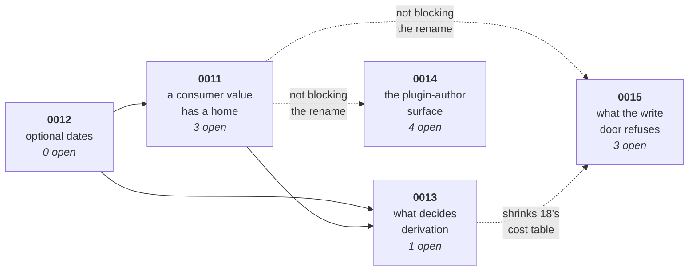

# The field redesign — five ADRs

One ADR grew to 25 decisions. On 2026-09-09 it split into five, **by question, not by file**. This folder is the working material for all of them.

## The five, in landing order

| ADR | The one question it answers | Open | Blocks |
|---|---|---|---|
| [**0012** — optional dates](0012-optional-dates/README.md) | May an Entry hold no dates? | **none** | 0013 |
| [**0011** — a consumer value has a home](0011-consumer-values-in-props/README.md) | Where does `entry.props.cost` live, and what does a write to it look like? | 1, 11, 22 | 0013 |
| [**0013** — what decides derivation](0013-what-decides-derivation/README.md) | What makes a row derive its values? | 26 (branches 8, 20, 21, 24) | — |
| [**0014** — the plugin-author surface](0014-plugin-author-surface/README.md) | Where do a plugin's values live, and how does an extender write? | 9, 12, 13, 16 | **nothing on the rename.** 16 waits on 22. 13 waits on 0012 |
| [**0015** — what the write door refuses](0015-write-door/README.md) | How strict is `entries.update()`? | 18, 19, 23 | **nothing on the rename.** Prefers 0013 first (shrinks 18) |

**Fifteen open decisions became three on the ADR that does the simplifying.** Decision 25 dissolved — each ADR bumps its own schema number: 0012 writes **5**, 0011 writes **6**, 0013 writes **7**.

## Shared

| File | Read it when |
|---|---|
| [`shared/refuted.md`](shared/refuted.md) | You are about to re-derive something. **Check here first** |
| [`shared/evidence.md`](shared/evidence.md) | You want the product survey the decisions cite |
| [`shared/rulings.md`](shared/rulings.md) | You hit the schema counter, the registration lock, or `ComputedFieldCannotBeWrittenError` |
| [`shared/prose-sweep.md`](shared/prose-sweep.md) | The last ADR has landed and the locked specs still state the old rule |

## The split rules

1. **A number never moves.** A decision keeps the number it was given, whichever ADR now owns it. The split re-homed decisions; it did not renumber them. Decision **26** is the only new number, and it is 0013's head. Decision **25** dissolved — see [`shared/rulings.md`](shared/rulings.md). **`shared/refuted.md` runs its own numbering**, and it is cited as *item N*, never *decision N*.
2. **Nothing undecided lives outside an ADR's own `README.md`.** Each one carries its open decisions, its closed ones, and its work. A question you cannot answer gets a number in the ADR it belongs to.
3. **A recommendation is not a ruling.**
4. **State a fact once.** A fact belongs to the ADR whose question it answers — the survey to [`shared/evidence.md`](shared/evidence.md), a refused approach to [`shared/refuted.md`](shared/refuted.md). Elsewhere, link to it.
5. **The prose sweep runs once, at the end**, not per ADR. See [`shared/prose-sweep.md`](shared/prose-sweep.md).
6. **One schema counter, not five.** The ADRs spend numbers in landing order: [0012](0012-optional-dates/README.md) writes **5**, [0011](0011-consumer-values-in-props/README.md) writes **6**, [0013](0013-what-decides-derivation/README.md) writes **7**. [0014](0014-plugin-author-surface/README.md) writes **8** only if decision 12 prefixes plugin keys. See [`shared/rulings.md`](shared/rulings.md).

## Where the decisions could walk over each other, and why they do not

Checked pairwise against the code on 2026-09-09.

| Pair | Shared ground | Collision? |
|---|---|---|
| 0012 × 0011 | `model/entry.ts`, `field-access.ts`, `entry-reader.ts`, `serialization/read.ts` | **No.** Different functions in the same files. 0012 first, 0011 rebases |
| 0012 × 0013 | dates on a demoted Entry | **One-way gate.** `start: Instant` is required today, so 0012 lands first |
| 0011 × 0013 | `props` carry-by-reference; `toJSON` | **One-way.** 0011 states the flat rule, 0013 adds the rolling-up exception |
| 0011 × 0014 | the `Entry.props` type | **No.** 0011 ships HEAD's posture; 0014 widens additively or migrates later |
| 0011 × 0015 | `field-registry.ts` | **No.** `#mergeCoreFieldOverride` merges `editable` and never reads `source` |
| 0011 × 0014 × 0013 | `data/edit-extension.ts` | **No.** Different symbols. A merge conflict, not a contradiction |
| 0013 × 0015 | decision 18's `kind` row vs decision 20 | **One-way.** 0013 first shrinks 18's table by one row |
| **0011 × 0013 × 0015** | **the write resolver** | **The one real collision — resolved below** |

### The write resolver: one function, three owners

Three ADRs would otherwise write the same function. The code says they need not.

`view/capability.ts:113-121`'s `libraryWriteRule` already holds the **editable** and **derived** arms together, and already imports `rollsUp` from `data/` (`field-registry.ts:97` — it already lives there). `entry-store.ts:358` already throws `UnknownFieldError` for the **exists** arm. **The resolver is a move, not a build.**

- **[0011](0011-consumer-values-in-props/README.md) moves it into `data/` with HEAD's policies unchanged.** `view/capability.ts` calls the moved function and stops restating the rule. `entries.update()` keeps HEAD's `UnknownFieldError` only — it does **not** call the editable or derived arms. No policy changes, so no decision is spent.
- **[0013](0013-what-decides-derivation/README.md) fills the derived arm and wires `entries.update()` (and the ingest drop doors) to it.** That is the first time the API door uses the resolver for a policy HEAD does not already apply there.
- **[0015](0015-write-door/README.md) fills the editable arm and wires `entries.update()` to it.**

**One at a time.** Do not wire `entries.update()` to a policy the landing ADR did not rule. The seven call sites and the throw-versus-drop table belong to 0013 (derived) and 0015 (editable), not to 0011. Do not claim I14 until 0015 has wired the editable arm.

## Independent fixes — land these on `main` first

Neither needs any decision, and both are already identified.

1. **`mergeColumn` spreads `sizingPairOf(…)` alone.** **Done** — see [0011](0011-consumer-values-in-props/README.md).
2. **Unify the proposed-Field predicate.** `rollup.ts:196` reads `body`, and `build-commit-change-set.ts:301` binds `body: proposed` — the transaction body alone — so a cascade's edits reach only `merged`. Two call sites answer *did anyone propose this Field?* from two different edit sets. **Unify them into one function before [0013](0013-what-decides-derivation/README.md) deletes the `body`/`merged` split.**

## Nothing here is implemented

`pnpm verify:full` runs green before each PR merges, and its **last line** is the answer. Review `harness/main.ts` and `harness/planner.ts` on every commit, changed or not.
