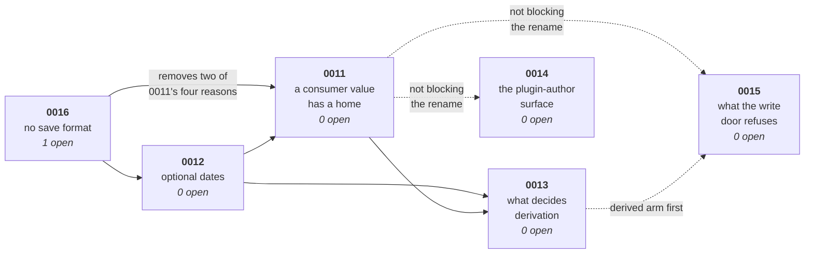

# The field redesign — six ADRs

One ADR grew to 25 decisions. On 2026-09-09 it split into five, **by question, not by file**. On 2026-09-10 a sixth opened, [ADR 0016](../../docs/adr/0016-the-library-holds-no-save-format.md), and it lands first. This folder is the working material for all of them.

## The six, in landing order

| ADR | The one question it answers | Open | Blocks |
|---|---|---|---|
| [**0016** — no save format](../../docs/adr/0016-the-library-holds-no-save-format.md) | Does this library save your data for you? | **one** — does `props` still stand? | 0011 |
| [**0012** — optional dates](0012-optional-dates/README.md) | May an Entry hold no dates? | **none** | 0013 |
| [**0011** — a consumer value has a home](0011-consumer-values-in-props/README.md) | Where does `entry.props.cost` live, and what does a write to it look like? | **none** | 0013 |
| [**0013** — what decides derivation](0013-what-decides-derivation/README.md) | What makes a row derive its values? | **none** | — |
| [**0014** — the plugin-author surface](0014-plugin-author-surface/README.md) | Where do a plugin's values live, and how does an extender write? | **none** | nothing on the rename |
| [**0015** — what the write door refuses](0015-write-door/README.md) | How strict is `entries.update()`? | **none** | nothing on the rename |

**Fifteen numbered decisions became none.** A 2026-09-10 grill then overruled three closed rules (0012 #4, 0011 #1 for `add()`, 0015 #18 default) and closed Q12b, Q15, and Q16. The [prose sweep](shared/prose-sweep.md) landed 2026-09-10. ADRs stay `proposed` until each build.

## Grill 2026-09-10

Settled in session. Each ruling lives in the ADR named. Do not re-derive them.

| Ruling | Owner |
|---|---|
| One date without the other is legal. A row **spans** iff both dates exist; a Segment and a bar exist iff it spans. Default `gridColumns` is `['name', 'start', 'end']`. The date editor writes one Field and must open on a blank cell. No diamond in core. | [0012](0012-optional-dates/README.md) |
| `add()` and `update()` are flat. Constructor `entries` also take declared keys at the top; nested `props` stays for passengers; unknown top-level keys warn; a key named both at the top and inside `props` throws. Storage nests in `props`. `add()` / `update()` throw `UnknownFieldError` for an undeclared key. The constructor still carries passengers inside `props`. | [0011](0011-consumer-values-in-props/README.md) |
| An Entry with children is a **parent**. Name is required. Lose the last child → name, no dates, no bar. Parent **cells** stay refused. Parent **bar** drag translates every descendant date that exists. Reuse `beforeEntryMove`. | [0013](0013-what-decides-derivation/README.md) |
| Plugin keys stay prefixed. App `add` / `update` use the prefixed key. The plugin exports that string as a const. No bare alias. | [0014](0014-plugin-author-surface/README.md) |
| Default `editable` is `'anywhere'`. After setup, only `editable` may change. No new Field keys. Keep `CORE_FIELD_OVERRIDABLE_KEYS`. Live call: `dataset.setFieldEditable('start', 'never')`. | [0015](0015-write-door/README.md) |

**Grill call-sites are closed.** Q12b, Q15, and Q16 are in the ADRs above.

Avoid **phase** and **grouped entry** in this folder. An Entry with children is a parent. `{ source: 'group', groupBy }` is a row source, not a parent.

## Shared

| File | Read it when |
|---|---|
| [`shared/refuted.md`](shared/refuted.md) | You are about to re-derive something. **Check here first** |
| [`shared/evidence.md`](shared/evidence.md) | You want the product survey the decisions cite |
| [`shared/rulings.md`](shared/rulings.md) | You hit the registration lock or `ComputedFieldCannotBeWrittenError`. The schema counter there is superseded by ADR 0016 |
| [`shared/prose-sweep.md`](shared/prose-sweep.md) | The F table is the changelog of the 2026-09-10 sweep. The spike gate runs at every ADR acceptance |
| [`reviews/`](reviews/) | You want a spike's verdict, or you are about to run a new wave ([`SPIKE-PLAYBOOK.md`](reviews/SPIKE-PLAYBOOK.md)) |
| [`CLOSE-OUT.md`](CLOSE-OUT.md) | **Every decision is closed and none is built.** The build order, the gates, and the locked-spec edits still owed |

## The split rules

1. **A number never moves.** A decision keeps the number it was given, whichever ADR now owns it. The split re-homed decisions; it did not renumber them. Decision **26** is the only new number, and it is 0013's head. Decision **25** dissolved — see [`shared/rulings.md`](shared/rulings.md). **`shared/refuted.md` runs its own numbering**, and it is cited as *item N*, never *decision N*.
2. **Nothing undecided lives outside an ADR's own `README.md`.** Each one carries its open decisions, its closed ones, and its work. A question you cannot answer gets a number in the ADR it belongs to.
3. **A recommendation is not a ruling.**
4. **State a fact once.** A fact belongs to the ADR whose question it answers — the survey to [`shared/evidence.md`](shared/evidence.md), a refused approach to [`shared/refuted.md`](shared/refuted.md). Elsewhere, link to it.
5. **The prose sweep runs once, at the end**, not per ADR. See [`shared/prose-sweep.md`](shared/prose-sweep.md).
6. ~~**One schema counter, not five.**~~ **Retired 2026-09-10 by [ADR 0016](../../docs/adr/0016-the-library-holds-no-save-format.md).** The library holds no save format, so no ADR spends a number. The counter table in [`shared/rulings.md`](shared/rulings.md#3--the-schema-restarts-release-gate) dissolves with it, and stays there marked as superseded.

## Where the decisions could walk over each other, and why they do not

Checked pairwise against the code on 2026-09-09.

| Pair | Shared ground | Collision? |
|---|---|---|
| 0012 × 0011 | `model/entry.ts`, `field-access.ts`, `entry-reader.ts` | **No.** Different functions in the same files. 0012 first, 0011 rebases. `serialization/read.ts` was the fourth shared file, and build 0016 deletes it |
| 0012 × 0013 | dates on a demoted Entry | **One-way gate.** `start: Instant` is required today, so 0012 lands first |
| 0011 × 0013 | `props` carry-by-reference | **One-way.** 0011 states the flat rule, 0013 adds the rolling-up exception. The `toJSON` half of this pair goes with build 0016 |
| 0011 × 0014 | the `Entry.props` type | **No.** 0011 ships HEAD's posture; 0014 widens additively (`TProps & PluginEntryProps`, plugin keys prefixed — 9 and 12, closed 2026-09-10) |
| 0011 × 0015 | `field-registry.ts` | **No.** `#mergeCoreFieldOverride` merges `editable` and never reads `source` |
| 0011 × 0014 × 0013 | `data/edit-extension.ts` | **No.** Different symbols. A merge conflict, not a contradiction |
| 0013 × 0015 | decision 18's `kind` row | **One-way.** 0013 deleted `kind`, so 18 is a two-row table |
| **0011 × 0013 × 0015** | **the write resolver** | **The one real collision — resolved below** |

### The write resolver: one function, three owners

Three ADRs would otherwise write the same function. The code says they need not.

`view/capability.ts:113-121`'s `libraryWriteRule` already holds the **editable** and **derived** arms together, and already imports `rollsUp` from `data/` (`field-registry.ts:97` — it already lives there). `entry-store.ts:358` already throws `UnknownFieldError` for the **exists** arm. **The resolver is a move, not a build.**

- **[0011](0011-consumer-values-in-props/README.md) moves it into `data/` with HEAD's policies unchanged.** `view/capability.ts` calls the moved function and stops restating the rule. `entries.update()` keeps HEAD's `UnknownFieldError` only — it does **not** call the editable or derived arms. No policy changes, so no decision is spent.
- **[0013](0013-what-decides-derivation/README.md) fills the derived arm and wires `entries.update()` (and the ingest drop doors) to it.** That is the first time the API door uses the resolver for a policy HEAD does not already apply there.
- **[0015](0015-write-door/README.md) fills the editable arm and wires `entries.update()` to it.**

**One at a time.** Do not wire `entries.update()` to a policy the landing ADR did not rule. The seven call sites and the throw-versus-drop table belong to 0013 (derived) and 0015 (editable), not to 0011. Do not claim I14 until 0015 has wired the editable arm.

## Independent fixes — land these on `main` first

One fix needs no decision: **`mergeColumn` spreads `sizingPairOf(…)` alone**, written up in [0011](0011-consumer-values-in-props/README.md).

**Two commits sit off `main`, and this instruction is unmet.** `624350d` (the `sizingPairOf` fix) and `9c3f704` (the conversion-naming rename) are on `adr-0011-field-redesign` and on every spike branch. Neither is an ancestor of `main`. They reach `main` through a PR, never a direct push.

## Nothing here is implemented

Every ADR in this folder is `proposed`, and no line of it is in `src/`. The build order and what each build owes are in [`CLOSE-OUT.md`](CLOSE-OUT.md).
