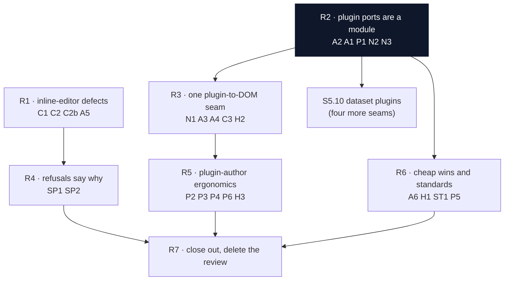

# Fix plan — S5 extensibility branch review

**Source review:** [`2026-09-04-s5-extensibility-branch.html`](./2026-09-04-s5-extensibility-branch.html) — FreeGantt, 2026-09-04, branch `s5-start` against `main`, steps S5.0–S5.9 landed.
**Slice:** S5 ([`plans/s5-extensibility-and-editing/README.md`](../s5-extensibility-and-editing/README.md)) · **Status:** open — R1, R2 and R3 landed; R4–R7 open.
**Gate state at review time:** every gate passed. Each finding below is a quality, design or API-shape call. No tool catches them.

> ## Delete the review when this plan closes
>
> The review HTML is a work item, not a record. Tick every box in this file first.
> Then delete `plans/reviews/2026-09-04-s5-extensibility-branch.html` in the same commit as the last fix.
> This plan file stays. It is the record of what the review asked and what landed.
> A finding you decide **not** to fix does not block the delete. Move it to §6 with the reason.

---

## 0. How to use this file

- Work one slice per session. The slices are ordered. Do not start R3 before R2 lands.
- Tick a box in the same change as the code, the way the S5 README requires.
- Run `pnpm gate` at the end of every slice. Run `pnpm api-report` after any public-surface change.
- Each slice ends with something you can see or run. That is the same vertical-slice rule S5 itself follows.

**Verification note.** Every finding below was re-read against `HEAD` before this plan was written.
All confirmed. Counts checked: `gantt-shell.ts` is 1,774 lines, `inline-editing.ts` is 458 lines,
`extensions/` holds 12 `document.addEventListener` calls, `GanttShellOptions` holds 34 members with
seven "omitted only by tests" comments, and `PluginContextPorts` holds 11 group-naming doc comments.

---

## 1. Order, and why

**R2 first, and before S5.10.** The review's own top recommendation. S5.10 adds a second plugin
contract with four more seams. On today's shape each seam costs three edits, and two of them are
transcription. R2 makes it one edit. Landing S5.10 first doubles the work R2 has to undo.

**R1 runs in parallel with R2.** The two defects live in `extensions/features/inline-editing.ts`.
R2 lives in `view/` and `api/`. They do not touch the same files.

**R3 needs R2.** R3 adds `ctx.view.dom`, which is a new port group. The port factory must exist first.

---

## 2. Findings index

| # | Finding | Verdict | Slice |
|---|---|---|---|
| C1 | The cell editor never repositions on resize | confirmed defect | R1 |
| C2 | An invalid value plus a double-click orphans a live editor | confirmed defect | R1 |
| C2b | `settled` is a latch the caller sets and the callee clears | design | R1 |
| A5 | `inlineEditing()`'s session wants to be an object | architecture | R1 |
| N4 | `findCell`'s doc outlived its use | naming | R1 |
| N5 | `date-input.ts` names a guard called `onceCommitted`; it is `settled` | naming | R1 |
| A2 | `GanttShell`'s constructor holds a module | architecture, strong | R2 |
| A1 | One plugin seam costs three edits in three layers | architecture, strong | R2 |
| P1 | Eleven comments restate what the flat type threw away | self-documentation | R2 |
| N2 | `emit*` is one verb doing two jobs | naming | R2 |
| N3 | `resolveTooltip` returns a body, not a tooltip | naming | R2 |
| N1 | `Overlay` now names two concepts | naming, #7 precedent | R3 |
| A3 | The plugin ↔ DOM contract is undeclared | architecture, strong | R3 |
| A4 | Every feature plugin re-invents scoped document listening | architecture | R3 |
| C3 | `Popup` has no way to tell its owner it closed | API gap | R3 |
| H2 | The harness re-derives `elementForEntry` with a raw selector | API gap | R3 |
| SP1 | Four different refusals all look like "nothing happened" | spec divergence | R4 |
| SP2 | Two ticked boxes claim what did not land | tracker | R4 |
| P2 | Two plugins that each define a kind cannot both be installed | extensibility | R5 |
| P3 | The commonest item producer costs eight lines of re-derivation | ergonomics | R5 |
| P4 | Every plugin ends with `return () => {};` | ergonomics | R5 |
| P6 | Three of `RendererRegistry`'s four resolvers only forward | middle man | R5 |
| H3 | A cell renderer can only see the formatted string | API gap | R5 |
| A6 | Four cheap wins | quality | R6 |
| H1 | Three demo plugins are copied between two harness pages | duplication | R6 |
| ST1 | Comment prose has drifted past the ASD-STE100 rule | **hard** standard | R6 |
| P5 | `GanttShellOptions` is three audiences in one bag | ISP | R6 |
| ST2 | `ColumnChromePorts` is a data clump, and that is fine | recorded only | §6 |
| SP3 | A pane-scroll fix rode in on the S5 branch | recorded only | §6 |

---

## 3. The slices

### R1 — The inline editor keeps its promise

**Ends with:** you open a cell editor, you resize the window, and the editor stays on its cell.
You type an invalid value, you double-click a second cell, and no ghost editor stays on screen.

Files: `src/extensions/features/inline-editing.ts`, `src/extensions/features/date-input.ts`, and their tests.

- [x] **C1 — fix the resize reposition.** The one call site passes the `.fg-row` element as `container`.
      `Element.querySelector` matches descendants only, so the lookup always returns `undefined`.
      Replace it with `row.querySelector([data-field="…"])`. Drop the unused `entryId` parameter.
- [x] **C1 test.** Open an editor. Fire the overlay resize. Assert the wrapper moved with its cell.
      Landed twice: through the real overlay observer, and on `CellEditorSession.reposition()` alone.
- [x] **N4 — retire the stale doc.** `findCell`'s doc says "scoped to this Gantt's own container".
      Its one caller passes a row. Rename or re-document it to match the row scope.
      It is `findCellInRow(row, field)` now. `findOwnCell` reuses it for its own per-row step.
- [x] **A5 + C2b — give the session an object.** Add a `CellEditorSession` class.
      It owns `mount`, `commit(): boolean`, `revert()` and `reposition()`.
      `commit()` returns its own outcome, so the `settled` flag goes away.
      `setup()` then holds one `session: CellEditorSession | undefined`.
      The class takes `CellEditorPorts`, the idiom `ColumnChromePorts` already sets, so a test drives
      a session with no mounted Gantt.
- [x] **C2 — make the refusal legible.** `closeSession` returns whether it closed.
      `openFor` bails when it did not close. No second session overwrites a live one.
- [x] **C2 test.** Open cell A. Enter a value `parseValue` rejects. Double-click cell B.
      Assert exactly one `.fg-cell-editor` is in the DOM.
- [x] **N5 — fix the comment drift.** `date-input.ts`'s `onCommit` doc names an `onceCommitted` guard.
      That symbol does not exist. Name the real one, or drop the clause if A5 removed it.
      The doc now names the real answer: a commit closes the session, so the second call finds none.
- [x] Add the two tests the S5.8 TODO already lists as untested, if A5 makes them cheap:
      blur-commit racing a context-menu open, and an entry removed mid-`commit()`.
      Both landed. `s5.8-inline-editing.md`'s TODO keeps the third item, the `data/history.test.ts`
      "an inline edit is one undo step" test, which sits outside this slice's files.

**Verify:** `pnpm test:dom`, `pnpm test:node`, `pnpm typecheck`, `pnpm lint`. Then edit a cell in `harness/editing.html`.

---

### R2 — The plugin ports become a module, in the shape a plugin sees

**Blocks S5.10.** Do this before the dataset-plugin step starts.
**Ends with:** adding a plugin seam is one edit in one file, and `buildPluginContext` is one line.

Files: `src/view/gantt-shell.ts`, new `src/view/plugin-ports.ts`, `src/api/gantt.ts`, `src/api/plugin.ts`.

- [x] **A2 — lift the port factory out of the constructor.** Move the ~200-line closure to
      `view/plugin-ports.ts` as `buildPluginPorts(deps, pluginId)`.
      Take the shell's collaborators through a ports interface.
      Follow the idiom `core-commands.ts` and `column-chrome.ts` already set on this branch.
      The deps interface is `GanttShellPorts`; `GanttShell#shellPorts()` builds it, the same way
      `#coreCommandPorts()`/`#columnChromePorts()` already build theirs. `gantt-shell.ts` lost
      214 lines (1,823 → 1,609); `api/gantt.ts` lost 24.
- [x] **A2 — collapse the six transcriptions.** Six ports repeat the same six lines:
      assert the gate, register, invalidate, build the disposer, add it to `disposables`, return it.
      Write one internal helper. A new seam then becomes a declaration.
      `registerWhileOpen(register, refresh?)` is that helper, and it covers seven seams, not six —
      `registerKeybinding` had the same shape. Only `refresh` is a real difference. The
      `gate.guard` / `gate.assertOpen()` split was accidental, so the helper asserts for all seven
      and `RegistrationGate.guard` is deleted (it had no other caller and no test).
- [x] **A1 + P1 — declare the ports grouped.** `PluginContextPorts` gains the shape a plugin sees:
      `{ commands, interaction: {…}, view: {…}, layout: {…} }`.
      Eleven doc comments that only name a path can go. The type carries the path now.
- [x] **A1 — delete the middle man.** `buildPluginContext` collapses to
      `(parts) => ({ dataset, gantt: this, ...parts })`.
      `api/gantt.ts` binds only the two things it alone has.
- [x] **A2 test.** Test `buildPluginPorts` against its ports interface, with no mounted Gantt.
      The gate, the invalidate call and the disposal all become directly testable.
      `src/view/plugin-ports.test.ts`, 31 tests, no container and no dataset.
- [x] **N2 — rename the two emit verbs.** `emitBeforeEntryEdit` becomes `proposeEntryEdit`.
      `emitEntryEdit` becomes `announceEntryEdit`. One asks and takes a veto. One tells.
      `Veto` and `Propose` are already in `CONTEXT.md`. Update `plans/02` §3 and the callers.
- [x] **N3 — rename `resolveTooltip`.** It returns an `ElementDescription`, which is the body.
      `resolveTooltipContent` pairs with the existing `resolveTooltipColumns`.
      `RendererRegistry.resolveTooltip` keeps its name: it resolves the point, and R5's P6 folds it.
- [x] Update `plans/01` §10 and `plans/02` §4 for the grouped port shape and the two renames.
      `CONTEXT.md` gains **Plugin ports** and **Propose / Announce**.
- [x] Run `pnpm api-report` and commit the `etc/` change.
      The report moved by exactly the three renamed members.

**Verify:** `pnpm gate`, `pnpm api-report`. The harness plugin pages still install every demo plugin.

---

### R3 — One seam answers "is this node mine, and what is it?"

**Needs R2.** **Ends with:** no `.fg-*` selector in `src/extensions/` or in `harness/`,
and `contextMenu()` holds no `isOpen` poll.

Files: `src/view/overlay.ts`, `src/view/plugin-ports.ts`, `src/extensions/features/*.ts`,
`src/extensions/popup.ts`, `src/api/plugin.ts`, `harness/main.ts`, `harness/plugins.ts`.

- [x] **N1 — split `Overlay`, do not rename it.** `Overlay` keeps `present`, `render` and `onResize`.
      `contains`, `elementForEntry`, `bounds` and `paneBounds` moved to `ctx.view.dom`
      (`view/gantt-dom.ts`'s `GanttDom`, built per Gantt by `ContainerDom`). `contains` reads
      `owns(node)` there and `elementForEntry` reads `barFor(id)` — both were false sentences on an
      overlay. `createPopup(ctx.view, keymap)` takes the whole view surface now, because a popup
      mounts in one member and places against the other.
- [x] **A3 — add the resolver.** `ctx.view.dom.targetUnder(node)` answers
      `{ kind, element, entry?, field? }`. `kind` is `model/`'s new `TargetKind`, which
      `CommandTarget.kind` now names too — one union, not two spellings of five words. `owns(node)`,
      `barFor(id)` and `cellFor(id, field)` sit beside it, plus `cellText(cell)` for the string the
      grid already painted. `contextMenu()` fills `CommandContext.target` from the resolved target,
      which it never filled before.
- [x] **A3 — delete the string literals.** `render/dom/dom-contract.ts` declares every class and
      `data-*` key that crosses the layer boundary, and `render/dom/index.ts` paints from it.
      `bar-under.ts` is deleted. `tooltips()`, `contextMenu()` and `inlineEditing()` read no `.fg-*`
      selector and no `data-*` key of the rendered Gantt. `stillAnchored()` is
      `dom.cellFor(entryId, field) !== undefined`, so "is this mine?" has one answer.
      A plugin's own classes (`.fg-tooltip`, `.fg-menu`, `.fg-cell-editor`, `.fg-popup`) stay — they
      are what the plugin *writes*, styled by `view/styles.ts`, not what it reads back.
- [x] **A3 test.** `src/view/gantt-dom.test.ts` paints a real frame through `createDomBackend` into a
      real `PaneLayout`, then asserts `targetUnder` still resolves each of the five kinds, and that
      `barFor`/`cellFor` stay inside their own Gantt.
- [x] **A4 — add `ctx.view.onDomEvent(type, handler, opts)`.** It listens on `document`, keeps only
      what `dom.owns` answers for, hands the handler the resolved target, and files its own removal —
      capture flag included — in `ctx.disposables`.
- [x] **A4 — convert the twelve listeners.** Eleven, not twelve: `extensions/` held eleven
      `document.addEventListener` calls, and the review counted one twice. Nine converted (four in
      `tooltips()`, three in `contextMenu()`, two in `inlineEditing()`). `extensions/popup.ts` keeps
      its two: a dismiss-on-outside-pointer listener exists to hear events *outside* this Gantt, so
      scoping it would break it. `inlineEditing()`'s `scroll` listener was the one with no guard at
      all. `plugin-ports.test.ts` adds the two-Gantt test (I2).
- [x] **C3 — `PopupOptions` gains `onDismiss?: (trigger: DismissTrigger) => void`.**
      It runs after the close, so `isOpen` reads `false` inside it. An owner's own `close()` never
      fires it.
- [x] **C3 — drop `contextMenu()`'s `isOpen` polls.** The two listeners live in a per-menu
      `DisposableStore` that `onDismiss` empties. A test spies on `document.removeEventListener` and
      asserts both come off on an Escape dismissal.
- [x] **H2 — the harness stops guessing.** Both popup demos stash `{ popup, dom }` out of `setup()`
      and call `ctx.view.dom.barFor(selected)`. Two harness-owned classes squatting the library's
      prefix went with them: `fg-mobilization-line` and `fg-toolbar` are `demo-*` now.
- [x] Update `CONTEXT.md` with `ctx.view.dom`, `targetUnder` and `DismissTrigger`.
      Update `plans/01` §10 and `plans/02` §4. Run `pnpm api-report`.
      `CONTEXT.md` gains **Gantt DOM**, **DOM target**, **Scoped DOM listener** and **Dismiss
      trigger**, and rewrites **Overlay** and **Popup**. `plans/02` gains §4.5.

**Verify:** `pnpm gate`, `pnpm test:e2e`. Then `grep -rn "fg-" src/extensions harness --include=*.ts`
returns only classes a plugin *writes* (`.fg-popup`, `.fg-tooltip*`, `.fg-menu*`, `.fg-cell-editor*`,
each named once, in the file that writes it), the public `--fg-bar-fill` custom property the harness
sets, and comments. No plugin and no harness page *reads* a `.fg-*` selector or a `data-*` key of the
rendered Gantt. That read side was the finding; the write side is a plugin's own output.

---

### R4 — A refusal to edit says why

**Ends with:** a user double-clicks a cell that cannot open an editor, and the cell says which reason applies.

Files: `src/extensions/features/inline-editing.ts`, its tests, `plans/s5-extensibility-and-editing/s5.8-inline-editing.md`.

- [ ] **SP1 — mount the invalid state on the two open-time paths.** Today both paths take a bare `return`.
      `openDate` refuses a non-midnight instant. `openFor` refuses a field with no `parseValue`.
      Both must mount the wrapper with `data-state="invalid"` and the named reason the spec quotes.
- [ ] **SP1 — keep the two "not editable" paths silent, or state them too.** Decide once and write it down.
      A column that is not editable and a rolled-up kind are a different answer from "this editor cannot show it".
- [ ] **SP1 tests.** Replace the two `querySelector('.fg-cell-editor') === null` assertions.
      Assert `.fg-cell-editor[data-state="invalid"]` and the reason text, the way the neighbouring
      parseValue test already does.
- [ ] **SP2 — split the two half-ticks.** `s5.8-inline-editing.md` lines 104–105 claim a named reason
      that did not land. Split each box. Tick the half that shipped. Untick the half that did not.
- [ ] **Carried from R1.** C2's fix makes an editor holding a rejected value refuse to yield.
      A double-click on another cell now does nothing until the user fixes the value or presses Escape.
      That is the intended behaviour. It is also a second silent refusal, which is SP1's own subject.
      Make this refusal legible with the same mechanism.
- [ ] Note the a11y consequence for S5.11: a silent no-op announces nothing to a screen reader.
      Add one line to [`s5.11-a11y-completion.md`](../s5-extensibility-and-editing/s5.11-a11y-completion.md).

**Verify:** `pnpm test:dom`. Then double-click a date cell with a time of day in `harness/editing.html`.

---

### R5 — A plugin author writes less and gets further

**Ends with:** two plugins each declare their own kind, both install, and both paint.

Files: `src/view/renderer-registry.ts`, `src/layout/items/produce-items.ts`, `src/layout/renderer.ts`,
`src/extensions/plugin-runtime.ts`, `src/api/plugin.ts`, `harness/plugins/`.

- [ ] **P2 — key the per-kind bar form on the kind.** Today `registerRenderer('bar', …)` claims one
      global slot, so a second kind-defining plugin throws.
      Key the per-kind map form on `bar:${kind}` in the registration table that is already there.
      Keep the whole-point claim (a function, not a map) exclusive, as it is today.
      `cell`, `header` and `tooltip` keep one slot per point: they have no key to merge on.
- [ ] **P2 test.** Install two plugins. One registers `'buffer'`. One registers `'risk'`.
      Both must install. Both must paint. Disposing one must leave the other.
      This is user story U10, tested for two plugins instead of one.
- [ ] **P3 — export `wholeEntryItem`.** It is pure and DOM-free and holds no internals.
      The common item producer then reads `(entry) => [wholeEntryItem(entry)]`.
      It also removes the one place a plugin can get the `itemId(entry.id, 0)` convention wrong.
- [ ] **P4 — `setup(ctx): Disposer | void`.** `PluginRuntime.install` gains one `?.()`.
      Three demo plugins then drop their empty `return () => {};`.
- [ ] **P6 — one `resolve
(point, consumer)`.** It replaces `resolveCell`,
      `resolveHeader` and `resolveTooltip`. `resolveBar` stays: it does the per-kind pass.
- [ ] **H3 — `CellRendererContext` gains `rawValue: unknown`.** It sits beside `value: string`.
      The Field registry already produced it. A renderer then branches on the number.
      `harness/plugins.ts`'s `overBudget` regex goes away.
- [ ] Update `plans/02` §4, `CONTEXT.md` and `pnpm api-report`.

**Verify:** `pnpm gate`. Then install two kind-defining plugins on `harness/plugins.html`.

---

### R6 — The cheap wins, and the one hard standard

**Ends with:** the branch reads as ASD-STE100, and the harness holds one copy of each demo plugin.

- [ ] **ST1 — the comment pass.** This is the branch's one hard standards breach.
      `CLAUDE.md` allows 20 words for an instruction and 25 for a description. One instruction per sentence.
      Split the long sentences in `src/api/plugin.ts`, `src/extensions/features/*.ts` and
      `src/view/gantt-shell.ts`. Keep every design rationale. Only the sentence shape changes.
      Do this pass **after** R2 and R3, so you do not reformat comments those slices delete.
- [ ] **P5 — group `GanttShellOptions`' wiring.** Thirty-four members mix configuration, layer wiring
      and test seams. Seven members carry the same "omitted only by tests" comment.
      Add one required `wiring` member holding the seven always-supplied seams.
      A test then names `wiring` once instead of omitting seven keys. Seven comments go.
- [ ] **H1 — move the three demo plugins.** `logEverything()`, `selectionShortcuts()` and `popupDemo()`
      are copied character-for-character into `harness/main.ts` and `harness/plugins.ts`.
      `harness/plugins/` already holds `weekend-shading.ts` and `buffer-kind.ts`. Put them beside those.
- [ ] **A6 — index the resolved columns.** `gantt-shell.ts` runs
      `resolvedColumns.find(…)` once per visible cell, so column lookup is O(rows × columns²) per frame.
      Build a `Map<string, ResolvedColumn>` in `ColumnChrome.setResolvedColumns`.
      It serves `resolveCellRenderer`, `isColumnEditable`, `isResizable`, `isMovable` and `resolvedColumn`.
- [ ] **A6 — collapse the column-gesture cascade.** `if (grabbedKind === 'resize') … else if (… 'reorder')`
      repeats in `move`, `commit` and `cancel`.
      Use two small strategy objects and one grabbed reference.
      `registerColumnStepCommand` in `core-commands.ts` already uses that shape.
- [ ] **Carried from R1.** `entryIdOfRow` in `inline-editing.ts` hand-casts `id as EntryId`.
      `model/ids.ts` already exports `entryIdFromDataset` for that DOM-to-brand boundary. One line.
- [ ] **A6 — name the seed.** `openGeneric` seeds `input.value` from a four-arm nested ternary.
      A named `seedText(field, raw, cell)` reads as a sentence.
- [ ] **A6 — table the popup dismiss triggers.** `createPopup`'s `open()` runs ~70 lines of four inline
      `if (dismissOn.includes(…))` blocks. A table keyed by `DismissTrigger` makes a fifth trigger a row.
      Pairs with R3's `onDismiss`.

**Verify:** `pnpm gate`. Then review `harness/main.ts` end to end, the way `CLAUDE.md` requires.

---

### R7 — Close out

- [ ] Re-read every box above. Every one is ticked, or moved to §6 with a reason.
- [ ] Run the full gate: `pnpm gate`, `pnpm api-report`, `pnpm test:e2e`.
- [ ] Review `harness/main.ts` once more. It must hold no library-rule breach and no re-derivation.
- [ ] Update the S5 README status line and §12 spec edits with what these slices changed.
- [ ] **Delete `plans/reviews/2026-09-04-s5-extensibility-branch.html`.** Do it in the same commit as the
      last fix. Keep this plan file.
- [ ] Confirm S5.10 can start. R2 landed, so a new dataset-plugin seam is one edit.

---

## 4. Spec and doc edits this plan carries

| Edit | Slice | File |
|---|---|---|
| `proposeEntryEdit` / `announceEntryEdit` replace the two `emit*` names | R2 | `plans/02` §3, `CONTEXT.md` |
| `resolveTooltipContent` replaces `resolveTooltip` | R2 | `plans/01` §10, `plans/02` §4 |
| `PluginContext` ports are declared grouped | R2 | `plans/01` §10 |
| `ctx.view.dom` — `owns`, `targetUnder`, `barFor` | R3 | `plans/01` §10, `plans/02` §4, `CONTEXT.md` |
| `PopupOptions.onDismiss`, `DismissTrigger` | R3 | `plans/02` §4, `CONTEXT.md` |
| The open-time invalid state and its named reason | R4 | `s5.8-inline-editing.md` §1, TODO 104–105 |
| A silent refusal announces nothing | R4 | `s5.11-a11y-completion.md` |
| The per-kind bar renderer composes across plugins | R5 | D-S5-11 note, `s5.9-plugin-registrations.md` |
| `wholeEntryItem` is public; `setup` may return `void` | R5 | `plans/02` §4 |
| `CellRendererContext.rawValue` | R5 | `plans/02` §4 |

---

## 5. What each slice must not do

- Do not tidy `harness/main.ts` to hide an API gap. Close the gap in `src/`, then the harness follows.
- Do not grow `view/gantt-shell.ts`. Every slice here either shrinks it or leaves it alone.
- Do not add a runtime dependency. `plans/04` §1 budgets two, and both are confined.
- Do not let `extensions/` import anything but `api/` and `model/`. That rule is what makes the dogfood gate real.
- Do not touch the #139 Grid-column-width work. The review put it out of scope.

---

## 6. Recorded, not fixed

| Finding | Why it stays |
|---|---|
| **ST2** — `ColumnChromePorts` is a seven-member data clump | Read alone it is a Data Clump. Read against `CoreCommandPorts` and `ColumnGestureContext` it is the branch's idiom for "this module borrows the shell's machinery". The idiom is what keeps `column-chrome.ts` testable. R2's `buildPluginPorts` extends the same idiom. Recorded so a later reviewer does not re-raise it. |
| **SP3** — commit `67c79dc` fixed pane scroll on the S5 branch | An S1.8 defect that S5.7's resizable columns made visible. The fix is real and harmless. Recorded so the slice gate's "what did S5 change" answer stays honest. Add one line to the S5 README §12. |

Move any finding you decide not to fix into this table. Give the reason. Then §R7's delete is honest.
