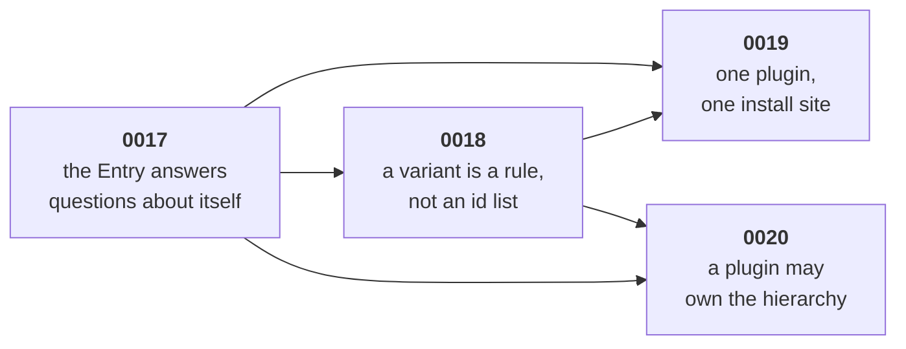

# The row redesign — four ADRs

One row has three names. It is a stored value in `model/`, a set of questions on the `Dataset`, and a registration on the `Gantt`. Nothing joins them, so every seam that needs two of them re-derives the join — **core as often as a plugin**. Four ADRs close that. This folder is their working material.

Opened 2026-09-11, out of a design session on the plugin variant surface.

> **The plan of record is [`build/`](build/README.md).** This folder is the reasoning behind it. An implementer reads `build/README.md` once, then one build file. Open questions and lone calls are in [`BUILD-LOG.md`](BUILD-LOG.md).

## The four, in landing order



| ADR | one question it answers | Supersedes |
|---|---|---|
| [**0017** — the Entry answers questions](../../docs/adr/0017-the-entry-answers-questions-about-itself.md) | Can you answer by looking at the row? | `EntryStoreView.fieldValue` and `EntryStoreView.childrenOf` — they become `Entry` members |
| [**0018** — a variant is a rule](../../docs/adr/0018-a-variant-is-a-rule-not-an-id-list.md) | How does a row get a variant? | the four variant-registration seams. [0013](../../docs/adr/0013-what-decides-that-a-row-derives-its-values.md) stands whole |
| [**0019** — one install site](../../docs/adr/0019-one-plugin-one-install-site.md) | Where does a plugin install? | the `GanttPlugin` / `DatasetPlugin` pair |
| [**0020** — a plugin may own the hierarchy](../../docs/adr/0020-a-plugin-may-own-the-hierarchy.md) | What makes an Entry a parent? | nothing — `parentId` was the only tree |

0017 lands first. A variant rule and a plugin half both read questions off the row, and neither can be written until the row answers.

0020 lands last, and it is the one that pays 0017 back. Four sites outside the store read `entry.parentId` to ask what the tree is. **Three move with 0017** — `layout/rows/entries-source.ts:16`, `layout/frame-memory.ts:77` and `view/tree-collapse.ts:111,153` — and they ask `parent()`, `children()` or `hasChildren` instead. **The fourth is 0020's own work.** `data/rollup.ts:46,52` reads a stored map to find the **former** parent of a moved row, so a live `parent()` there misses it and skips a Rollup. That invalidation belongs with the hierarchy source. A plugin can only own the tree once all four ask one door.

## The evidence

**One table, in [ADR 0017](../../docs/adr/0017-the-entry-answers-questions-about-itself.md).** Seven sites, all read at HEAD on 2026-09-11. The three strongest are `harness/planner.ts:70` (a consumer reaching back to the Dataset to ask about its own row), `src/model/field.ts:303` (`Aggregator` taking `children` beside `parent`), and `src/layout/items/produce-items.ts:235` (`hasChildren` threaded as a positional boolean).

## Review — 2026-09-11

The field-redesign build reviewed the first draft and raised seven problems. **All seven were verified at HEAD before the revision, and all seven were real.** Four of them killed the draft's central claim, which was that the live `Entry` simply *is* `Entry`. The revision answers each one. Do not re-derive them.

| # | Problem | Answered in |
|---|---|---|
| P1 | `CoreFieldKey = keyof Omit<Entry, 'id' \| 'props'>` — every live member would invent a core Field key | [0017](../../docs/adr/0017-the-entry-answers-questions-about-itself.md), *Why `StoredEntry` stays* |
| P2 | `entryAfterEdit` spreads `StoredEntry` on the hot path; a prototype getter does not survive a spread | same |
| P3 | `ProposedEdit` derives from `Entry` too | same |
| P4 | `EditRequest.entries` and `entryAfterEdits` are deliberately different states (D-S5-45); one live object collapses them | same |
| P5 | `.children` means two things inside an open transaction | 0017 rule 2 — live means the committed index overlaid with the open write set |
| P6 | `hasChildren` has a cheap path and an expensive one | 0017 rule 4 — a member that does no work is a property, a member that computes or walks carries parentheses. **The first draft said "a getter answers one value", and that wording is withdrawn** — the rule is about cost |
| P7 | HEAD ships `fieldValue`, not `read` | 0017 Consequences — the one ADR that also proposed this rename was withdrawn and deleted on 2026-09-11 ([the gap at 0014](../../docs/adr/README.md#the-gap-at-0014)), so 0017 owns it outright |

## Rulings — 2026-09-11

Settled in the session that opened this folder. Do not re-derive them.

| Ruling | Owner |
|---|---|
| Any earlier ADR may change, [0013](../../docs/adr/0013-what-decides-that-a-row-derives-its-values.md) included, when the change buys a cleaner API. | all three |
| `Entry` names the live type. `StoredEntry` names the stored values. | [0017](../../docs/adr/0017-the-entry-answers-questions-about-itself.md) |
| `layout/` must not couple to `data/`. A clean, specific seam is allowed when it buys a large API gain. The live `Entry` needs none: `model/` declares the interface, `data/` builds it, and `layout/` names the type. `.dependency-cruiser.cjs:63` already holds the line. | [0017](../../docs/adr/0017-the-entry-answers-questions-about-itself.md) |
| `EntryStoreView.childrenOf` and the by-key `read(id, key)` door are deleted. One question, one call site. | [0017](../../docs/adr/0017-the-entry-answers-questions-about-itself.md) |
| A removed id carries no flag. Existence stays `entries.has(id)`. | [0017](../../docs/adr/0017-the-entry-answers-questions-about-itself.md) |
| `when` ships both forms — the field-match shorthand and the predicate. | [0018](../../docs/adr/0018-a-variant-is-a-rule-not-an-id-list.md) |
| `StoredEntry` and `Entry` are two types. No derived type reads `keyof` `Entry`. | [0017](../../docs/adr/0017-the-entry-answers-questions-about-itself.md) |
| A seam that asks a question about now receives an `Entry`. A seam that describes a change carries `StoredEntry` values. | [0017](../../docs/adr/0017-the-entry-answers-questions-about-itself.md) |
| **Nothing stores a variant.** A variant is a rule, resolved per Gantt. The stored `variant` an earlier draft proposed is refused. | [0018](../../docs/adr/0018-a-variant-is-a-rule-not-an-id-list.md) |
| An app pins one row with its own Field — `when: { milestone: true }` plus `update(id, { milestone: true })`. That write undoes; a variant is not a `ChangeSet` entry. | [0018](../../docs/adr/0018-a-variant-is-a-rule-not-an-id-list.md) |
| A chrome-only plugin — no `data` half — keeps installing on the `Gantt`. | [0019](../../docs/adr/0019-one-plugin-one-install-site.md) |
| The data side may change what the tree is, and the Rollup follows it. One seam, not two. | [0020](../../docs/adr/0020-a-plugin-may-own-the-hierarchy.md) |
| No new type parameter on the `Dataset` constructor. TypeScript has no partial type-argument inference, so module augmentation stays the route. | [0019](../../docs/adr/0019-one-plugin-one-install-site.md) |
| `Field.editable` and `interactions` stay two questions. Merging them deletes the read-only view. 0018 reuses the type, not the seam. | [0018](../../docs/adr/0018-a-variant-is-a-rule-not-an-id-list.md) |
| `EntryLook` goes away. A variant name is a `string`, and it names a DOM identity, never a stored value. Core's `'parent'` and `'leaf'` become two ordinary variants, registered last. | [0018](../../docs/adr/0018-a-variant-is-a-rule-not-an-id-list.md) |
| **The concept is a Variant, not a look.** `EntryVariant` is the type, `variants` the config key, `ctx.addVariant` the plugin door. `data-kind` becomes `data-variant`. | [0018](../../docs/adr/0018-a-variant-is-a-rule-not-an-id-list.md) |

## Refuted here — do not re-derive

Each one came up in the design session and lost.

| # | idea | Why it fails |
|---|---|---|
| 1 | Keep the plain record. Pass a context to every seam — `claim: (entry, ctx) => ctx.hasChildren(entry)` | This is HEAD. It splits one thought across two types, and a plugin author learns three doors before writing one rule. |
| 2 | `dataset.entries.hasChildren(id)` | Better than nothing, and still two types for one thought. It answers this question and leaves the next one — a Field read, a child walk — unanswered. |
| 3 | Rebuild the live `Entry` per store revision (snapshot semantics) | It allocates per Entry per frame on the hover path (I5). Its tree questions then read a live index at a dead revision, which is worse than the staleness it set out to fix. |
| 4 | `entry.update({ start })` | A second write door, three days after [0015](../../docs/adr/0015-what-the-write-door-refuses.md) decided the first one. The `Entry` reads. The store writes. |
| 5 | `entry.variant` on the live `Entry` | The variant is per Gantt. Two Gantts on one Dataset may install different variants, so a data-side `Entry` cannot carry one without breaking I2. |
| 6 | One object for the `Dataset` and the `Gantt` | It kills the headless Dataset — the DOM-free core, the worker seam, and two Gantts on one Dataset. |
| 8 | One type: the live one **is** the stored one | The first draft said this, and four findings killed it. `CoreFieldKey` and `ProposedEdit` both derive from `Entry` by `keyof`, core spreads `StoredEntry` on the drag path, and two `EditRequest` members are deliberately different states. See the review table above. |
| 7 | A selector language for variants, with no predicate escape | `when: { milestone: true }` serves the common case and core can index it. It cannot express `!entry.hasChildren && entry.read('duration') === 0`. Ship the shorthand **and** the predicate. |
| 9 | A stored `variant` on the Entry, resolved before any rule | The first draft of 0018 did this. It is ADR 0013's stored `kind` under a new word: a childless row could store `variant: 'parent'` and paint as a summary while rolling nothing up. Guarding it cost a reserved-name list, two write-door refusals and a new core Field key. An app pins a row with its own Field instead — `when: { milestone: true }`. |

## The names — ruled 2026-09-11

One concept, two types. One keeps the bare word, and the other takes a qualifier. **The author accepted both on 2026-09-11.** [ADR 0017](../../docs/adr/0017-the-entry-answers-questions-about-itself.md) carries the reasoning; this is the short form.

**`Entry` names the live `Entry`.** The bare word goes to the surface most people read: every variant rule, item producer, Aggregator, capability rule and renderer context. It is what makes the author's own sentence true in code — `(entry) => entry.hasChildren`.

**`StoredEntry` names the values.** The five checks on the three candidates:

| Candidate | Result |
|---|---|
| `EntrySnapshot` | **Check 4 fails.** `CONTEXT.md:23` gives "Snapshot" to the committed, cached array `all` returns. **Check 2 fails** at `entryAfterEdits(id)`, which answers with state no commit has taken. |
| `EntryValues` | Checks 1, 2 and 5 pass. **Checks 3 and 4 wobble**: `CoreFieldValues`, `CoreFieldValue`, `ctx.values()` and `numericValues` already spend the word at a narrower scope. |
| **`StoredEntry`** | All five. "Stored" has one meaning here — *it has a home in storage* — in `CLAUDE.md` and in `data/fields/field-access.ts:1-3`'s "storage-shaped edit". It never means "already committed". |

The call sites:

```ts
entries: ReadonlyMap<EntryId, StoredEntry>;
entryAfterEdits(id: EntryId): StoredEntry | undefined;
type CoreFieldKey = keyof Omit<StoredEntry, 'id' | 'props'>;
```

That last line is why the name earns its place. `CoreFieldKey` **is** the question "which keys does storage own", and P1 was it silently harvesting live members instead.

Two more results. `EntryRecord` is out: `CONTEXT.md:37` lists "record" and "row" under *Avoid* for this concept, so 0017's prose says *stored values*. `EntryHandle` is out: `CONTEXT.md:127` gives "handle" to a held event registration.

`CONTEXT.md` keeps **one** Entry entry. `StoredEntry` is named inside it, as what the Entry's stored values are called — not as a second concept.

### `EntryVariant` replaces `Look` — ruled 2026-09-11

The object bundles three answers: what shape it draws (`items`), how it paints (`paint`), and what you can do to it (`can`). "Look" names one of the three and claims all three, and `can: { resize: false }` is not a look. **The author ruled the rename on 2026-09-11.**

| Candidate | Result |
|---|---|
| `Look` | **Check 4 fails** — it names the paint, and the object carries capability too. **Check 2 fails** in prose: `view/capability.ts:107` reads _"the look `layout/`'s item production would resolve"_, which is hard to read because "look" is also a verb. The bare word appears 206 times in `src/`, and `lookup` adds 44 more on the same stem. |
| `Style` | **Check 4 fails.** 286 hits in `src/`, and `view/styles.ts` owns the word. |
| `Role` | **Check 4 fails.** 45 hits — ARIA, in `render/dom` and three feature modules. |
| `Trait` | Clean on the search test (0 hits). **Check 2 fails**: a trait reads as intrinsic to the data, which is the confusion [ADR 0018](../../docs/adr/0018-a-variant-is-a-rule-not-an-id-list.md) just removed. |
| **`EntryVariant`** | All five. `variant` returns **2** hits in `src/`, both incidental — `font-variant-numeric`, and one test title. The category word is last and `Entry` is the domain term, which matches `EntryEdit`, `EntryInput` and `EntryId`. |

The call sites:

```ts
variants: [{ name: 'milestone', when: { milestone: true }, paint, can: { resize: false } }];
ctx.addVariant({ name: 'buffer', when: (entry) => entry.read('slack') > 0, paint });
```

"This Gantt has a milestone variant." "Add the buffer variant." Both sentences are true.

**Rejected without a full pass:** `Kind` (ADR 0013 retired it), `Preset` (`gantt.preset` owns it), `Class`, `Type`, and `Category` — the last one names a data classification, which is the one thing 0018 refuses to store.

**The rename reaches the DOM.** `data-kind` becomes `data-variant`, and the `'look-claimed-twice'` report becomes `'variant-claimed-twice'`. `fg-bar-summary` keeps its name — it is a CSS class, and it comes from the `parent` variant's own `paint`.

## Open

Each ADR's frontmatter carries its own. One thing still needs the author, and it blocks no build:

1. **Which end of the setup order wins a double claim.** `requires` sets the order — D-S5-31, ruled 2026-09-01, and no build adds a knob. What is open is one word: the **first** registration wins, or the **newest**. HEAD says both. `registerClaim` and `register` say newest (`layout/items/produce-items.ts:134-144`); `claimedLookFor` says *"the first yes is the whole answer"* (`:197`). See `Q5` in [`BUILD-LOG.md`](BUILD-LOG.md).

**Closed 2026-09-11.** The hierarchy seam is `setHierarchySource` (`Q3`). `CONTEXT.md:47` still defines the Hierarchy as the tree via `parentId`, and Build 4 edits that entry.
