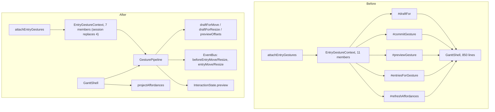

# Gesture host refactor — closing C1–C5

**Slice:** S3 · **Position:** after S3.4, before S3.5 · **Source:** [`plans/reviews/2026-08-30-s3.1-s3.3-impl.html`](../reviews/2026-08-30-s3.1-s3.3-impl.html), Simplify candidates 1–5.
**Status:** done · **Ends with:** one home for `EntryGestureContext`, gesture commit/preview/draft
logic in one deep module (`GesturePipeline` — "Host" is a retired word, D-S1.11-6/#64),
all five checks green. `gantt-shell.ts` shrank from 850 to 719 at HEAD (694 after D-GH-4, then S3.5
wiring added the 25 back). Leftover D-S3-17 ghost work lives in
[`s3.5-keyboard-parity-and-async-veto.md`](./s3.5-keyboard-parity-and-async-veto.md) §4, not here.

## 0. Why now, not later

The 2026-08-30 review re-ran C1–C5 against S3.4 (uncommitted at review time, now on `main`) and found
every candidate **still applicable, none shrinking**:

- **C1** (collapse the gesture-host cluster) — `gantt-shell.ts` grew to 850 lines; S3.4 added
  `#resolveResizableItemId` and folded resize into `#commitGesture`/`#draftFor` on top of the S3.3
  cluster. The private-method fan grew, didn't shrink.
- **C2** (deepen `EntryGestureContext`) — still 11 members, including the still-unused `pointerAt`
  stub. S3.4 added no new members (good) but didn't remove any either.
- **C3** (affordance projector) — `#refreshAffordances`/`#resolveResizableItemId` are still
  interleaved with `applyState` on the shell; S3.4 added a second consumer of the same mixed shape.
- **C4** (gesture commit pipeline) — **confirmed**, not just predicted: `#commitGesture` forks on
  `gesture.kind === 'resize'` vs move, each branch emitting its own before/after pair inline, exactly
  as the 2026-08-29 review predicted it would if left on the shell.
- **C5** (one home for the context type) — `gantt-shell.ts:54–85` still hand-mirrors
  `EntryGesture`/`EntryGestureContext` from `interaction/entry-gesture-context.ts`, now including the
  resize shape too.

S3.5 (keyboard parity + async veto) and S3.6 (extender preview) both add another kind of gesture
outcome to commit and another input to affordance projection. Doing this refactor now means they add
implementation behind an existing seam; doing it after means a third fork in `#commitGesture` and a
twelfth context member. Matches the review's own top recommendation: "Candidates 1 + 2 first — host +
narrow context before S3.4 grows the shell [further]."

## 1. Layer constraint (read before writing code)

`interaction/` may import `view/` (`Interactions`, and after this refactor `EntryGestureContext`
itself); `view/` may **never** import `interaction/` (`.dependency-cruiser.cjs`'s
`interaction-boundary`/`view-boundary` rules). `interaction/` may not import `layout/`, `time/`, or
`render/` at all.

This fixes where each piece can live:

- The gesture **host** (draft math via `layout/gesture-draft.ts`, preview via the shell's rAF, commit
  via `view/event-bus.ts` and `commitEntryEdits`) must stay in `view/` — it needs `layout/` and the
  render backend, which `interaction/` cannot reach.
- The `EntryGestureContext`/`EntryGesture` **type** can now have exactly one owner. Today it is
  declared in `interaction/` and mirrored in `view/` because the mirror was assumed to belong on the
  consumer side. It does not have to: `interaction/` → `view/` is the legal edge, so `view/` can
  declare the type once and `interaction/entry-gestures.ts` imports it — zero mirror, zero drift risk.

## 2. Target shape

```
src/view/entry-gesture-context.ts   (new)  EntryGesture, EntryGestureContext, EntryGestureSession,
                                            EntryHit, DraftOptions — the one declaration.
src/view/gesture-pipeline.ts        (new)  GesturePipeline — owns entriesForGesture, draftFor, commit,
                                            preview/rAF coalescing. Built once in GanttShell's
                                            constructor from narrow deps (preset, selection, entryById,
                                            canGesture, EventBus, commitEntryEdits, applyPreview,
                                            setPending).
src/view/affordance-projection.ts   (new)  projectAffordances() — pure function, hover + selection +
                                            capabilities in, paint ids out. No shell, no applyState.
src/view/gantt-shell.ts             (cut)  Loses #entriesForGesture, #draftFor, #commitGesture,
                                            #previewGesture, #applyPreview, #resolveSnap,
                                            #resolveResizableItemId, and the hand-mirrored
                                            EntryGesture/EntryGestureContext types (lines 54–85).
                                            Keeps hitTest/entryFor/can/rowOrder/selection/setHovered —
                                            those are genuinely paint/selection state, not gesture math.
src/interaction/entry-gesture-context.ts   (deleted) — superseded by view/entry-gesture-context.ts.
src/interaction/entry-gestures.ts   (cut)  Pointer machine holds an EntryGestureSession instead of
                                            armedEntries + three separate ctx calls.
```



## 3. Decisions

### D-GH-1 — `EntryGestureContext` moves to `view/`, `session()` replaces four members

```ts
// src/view/entry-gesture-context.ts
export type EntryGesture = { kind: 'move' } | { kind: 'resize'; edge: 'start' | 'end' };
export interface DraftOptions { suspendSnap?: boolean }
export interface EntryHit { itemId: ItemId; edge?: 'start' | 'end' }

export interface EntryGestureSession {
  /** Raw-pixel preview (D-S3-3/12 realigned, see §4) — coalesced on the pipeline's own rAF. */
  preview(dxPx: number, options?: DraftOptions): void;
  /** Snapped write: beforeEntry{Move,Resize} → commitEntryEdits → entry{Move,Resize}. */
  commit(dxPx: number, options?: DraftOptions): Promise<boolean>;
  /** S3.5: one snap-unit step through commit's veto/pending path. */
  nudge(direction: 1 | -1, options?: DraftOptions): Promise<boolean>;
  /** Escape / pointer cancel — clears the preview, writes nothing. */
  cancel(): void;
}

export interface EntryGestureContext {
  hitTest(x: number, y: number): EntryHit | undefined;
  entryFor(itemId: ItemId): Entry | undefined;
  can(capability: keyof Interactions, entry: Entry): boolean;
  rowOrder(): readonly EntryId[];
  selection: { get(): readonly EntryId[]; propose(next: readonly EntryId[]): void };
  setHovered(itemId: ItemId | undefined): void;
  /** Arms a gesture on the grabbed entry (+ capable co-selected entries, D-S3-19/22). Returns
   *  undefined when nothing capable is grabbed — replaces entriesForGesture()'s length check that
   *  `start()` in entry-gestures.ts currently inspects by hand. */
  session(grabbed: EntryId, gesture: EntryGesture): EntryGestureSession | undefined;
}
```

`pointerAt` is dropped, not carried forward empty — same call the 2026-08-29/2026-08-30 reviews
already made ("leave it off until the extender ghost needs it"); S3.6 adds it back when there is a
real reader. Member count: 7, down from 11, with `session()` absorbing what `entriesForGesture` +
`draftFor` + `commit` + `preview` did.

`interaction/entry-gestures.ts` changes shape to match: `grabbedId`/`grabbedEdge`/`armedEntries`
collapse into one `let session: EntryGestureSession | undefined`, set in `drag.start()` from
`ctx.session(grabbedId, currentGesture())`, read in `move()`/`commit()`/`cancel()`. This is the one
behavior-preserving rewrite of `entry-gestures.ts` this refactor requires — same pointer semantics
(D-S3-10), same snap-on-commit behavior, different shape for holding gesture state.

### D-GH-2 — `GesturePipeline` owns draft, preview, and the commit pipeline

```ts
// src/view/gesture-pipeline.ts
export interface GesturePipelineDeps {
  timeZone(): string;
  timeScale(): TimeScale;
  preset(): ViewPreset;                                  // snap resolves inside the pipeline
  selection(): readonly EntryId[];
  entryById(id: EntryId): Entry | undefined;
  canGesture(capability: keyof Interactions, id: EntryId): boolean;
  commitEntryEdits(edits: EntryEdits): boolean;
  emit: EventBus<GanttEventMap, AsyncCancelableEvent>['emit'];
  applyPreview(preview: readonly ItemPreview[] | undefined): void;
  setPending(itemIds: readonly ItemId[] | undefined): void;
}
export class GesturePipeline {
  constructor(deps: GesturePipelineDeps);
  session(grabbed: EntryId, gesture: EntryGesture): EntryGestureSession | undefined;
}
```

`#commit` is still one file (closes C4's "spread across shell state"), but the move and resize
bodies are still written twice — event names and `edge` only. Fold that fork in the S3.5 D-S3-17
follow-up; isolation does not require the body twice. S3.6's extender preview did **not** add a
third commit kind; it feeds `#computePreview` only.

Preview rAF coalescing (`#previewFrame`, `#pendingPreviewDraft`) moved into `GesturePipeline`
verbatim.

`GanttShell`'s constructor builds one `GesturePipeline` from its own primitives and wires
`ctx.session = (grabbed, gesture) => this.#gesturePipeline.session(grabbed, gesture)`.

### D-GH-3 — Affordance projection is a pure function

```ts
// src/view/affordance-projection.ts
export interface AffordanceInputs {
  hoveredItemId: ItemId | undefined;
  selection: readonly EntryId[];
  itemEntryIds: ReadonlyMap<ItemId, EntryId>;
  canGesture(capability: keyof Interactions, id: EntryId): boolean;
}
export interface AffordanceIds {
  hoveredItemId?: ItemId;
  movableItemId?: ItemId;
  resizableItemId?: ItemId;
}
export function projectAffordances(inputs: AffordanceInputs): AffordanceIds;
```

Pure, Node-testable, no `InteractionState`/`applyState` knowledge — `#refreshAffordances` shrinks to
"compute, `setOptional` × 3, `applyState`" (D-S3-6's resolution rule, `#resolveResizableItemId`'s hover-
wins-over-selection logic, moves in unchanged). This is the smallest of the five candidates and has no
sequencing dependency on D-GH-1/2 — it can land first or in parallel.

### D-GH-4 — Realign D-S3-3/D-S3-12 while touching this file

The 2026-08-30 review's Spec axis flagged the same file: D-S3-3 says "snap the pointer," D-S3-12 says
"Alt suspends snapping for fine placement during a gesture," but commit `4105b08` made live preview
always raw and snap only on write. Since `GesturePipeline.session().preview()`/`.commit()` is the new home
for this logic, update the two decision records in `plans/s3-direct-manipulation/s3.3-drag-move.md` to
read "smooth (unsnapped) preview; snap applied on write; Alt suspends snap on write, not preview" —
matching what the code already does. No behavior change, doc-only, bundled here because it is the same
lines this refactor touches anyway.

## 4. Migration order

Each step keeps all five checks green before starting the next — no big-bang rewrite.

1. **D-GH-3 first** (affordance projector) — smallest, no interface change for `entry-gestures.ts`,
   lowest risk. Extract `projectAffordances`, add its unit tests, wire `#refreshAffordances` to call
   it. Commit.
2. **D-GH-2** (`GesturePipeline`) — move `#entriesForGesture`/`#draftFor`/`#resolveSnap`/`#commitGesture`/
   `#previewGesture`/`#applyPreview` into `src/view/gesture-pipeline.ts` verbatim (no logic change yet),
   keep the *existing* wide `EntryGestureContext` shape in `gantt-shell.ts` calling straight through to
   the new pipeline's individual methods. Proves the extraction is behavior-preserving before the interface
   also changes. Commit.
3. **D-GH-1** (`session()`, single type home) — add `view/entry-gesture-context.ts`, change
   `GesturePipeline` to expose `session()`, rewrite `entry-gestures.ts`'s pointer machine to hold a session
   instead of `armedEntries`, delete `interaction/entry-gesture-context.ts` and the mirror in
   `gantt-shell.ts`, update `interaction/index.ts`'s re-exports to point at `view/`. Commit.
4. **D-GH-4** (spec doc realignment) — trivial doc edit, same commit as step 3 or its own.

## 5. Files

| File | Change |
|---|---|
| `src/view/affordance-projection.ts` | new — `projectAffordances` |
| `src/view/affordance-projection.test.ts` | new — pure unit tests, hover/selection/capability matrix |
| `src/view/gesture-pipeline.ts` | new — `GesturePipeline`, `GesturePipelineDeps` |
| `src/view/gesture-pipeline.test.ts` | new — draft/preview/commit/veto/multi-select |
| `src/view/entry-gesture-context.ts` | new — canonical `EntryGesture`/`EntryGestureContext`/`EntryGestureSession`/`EntryHit`/`DraftOptions` |
| `src/view/index.ts` | export the new context types |
| `src/view/gantt-shell.ts` | delete `#entriesForGesture`, `#draftFor`, `#resolveSnap`, `#commitGesture`, `#previewGesture`, `#applyPreview`, `#resolveResizableItemId`, the `EntryGesture`/`EntryGestureContext` mirror (lines 54–85); construct `#gesturePipeline`; `#refreshAffordances` calls `projectAffordances` |
| `src/interaction/entry-gesture-context.ts` | deleted |
| `src/interaction/entry-gestures.ts` | `armedEntries`/`grabbedId`/`grabbedEdge` → one `session: EntryGestureSession \| undefined`; import context types from `../view/index.js` |
| `src/interaction/entry-gestures.test.ts` | update fakes to the new `session()`-shaped context |
| `src/interaction/index.ts` | re-export context types from `../view/index.js` instead of the deleted local file |
| `plans/s3-direct-manipulation/s3.3-drag-move.md` | D-S3-3/D-S3-12 wording realignment (D-GH-4) |
| `.dependency-cruiser.cjs` | comment update only if the `interaction-boundary` rule's rationale comment references the old file path |

## 6. Tests

- `affordance-projection.test.ts`: hover wins over selection; selection fallback only at exactly one
  selected entry; incapable hover/selection resolves to `undefined`; existing `gantt-shell.test.ts`
  cases for `movableItemId`/`resizableItemId` move here or stay as thin integration checks.
- `gesture-pipeline.test.ts`: move draft (single + multi-select), resize draft (both edges, milestone/
  derived-span refusal), sync veto (`beforeEntryMove`/`beforeEntryResize` returning `false`), async
  `MutationCancelledError` → `false`, preview rAF coalescing (multiple `preview()` calls before a
  frame flush paint only the last). Multi-select is armed in tests today; a multi-entry draft/commit
  and an end-edge preview case still sit on the S3.5 follow-up if that change set touches the file.
- `entry-gestures.test.ts`: rewrite the fake `EntryGestureContext` to the `session()` shape; keep
  every existing `[S3-A1]`/`[S3-A2]` scenario (drag threshold, Escape mid-drag no commit, ctrl/shift
  selection unaffected by a gesture) passing unchanged in behavior.
- No new e2e coverage required — this is an internal reshape; `e2e/resize.spec.ts` and the drag-move
  e2e tests are the regression backstop that behavior did not change.

## 7. Gate

All five existing checks, run after each numbered step in §4, not just at the end:

```
pnpm vitest run
tsc --noEmit
eslint src harness
depcruise --config .dependency-cruiser.cjs src harness
node scripts/guard-red-test.mjs
```

`depcruise` is the one that actually proves C5 closed — it fails if anything in `view/` ever imports
`interaction/`, which is the constraint the whole "single home" design leans on.

## 8. TODO

- [x] D-GH-3: `projectAffordances`, its tests, `#refreshAffordances` wired to it
- [x] D-GH-2: gesture pipeline extraction, behavior-preserving, existing wide context still calls
      through. Landed as `GesturePipeline`, not the plan's original name "GestureHost" — "Host" is a
      retired word (D-S1.11-6, #64) for the same failure class as the retired "chart" (#7).
- [x] D-GH-1: `session()`-shaped context, `view/entry-gesture-context.ts` as sole type home,
      `interaction/entry-gesture-context.ts` deleted, `entry-gestures.ts` rewritten to hold a session
- [x] D-GH-4: D-S3-3/D-S3-12 already read smooth-preview/snap-on-write — landed earlier in `cbc781a`
      ("Address S3.1-S3.3 review"), before this refactor started. No doc edit was needed.
- [x] **Visible:** `git grep -rn "interface EntryGestureContext" src` finds exactly one declaration;
      all five checks green; full e2e suite (including `resize.spec.ts` and `data.spec.ts`'s
      drag-move/undo coverage) passes unchanged. `gantt-shell.ts` is 719 lines at HEAD (694 after
      D-GH-4; S3.5 shared context / keyboard / `setPending` added 25). Every method the plan's §2
      "cut" list named is gone (verified by grep). The residual is the shell's non-gesture surface
      (viewport/theme/scroll/splitter/pane wiring) — out of C1–C5; do not split it in this plan.
- [ ] Leftover `#commit` fold, pending-ghost, two "pending" field names — tracked under S3.5 §4
      follow-up, not a new D-GH step.
