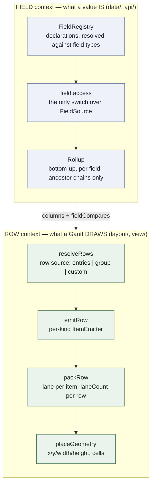

# S4 — Hierarchy, grouping, multi-item rows

**Slice:** S4 (`plans/03` §S4) · **Position:** after S3, before S5 · **Status:** S4.1–S4.4 done; continue at **S4.5**
**Form:** the same settled-spec form as [`plans/s3-direct-manipulation/README.md`](../s3-direct-manipulation/README.md) — this file is the tracker and the shared context; each step file holds the decisions it implements and its TODO boxes.
**Tick as you go:** When you finish a TODO item, tick its box in that step file. Tick it in the same change as the code. Tick each item when it lands. Do not wait for S4.11 or the slice gate.
**Last review:** [`plans/reviews/2026-08-31-s4.3-s4.4.html`](../reviews/2026-08-31-s4.3-s4.4.html) — S4.3/S4.4 branch review. Spec-review findings already landed in this spec (2026-08-31): sort binds `FieldCompare` from declared Fields; `emitRow`/`packRow`; X2 is `'header'`; `CustomRow` is the public custom-source DTO.
**Governed by:** `plans/00` D2/D7/D8, `plans/01` §2.3/§2.5/§2.6/§4/§6, `plans/02` §2/§4.1/§4.2/§6, ADR [0005](../../docs/adr/0005-fields-are-declared-and-grid-columns-reference-them.md).
**Builds on:** S2 data core (transactions, changesets, undo, JSON), S3 gestures, S1's height index and `FrameLayout`.
**Closes:** issue #80 (per-field rollup), #81 (row cells), ADR 0005's two open questions, `plans/03` §S4's three known gaps (#91 §9-B, §9-E, §9-G).

> **What this slice is not.** No plugin runtime and no public registration API — a consumer cannot register a field, a column, an item emitter or a renderer from outside yet. That is S5. No `cellRenderer`, no inline editing, no column resize or reorder — also S5. No `Dependency`, no `schedule()`, no link geometry — S7. `layout/` never imports `data/`; `data/` never imports `view/`.

---

## 0. Scope calls — confirmed

| # | Question | Answer |
|---|---|---|
| **Q1** | Does S4 ship the **public** way to register a Field, a Grid column or an Item emitter? | **No — only the registries and the shipped occupants.** A consumer declares Fields through `DatasetOptions.fields` (data, not code registration) and orders columns through `Gantt.gridColumns`. Registering an *emitter* or a *renderer* needs `PluginContext`, which is S5's. S4 ships `ItemEmitter` with three occupants and no way in from outside; tests inject through an internal option. Same posture S2 took for the extender slot (D-S2-6). §S4.7, D-S4-24. |
| **Q2** | Does the Rollup gate stay `derivedSpanKinds`? | **No — it widens and it is renamed `rollUpKinds`.** Once `cost` rolls up, a gate whose name says "span" governs values that are not spans. Widening the meaning under the old name is the drift CLAUDE.md's naming rule forbids (#7). The rule itself is the one that reads correctly: a parent of a rolling-up Kind derives **every** rolling-up Field; a parent of any other Kind keeps its authored values. §S4.2, D-S4-6. |
| **Q3** | Does the Document carry Field declarations? | **The data half, yes; the code half, no.** Without them, `fromJSON(toJSON(d))` returns a Dataset that still holds rolled-up values but no longer maintains them — a silent corruption on the next edit. `fields` joins the Document; `equals`, `compare`, `formatValue`, `fieldTypes` and `aggregators` are code the reading application supplies, through a second `fromJSON` parameter. Omitted `source` is written **resolved**. `schema` goes to 2. §S4.4, D-S4-15, D-S4-16, D-S4-35. |
| **Q4** | Where do sort and filter live? `plans/03` §S4 says "store-level view specs". | **On the row source, not on the Store.** Sorting the Store would reorder `entries.all`, and that order is what makes `toJSON` byte-stable (D-S2-12). A view knob must not rewrite the Document. `rows: { source: 'entries', tree: true, sort, filter }` is one config tree for one job (`plans/02` §1). `plans/03` §S4 is edited to match. §S4.9, D-S4-28. |
| **Q5** | Does an Aggregator that throws roll the transaction back, or keep the stored value? (ADR 0005's open question) | **It rolls the transaction back**, with a named `AggregatorFailedError`. Keeping the stored value leaves a parent whose value no longer follows its children, with nothing said — principle 6 ("diagnostics over silent fixes") forbids exactly that, and a diagnostics channel does not exist before S7. §S4.2, D-S4-9. |
| **Q6** | Are shipped Aggregators maintained incrementally while consumer ones force a full walk? (ADR 0005's other open question) | **No — one path for both.** Every Aggregator recomputes the ancestor chains of the touched entries. A two-speed design would give a consumer field different commit semantics from `start`, which is the second code path ADR 0005 exists to remove. §S4.2, D-S4-8. |
| **Q7** | Does `computeFrame` grow row sources, trees, emitters and packing inside its current loop? | **No.** It becomes composition over four named stages, each its own module with one reason to change. The function is 293 lines and already carries culling, header bands and decorations; four more concerns inside it is the ball of mud this slice is most likely to produce. §S4.6, D-S4-19. |
| **Q8** | Is `hierarchy: { autoGroup: true }` the default? | **No — the default is `false`.** Promotion writes `kind` into the Document, and `kind` is authored (`01` §2.5). A library that rewrites an authored field nobody asked it to touch is not honest. The harness turns it on; the demo is the argument for it. §S4.5, D-S4-17. |
| **Q9** | Is `progress` a core Field? | **No — it is scheduling-plugin data (ADR 0008).** It is not on `Entry`. `weightedMeanByDuration` still ships as an Aggregator. |
| **Q10** | How does a Field become a Grid column? | **It declares `column`.** Same split AG Grid uses (row data vs `columnDefs`), except aggregation stays on the Field, not on the column. `gridColumns` lists which columnable Fields this Gantt shows. Default is still `['name']`. `parentId` / `segments` / `meta` have no `column`. Naming them throws `FieldNotColumnableError`. §S4.3, D-S4-12. |
| **Q11** | What does a shipped Aggregator do with holes? | **It skips them** and never throws. All skipped → `undefined` (keep stored). §S4.1, D-S4-3. |
| **Q12** | After a Segment write, who owns `start`/`end`? | **The envelope, in the same transaction.** A `start`/`end` write on a segmented entry throws `SegmentsOutOfSyncError`. §S4.10, D-S4-30. |
| **Q13** | Does `autoGroup` promote a `'milestone'`? | **No.** `'span'` only. Already-`'group'` is a no-op. No throw. §S4.5, D-S4-17. |
| **Q14** | What is in `gantt.collapsed`, and what does a grouping-header cell show? | **`RowId`s.** Entries-source ids equal `EntryId`. Header `cells[0]` is `headerLabel`; the rest are empty. §S4.6, D-S4-22, D-S4-23. |
| **Q15** | Does `transaction.ts` keep a static import of the Rollup? | **Yes — it is the one importer**, same as S2's span leaf. Default is on. `rollUpKinds: 'none'` (or `[]`) keeps the values the caller assigned on the parent. Delete `rollup.ts` is that same stored result. No public `rollUp` function. §S4.2, D-S4-6, D-S4-7. |
| **Q16** | If a Field omits `rollUp`, what happens? | **After Field-type merge, it does not participate — unless the type supplied a name.** A Field type's `rollUp` is the default Aggregator name (shipped or a consumer name in `aggregators`). The Field's own keys win, so `rollUp: 'none'` opts that Field out. There is no global default Aggregator and no shipped `number`/`instant` types. Dates use `min`/`max`, not `sum`. §S4.1, D-S4-3. |
| **Q17** | Must `{ key: 'cost', type: 'money' }` also name `source: { from: 'meta', key: 'cost' }`? | **No.** Omitted `source` is `meta` under the Field key (D-S4-35). `Entry` stays closed: top-level unknown keys still drop; `update({ cost })` writes `entry.meta.cost` and creates `meta` if needed. Two Fields may not share one `meta` slot (`DuplicateFieldSourceError`). The long form remains for a remapped Document key. |
| **Q18** | Where does currency formatting live? | **`formatValue` on the Field type.** Money stays a number in the store. The cell is text. `cellRenderer` is S5, on the Grid column. §S4.3, D-S4-14. |
| **Q19** | Can a view override sort order? | **Yes — `RowSort.compare`.** Default is `asc`/`desc` on the **stored** value, never on `formatValue`. Then `FieldCompare.compareStored` (every declared Field, same Gantt locale bind as columns), then a shipped compare. Sort does not require the Field on the Grid. §S4.3, S4.9, D-S4-13, D-S4-28. |
| **Q20** | Whose `locale` drives `formatValue` and default string sort? | **This Gantt's `locale`, at resolve time.** `ResolvedColumn.format` and `FieldCompare.compareStored` are bound then. `FieldContext` has no `locale`. A headless `Dataset` does not format cells. `locale` does not travel in the Document. §S4.3, D-S4-13. |
| **Q21** | How do I ship a custom rollup? | **Register the function in `aggregators`, name it on the Field or Field type.** `rollUp` is always a name (`'sum'`, `'riskWeighted'`), never a bare function — the name serializes; the function travels with the app (`fromJSON`'s second argument). One registration can serve many Fields. §S4.1, D-S4-3; `02` §4.2 level 4. |

---

## 1. User stories

Each story names the step that owns it. Acceptance boxes live in the step files.

- **U1.** (consumer) I declare `{ key: 'cost', type: 'money' }`. Each parent shows the sum of its children. I wrote no aggregation code. → S4.1, S4.2
- **U2.** (consumer) I call `dataset.entries.update('t1', { start: X, cost: 500 })`. That is one transaction, one changeset, one undo step — across a core Field and my own. → S4.1, S4.3
- **U3.** (consumer) I misspell a Field key. The call throws `UnknownFieldError` and writes nothing. → S4.1
- **U4.** (consumer) I set `gantt.gridColumns = ['name', 'start', 'duration', 'cost']`. Four columns appear, each formatted by its Field. → S4.3
- **U5.** (consumer) I save `toJSON()`, reload with `fromJSON(doc, { aggregators })`, and my parents keep summing. → S4.4
- **U6.** (consumer) I see a tree in the grid pane. I click a twisty and the subtree collapses. The data does not change. → S4.6
- **U7.** (consumer) I switch `gantt.rows` from the tree to `{ source: 'group', groupBy }`. The same Gantt re-resolves rows and keeps its scroll position. → S4.6
- **U8.** (consumer) An entry with `segments` draws several bars on one row. I drag one of them and only that segment moves. → S4.7, S4.10
- **U9.** (consumer) I turn on `heightMode: 'pack'`. Overlapping items stack into lanes and the row grows to fit them. → S4.8
- **U10.** (consumer) I filter to one team. A matching deep child still appears under its chain of parents. → S4.9
- **U11.** (consumer) I turn on `autoGroup`. Reparenting an entry promotes its new parent to `'group'` in the same undo step. Removing the last child demotes nothing. → S4.5
- **U12.** (reviewer) I run `pnpm gate` on `.slice` = `S4` and read eleven lines, each naming an acceptance box from `plans/03` and each backed by a test that ran. → S4.11
- **U13.** (consumer) I set `rollUpKinds: 'none'` and assign `start`/`end`/`cost` on the parent. A child edit leaves those values. → S4.2
- **U14.** (consumer) I set `filterPolicy: 'matchOnly'`. Only matching entries appear — no ancestor rows. → S4.9
- **U15.** (consumer) I supply `{ source: 'custom', resolve }`. My rows appear in the Gantt. → S4.6
- **U16.** (consumer) I register `aggregators: { riskWeighted: fn }` and set `rollUp: 'riskWeighted'` on a Field type. Parents roll up with my function. I did not put a function on `rollUp`. → S4.1

---

## 2. The two contexts this slice adds

S4 is the largest slice, so it is split into two contexts that meet at exactly one place. Keeping them apart is what stops the slice from becoming one change.



**Cells meet Fields at `LayoutInput.columns`.** Sort meets Fields at `RowResolutionInput.fieldCompares`. `view/` binds both with this Gantt's locale. `layout/` never imports `data/`, and `data/` never learns that a Gantt exists. Everything else in the two contexts is independent, which is why the step order can interleave them freely.

---

## 3. Step map

Eleven steps, in order. The Field context lands first, because the row cells and the grid columns read from it. Open the step file for decisions, files, tests and checkboxes. When an item in that file is done, tick its box in the same change.

| Step | Plan | Ends with |
|---|---|---|
| S4.1 | [`s4.1-field-registry.md`](./s4.1-field-registry.md) | `update('t1', { cost: 500 })` commits one changeset row keyed `cost` |
| S4.2 | [`s4.2-rollup.md`](./s4.2-rollup.md) | a parent's `cost` is the sum of its children, undoably |
| S4.3 | [`s4.3-grid-columns-and-cells.md`](./s4.3-grid-columns-and-cells.md) | four columns in the grid pane, live-reconfigurable |
| S4.4 | [`s4.4-serialization.md`](./s4.4-serialization.md) | `schema: 2` round-trips a declared Field |
| S4.5 | [`s4.5-autogroup-and-hierarchy-edits.md`](./s4.5-autogroup-and-hierarchy-edits.md) | reparenting promotes a parent in one undo step |
| S4.6 | [`s4.6-row-sources.md`](./s4.6-row-sources.md) | a tree with twisties; `gantt.rows` switches sources live |
| S4.7 | [`s4.7-item-emission.md`](./s4.7-item-emission.md) | brackets, diamonds, and N bars for N segments |
| S4.8 | [`s4.8-lane-packing-and-heights.md`](./s4.8-lane-packing-and-heights.md) | pack-mode rows grow to fit their lanes |
| S4.9 | [`s4.9-sort-and-filter.md`](./s4.9-sort-and-filter.md) | filter keeps ancestors; sort stays within a parent |
| S4.10 | [`s4.10-tree-and-lane-interaction.md`](./s4.10-tree-and-lane-interaction.md) | drag one segment; collapse from the keyboard |
| S4.11 | [`s4.11-harness-and-gate.md`](./s4.11-harness-and-gate.md) | `hierarchy.html`, e2e, spec edits, gate green |

---

## 4. Acceptance ids

`plans/03` §S4's eleven boxes become `[S4-A1]`–`[S4-A11]` when S4.11's spec edits land.

| Id | Box | Owning step | Primary tests |
|---|---|---|---|
| `[S4-A1]` | A declared `meta` Field sums up the tree, shows beside `start`, edits in the same `update()` and undo step as a core Field, and round-trips | S4.1–S4.4 | `data/rollup.test.ts`, `data/serialization/*.test.ts`, `api/dataset.test.ts` |
| `[S4-A2]` | An edit naming an unregistered key throws `UnknownFieldError` — never a silent write | S4.1 | `data/entry-store.test.ts` |
| `[S4-A3]` | Switching `gantt.rows` re-resolves rows with no remount; scroll survives | S4.6 | `api/gantt.test.ts`, `layout/rows/*.test.ts` |
| `[S4-A4]` | A segmented entry renders N bars on one row; one segment drags transactionally | S4.7, S4.10 | `layout/items/*.test.ts`, `interaction/entry-gestures.test.ts` |
| `[S4-A5]` | Pack-mode rows change height as overlaps come and go; scroll stays stable | S4.8 | `layout/lanes/*.test.ts`, `layout/frame-layout.test.ts` |
| `[S4-A6]` | Collapse state survives data edits and is independent per Gantt | S4.6 | `view/collapse-state.test.ts`, `api/gantt.test.ts` |
| `[S4-A7]` | Filter with keep-ancestors shows a matching deep child under its parents | S4.9 | `layout/rows/filter.test.ts` |
| `[S4-A8]` | An empty `'group'` renders as a group, accepts children, and gains a span — no special-casing | S4.7 | `layout/items/*.test.ts`, `data/rollup.test.ts` |
| `[S4-A9]` | `autoGroup` promotes in the same undo step; losing the last child demotes nothing | S4.5 | `data/hierarchy.test.ts`, `data/history.property.test.ts` |
| `[S4-A10]` | `filterPolicy: 'matchOnly'` returns only matching entries — no ancestor rows | S4.9 | `layout/rows/filter.test.ts` |
| `[S4-A11]` | `{ source: 'custom', resolve }` produces the resolver's rows | S4.6 | `layout/rows/custom-source.test.ts` |

**Gate S4 → S5** (`plans/00` §4): field registry live; tree and grouped row sources; pack-mode row heights; item identity deterministic.

---

## 5. Public surface (app author)

What an app author gains. No registry handle. The Rollup runs by default.

```ts
import { Dataset, Gantt } from 'freegantt';

const dataset = new Dataset({
  timeZone: 'America/Chicago',
  rollUpKinds: ['group'],                     // default; `'none'` keeps caller-assigned parent values
  hierarchy: { autoGroup: true },             // default false
  fieldTypes: { money: { rollUp: 'sum', formatValue: asCurrency, column: { align: 'end' } } },
  aggregators: { riskWeighted: (children, parent, ctx) => /* … */ },
  fields: [{ key: 'cost', type: 'money' }],
  entries,
});

dataset.entries.update('t1', { start: '2026-10-05', cost: 12_000 });   // one changeset, one undo step

const gantt = new Gantt({
  container, dataset,
  gridColumns: ['name', 'start', 'duration', { field: 'cost', header: 'Budget' }],
  rows: { source: 'entries', tree: true, heightMode: 'pack', filter: byTeam, sort: { field: 'start' } },
});

gantt.rows = { source: 'group', groupBy: (entry) => entry.meta.team };
```

Group headers render the `groupBy` label in column 0 and **blank cells** elsewhere. Per-team aggregates are the caller's data — declare a computed Field or write through a group entry (D-S4-11). The grid does not invent them.

```ts
gantt.collapse('p1');
gantt.on('collapseChange', ({ to }) => save(to));
```

| Export | Step |
|---|---|
| `Field`, `FieldSource`, `FieldType`, `FieldKey`, `Aggregator`, `AggregatorName`, `FieldContext`, `FormatContext`, `RollUpContext` | S4.1 |
| `DatasetOptions.fields` / `.fieldTypes` / `.aggregators` / `.rollUpKinds` (`'none'` or Kind list), `Dataset.field(key)` / `Dataset.fields.all` (resolved read view), `entries.fieldValue` | S4.1, S4.2 |
| `AggregatorFailedError`, `DuplicateFieldKeyError`, `DuplicateFieldSourceError`, `UnknownAggregatorError` | S4.1, S4.2 |
| `DatasetOptions.hierarchy`, `Dataset.hierarchy` | S4.5 |
| `GridColumn`, `GridColumnInput`, `Gantt.gridColumns` | S4.3 |
| `Dataset.fromJSON(doc, options?)`, `schema: 2` | S4.4 |
| `RowSource`, `EntriesRowSource`, `GroupRowSource`, `CustomRowSource`, `CustomRow`, `Gantt.rows` | S4.6 |
| `Gantt.collapsed`, `collapse`, `expand`, `toggleCollapse`, `beforeCollapseChange`/`collapseChange`, `CollapseChange` | S4.6 |
| `RowFilter`, `RowSort` | S4.9 |
| Parts: `fg-row-cell`, `fg-row-twisty`, `fg-bar-bracket`, `fg-bar-diamond`; tokens `--fg-indent-width`, `--fg-lane-gap` | S4.3, S4.6, S4.7, S4.8 |

**Not public:** `FieldRegistry`, `readField`/`writeField`, `ItemEmitter` registration, `PlannedRow`, `LanePacking`, `FrameMemory` — internal registry and pipeline shapes.

**Retired by this slice:** `DatasetOptions.derivedSpanKinds`, `Dataset.derivedSpanKinds`, `Dataset.isDerivedSpanKind` (→ `rollUpKinds`, `isRollUpKind`). Pre-1.0, no released consumers, so the rename ships with no alias — ADR 0003's own precedent.

---

## 6. Decisions index

Full prose lives in the step file that implements each decision.

| Decision | Topic | Step |
|---|---|---|
| D-S4-1 | Types in `model/`, one registry in `data/`, whole declaration stored | S4.1 |
| D-S4-2 | One `FieldSource` adapter | S4.1 |
| D-S4-3 | Aggregators by name; skip holes; no function on the Field | S4.1 |
| D-S4-4 | Core Fields are ordinary declarations; no `progress` | S4.1 |
| D-S4-5 | Declaration errors at construction | S4.1 |
| D-S4-35 | Omitted `source` is `meta` under the Field key | S4.1 |
| D-S4-6 | `derivedSpanKinds` → `rollUpKinds`; `'none'` keeps authored parents | S4.2 |
| D-S4-7 | `rollup.ts` is a leaf; one importer `transaction.ts`; default on | S4.2 |
| D-S4-8 | Ancestor chains only; one path for every Aggregator | S4.2 |
| D-S4-9 | `AggregatorFailedError` fails the transaction | S4.2 |
| D-S4-10 | Computed Fields memoized on dataset revision | S4.2 |
| D-S4-11 | View state never changes a stored value | S4.2 |
| D-S4-12 | `gridColumns` is names plus overrides; `column` means columnable | S4.3 |
| D-S4-13 | Visible `columns` for cells; `fieldCompares` for sort | S4.3 |
| D-S4-14 | `formatValue` is text; renderers stay out of `data/` | S4.3 |
| D-S4-15 | The Document carries the data half of a Field | S4.4 |
| D-S4-16 | `schema: 2`, and `schema: 1` still reads | S4.4 |
| D-S4-17 | `autoGroup` defaults to `false`; promotes `'span'` only | S4.5 |
| D-S4-18 | Promote only, never demote | S4.5 |
| D-S4-19 | `computeFrame` becomes four stages; `emitRow` / `packRow` | S4.6 |
| D-S4-20 | Rows resolve whole-dataset; placement windowed; emit/pack on-demand | S4.6 |
| D-S4-21 | One `RowSource` interface, three occupants; public `CustomRow` | S4.6 |
| D-S4-22 | Collapse is Gantt state; ids are `RowId`s | S4.6 |
| D-S4-23 | `Row.kind: 'header'` stands for no Entry; `headerLabel` | S4.6 |
| D-S4-24 | `ItemEmitter` seam, three occupants, no public registration | S4.7 |
| D-S4-25 | One Item per Segment; one id builder | S4.7 |
| D-S4-26 | Lane packing memoized; the height index forces it | S4.8 |
| D-S4-27 | `heightMode` on the row source; scroll is a pixel position | S4.8 |
| D-S4-28 | Sort and filter belong to the row source | S4.9 |
| D-S4-29 | Filter keeps ancestors; sort stays within a parent | S4.9 |
| D-S4-30 | A Segment drag writes `segments` and the envelope | S4.10 |
| D-S4-31 | Row reorder and reparent **by drag** are not S4's | S4.10 |
| D-S4-32 | `rowOrder()` retires | S4.10 |
| D-S4-33 | Keyboard collapse and expand | S4.10 |
| D-S4-34 | One harness page, one Gantt, one `rows` switch | S4.11 |

---

## 7. Agent gotchas

Read these before you touch `src/`.

1. **`layout/` must not import `data/`.** The Field registry lives in `data/`; the resolved columns reach `layout/` as plain data on `LayoutInput`. `depcruise` catches a direct import; `LayoutInput.columns` is the fix.
2. **`data/` must not import `view/` or `layout/`.** A `Field.column` sub-object is plain data that `data/` carries and never interprets. A renderer is code that `data/` must never hold — keep it on the Gantt (S5).
3. **One `switch` over `FieldSource`, in `data/fields/field-access.ts`.** A second one anywhere is the finding, not a style nit.
4. **`computeFrame` is composition after S4.6.** Do not add a branch to it. Add a stage, or change the stage that owns the concern.
5. **Never split an `ItemId` inline.** Use `model/ids.ts`'s builder and its new reader. S3's `entryFor(itemId)` already depends on this.
6. **Collapse, filter and sort are view state.** None of them may reach the Rollup, the changeset, or the Document. `[S4-A6]` and D-S4-11 both test this.
7. **`kind` stays authored.** The only automated write to it is `autoGroup`'s promotion, and only when the consumer turned it on.
8. **Review `harness/main.ts` on every commit**, changed or not (CLAUDE.md). Code there that re-derives what the library computes is an API gap to close in `src/`.
9. **Run the full check sequence** after each step: `pnpm vitest run`, `tsc --noEmit`, `eslint src harness`, `depcruise`, `node scripts/guard-red-test.mjs`.
10. **`.slice` bumps only at S4.11** — not before the gate is green.
11. **`data/transaction.ts` is the only importer of `data/rollup.ts`.** Do not add `api/roll-up.ts` or a constructor `rollUp` function. `'none'` is `rollUpKinds`, not a second option.
12. **Omitted `source` is `meta[field.key]`, never a new key on `Entry`.** A top-level `cost` on ingest still drops. Core Fields set `source` explicitly. `toJSON` writes the resolved source.
13. **Sort comparers bind from declared Fields** (`FieldCompare`), not from `gridColumns`. Hiding a column does not change order.
14. **`{ source: 'custom' }` takes `CustomRow[]`.** Adapt in `custom-source.ts`. Do not publish `PlannedRow`.

---

## 8. Foot-guns

| Foot-gun | Answer |
|---|---|
| A consumer field is written but never rolls up | After type merge the Field has no `rollUp` or `'none'`, or the parent's Kind is not in `rollUpKinds` (including `'none'`) (D-S4-3, D-S4-6) |
| `update('t1', { meta: {...} })` loses a declared value | Whole-`meta` write emits the `meta` row **and** one row per changed declared key; apply order is `meta` first (D-S4-2) |
| An aggregate appears in the Document that the consumer did not want | The Field is `entry`- or `meta`-sourced. A `compute` source never reaches the Document (ADR 0005) |
| A consumer Aggregator reads the zoom level | Forbidden. A computed Field reads the Dataset only; its cache key assumes it (D-S4-10) |
| A drag reverts with no message | It does not: an Aggregator that throws raises `AggregatorFailedError` out of the commit (D-S4-9) |
| Collapsing a parent changes its rolled-up value | It cannot. Collapse is `view/` state and never reaches `data/` (D-S4-11) |
| A filtered-out child stops counting toward its parent's sum | It still counts. Filter is a row-resolution question (D-S4-11, D-S4-29) |
| Pack mode makes `contentHeight` cost O(n) per render | It costs one pack per row per revision, memoized. The height index is the only forcing caller (D-S4-26) |
| Switching `rows` scrolls the user to the top | Scroll is a pixel position, clamped against the new content height (D-S4-27) |
| Two Gantts on one Dataset fight over collapse | Collapse is per Gantt, like selection (D-S4-22) |
| `Row.kind: 'header'` is read as "a `'group'` Entry" | It is not. A `'group'` Entry produces a `Row.kind: 'entry'` row (D-S4-23) |
| A segment drag moves the whole entry | The grabbed `ItemId` carries the segment index and the draft writes `segments` (D-S4-30) |
| I declared `cost` but `entry.cost` is undefined | Correct. The Field key is the API; storage is `entry.meta.cost` (D-S4-35). Use `update({ cost })` or read through the Field. |
| A top-level `cost` on the JSON entry never appears | Unknown top-level keys drop. Put the value in `meta`, or write it through `update({ cost })` after construction (D-S4-35). |
| Two Fields silently share `meta.cost` | They cannot. That is `DuplicateFieldSourceError` at construction (D-S4-35). |
| `{ field: 'cost', header: 'Budget' }` drops the Field's `align: 'end'` | It should not. The object form merges per-key over the Field's `column` defaults (D-S4-12). |
| A grouped view shows per-team sums in header cells | It does not. Group headers show the label in column 0 and blank cells elsewhere (D-S4-23, D-S4-11). |
| `derivedSpanKinds` still works | It does not. The option is renamed with no alias; a `schema: 1` Document still reads (D-S4-6, D-S4-16) |
| `sort: { field: 'cost' }` with `gridColumns: ['name']` ignores Field-type `compare` | It must not. Sort reads `fieldCompares`, not visible columns (D-S4-13, D-S4-28). |
| `fromJSON(doc, { fields: [{ key: 'cost', rollUp: 'none' }] })` replaces Document `rollUp: 'sum'` | It does not. Same-key merge keeps Document `rollUp` / `type` / `column` / `source` (D-S4-15). |

---

## 9. Tests (overview)

`pure` (Node) unless noted. Per-step detail lives in each step file §3.

| Area | Files |
|---|---|
| Field registry | `data/fields/field-registry.test.ts`, `field-access.test.ts`, `aggregators.test.ts` |
| Rollup | `data/rollup.test.ts`, `data/rollup.property.test.ts` |
| Edits and changesets | `data/entry-store.test.ts`, `data/change-set.test.ts` |
| Undo | `data/history.property.test.ts` (widened to declared Fields) |
| Serialization | `data/serialization/read.test.ts`, `write.test.ts` |
| Hierarchy | `data/hierarchy.test.ts` |
| Row resolution | `layout/rows/entries-source.test.ts`, `group-source.test.ts`, `custom-source.test.ts`, `filter.test.ts`, `sort.test.ts` |
| Item emission | `layout/items/emit-items.test.ts` |
| Lanes and heights | `layout/lanes/pack-lanes.test.ts`, `layout/frame-layout.test.ts` |
| Frame composition | `layout/frame.test.ts` |
| Columns and paint | `view/grid-columns.test.ts`, `render/dom/index.test.ts` (dom) |
| Collapse | `view/collapse-state.test.ts` |
| Gestures | `interaction/entry-gestures.test.ts`, `keyboard-editing.test.ts` |
| Integration | `api/dataset.test.ts`, `api/gantt.test.ts` |
| E2E | `e2e/hierarchy.spec.ts` |
| Guard | `scripts/guard-red-test.mjs` — `layout/` must not import `data/`; `rollup-is-removable` |

---

## 10. Known gaps this slice closes (issue #91 §9)

| Gap | What it asks | Step |
|---|---|---|
| §9-B | `GanttShell`'s `#wiring` boolean, revisited now that construction wires more | S4.6 |
| §9-E | `RowHeightIndex.heightAt` / `invalidateFrom` finally get production callers — or come out | S4.8 |
| §9-G | `RenderBackend.hitTest(x, y)` names its coordinate space before lane hit-testing lands | S4.10 |

---

## 11. Deferred

| Deferred | Returns at | Needs |
|---|---|---|
| `PluginContext.data.registerField` / `view.registerGridColumn` / `layout.registerItemEmitter` | S5 | Plugin runtime |
| `cellRenderer`, inline cell editing, `beforeEntryEdit` | S5 | Editor host and overlay |
| Column resize and reorder | S5 | Grid chrome |
| Consumer-defined Kind end-to-end (`[S5]` box) | S5 | Public registration at all four seams |
| Full grid a11y (roving tabindex, axe in CI) | S5 | `plans/03` §S5 a11y block |
| Subtree-revision cache key for computed Fields | S6 | The measured spike (D-S4-10) |
| Log-time height index | S6 | The measured spike (D2) |
| Row reorder and reparent **by drag** | when an authored order Field exists | That Field, plus a drop-target vocabulary (D-S4-31). S4 ships the data half: `update(id, { parentId })` |
| Moving a `'group'` moves its subtree | S7 | The extension hook writes children |
| Link endpoints on a multi-item row (`links.endpoints`) | S7 | Link emission (#16) |

---

## 12. Grill later

Parked 2026-08-30 after the Field-type / omit-`source` / formatter / sort pass. Updated 2026-08-31 after landing the final spec-review findings. Grill to try to break the settled answers; do not reopen them casually.

**Settled** (do not reopen casually): Q16–Q21; X2 (`Row.kind: 'header'`); D-S4-3; D-S4-12; D-S4-13 (`columns` vs `fieldCompares`); D-S4-15 same-key merge table; D-S4-19 `emitRow`/`packRow`; D-S4-20; D-S4-21 `CustomRow`; D-S4-23; D-S4-28; D-S4-35; `[S4-A10]` / `[S4-A11]`.

---

### Parked (non-blocking)

❓ **G1 — Nested `meta` paths.** Does `{ key: 'cost' }` ever mean `meta.finance.cost`?

➡️ No. One key, one segment. Nesting is a computed Field or a flatter Document.

---

❓ **G2 — Shipped Field types.** Does core ship `money` / `instant` / `text` with a baked-in `rollUp` and `formatValue`?

➡️ No. The consumer registers `money`. Core `start`/`end` set `min`/`max` on those Fields.

---

❓ **G4 — `update({ cost })` vs `entries.add({ meta: { cost } })`.** Must ingest of `EntryInput.meta.cost` and a later `update({ cost })` be the same slot even when `source` was omitted?

➡️ Yes. Both go to `meta.cost`. D-S4-35's first two table rows.

---

❓ **G5 — Declaring `cost` when passenger data already used `meta.cost` for something else.**

➡️ Declaring claims the key. A Document that stored a string under `cost` and then declares `type: 'money'` is a consumer bug.

---

❓ **G6 — `compare` on the Field type vs only on `RowSort`.**

➡️ Keep Field-type `compare`. It flows into `FieldCompare` at the Gantt locale bind. `RowSort.compare` is the per-view override.

---

❓ **G7 — Creating `meta` on first declared write.**

➡️ No surprise. `toJSON` writes `meta` when present. Construction rollup may create `meta.cost` on a parent — same precedent as span `start`/`end`.

---

## 13. Spec edits

Landed in the step that proves each one, except the batch at S4.11. Full list in [`s4.11-harness-and-gate.md`](./s4.11-harness-and-gate.md) §4. The four that change settled text rather than adding to it:

1. `plans/03` §S4 — "Sort and filter as store-level view specs" becomes row-source-level (Q4).
2. `plans/00`–`04`, `CONTEXT.md`, `README.md` — `derivedSpanKinds` → `rollUpKinds`, and its meaning widens (Q2).
3. `plans/02` §6 and `CONTEXT.md` "Document" — `schema: 2`, `fields` in the Document, `fromJSON`'s second parameter (Q3).
4. Stale slice pointers in shipped comments: `src/model/errors.ts` and `src/data/change-set.ts` say "S5's field registry" (it is S4); `src/layout/row-height-index.ts` says "S5's pack-mode" (S4) and "S7 spike" (S6).
