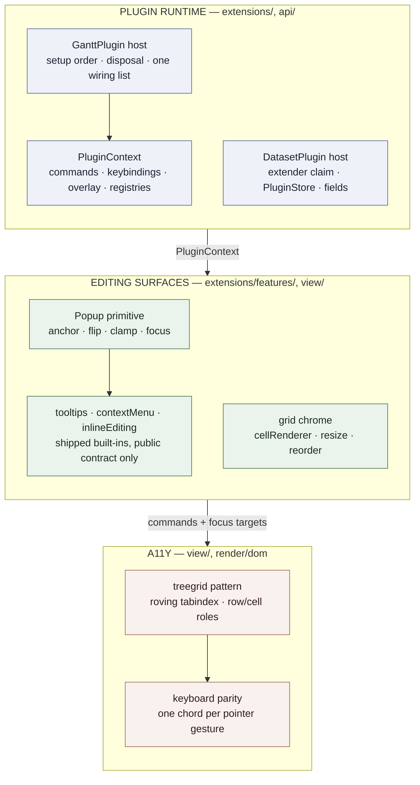

# S5 — Extensibility, editing surfaces, a11y completion

**Slice:** S5 (`plans/03` §S5) · **Position:** after S4, before S6 · **Status:** in progress — S5.0–S5.10 done, the 2026-09-04 branch review is closed, S5.11 next
**Form:** the same settled-spec form as [`plans/s4-hierarchy-and-rows/README.md`](../s4-hierarchy-and-rows/README.md) — this file is the tracker and the shared context; each step file holds the decisions it implements and its TODO boxes.
**Tick as you go:** When you finish a TODO item, tick its box in that step file. Tick it in the same change as the code. Do not wait for S5.12 or the slice gate.
**Governed by:** `plans/00` D3/D4/D5/D11/D12, `plans/01` §2.5/§2.6/§8/§9/§10, `plans/02` §3/§4/§4.1/§4.2/§7, ADR [0002](../../docs/adr/0002-scheduling-is-a-plugin-not-a-core-layer.md), ADR [0005](../../docs/adr/0005-fields-are-declared-and-grid-columns-reference-them.md).
**Builds on:** S2's extension hook (`data/edit-extension.ts`, D-S2-6), S3's capability resolver and gesture pipeline, S4's Field registry, Grid columns and `ItemProducer` seam.
**Review fixes — closed 2026-09-04:** [`plans/reviews/2026-09-04-s5-extensibility-fixes.md`](../reviews/2026-09-04-s5-extensibility-fixes.md) records what the branch review asked and what landed. All seven slices R1–R7 are done, so the review HTML is deleted. R2 lifted the plugin ports into `view/plugin-ports.ts` before S5.10, which is what that step builds on.
**Closes:** issue #15 (the install API for the extension hook), `plans/s2-data-core/OPEN-QUESTIONS.md` OQ8, `plans/03` §S5's six acceptance boxes, S4's deferred list rows 1–5.

**Start constraint (from `plans/03` §S5):** the `GanttShell` split in [`c4-split-gantt-shell.md`](../s4-hierarchy-and-rows/c4-split-gantt-shell.md) has landed. Plugin wiring must not grow tree-collapse policy back into `view/gantt-shell.ts`. Do not name a new extract `GanttViewport` — `layout/` already owns `Viewport`. The shell gains **one** wiring list (S5.1, D-S5-5); every attach point goes in it.
**Blocking pre-step (user, 2026-09-01):** the grill on issue [#111](https://github.com/Pawel-IT/FreeGantt/issues/111) — split schedule and dependency — is S5.0 and blocks the slice. No S5 step starts until it settles ([`s5.0-grill-issue-111.md`](./s5.0-grill-issue-111.md)).

> **What this slice is not.** No `Dependency`, no `schedule()`, no link geometry, no link-create gesture — S7. No performance budget and no linked-Gantt demo — S6. No framework wrapper (`plans/02` §8). `extensions/` never imports `data/`, `layout/`, `render/` or `interaction/` internals: it reaches the library the way a third party does, through `api/` and `model/` only (D-S5-5). That rule is what makes the dogfood gate real rather than declared.

---

## 0. Scope calls — proposed

Q2 needs the user's sign-off before S5.10 starts; it rewords a locked decision. Everything else is settled by this spec. The S5.0 grill on issue #111 may add rows here before S5.1 starts.

| # | Question | Answer |
|---|---|---|
| **Q1** | One plugin contract, or two? | **Two contracts, two hosts.** `GanttPlugin` installs on a `Gantt`, sees DOM seams, and lives as long as that Gantt. `DatasetPlugin` installs on a `Dataset`, is DOM-free, and owns the extension hook and per-plugin storage. A headless `Dataset` in Node must be able to run the scheduling plugin with no Gantt in the process (D4), which one merged contract cannot give. §S5.1, D-S5-1. |
| **Q2** | Does installing an extender **replace** the current one or **compose** over it? | **Compose — answered 2026-09-01.** `setExtender((next) => (request) => …)` takes a wrapper, so `data/` still holds one field and one call site (D-S2-6). This is OQ8 reading (b), and it rewords locked **D4** ("occupies that hook exclusively" → "the hook has one occupant at a time"). S5.10 carries that edit to `plans/00`, `CLAUDE.md`, `plans/01` §7, `plans/03` §S3 and ADR 0002. §S5.10, D-S5-23. Composition **order** is a separate question, settled by D-S5-31: `requires` orders setup, not the `plugins` array position (issue #137 F2 — D-S5-23's own text used to claim array order; that line is wrong and is corrected there). |
| **Q3** | Does `features: { tooltips: true }` survive? | **No — it becomes `plugins: [tooltips()]`.** A name-keyed feature table forces the Gantt to import every built-in, which the tree-shaking box (`[S5-A6]`) forbids. A factory the consumer imports is tree-shakeable by construction. `plans/01` §10 and `plans/02` §2 are edited. §S5.1, D-S5-2. |
| **Q4** | Who registers a Field — the Gantt plugin or the Dataset plugin? | **The Dataset plugin.** Fields are Dataset data, and the Rollup runs at construction before any Gantt exists (ADR 0005). `plans/01` §10's `PluginContext.data.registerField` moves to `DatasetPluginContext.fields.register`. A Gantt plugin still registers the **column** that shows it. §S5.9, D-S5-21. |
| **Q5** | When may a plugin register anything? | **During `setup` only.** A later `register*` call throws `RegistrationClosedError`. Registration during setup keeps one resolution per seam and keeps a Field declaration ahead of the first Rollup. A plugin that must change behaviour later changes it through the public API, like any consumer. §S5.1, D-S5-4. |
| **Q6** | Are plugins live-reconfigurable, like every other option? | **Yes.** `gantt.plugins = [...]` disposes what left, sets up what arrived, and leaves the rest untouched — keyed by `id` (`plans/02` §2: every config key is live). A duplicate `id` in one list is `DuplicatePluginIdError`. §S5.1, D-S5-3. |
| **Q7** | Where does the popup live? | **The host is `view/`'s, the popup is `extensions/`'s.** `OverlayHost` is a layer of the Gantt, like a pane. `Popup` is the anchoring/flipping/clamping/focus primitive that tooltips, the context menu and the inline editor all build on. A place and a thing are two names. §S5.3, D-S5-8. |
| **Q8** | Do renderer callbacks arrive as config, as plugin registration, or both? | **Both, into one registry.** `GanttOptions.barRenderer` is level 3 of the ladder; `ctx.view.registerRenderer` is level 5. Consumer config wins over any plugin. Two plugins claiming one slot is `RendererAlreadyRegisteredError`, naming both ids — diagnostics over a silent last-wins. §S5.4, D-S5-11. |
| **Q9** | What does a renderer return? | **`ElementDescription` — the reconciler's own vocabulary as plain data.** Tag, class, style, attrs, `text`, keyed `children`. `text` is the only text channel; `{ html }` is an explicit second key (I13). The reconciler does not grow: the type is bounded by what `sync-keyed.ts` already applies. §S5.4, D-S5-10. |
| **Q10** | Do column resize and reorder get their own event pairs? | **No — one pair, `beforeGridColumnsChange`/`gridColumnsChange`**, carrying `{ from, to }` as resolved columns. A resize drag, a reorder drop and `gantt.gridColumns = […]` are one commit sequence in one place — the `gridWidth` precedent (S1.8). §S5.7, D-S5-18. |
| **Q11** | Is the inline editor core or a plugin? | **A plugin** (`inlineEditing()`), like tooltips and the context menu. `plans/01` §10 already names editors as a dogfood case. It also makes `[S5-A6]` honest: a read-only Gantt ships no editor code. §S5.8, D-S5-19. |
| **Q12** | How does a date cell edit without a date-picker dependency? | **A `dateInput` seam.** The default is `<input type="date">`, read and written through the dataset's zone. A consumer passes its own factory. `plans/04` §1 budgets two runtime dependencies and a picker is not one of them. §S5.8, D-S5-20. |
| **Q13** | Which pane carries the grid a11y pattern? | **The grid pane is the `treegrid`/`grid`.** The timeline pane stays a labelled region of focusable bars, and roving focus keeps the two in step. `aria-owns` across two scrollers was considered and rejected: it is fragile under virtualization, where the owned node may not exist. §S5.11, D-S5-25. |
| **Q14** | Does a third-party plugin get zone-aware date math? | **Yes — `dataset.time`, a zone-bound façade.** A weekend-shading plugin cannot import `time/` (the exports map seals it), so without this the gate box `[S5-A2]` is unreachable. `PlainParts` gains `dayOfWeek`. §S5.6, D-S5-16. |
| **Q15** | Does `StoreName` widen this slice? | **Yes, with a shipped occupant.** `PluginStore` gives a `DatasetPlugin` reserved per-entry data (ADR 0002: not `Entry.meta`, to stop host/plugin collisions). The harness lock plugin is its first occupant, so the mechanism ships with a user, not as decoration (I11). S7's `Dependency` store is the second. §S5.10, D-S5-24. |
| **Q16** | Does `registerItemEmitter` keep that name? | **No — `registerItemProducer`.** S4 named the seam `ItemProducer` and the call `produceItemsForRow`. `plans/01` §10 still says emitter; one concept keeps one name (CLAUDE.md, #7). §S5.9, D-S5-22. |
| **Q17** | What proves "zero private imports"? | **A dependency-cruiser rule, not a review note.** `src/extensions/**` may import `src/api/**` and `src/model/**` and nothing else in `src/`. The built-ins live there, so the gate fails the build the moment a back-door appears. §S5.1, D-S5-5. |
| **Q18** | Can a `DatasetPlugin` read another plugin's `PluginStore`? | **Yes, read-only.** The S5.0 grill on #111 found this gap while splitting S7's scheduling engine from its dependency data: the engine has to read the edges. `ctx.store.read<T>(pluginId)` returns a `PluginStoreView` — `get`/`all`, no `set`/`remove` — or `undefined` if that plugin never reserved a store. The owner still writes through `reserve()`. §S5.10, D-S5-30. |
| **Q19** | Does the `plugins` array's own order matter for setup? | **No.** A `DatasetPlugin` declares `requires: readonly PluginId[]`; the host topologically sorts the installed set by that graph before running any `setup`, so `[a, b]` and `[b, a]` behave the same. A missing prerequisite throws `MissingPluginError` naming both ids — there is no `PluginOrderError`, because there is no wrong order left to write. Considered and rejected: a plugin supplying its own default for a missing `requires` entry — that would install a second plugin's real behaviour (e.g. dependency arrows) without it ever appearing in the caller's array, which is the same silent-composition problem D-S5-23 already ruled out. §S5.10, D-S5-31. |

---

## 1. User stories

Each story names the step that owns it. Acceptance boxes live in the step files.

- **U1.** (consumer) I write `plugins: [tooltips(), contextMenu({ items })]`. Both features appear. I imported exactly what I use. → S5.1, S5.5
- **U2.** (consumer) I ship a Gantt with no plugins. My bundle contains no tooltip, menu or editor code. → S5.1, S5.12
- **U3.** (plugin author) I write a weekend-shading plugin against the published types alone. I never import a path inside `freegantt/`. → S5.6, S5.12
- **U4.** (plugin author) My plugin adds a command, a keybinding and a context-menu item for it. One command id serves all three. → S5.2, S5.5
- **U5.** (consumer) I hover a bar and read a tooltip. I press Escape and it goes away. Focus never left my bar. → S5.3, S5.5
- **U6.** (consumer) I pass `barRenderer: { milestone: …, '*': … }`. My milestone draws my way; everything else keeps the library's look. → S5.4
- **U7.** (consumer) I double-click a cost cell, type a number and press Enter. That is one transaction and one undo step. → S5.8
- **U8.** (consumer) I return `false` from `beforeEntryEdit` and open my own dialog. The built-in editor never opens. → S5.8
- **U9.** (consumer) I drag a column edge to widen it, then drag its header to move it. Both fire one `gridColumnsChange`. → S5.7
- **U10.** (consumer) I declare a `'buffer'` kind in one plugin: shape, renderer, capabilities and menu items. I edited no library file. → S5.9
- **U11.** (plugin author) I install a `DatasetPlugin` that locks an entry. Dragging its neighbour ghosts the locked bar and the drop is refused. → S5.10
- **U12.** (keyboard user) I reach every row, cell, bar and command with the keyboard alone. Screen-reader labels name dates. → S5.11
- **U13.** (reviewer) I run `pnpm gate` on `.slice` = `S5` and read six lines, each naming an acceptance box from `plans/03`, each backed by a test that ran. → S5.12
- **U14.** (consumer) I set `gantt.plugins = [...gantt.plugins, myPlugin()]` at runtime. Nothing remounts. → S5.1

---

## 2. The three contexts this slice adds

S5 adds a runtime, a set of surfaces built on it, and an a11y pass over both. They meet at exactly two places.



**Built-ins meet the runtime at `PluginContext`, and nowhere else.** That is one import rule (D-S5-5), not a habit. **A11y meets the surfaces at the command registry**: every pointer action a built-in offers is a named command, so the keyboard path is a binding over the same command rather than a second implementation.

---

## 3. Step map

Thirteen steps, in order. S5.0 is the blocking pre-step: the grill on issue #111 settles before any S5 code starts. The runtime lands first after that because every surface registers into it. The a11y pass lands late because it needs the popups and the editor to exist before it can put focus policy on them.

| Step | Plan | Ends with |
|---|---|---|
| S5.0 | [`s5.0-grill-issue-111.md`](./s5.0-grill-issue-111.md) | issue #111 (split schedule and dependency) is grilled and settled — **blocks S5.1** |
| S5.1 | [`s5.1-plugin-runtime.md`](./s5.1-plugin-runtime.md) | `plugins: [logEverything()]` sets up, disposes, and cannot import a private module |
| S5.2 | [`s5.2-commands-and-keybindings.md`](./s5.2-commands-and-keybindings.md) | a named command runs from a chord and from `gantt.commands.run(id)` |
| S5.3 | [`s5.3-overlay-and-popup.md`](./s5.3-overlay-and-popup.md) | a popup anchors to a bar, flips at the pane edge, and returns focus |
| S5.4 | [`s5.4-renderers.md`](./s5.4-renderers.md) | `barRenderer` and `cellRenderer` paint, text-safe by default |
| S5.5 | [`s5.5-tooltips-and-context-menu.md`](./s5.5-tooltips-and-context-menu.md) | two shipped plugins, zero private imports — the dogfood gate |
| S5.6 | [`s5.6-decorations-and-time-facade.md`](./s5.6-decorations-and-time-facade.md) | weekend shading, written against the public surface only |
| S5.7 | [`s5.7-grid-chrome.md`](./s5.7-grid-chrome.md) | drag a column edge, drag a header, one event pair |
| S5.8 | [`s5.8-inline-editing.md`](./s5.8-inline-editing.md) | edit a cell, commit one transaction, or replace the editor |
| S5.9 | [`s5.9-plugin-registrations.md`](./s5.9-plugin-registrations.md) | a consumer-defined kind, whole, from one plugin |
| S5.10 | [`s5.10-dataset-plugins.md`](./s5.10-dataset-plugins.md) | the lock plugin ghosts a second bar in the harness |
| S5.11 | [`s5.11-a11y-completion.md`](./s5.11-a11y-completion.md) | roving tabindex, keyboard parity, axe green in CI |
| S5.12 | [`s5.12-gallery-and-gate.md`](./s5.12-gallery-and-gate.md) | the example gallery, the tree-shaking budget, gate green |

---

## 4. Acceptance ids

`plans/03` §S5's six boxes become `[S5-A1]`–`[S5-A6]` (spec edit, S5.1 — S4 labelled its own the same way).

| Id | Box | Owning step | Primary tests |
|---|---|---|---|
| `[S5-A1]` | Context menu and tooltips are plugins with zero private imports (lint-proven — the dogfood gate) | S5.5 | `.dependency-cruiser.cjs` rule + `scripts/guard-red-test.mjs`, `extensions/features/*.test.ts` |
| `[S5-A2]` | A harness-only third-party-style plugin (weekend shading) is written against the public contract only | S5.6 | `harness/plugins/weekend-shading.ts`, `e2e/plugins.spec.ts` |
| `[S5-A3]` | A consumer-defined kind (renderer + capabilities + `when` menu items, registered by config or plugin) works with zero core edits | S5.9 | `api/gantt.test.ts`, `layout/items/produce-items.test.ts`, `view/capability.test.ts` |
| `[S5-A4]` | Every S3 pointer capability has a keyboard path; axe reports no violations on harness pages | S5.11 | `view/keyboard-navigation.test.ts`, `e2e/a11y.spec.ts` |
| `[S5-A5]` | A consumer replaces the entry editor through `beforeEntryEdit` (harness demo) | S5.8 | `extensions/features/inline-editing.test.ts`, `e2e/editing.spec.ts` |
| `[S5-A6]` | Unused features are absent from a consumer bundle (tree-shaking test in CI) | S5.12 | `size-limit` budgets + a string probe over the built bundle |

**Gate S5 → S6** (`plans/00` §4): a non-trivial feature exists as a plugin using only the public plugin API. `[S5-A1]` and `[S5-A2]` together discharge it — `[S5-A1]` proves the built-ins took no back door, `[S5-A2]` proves an outside author can do the same.

---

## 5. Public surface (app author)

What an app author gains. Plugins are values the consumer imports, never names in a table.

```ts
import { Dataset, Gantt, tooltips, contextMenu, inlineEditing } from 'freegantt';

const gantt = new Gantt({
  container, dataset,
  gridColumns: ['name', 'start', { field: 'cost', header: 'Budget', editable: true }],
  barRenderer: {
    milestone: ({ entry }) => ({ class: { 'my-diamond': true }, text: entry.name }),
    '*': undefined,                                   // keep the library's bar
  },
  plugins: [
    tooltips(),
    contextMenu({ items: ({ entry, defaults }) => [...defaults, myItem(entry)] }),
    inlineEditing(),
  ],
});

gantt.commands.run('freegantt.collapseAll');
gantt.on('beforeEntryEdit', async ({ entry }) => { await myDialog.open(entry); return false; });
gantt.on('gridColumnsChange', ({ to }) => save(to.map((c) => c.field)));
gantt.plugins = [...gantt.plugins, myPlugin()];       // live, like every other option
```

A plugin author writes the second surface:

```ts
import type { GanttPlugin } from 'freegantt';

export function weekendShading(): GanttPlugin {
  return {
    id: 'demo.weekendShading',
    setup(ctx) {
      ctx.view.registerDecoration('underBars', ({ span, time }) =>
        time.eachDay(span)
          .filter((day) => time.dayOfWeek(day) >= 6)
          .map((day) => ({ kind: 'rangeBand', start: day, end: time.addDays(day, 1), class: 'weekend' })),
      );
      return () => {};
    },
  };
}
```

And a data-side plugin author writes the third:

```ts
import type { DatasetPlugin } from 'freegantt';

export function lockEntries(lockedIds: readonly string[]): DatasetPlugin {
  return {
    id: 'demo.lock',
    setup(ctx) {
      const locks = ctx.store.reserve<{ locked: boolean }>();     // PluginStore, not Entry.meta
      for (const id of lockedIds) locks.set(id, { locked: true });
      // The extender only ever adds cascade edits — it never refuses. During drag preview
      // it still runs, so the locked neighbour still ghosts alongside the dragged bar.
      ctx.edits.setExtender((next) => (request) => cascadeToLocked(next(request), locks, request));
      // Refusal is a `beforeChange` veto, not an extender concern (issue #137 F3): the
      // extender's `EditRequest` has no preview/commit distinction to refuse correctly on,
      // but `beforeChange` fires once, only at commit, on the finished changeset — exactly
      // where a refusal belongs.
      ctx.events.on('beforeChange', ({ changeSet }) => !touchesLocked(changeSet, locks));
      return () => {};
    },
  };
}
```

| Export | Step |
|---|---|
| `GanttPlugin`, `PluginContext`, `PluginId`, `Disposer`, `DisposableStore`, `GanttOptions.plugins`, `Gantt.plugins`, `DuplicatePluginIdError`, `RegistrationClosedError`, `PluginSetupError` | S5.1 |
| `Command`, `CommandRegistry`, `CommandContext`, `Gantt.commands`, `KeyBinding`, `KeyChord`, `UnknownCommandError` | S5.2 |
| `OverlayHost`, `Popup`, `PopupOptions`, `PopupPlacement`, `Anchor` | S5.3 |
| `ElementDescription`, `Renderer`, `BarRenderer`, `CellRenderer`, `HeaderRenderer`, `TooltipRenderer`, `RendererByKind`, `GanttOptions.barRenderer` / `.cellRenderer` / `.headerRenderer` / `.tooltipRenderer`, `RendererAlreadyRegisteredError` | S5.4 |
| `tooltips()`, `contextMenu()`, `ContextMenuOptions`, `MenuItem`, `TooltipOptions` | S5.5 |
| `DecorationProvider`, `DecorationLayer`, `RangeBand`, `RowStripe`, `Dataset.time`, `ZonedTime` | S5.6 |
| `GridColumn.cellRenderer` / `.editable` / `.resizable` / `.movable`, `beforeGridColumnsChange`/`gridColumnsChange`, `GridColumnsChange` | S5.7 |
| `inlineEditing()`, `InlineEditingOptions`, `DateInputFactory`, `DateInput`, `beforeEntryEdit`/`entryEdit`, `EntryFieldEdit`, `FieldType.parseValue`, `Interactions.edit` | S5.8 |
| `ItemProducer`, `ItemProducerContext`, `KindDefaults`, `Interactions` per-kind registration | S5.9 |
| `DatasetPlugin` (with `requires`), `DatasetPluginContext`, `DatasetOptions.plugins`, `EditExtender`, `ExtenderWrapper`, `PluginStore`, `PluginStoreView`, `StoreName` widened, `MissingPluginError` | S5.10 |
| Parts: `fg-popup`, `fg-menu`, `fg-menu-item`, `fg-cell-editor`, `fg-column-resizer`, `fg-overlay`; tokens `--fg-popup-bg`, `--fg-popup-border`, `--fg-popup-shadow`, `--fg-focus-ring` | S5.3, S5.7, S5.11 |

**Not public:** `PluginHost`, `RendererRegistry`, `KeymapResolver`, `OverlayLayer`'s node handles, `extensions/features/*`'s internal state — the runtime's own shapes. A consumer names the factory, never the host.

**Retired by this slice:** `GanttOptions.features` (never shipped; `plans/02` §2 prose only) → `plugins`. `PluginContext.layout.registerItemEmitter` (spec prose only) → `registerItemProducer`. `PluginContext.data.registerField` (spec prose only) → `DatasetPluginContext.fields.register`.

---

## 6. Decisions index

Full prose lives in the step file that implements each decision.

| Decision | Topic | Step |
|---|---|---|
| D-S5-1 | Two contracts, two hosts: `GanttPlugin` and `DatasetPlugin` | S5.1 |
| D-S5-2 | `plugins: [factory()]` replaces a `features` name table | S5.1 |
| D-S5-3 | `plugins` is live; identity is `id`; disposal is reverse order | S5.1 |
| D-S5-4 | Registration is legal during `setup` only | S5.1 |
| D-S5-5 | `extensions/` imports `api/` and `model/` only — the gate as a lint rule | S5.1 |
| D-S5-6 | One command registry; menus and chords both name commands | S5.2 |
| D-S5-7 | Last registration gets first refusal; `when` falls through | S5.2 |
| D-S5-8 | `OverlayHost` is `view/`'s place; `Popup` is `extensions/`'s thing | S5.3 |
| D-S5-9 | Focus policy is declared per popup, not per caller | S5.3 |
| D-S5-10 | `ElementDescription` is the reconciler's vocabulary as data | S5.4 |
| D-S5-11 | One renderer slot; config beats plugins; two plugins is an error | S5.4 |
| D-S5-12 | Per-kind renderer map resolves kind, then `'*'`, then the default | S5.4 |
| D-S5-13 | Built-ins are ordinary plugins in `extensions/features/` | S5.5 |
| D-S5-14 | Menu items come from commands, filtered by `when` | S5.5 |
| D-S5-15 | A decoration provider is pure and runs in `layout/` | S5.6 |
| D-S5-16 | `Dataset.time` is the zone-bound façade; `PlainParts` gains `dayOfWeek` | S5.6 |
| D-S5-17 | `cellRenderer` sits on the Gantt's column, never on the Field | S5.7 |
| D-S5-18 | One event pair for every column presentation change | S5.7 |
| D-S5-19 | The inline editor is a plugin; `beforeEntryEdit` suppresses it | S5.8 |
| D-S5-20 | The `dateInput` seam, with no picker dependency | S5.8 |
| D-S5-21 | A Field registers on the Dataset side; its column on the Gantt side | S5.9 |
| D-S5-22 | One kind, four seams, one plugin, zero core edits | S5.9 |
| D-S5-23 | `setExtender` composes over the current occupant | S5.10 |
| D-S5-24 | `PluginStore` holds per-plugin per-entry data, never `Entry.meta` | S5.10 |
| D-S5-25 | The grid pane carries the `treegrid` pattern; the timeline is a labelled region | S5.11 |
| D-S5-26 | Every pointer gesture has a chord over the same command | S5.11 |
| D-S5-27 | Axe runs on every harness page in CI | S5.11 |
| D-S5-28 | The tree-shaking budget is a probe plus a size limit | S5.12 |
| D-S5-29 | The API reference renders the existing API report — no new dependency | S5.12 |
| D-S5-30 | `PluginStore` gets a read-only cross-plugin view, `store.read()` | S5.10 |
| D-S5-31 | `requires` orders setup; the `plugins` array's own order never matters | S5.10 |
| D-S5-35 | One gesture's rule is written by a verb, not by restating `interactions` | S5.9 |
| D-S5-36 | One plugin is installed by a verb, not by restating the set | S5.1 |
| D-S5-37 | A column is named by its `field`, everywhere a column is named | S5.7 |

---

## 7. Agent gotchas

Read these before you touch `src/`.

1. **`extensions/` may import `api/` and `model/` only.** No `data/`, no `layout/`, no `render/`, no `view/`, no `interaction/`. If a built-in needs something it cannot reach, the public API has a gap — fix the gap, do not widen the rule (`plans/01` §10, D-S5-5).
2. **The shell gains one wiring list.** Plugin attach points go in `GanttShell`'s wiring list and nowhere else. Do not grow tree-collapse, column or gesture policy back into `gantt-shell.ts` (c4 §7).
3. **A renderer never enters `data/`.** S4's D-S4-14 stands. `cellRenderer` is on `GridColumn` (the Gantt's), not on `Field` (the Dataset's).
4. **The reconciler does not grow.** `ElementDescription` is bounded by attr/class/style/text + keyed children. A renderer that needs a lifecycle hook means the design is wrong — stop and discuss (CLAUDE.md).
5. **No new runtime dependency.** A popup positioner, a focus trap and a date input are all hand-rolled here. `plans/04` §1.1 lists what was already rejected; add a row before proposing anything.
6. **One transaction per edit, at commit.** The inline editor writes on Enter or blur, never per keystroke (I6).
7. **Commands are the a11y seam.** Add a pointer affordance and its command in the same change; the chord is then a binding, not a second implementation (D-S5-26).
8. **`interaction/` still never imports `scheduling/`.** S5 adds no scheduling anything. `Interactions.linkCreate` stays off the type until S7 (I11).
9. **Review `harness/main.ts` on every commit**, changed or not (CLAUDE.md). This slice's harness pages are also the example gallery, so a workaround there is doubly visible.
10. **Run the full check sequence** after each step: `pnpm vitest run`, `tsc --noEmit`, `eslint src harness`, `depcruise`, `node scripts/guard-red-test.mjs`, `pnpm api-report`.
11. **`.slice` bumps only at S5.12** — not before the gate is green.
12. **Every new public key must work on the day it appears** (I11). `editable`, `resizable`, `movable` join `GridColumn` in the step that honours them, not in S5.1.

---

## 8. Foot-guns

| Foot-gun | Answer |
|---|---|
| A built-in reaches into `view/` "just for one thing" | The lint fails the build. That one thing is the API gap `[S5-A1]` exists to find (D-S5-5) |
| Two plugins claim the bar renderer | `RendererAlreadyRegisteredError`, naming both plugin ids. Consumer config always wins over both (D-S5-11) |
| A plugin registers a keybinding on `ArrowRight` and breaks tree collapse | It does not break it: core registered first, and the plugin's binding only runs when its own `when` passes. Last registration gets first refusal, and a decline falls through (D-S5-7) |
| `plugins` assignment remounts the Gantt | It does not. Same-`id` plugins are left alone; only the difference is disposed and set up (D-S5-3) |
| A plugin registers a Field after construction | `RegistrationClosedError`. A Field must exist before the first Rollup (D-S5-4, D-S5-21) |
| A tooltip steals focus from the bar | It cannot. A tooltip declares `focus: 'none'`; only the menu and the editor trap (D-S5-9) |
| The editor commits per keystroke | It commits on Enter or blur, in one transaction. Escape reverts and writes nothing (D-S5-19, I6) |
| `beforeEntryEdit` returning `false` still opens the editor | It does not, and the veto path is the same one `beforeEntryMove` uses (D-S5-19) |
| A weekend-shading plugin computes days with `86400000` | I10 forbids it in `src/`, and a consumer has `dataset.time` instead. The harness plugin uses the façade (D-S5-16) |
| Column reorder rewrites the Dataset | It cannot. Columns are Gantt view state; the Field registry never changes (ADR 0005, D-S5-18) |
| A consumer kind needs a core edit for its capabilities | It does not. `registerKindDefaults` is the fourth seam, beside producer, renderer and commands (D-S5-22) |
| Two plugins are listed in the "wrong" order because one `requires` the other | There is no wrong order. The host sorts by `requires` before `setup` runs; array position is not the install order (D-S5-31) |
| A plugin reserves a store and another plugin writes into it through `store.read()` | It cannot. `PluginStoreView` has no `set`/`remove` — only the reserving plugin's own `store.reserve()` handle can write (D-S5-30) |
| Installing a Dataset plugin turns off the Rollup | It cannot. The Rollup is step 5 of the commit sequence, not the hook (D-S2-22) |
| An extender throws to refuse a write | It never does — the extender only ever returns cascade edits, including during drag preview. Refusal is a `beforeChange` veto on the finished changeset, which fires once, at commit only (D-S5-23; issue #137 F3) |
| Reassigning `plugins` with a freshly constructed same-`id` plugin silently does nothing | Correct, and dev builds warn: same `id`, new instance, config likely changed and was dropped. Reconfigure with two assignments (remove, then add) or two distinct ids (D-S5-3; issue #137 F5) |
| A chord fires while the user is typing in the cell editor | It does not. The keymap resolver ignores key events whose target is editable (`input`, `textarea`, `contenteditable`) or mid-IME-composition, unless the binding opts in (D-S5-7; issue #137 F7) |
| A `GanttPlugin` needs another `GanttPlugin`'s registration and lists itself first | Nothing enforces order for Gantt plugins — unlike `DatasetPlugin`, there is no `requires`. Setup runs in `plugins` array order; a plugin documents its own prerequisite and the consumer orders the array (D-S5-1; issue #137 F18) |
| A second Dataset plugin overwrites the first one's extender | It wraps it. Composition order follows `requires`-resolved setup order, never the `plugins` array position (D-S5-23, D-S5-31) |
| A plugin writes its per-entry flag into `entry.meta` | It must not — that is the host/plugin collision ADR 0002 named. Reserve a `PluginStore` (D-S5-24) |
| `role="row"` on both panes makes a screen reader read every row twice | It would. Only the grid pane carries row and cell roles (D-S5-25) |
| The built-ins ship in every bundle | They must not. They are values a consumer imports; `[S5-A6]` probes the built output (D-S5-2, D-S5-28) |

---

## 9. Tests (overview)

`pure` (Node) unless noted. Per-step detail lives in each step file §3.

| Area | Files |
|---|---|
| Plugin host | `extensions/plugin-host.test.ts`, `extensions/disposables.test.ts` |
| Commands and keys | `extensions/commands.test.ts`, `extensions/keymap.test.ts` |
| Overlay and popup | `view/overlay-host.test.ts` (dom), `extensions/popup.test.ts` (dom) |
| Renderers | `render/dom/element-description.test.ts` (dom), `view/renderer-registry.test.ts` |
| Built-ins | `extensions/features/tooltips.test.ts` (dom), `context-menu.test.ts` (dom), `inline-editing.test.ts` (dom) |
| Decorations and time | `layout/decorations.test.ts`, `time/zone.test.ts`, `api/dataset.test.ts` |
| Grid chrome | `view/grid-columns.test.ts`, `interaction/column-gestures.test.ts` (dom) |
| Dataset plugins | `data/edit-extension.test.ts`, `data/plugin-store.test.ts`, `api/dataset.test.ts` |
| A11y | `view/keyboard-navigation.test.ts`, `render/dom/index.test.ts` (dom), `e2e/a11y.spec.ts` |
| Integration | `api/gantt.test.ts`, `api/dataset.test.ts` |
| E2E | `e2e/plugins.spec.ts`, `e2e/editing.spec.ts`, `e2e/a11y.spec.ts` |
| Guard | `.dependency-cruiser.cjs` `extensions-public-only` rule; `scripts/guard-red-test.mjs` gains the matching red test; `size-limit` budgets |

---

## 10. Deferred

| Deferred | Returns at | Needs |
|---|---|---|
| `Interactions.linkCreate`, link endpoints, link renderer | S7 | `Dependency` data and link emission — design open at #136 (supersedes #16) |
| The first-party scheduling plugin as the extender's occupant | S7 | This slice's install API (#15) |
| Performance budget on plugin-heavy frames | S6 | The measured spike (D2) |
| Named multi-preset theme picker (`registerThemePreset`) | after S5 if asked | This slice's plugin runtime is the seam it needs (D-S1.10-9) |
| Framework wrappers | out of the slices | `plans/02` §8 |
| Row reorder and reparent by drag | when an authored order Field exists | D-S4-31 |
| Column groups (a header spanning two columns) | not scheduled | A real ask; no consumer yet |
| Async command results and a progress affordance | not scheduled | A real ask; commands stay sync in S5 |

### API gaps the `harness/main.ts` review found and did not close here

CLAUDE.md asks for a read of `harness/main.ts` on every commit. What it exposed during S5 is recorded here, never tidied away in the harness. All three below are now closed in `src/` — #184 by D-S5-34, #195 by D-S5-35/D-S5-36/D-S3-24, and #194 by D-S5-37.

| Gap | Where it shows | State |
|---|---|---|
| No way to hide one Grid column, so the page declared its column list twice and a toggle discarded the widths and the order the user had set (#184) | `GRID_WITH_BUDGET` / `GRID_WITHOUT_BUDGET`, plus a `budgetVisible` flag | **Closed** by D-S5-34: `GridColumn.hidden`, `gantt.hideGridColumn` / `showGridColumn` / `hiddenGridColumns`. The harness now declares one list |
| One resolved column carries two public names: a renderer context hands a consumer `column.key`, and every other surface names the same column `field` (#194) | `demoCellRenderer` reads `column.key === 'cost'`, six lines from `{ field: 'cost' }` | **Closed** by D-S5-37: `FrameColumn.key` and `CommandTarget.columnKey` both become `field`. A Field has a `key`; a Grid column carries the `field` it shows |
| Three more whole-object setters need the read-modify-write #184 removed from `gridColumns` (#195) | `gantt.interactions = { resize: false }`, `gantt.preset = { ...gantt.preset, snap }`, `gantt.plugins = [...gantt.plugins, x]` | **Closed** by three separate answers, one per setter: D-S5-35 (`setCapabilityRule`/`clearCapabilityRule`), D-S3-24 (`gantt.snap`) and D-S5-36 (`installPlugin`/`uninstallPlugin`/`hasPlugin`). The harness restates no config |

---

## 11. Settled by the user

✅ **Q2 / D-S5-23 — `setExtender` composes. Answered 2026-09-01.**

`plans/s2-data-core/OPEN-QUESTIONS.md` OQ8 closes on reading (b): the hook has one occupant at a time, and a scheduling plugin is one candidate occupant with no special claim on it. `EditExtenderConflictError` is never written.

The wording change to locked **D4** (`plans/00`), `CLAUDE.md`, `plans/01` §7, `plans/03` §S3 and ADR 0002 **landed in S5.10 (2026-09-04)**, beside the code that makes it true, and OQ8 is closed against it.

---

## 12. Spec edits

Landed in the step that proves each one, except the batch at S5.12. Full list in [`s5.12-gallery-and-gate.md`](./s5.12-gallery-and-gate.md) §4. The six that change settled text rather than adding to it:

1. `plans/03` §S5 — the six acceptance boxes gain ids `[S5-A1]`–`[S5-A6]` and a tracker pointer. **Landed with this spec.**
2. `plans/01` §10 and `plans/02` §2 — `features: { … }` becomes `plugins: [ … ]` (Q3, D-S5-2).
3. `plans/01` §10 — `registerItemEmitter` becomes `registerItemProducer`; `data.registerField` moves to the Dataset plugin context (Q4, Q16).
4. `plans/00` D4, `CLAUDE.md`, `plans/01` §7, `plans/03` §S3, ADR 0002 — exclusivity is arity, not ownership (Q2, answered). **Landed in S5.10**, with OQ8 closed and `plans/03` §S2's `StoreName` note marked satisfied.
5. `src/view/capability.ts` — the comment says `edit` waits for S5; this slice is S5, so the key ships with the editor (S5.8).
7. The 2026-09-04 review's own edits, landed in slices R1–R6 (fix plan §4): `emitBeforeEntryEdit`/`emitEntryEdit` become `proposeEntryEdit`/`announceEntryEdit`; `resolveTooltip` becomes `resolveTooltipContent`; `PluginContextParts` is declared in the grouped shape a plugin sees; `Overlay` keeps `{ present, render }` and the DOM questions move to `ctx.view.dom`; `PopupOptions` gains `onDismiss`; the per-kind bar renderer composes across plugins on a slot key; `CellRendererContext` and `ColumnCellRendererContext` gain `fieldValue`; `setup()` may return `void`; `wholeEntryItem` is public. `CONTEXT.md` gained **Shell wiring** and **Refusal notice**.
6. `CONTEXT.md` — the **Dependency** and **Scheduling plugin** entries, plus a new **`entryDependencies()`** entry: `Dependency` is owned by `entryDependencies()`, not the scheduling plugin, which `requires` and reads it (S5.0 grill, issue #111; Q18, Q19). **Landed with this spec.**
